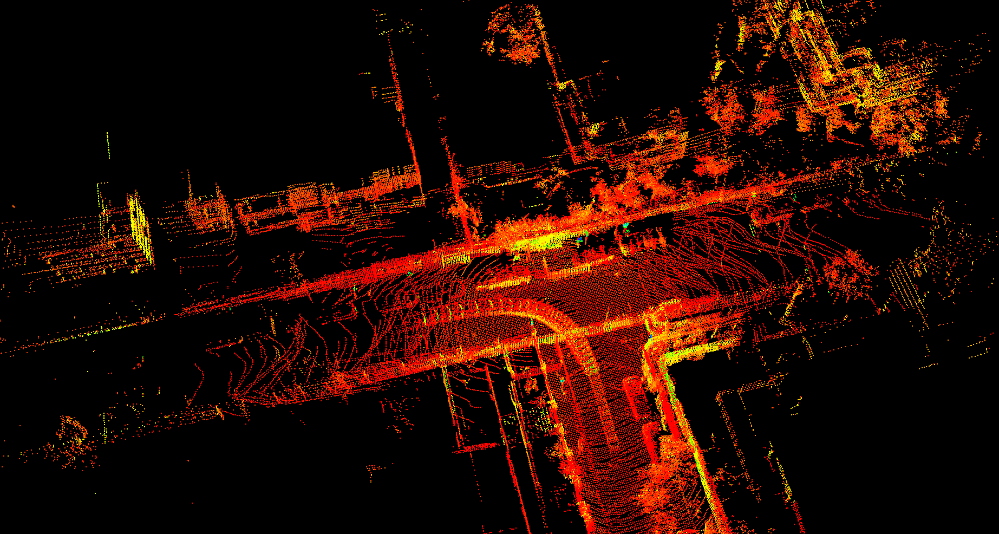

# Sensor Lab <!-- omit in toc -->

A repository of implementations and notes that provide services for the math, computer vision, AI, robotics, autonomous driving related methods I have studied

:construction:

- [Getting Started](#getting-started)
  - [Prerequisites](#prerequisites)
- [Algorithm](#algorithm)
- [Feature Detect](#feature-detect)
- [Pose Estimation](#pose-estimation)
- [Kalman Filter](#kalman-filter)
- [imu\_and\_gnss](#imu_and_gnss)
- [Lidar\_2d](#lidar_2d)
- [Lidar\_3d](#lidar_3d)
- [pcl\_test](#pcl_test)
- [cere\_test](#cere_test)
- [g2o\_test](#g2o_test)
- [Path Plan](#path-plan)
- [Path Tracking](#path-tracking)
- [task](#task)
- [Usage](#usage)

## Getting Started

### Prerequisites

- Ubuntu 20.04
- C++14
- OpenCV 4.2.0
- Eigen 3.3.7
- PCL 1.10.0
- Sophus, commit SHA `a621ff` [local build](./task/local_build_sophus.md), support SO(3) and SE(3) operator
- glog
- gflags
- gtest build gtest and `sudo cp libgtest*.a /usr/local/lib`
- Ceres 1.12.0, deal with complicated non-linear optimization problems like Bundle Adjustment
- G2O, like Ceres
- DBoW3, loop closure
- gtsam 4.2.0, currently learning how to use it
- Pangolin, installed but rarely used
- Python 3.8.10. I use the features of `matplotlibcpp` and run some python scripts
- ROS noetic

## Algorithm

this module summarizes some methods for tradition image process, hand-eye calibration, curve fit

**image undistortion**


## Feature Detect

- based orb operator match


## Pose Estimation

## Kalman Filter

## imu_and_gnss

eskf gins (imu+gnss+odom)


## Lidar_2d

lidar 2d mapping global map


## Lidar_3d

direct NDT LO mapping and without loop closure



## pcl_test

## cere_test

## g2o_test

## Path Plan

this module conclude some common tips and knowledge in global or local path plan. 

**Dijkstra global path plan**


**A star global path plan**


**DWA local path plan**


**RRT* sample based local path plan**


**Bezier Curve local path plan**


**B spline curve local path plan**


**Dubins Curve path plan**


**Reeds-Shepp**

TODO: 

## Path Tracking

**PID Controller**


## task

## Usage

```bash
mkdir build && cd build

# enable debug
cmake ..
make -j4
make install
```
