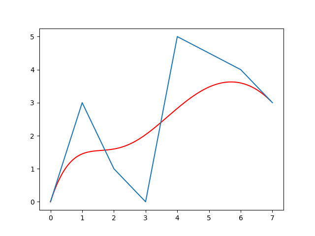

:construction:

- [sensor lab](#sensor-lab)
  - [using](#using)

# sensor lab

## using

```bash
mkdir build && cd build

# enable debug
cmake ..
make -j4
make install
```

### Path Plan

#### Bezier Curve


