# Sensor Lab <!-- omit in toc -->

[中文|Chinese](./README_zh.md)

A repository of implementations and notes that provide services for the math, computer vision, AI, robotics, autonomous driving related methods I have studied

just for fun

:construction:

- [Getting Started](#getting-started)
  - [Prerequisites](#prerequisites)
- [Modules Introduction](#modules-introduction)
  - [cpp\_test](#cpp_test)
  - [Algorithm](#algorithm)
  - [Feature Detect](#feature-detect)
  - [Pose Estimation](#pose-estimation)
  - [Kalman Filter](#kalman-filter)
  - [imu\_and\_gnss](#imu_and_gnss)
  - [Lidar\_2d](#lidar_2d)
  - [Lidar\_3d](#lidar_3d)
  - [pcl\_test](#pcl_test)
  - [cere\_test](#cere_test)
  - [g2o\_test](#g2o_test)
  - [gtsam\_test](#gtsam_test)
  - [Path Plan](#path-plan)
  - [Path Tracking](#path-tracking)
- [Usage](#usage)

## Getting Started

### Prerequisites

- Ubuntu 20.04 (virtual machine); ROS noetic
- C++14; OpenCV 4.2.0; Eigen 3.3.7; PCL 1.10.0
- Sophus, commit SHA `a621ff` [local build](./task/local_build_sophus.md), support SO(3) and SE(3) operator
- glog(release version); gflags; gtest build gtest and `sudo cp libgtest*.a /usr/local/lib`
- Ceres v2.2.0, deal with complicated non-linear optimization problems like Bundle Adjustment
- G2O `checkout ff647bd`, like Ceres
- DBoW3, images loop closure
- gtsam 4.2.0, optimize library
- Pangolin `branch:v0.9` installed but rarely used
- octomap a 3D occupancy grid mapping approach
- Python 3.8.10. I use the features of `matplotlibcpp` and run some python scripts
- yaml-cpp use .yaml

## Modules Introduction

Each module describes the methods it contains

> attention: some test data comes from the network public dataset

### cpp_test

including some cpp feature test

### Algorithm

this module summarizes some methods for tradition image process and curve fit

- dlt camera calibration
- image undistortion
- based on Tsai-Lenz of hand-eye calibration (eye in hand)
- least square polynomial curve fit and move least square
- cubic spline interpolation curve fit
- thin plate spline

**image undistortion result**

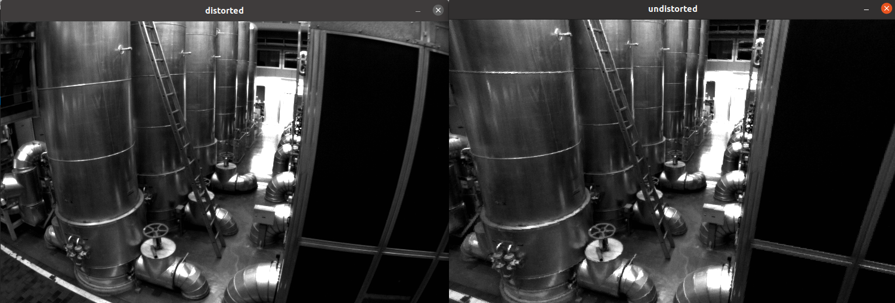

### Feature Detect

- based orb operator match

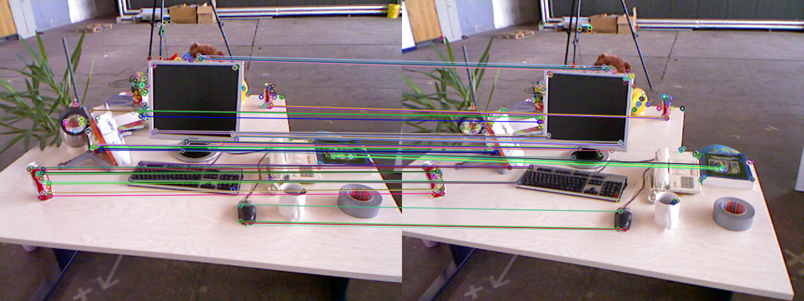

- LK option flow apply

<table>
    <tr>
        <td ><center>pre image</center></td>
        <td ><center>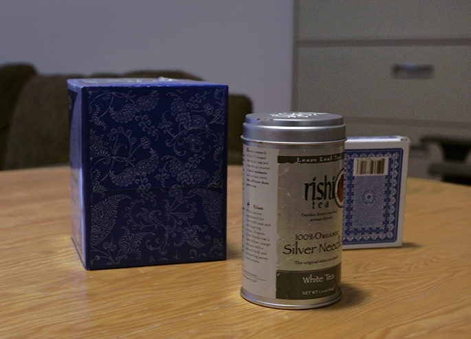current image</center></td>
        <td ><center>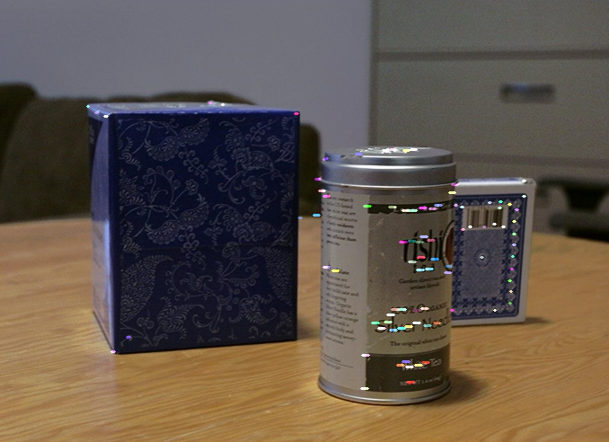LK option flow result</center></td>
    </tr>
</table>

### Pose Estimation

- sfm: epipolar constrainc and triansgulation
- 3D points ICP
- gaussian-newton estimate camera pose

### Kalman Filter

- direct kalman filter point estimate
- extend kalman filter test

### imu_and_gnss

- static imu initialization
- tradition imu integration
- imu pre-integration
- gnss data convert to utm
- eskf gins (imu data predict and gnss data update)
- eskf gins with imu pre-integration optimize

in the image below, the left shows the ESKF and the right side uses IMU pre-integration, trajectory interruptions due to poor GNSS signals are reduced

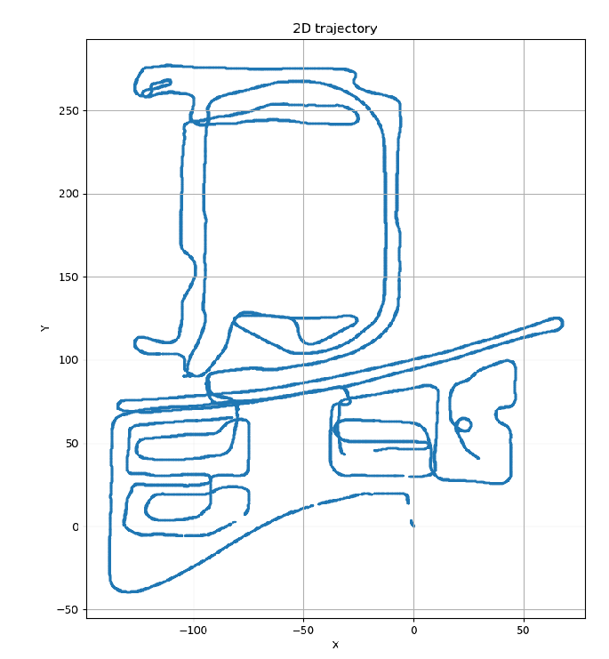

### Lidar_2d

- 2d lidar scans ICP (point to point & point to plane distance)
- scan to occupancy grid map 
- lidar 2d mapping global map

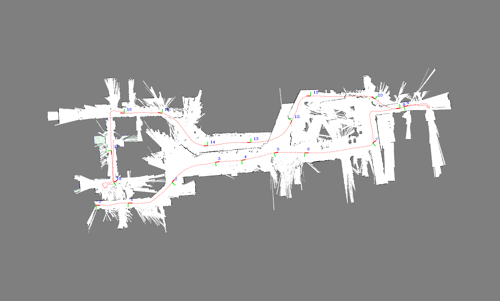

### Lidar_3d

- point cloud ICP registration
- point cloud NDT registration
- direct NDT lidar odom
- incremental NDT LO
- loosely coupled LIO

incremental NDT loosely coupled LIO mapping and without loop closure

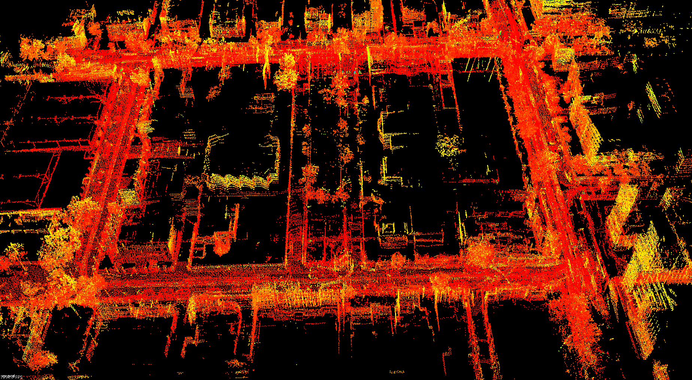

### pcl_test

- point cloud linear fit
- point cloud data convert
- nearest neighbor search

### cere_test

the below image show the easy use of the ceres optimization library

- left image was source BAL data
- right image use ceres for BA optimize,reduce some noise(running in virtual machine, low performance)

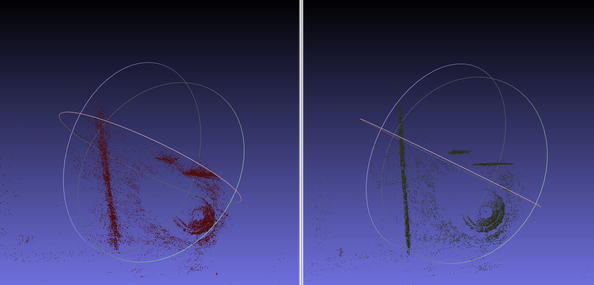


### g2o_test

g2o optimize library test

### gtsam_test

gtsam optimize library test

### Path Plan

this module conclude some common tips and knowledge in global or local path plan. 

<table>
    <tr>
        <td ><center>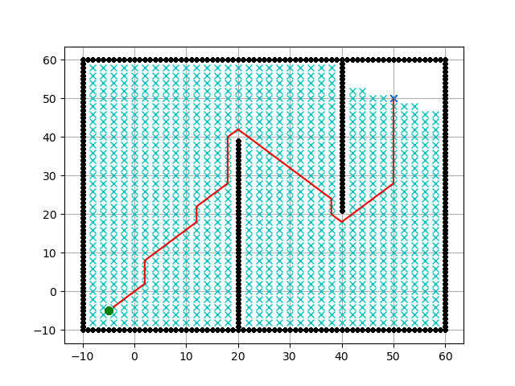Dijkstra global path plan </center></td>
        <td ><center>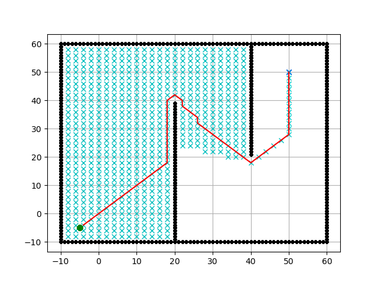A star global path plan</center></td>
    </tr>
</table>

<table>
    <tr>
        <td ><center>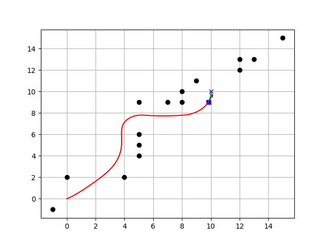DWA local path plan </center></td>
        <td ><center>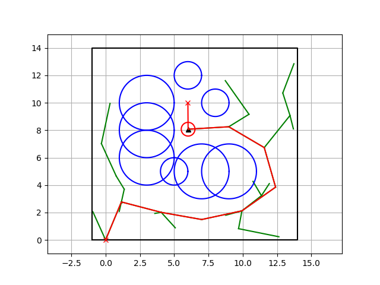RRT* sample based local path plan</center></td>
    </tr>
</table>

**Bezier Curve local path plan and B spline curve local path plan and smooth**

<table>
    <tr>
        <td ><center>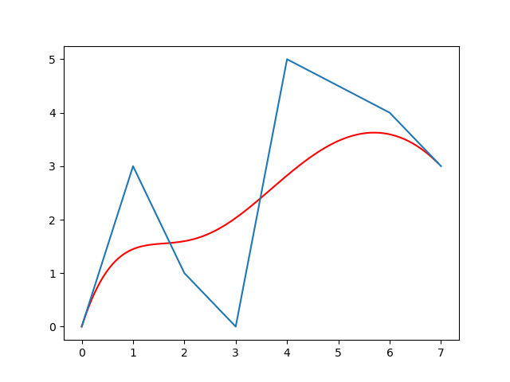Bezier Curve </center></td>
        <td ><center>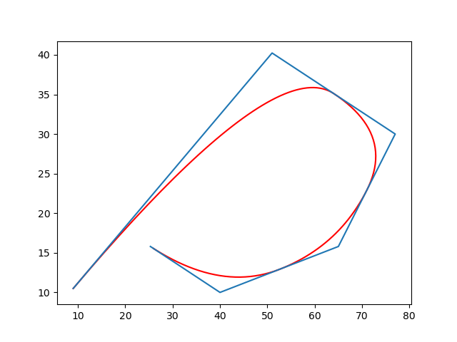B spline curve </center></td>
    </tr>
</table>

**Dubins Curve path plan**

<table>
    <tr>
        <td ><center>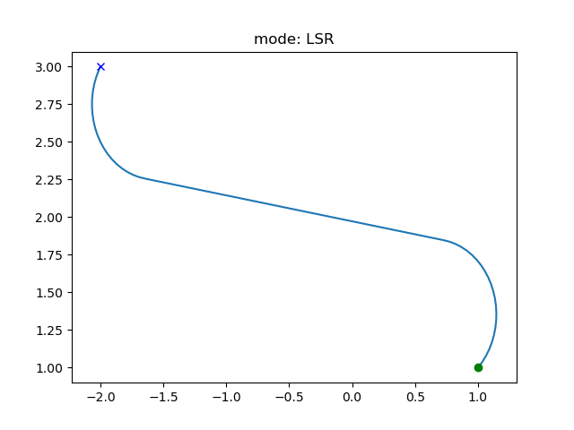dubins curve LSR </center></td>
        <td ><center>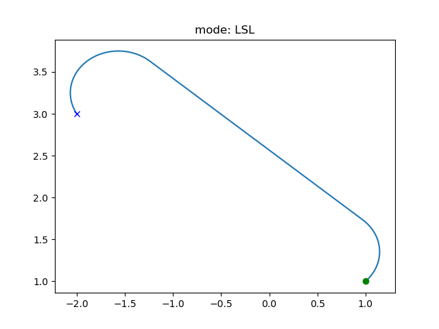dubins curve LSL</center></td>
    </tr>
</table>

### Path Tracking

<table>
    <tr>
        <td ><center>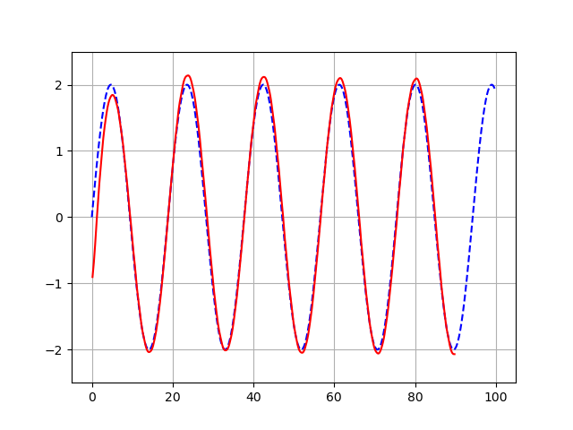PID controller </center></td>
        <td ><center>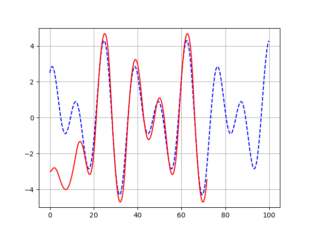LQR controller</center></td>
    </tr>
</table>

<table>
    <tr>
        <td ><center>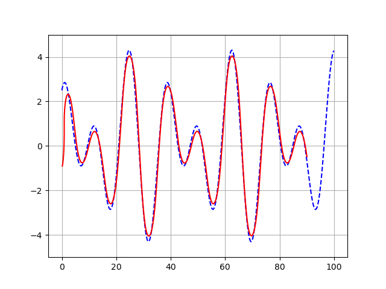pure pursuit controller </center></td>
        <td ><center>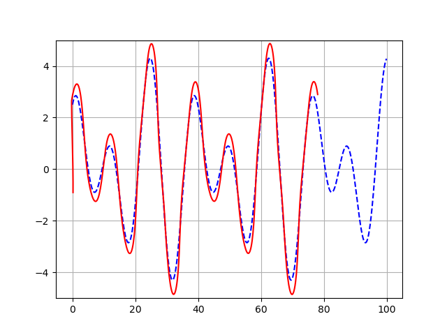stanley controller</center></td>
    </tr>
</table>

## Usage

```bash
mkdir build && cd build

# enable debug
cmake ..
make -j8
```
