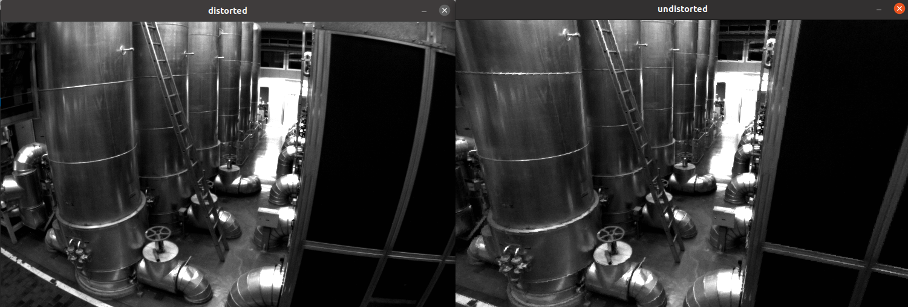
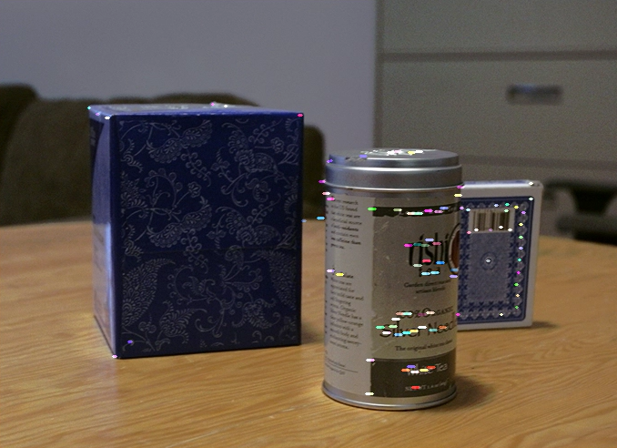
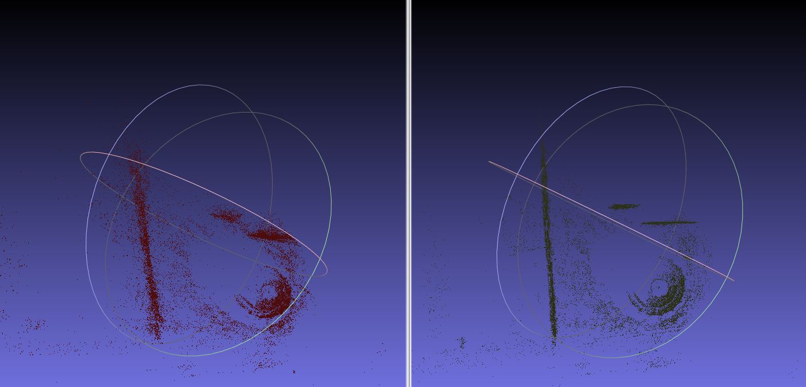
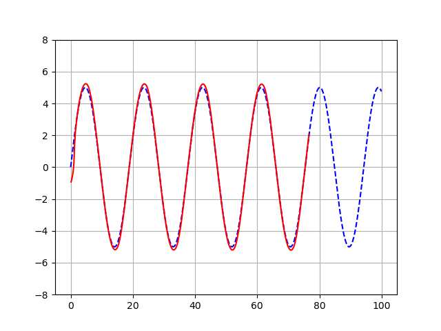
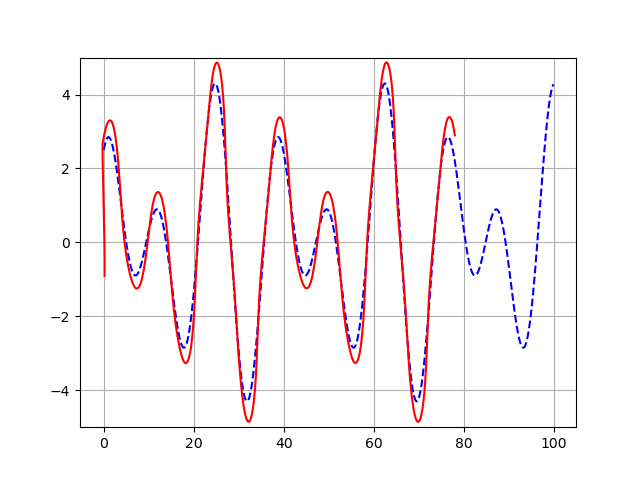

# Sensor Lab <!-- omit in toc -->

[English](./README.md)

这个仓库用于记录我了解过的数学，计算机视觉，AI，机器人，自动驾驶等领域相关方法论的代码实现和笔记

:construction:

- [项目介绍](#项目介绍)
  - [运行环境与依赖](#运行环境与依赖)
- [模块介绍](#模块介绍)
  - [cpp\_test](#cpp_test)
  - [Algorithm](#algorithm)
  - [Feature Detect](#feature-detect)
  - [Pose Estimation](#pose-estimation)
  - [Kalman Filter](#kalman-filter)
  - [imu\_and\_gnss](#imu_and_gnss)
  - [Lidar\_2d](#lidar_2d)
  - [Lidar\_3d](#lidar_3d)
  - [pcl\_test](#pcl_test)
  - [cere\_test](#cere_test)
  - [g2o\_test](#g2o_test)
  - [gtsam\_test](#gtsam_test)
  - [Path Plan](#path-plan)
  - [Path Tracking](#path-tracking)
- [Usage](#usage)

## 项目介绍

### 运行环境与依赖

- Ubuntu 20.04 (virtual machine); ROS noetic
- C++14; OpenCV 4.2.0; Eigen 3.3.7; PCL 1.10.0
- Sophus, commit SHA `a621ff` [local build](./task/local_build_sophus.md), support SO(3) and SE(3) operator
- glog; gflags; gtest build gtest and `sudo cp libgtest*.a /usr/local/lib`
- Ceres 1.12.0, deal with complicated non-linear optimization problems like Bundle Adjustment
- G2O, like Ceres
- DBoW3, images loop closure
- gtsam 4.2.0, optimize library
- Pangolin, installed but rarely used
- Python 3.8.10. I use the features of `matplotlibcpp` and run some python scripts
- yaml-cpp use .yaml

## 模块介绍

每个模块会描述各自包含的方法

> attention: some test data comes from the network public dataset

### cpp_test

包含一些C++特性使用例子

### Algorithm

该模块记录了一些传统图像处理与数据拟合，数据插值的方法

- 基于DLT相机标定
- 图像去畸变
- 基于Tsai-Lenz方法的手眼标定(眼在手上)
- 最小二乘多项式曲线拟合与移动最小二乘拟合
- 三次样条曲线插值
- 薄板样条插值

**图像去畸变**



### Feature Detect

- 基于ORB的图像特征检测


- LK 光流应用

<table>
    <tr>
        <td ><center>pre image</center></td>
        <td ><center>current image</center></td>
        <td ><center>LK option flow result</center></td>
    </tr>
</table>

### Pose Estimation

- sfm: 对极约束计算相机帧间运动并使用三角化估计3D点位置
- 3D ICP
- gaussian-newton 估计相机位置

### Kalman Filter

- 直接线性卡尔曼点估计
- 扩展卡尔曼估计demo

### imu_and_gnss

- imu静态初始化
- 传统imu直接积分
- imu预积分
- gnss数据转换为东北天坐标
- 基于imu直接积分, gnss, odom，使用eskf gins的数据融合（下方左图）
- 在上述基础上改用imu预积分进行数据融合（下方右图） 可见由gnss信号差引起的轨迹中断情况减少


### Lidar_2d

- 2d lidar scans ICP (点到点,点到面ICP)
- scan转换为栅格地图
- lidar 2d 建图


### Lidar_3d

- 点云ICP配准
- 点云NDT配准
- 直接式NDT雷达里程计
- 增量式NDT雷达里程计
- 增量式NDT松耦合雷达里程计

下图为增量式NDT松耦合雷达里程计建图(没有回环检测)


### pcl_test

- 点云直线，平面拟合
- 点云数据转换
- 点云最近点查找

### cere_test

下图演示了ceres优化库在Bundle Adjustment中的简单使用

- 左图是BAL原始数据
- 右图使用 ceres 进行 BA 优化，减少部分噪音（在虚拟机中运行，性能低）




### g2o_test

g2o优化库简单使用

### gtsam_test

gtsam优化库简单使用

### Path Plan

该模块包含了几种经典的全局路径规划，局部路径规划以及基于采样的路径规划

<table>
    <tr>
        <td ><center>Dijkstra global path plan </center></td>
        <td ><center>A star global path plan</center></td>
    </tr>
</table>

<table>
    <tr>
        <td ><center>DWA local path plan </center></td>
        <td ><center>RRT* sample based local path plan</center></td>
    </tr>
</table>

**Bezier Curve local path plan and B spline curve local path plan and smooth**

<table>
    <tr>
        <td ><center>Bezier Curve </center></td>
        <td ><center>B spline curve </center></td>
    </tr>
</table>

**Dubins Curve path plan**

<table>
    <tr>
        <td ><center>dubins curve LSR </center></td>
        <td ><center>dubins curve LSL</center></td>
    </tr>
</table>

### Path Tracking

该模块包含了几种经典的路径跟踪方法

<table>
    <tr>
        <td ><center>PID controller </center></td>
        <td ><center>LQR controller</center></td>
    </tr>
</table>

<table>
    <tr>
        <td ><center>pure pursuit controller </center></td>
        <td ><center>stanley controller</center></td>
    </tr>
</table>

## Usage

```bash
mkdir build && cd build

# enable debug
cmake ..
make -j8
```
