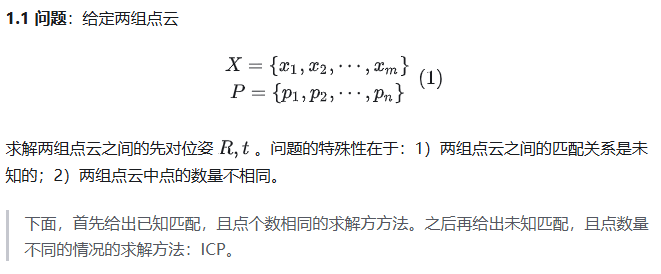
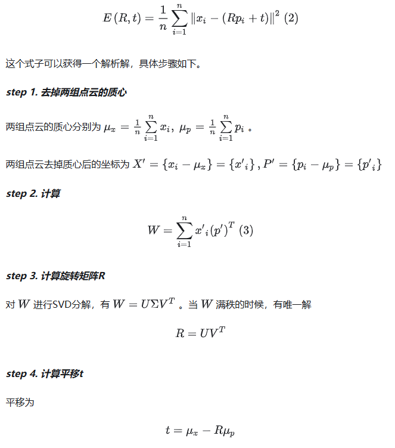
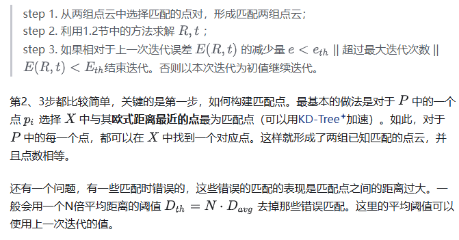
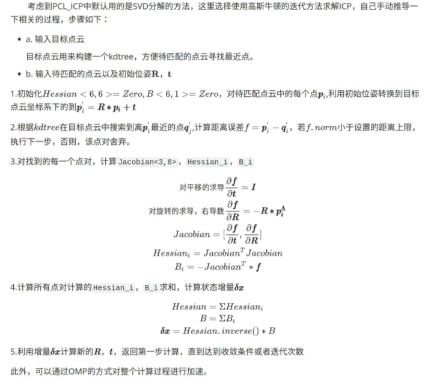

# ICP 最近点迭代法

给定两帧点云，分别使用基于svd求解icp、基于高斯牛顿求解icp

## SVD求解

问题：给定两组点云，求解链子点云之间的刚体变换关系

### 点数量相同，已知点之间的匹配关系

此时，两组点云是已经匹配好的（通过下标一一对应），且数量相等（m=n）。可通过最小化下式求解R T

求解步骤为：

- 点云去质心
- 计算类协方差矩阵W
- 对矩阵W进行SVD分解，R=$U*V^{T}$
- 计算平移

### 点数量不同，匹配关系未知

实际情况下，点云之间的匹配关系是不知道，且点的数量不相等的。为此，ICP算法采用迭代求解的方法。具体的迭代如下步骤

## 高斯牛顿法求解ICP

需要先验信息提供一个初始的R T

## reference

- [SVD求解icp](https://zhuanlan.zhihu.com/p/63964953)
- [最小二乘求解icp]()
