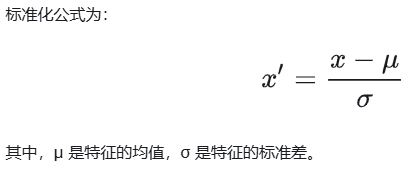
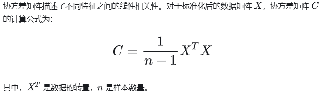
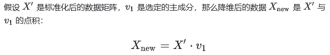
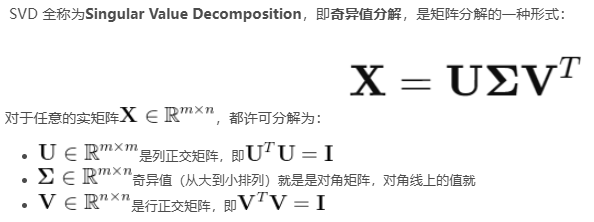
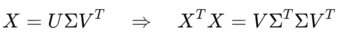

# PCA

主成分分析（PCA）核心目标是通过线性变换将高维数据投影到低维空间，同时尽可能保留信息的方差（即信息量）。PCA通过找到一组新的正交基（称为主成分），使数据在这些基上的投影具有最大方差，从而实现降维

- 降维的目的：高维数据通常包含冗余信息或噪声，PCA通过保留主要信息（高方差方向）来减少维度，降低计算复杂度和过拟合风险。
- 正交性：主成分之间是正交的，确保降维后的特征不相关。
- 方差最大化：主成分的方向是数据协方差矩阵的特征向量，对应的特征值表示该方向的方差大小

## 数学过程

1. 数据标准化（可选）：由于PCA对数据的方差非常敏感，如果不同特征的量纲（尺度）不同，方差较大的特征将会主导结果，因此，通常需要对数据进行标准化 ，使每个特征具有均值为0，方差为1

2. 计算协方差矩阵

协方差矩阵描述了不同特征之间的线性相关性

3. 计算特征值与特征向量

计算矩阵C的特征值和特征向量，特征值表示每个主成分的方差大小，特征向量表示主成分的方向

- 特征值按从大到小排列，对应的特征向量就是主成分的方向

4. 选择主成分

根据特征值的大小，选择前 k 个主成分（通常选择累计方差贡献率达到一定比例，比如95%）。这些主成分对应的特征向量组成了新的坐标系

5. 数据投影

将原始数据投影到选定的主成分上，得到降维后的数据。假设我们选择了 k 个主成分，那么降维后的数据就是 n×k 的矩阵

### PCA与SVD分解

SVD 与 PCA 的关系

1. PCA 本质上就是对协方差矩阵做特征分解
2. 而协方差矩阵C，其特征分解其实就等价于对 X(协方差对应原数据) 做SVD

- V的列就是PCA的主成分方向（特征向量）
- 奇异值矩阵的对角线元素就是协方差矩阵的特征值
