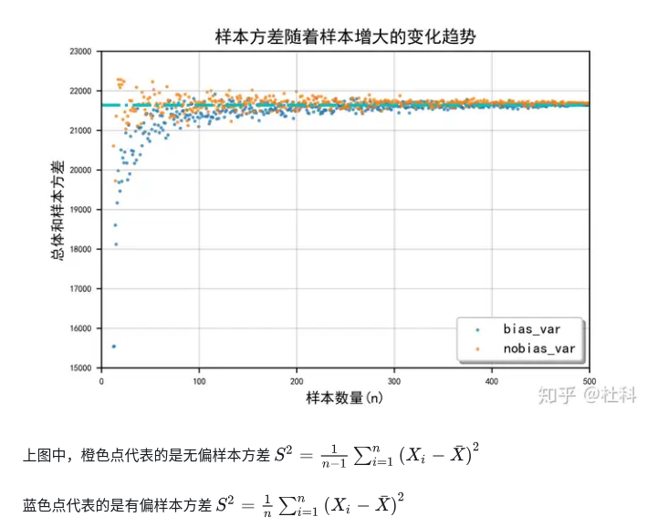
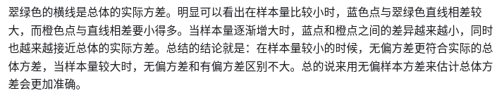

## 无偏样本估计方差与有偏样本方差

无偏样本方差 $S^2=(n-1)^-1\Sigma_{i=1}^n(X_i-\mu)^2$

有偏样本方差 $S^2=(n)^-1\Sigma_{i=1}^n(X_i-\mu)^2$

两者的区别就是一个除以的是n-1,而另一个除以的是n。这里的n或n-1称之为自由度

- 在平均值已知情况下，自由度是n-1而不是n
- 在样本量较小的时候，无偏方差更符合实际的总体方差
- 当样本量较大时，无偏方差和有偏方差区别不大
- 总的说来用无偏样本方差来估计总体方差会更加准确。
