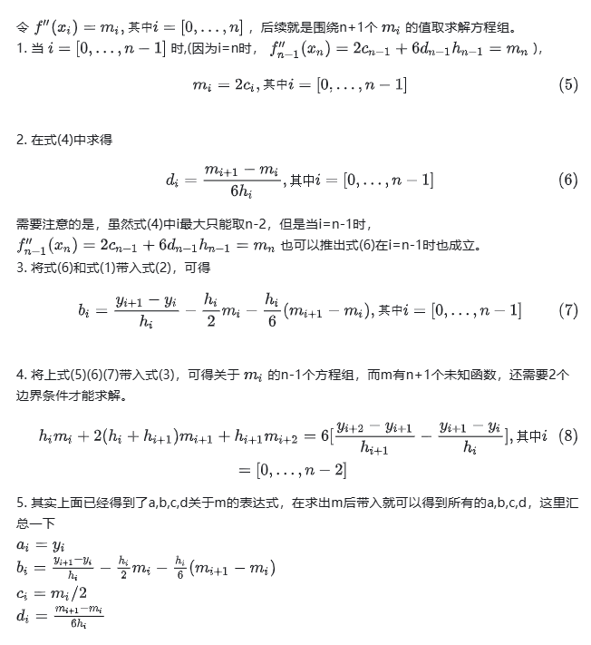
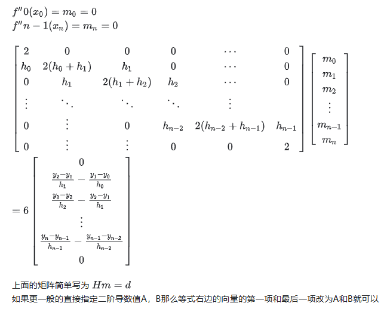

- [cubic\_spline\_interpolation](#cubic_spline_interpolation)
  - [龙格库塔现象](#龙格库塔现象)
  - [三次样条插值实现](#三次样条插值实现)
  - [方程消元](#方程消元)
- [reference](#reference)

# cubic_spline_interpolation

cubic_spline_interpolation 三次样条插值

当已知某些点而不知道具体方程时候，通常会进行拟合或者插值, 拟合不要求方程通过所有的已知点,插值则是每个已知点都会穿过．插值高阶会出现龙格库塔现象

## 龙格库塔现象

- 指在使用高阶插值方法时，可能会出现振荡或不稳定的插值结果，尤其是在数据点之间存在快速变化或噪声的情况下
- 这种现象通常发生在使用超过三次多项式的插值时，因为高阶多项式对数据点之间的插值过于敏感，可能会导致插值曲线在数据点之间产生不必要的波动和尖峰
- 因此，为了避免这种现象，通常推荐使用分段插值方法，如三次样条插值，它能够在保证插值点通过的前提下，提供更平滑和稳定的插值结果

## 三次样条插值实现

- 在区间段[a,b]上划分[(x0,x1),(x1,x2),(x2,x3),...,(x_{n-1, x_n})], 其中a=x0, b=x_n, 因此有n+1个点和n个区间
- 在每一个区间段上用三次函数 $y=a_{i} + b_{i}x + c_{i}x^2 + d_{i}x^{3}$进行插值插值，要求端点的左右一阶导数和二阶导数相等
- 有n个区间，就有n个三次函数，就有4n个待定系数要求，要解出这些未知数，则我们需要4n个方程来求解

**假设有n+1个点，n个三次函数区间,要找出4n个方程来求解4n个未知数**

1. 所有点必须满足对应插值插值方程, 除了两个端点，所有n-1内部点都要满足首尾两个方程, 2(n-1)方程，然后再加上两个端点分别满足第一个和最后一个三次方程，则总共有2n个方程
2. n-1个内部点的一阶导数应该是连续的，第i区间的末点与第i+1区间的起点是同一点，且它们的一阶导数相等 $S_{i}^{'}　(x_{i+1}) = S_{i+1}^{'}　(x_{i+1})$ 则有n-1个方程
3. 另外，内部点的二阶导数也要连续 $S_{i}^{''}　(x_{i+1}) = S_{i+1}^{''}　(x_{i+1})$ 也有n-1个方程
4. 现在总共有4n-2个方程了，还差两个方程就可以解出所有未知数了，这两个方程我们通过边界条件得到

有三种边界条件

- 自然边界(Natural Spline): 指定端点二阶导数为0 $S^{''}　(x_{0}) = S^{''}　(x_{n}) = 0$
- 固定边界(Clamped Spline): 指定端点一阶导数，这里分别定为A和B $S_{0}^{'}　(x_{0}) = A; S_{n-1}^{'}　(x_{n}) = B$
- 非扭结边界(Not-A-Knot Spline): 强制第一个插值点的三阶导数值等于第二个点的三阶导数值，最后第一个点的三阶导数值等于倒数第二个点的三阶导数值

## 方程消元

自然边界说明

# reference

- [三次样条插值理论推导、自定义实现与scipy实现](https://zhuanlan.zhihu.com/p/672601034)
