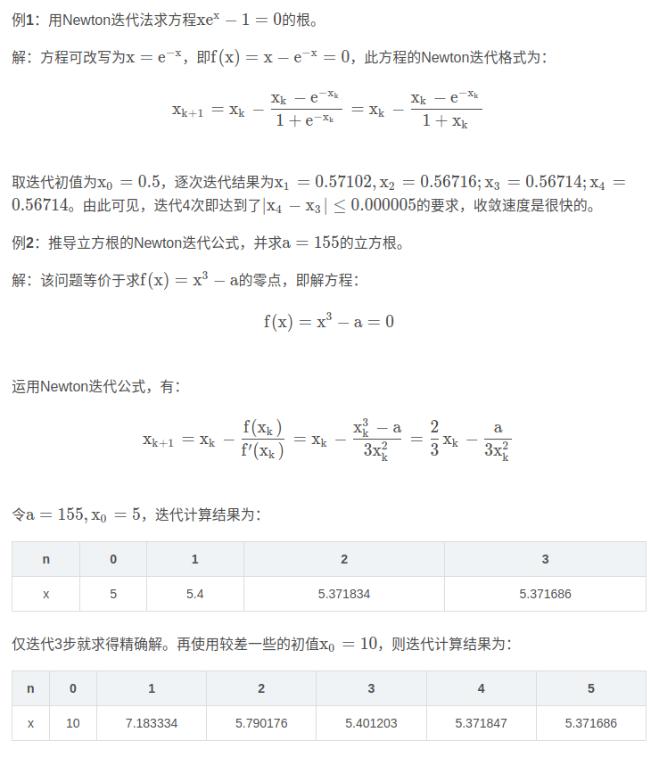
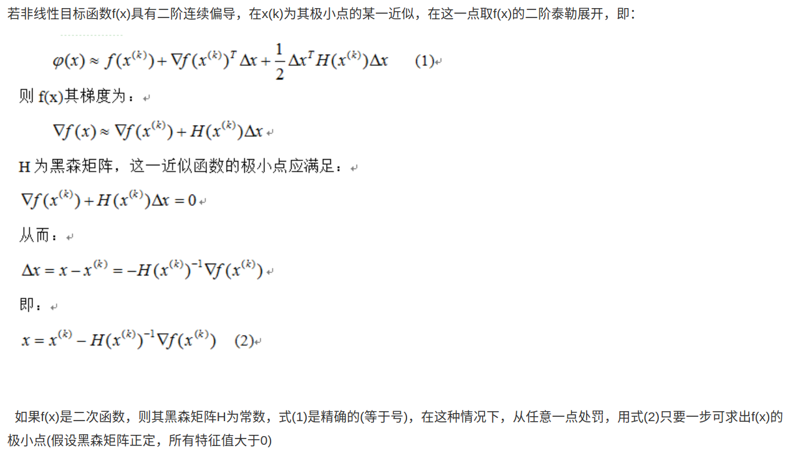
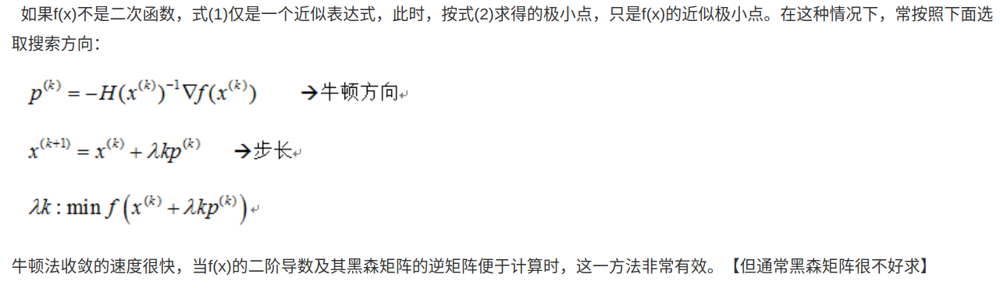
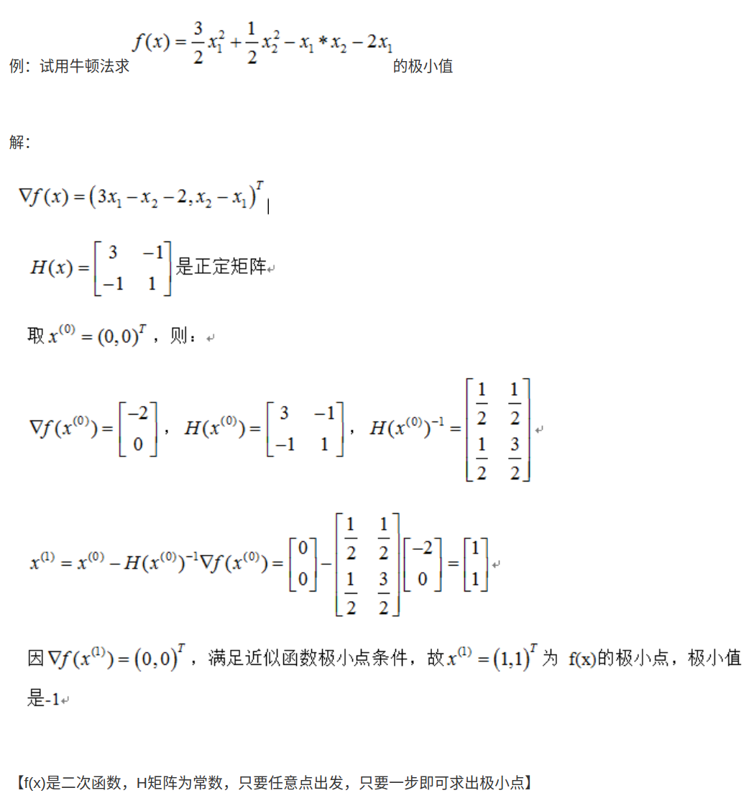
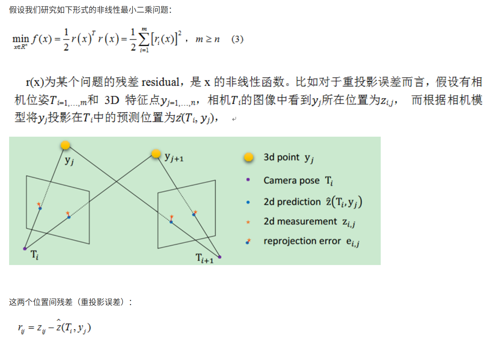
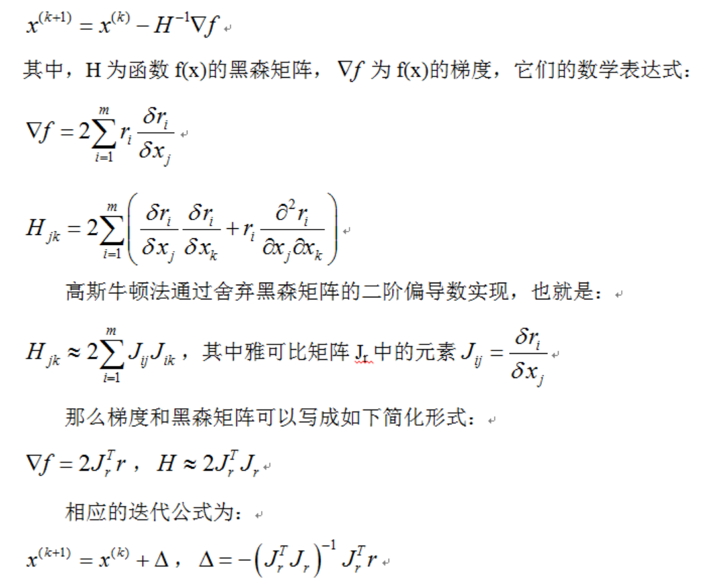

- [newton method](#newton-method)
  - [一维牛顿法](#一维牛顿法)
  - [二维牛顿法](#二维牛顿法)
- [gauss-newton method](#gauss-newton-method)
  - [优点分析](#优点分析)
  - [gauss-newton 非线性最小二乘 example](#gauss-newton-非线性最小二乘-example)
- [列文伯格-马夸尔特算法 L-M](#列文伯格-马夸尔特算法-l-m)
- [参考文章](#参考文章)

# newton method

## 一维牛顿法

- Newton迭代法的基本思想是：设法将一个非线性方程f ( x ) = 0 f(x)=0f(x)=0转化为某种线性方程求解，其解决问题的基础是Taylor（泰勒）多项式
- 设$f(x)=0$的近似根为{x_k},则函数$f(x)$在点{x_k}附近可用１阶泰勒多项式近似

$$
p(x)=f({x_k})+f'({x_k})(x-{x_k})\approx f({x_k}) = 0
$$

得到线性方程

$$
f({x_k})+f'({x_k})(x-{x_k})=0
$$

解之，得该线性方程的根x，但它是$f(x)=0$的近似根，记作$x_{k+1}$

$$
x_{k+1} = x_{k} - \frac{f(x_{k})}{f'(x_{k})}
$$

重复迭代，直到误差允许



## 二维牛顿法

**导数一般指一元函数，偏导一般指多元函数**



这里(1)式最后$\Delta x$漏了平方标记



举例



为了缓解计算H矩阵有时比较困难的问题，引入gauss-newton

# gauss-newton method

- 对newton的改进:用雅克比矩阵的乘积近似代替牛顿法中的二阶Hessian 矩阵，从而省略了求二阶Hessian 矩阵的计算
- 有时候为了拟合数据，比如根据重投影误差求相机位姿(R,T为方程系数)，常常将求解模型转化为非线性最小二乘问题
- 高斯牛顿法正是用于解决非线性最小二乘问题，达到数据拟合、参数估计和函数估计的目的



如果有大量观测点(多维)，我们可以通过选择合理的T使得残差的平方和最小求得两个相机之间的位姿

若用牛顿法求(3)



令$H = J^TJ \quad B = -J^Tr$

有$x_{x+1}-x_{k} = H^{-1}B$

则$H \Delta x = B$

- 看到这里大家都明白高斯牛顿和牛顿法的差异了吧，就在这迭代项上。经典高斯牛顿算法迭代步长$\lambda$为1
- 高斯牛顿法里为啥要舍弃黑森矩阵的二阶偏导数呢？主要问题是因为牛顿法中Hessian矩阵中的二阶信息项通常难以计算或者花费的工作量很大，而利用整个H的割线近似也不可取
- 因为在计算梯度时$\bigtriangledown f$时已经得到J(x)，这样H中的一阶信息项$J^TJ$几乎是现成的。鉴于此，为了简化计算，获得有效算法，我们可用一阶导数信息逼近二阶信息项
  - 注意这么干的前提是，残差r接近于零或者接近线性函数
  - 从而$\bigtriangledown f$接近零时，二阶信息项才可以忽略。通常称为“小残量问题”，否则高斯牛顿法不收敛

- 这要求 $H$可逆（正定），但实际情况并不一定满足这个条件，因此可能发散，另外步长$\Delta x$可能太大，也会导致发散。
- 如果已知观测z的协方差的矩阵$\Sigma$，应该对指标函数按方差$\Sigma$加权，方差大的观测分量权重小，对结果的影响小.
  - 迭代公式为：
  - 设信息矩阵$\Sigma^{-1}$，由Cholesky分解，$\Sigma^{-1} = A^{T}A$, 得：
  - 因此加权最小二乘可以转换为非加权问题

## 优点分析


优点：
- 对于零残量问题，即r=0，有局部二阶收敛速度
- 对于小残量问题，即r较小或接近线性，有快的局部收敛速度
- 对于线性最小二乘问题，一步达到极小点

缺点：
- 对于不是很严重的大残量问题，有较慢的局部收敛速度
- 对于残量很大的问题或r的非线性程度很大的问题，不收敛
- 不一定总体收敛
- 如果J不满秩，则方法无定义

## gauss-newton 非线性最小二乘 example

非线性方程：$y = exp(ax^2 + bx +c)$ 给定n组观测数据$(x, y)$ 求解系数 $X = [a, b, c]^T$

令$f(X) = y - exp(ax^2 + bx + c)$ N组数据可以组成一个大的非线性方程组

可以构建一个最小二乘问题：

要求解这个问题，根据推导部分可知，需要求解雅克比

```cpp
#include <iostream>
#include <Eigen/Core>
#include <vector>
#include <opencv2/opencv.hpp>
#include <Eigen/Cholesky>
#include <Eigen/QR>
#include <Eigen/SVD>
#include <chrono>

class CostFunction{
public:
        CostFunction(double* a, double* b, double* c, int max_iter, double min_step, bool is_out):
        a_(a), b_(b), c_(c), max_iter_(max_iter), min_step_(min_step), is_out_(is_out)
        {}

        void addObservation(double x, double y)
        {
            std::vector<double> ob;
            ob.push_back(x);
            ob.push_back(y);
            obs_.push_back(ob);
        }

        void calcJ_fx()
        {
            J_ .resize(obs_.size(), 3);
            fx_.resize(obs_.size(), 1);

            for ( size_t i = 0; i < obs_.size(); i ++)
            {
                std::vector<double>& ob = obs_.at(i);
                double& x = ob.at(0);
                double& y = ob.at(1);
                double j1 = -x*x*exp(*a_ * x*x + *b_*x + *c_);
                double j2 = -x*exp(*a_ * x*x + *b_*x + *c_);
                double j3 = -exp(*a_ * x*x + *b_*x + *c_);
                J_(i, 0 ) = j1;
                J_(i, 1) = j2;
                J_(i, 2) = j3;
                fx_(i, 0) = y - exp( *a_ *x*x + *b_*x +*c_);
            }
        }

       void calcH_b()
        {
            H_ = J_.transpose() * J_;
            B_ = -J_.transpose() * fx_;
        }

        void calcDeltax()
        {
            deltax_ = H_.ldlt().solve(B_); // H* deltax = B
        }

       void updateX()
        {
            *a_ += deltax_(0);
            *b_ += deltax_(1);
            *c_ += deltax_(2);
        }

        double getCost()
        {
            Eigen::MatrixXd cost= fx_.transpose() * fx_;
            return cost(0,0);
        }

        void solveByGaussNewton()
        {
            double sumt =0;
            bool is_conv = false;
            for( size_t i = 0; i < max_iter_; i ++)
            {
                calcJ_fx();
                calcH_b();
                calcDeltax();
                double delta = deltax_.transpose() * deltax_;
                if( is_out_ )
                {
                    std::cout << "Iter: " << std::left <<std::setw(3) << i << " Result: "<< std::left <<std::setw(10)  << *a_ << " " << std::left <<std::setw(10)  << *b_ << " " << std::left <<std::setw(10) << *c_ << 
                    " step: " << std::left <<std::setw(14) << delta << " cost: "<< std::left <<std::setw(14)  << getCost() << " time: " << std::left <<std::setw(14) << t.duration()  <<
                    " total_time: "<< std::left <<std::setw(14) << (sumt += t.duration()) << std::endl;
                }
                if( delta < min_step_)
                {
                    is_conv = true;
                    break;
                }
                updateX();
            }

           if( is_conv  == true)
                std::cout << "\nConverged\n";
            else
                std::cout << "\nDiverged\n\n";
        }

        Eigen::MatrixXd fx_;
        Eigen::MatrixXd J_; // 
        Eigen::Matrix3d H_; // H
        Eigen::Vector3d B_;
        Eigen::Vector3d deltax_;
        std::vector< std::vector<double>  > obs_; //
        double* a_, *b_, *c_;

        int max_iter_;
        double min_step_;
        bool is_out_;
};//class CostFunction

int main(int argc, char **argv) {
    const double aa = 0.1, bb = 0.5, cc = 2; // true value
    double a =0.0, b=0.0, c=0.0; // first value

    CostFunction cost_func(&a, &b, &c, 50, 1e-10, true);

    /* generate data */
    const size_t N = 100; // data size
    cv::RNG rng(cv::getTickCount());
    for( size_t i = 0; i < N; i ++)
    {
       double x = rng.uniform(0.0, 1.0) ;
       double y = exp(aa*x*x + bb*x + cc) + rng.gaussian(0.05);

       cost_func.addObservation(x, y);
    }
    cost_func.solveByGaussNewton();
    return 0;
}
```

# 列文伯格-马夸尔特算法 L-M

- 不难看出， G-N优化通过在$ X $附近进行近似二阶泰勒展开来简化计算
- 这也决定了$\Delta X$只在$X$附近才有较高的置信度，我们很自然地想到应该给$\Delta X$添加一个信赖区域(Trust Region) ，不让$\Delta X$过大，于是就产生了L-M优化算法

L-M优化通过在增量方程中增加一个动态拉格朗日乘子$\mu$来改善G-N方法：

L-M优化中的增量方程:

拉格朗日乘子$\mu$设定为正数；由于$H$是半正定矩阵，所以其对角阵$I \cdot H$是正定矩阵。这样$\mu$增大，$\Delta x$减小，成反比关系。

- 对与$\mu > 0$，$H + \mu I$正定，保证了度下降的方向。
- 当$\mu$较大时：其实就是梯度、最速下降法，当离最终结果较远的时候，很好。
- 当$\mu$较小时，方法接近与高斯牛顿，当离最终结果很近时，可以获得二次收敛速度。
- 在一次迭代中， $H$和$g$是不变的，如果我们发觉解出的$\Delta x$过大，就适当调大$\mu$，并重新计算增量方程，以获得相对小一些的$\Delta x$；

反过来，如果发觉解出的$\Delta x$在合理的范围内，则适当减小$\mu$，减小后的$\mu$将用于下次迭代，相当于允许下次迭代时$\Delta x$有更大的取值，以尽可能地加快收敛速度。

通过这样的调控，L-M算法即保证了收敛的稳定性，又加快了收敛速度。

$\mu$初始值：

$\mu$的值应该和$H$的最大特征值在一个数量级。对于$J^TJ$对角线上的最大元素和最大特征值在一个数量级：

$\mu$更新：

实际下降比上近似下降

if $\rho > 0$

$\mu = \mu max\{ 1/3, 1-(2\rho-1)^3 \} \quad v = 2$

else
$\mu = \mu v \quad v = 2 * v$

# 参考文章

- [高斯牛顿法 | Gauss-Newton Method](https://www.liuxiao.org/kb/%e9%ab%98%e6%96%af%e7%89%9b%e9%a1%bf%e6%b3%95-gauss-newton-method/)
- [牛顿法 高斯牛顿法 列文伯格-马夸尔特算法](https://scm_mos.gitlab.io/algorithm/newton-and-gauss-newton/)
- [高斯-牛顿算法](https://www.cnblogs.com/wlzy/p/8012562.html)
