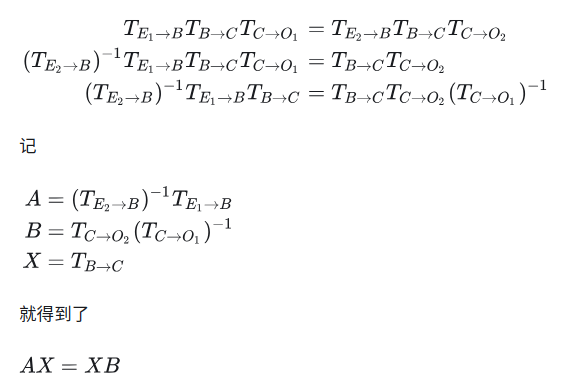

- [eye in hand](#eye-in-hand)
- [eye to hand](#eye-to-hand)
- [Tsai-Lenz　求解ＡＸ＝ＸＢ](#tsai-lenz求解ａｘｘｂ)

先定义坐标系，se表示机械臂的底座，用End表示机械臂的末端，用Camera表示摄像头，用Object表示标定板

## eye in hand

Tsai-Lenz 论文中是以eye in hand做演示

Eye-In-Hand，是指摄像头被安装在机械臂上(想起给机械臂，相机拧螺丝的日子)。此时要求取的是，End到Camera之间的坐标转换关系，也就是$X=T_{E->C}$,那么有两个不变量

1. 相机与机械臂末端之间的坐标转换关系不变　$T_{E->C}$
2. 标定板与机械臂底座之间的坐标转换关系不变　$T_{Ｂ->Ｏ}$

把$T_{Ｂ->Ｏ}$按照两次运动展开

也就是，如果能够计算移动前后，机械臂末端的坐标变换关系Ａ,相机的坐标变换关系Ｂ，就可以求机械臂末端到相机之间的坐标变换Ｘ

## eye to hand

Eye-To-Hand，是指相机被安装在一个固定不动的位置（然而这个固定不动，很难，脚趾头碰一下差不多就要重新标了），而标定板被拿在机械臂上．此时要求取的是，Base到Camera之间的坐标转换关系也就是$X=T_{B->C}$

此时的不变量有
1. 相机与机械臂底座之间的坐标转换关系不变　$X=T_{B->C}$
2. 标定板与机械臂末端转换关系不变　$X=T_{Ｅ->Ｏ}$

把$T_{Ｅ->Ｏ}$按照两次运动展开

## Tsai-Lenz　求解ＡＸ＝ＸＢ

求解ＡＸ＝ＸＢ可以用 Tsai-Lenz 两步法或者李群理论法求解

将ＡＸ＝ＸＢ矩阵分解为两个方程组

$R_{cg}$，$Ｔ_{cg}$就是Ｘ的旋转部分和平移部分．Tsai-Lenz论文方法，先求$R_{cg}$再带入下式求解$Ｔ_{cg}$

1. 用罗德里格斯公式将旋转矩阵转换为旋转向量

2. 旋转向量归一化，得到单位旋转轴和旋转角*(将旋转向量解耦)*

3. 修正的罗德里格斯参数表示姿态变换

4. 计算初始的$P_{cg}$

5. 计算旋转角$\theta_{R_{cg}}$

6. 计算$P_{cg}$

7. 利用罗德里格斯计算旋转矩阵$R_{cg}$

下面这个更常用

8. 计算平移向量$Ｔ_{cg}$

**参考**

[A new technique for fully autonomous and efficient 3D robotics hand/eye calibration](https://ieeexplore.ieee.org/document/34770/?reload=true&arnumber=34770&newsearch=true&queryText=A%20New%20Technique%20for%20Fully%20Autonomous%20and%20Efficient%203D%20Robotics%20Hand%2FEye%20Calibration)

[手眼标定AX=XB原理](https://zhuanlan.zhihu.com/p/103749589)

[标定学习笔记（四）-- 手眼标定详解](https://blog.csdn.net/qq_45006390/article/details/121670412)

[经典手眼标定算法之Tsai-Lenz](https://blog.csdn.net/wjdexz/article/details/78516585)
[Tsai手眼标定算法](https://blog.csdn.net/m0_38144614/article/details/116293727?utm_medium=distribute.pc_relevant.none-task-blog-2~default~baidujs_baidulandingword~default-8-116293727-blog-78516585.235^v43^pc_blog_bottom_relevance_base7&spm=1001.2101.3001.4242.5&utm_relevant_index=11)
