- [least square curve fit](#least-square-curve-fit)
  - [代数法求解](#代数法求解)
  - [矩阵法求解](#矩阵法求解)
    - [一般形式](#一般形式)
    - [对代数的改进](#对代数的改进)
  - [代数法实现](#代数法实现)
  - [矩阵法实现](#矩阵法实现)

# least square curve fit

最小二乘法（Least Square Method，LSM）通过最小化误差（也叫残差）的平方和寻找数据的最优函数匹配。

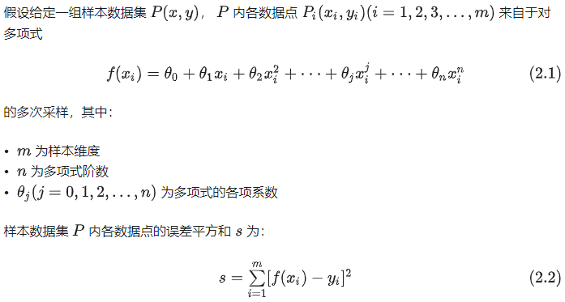

最优的各项系数使得残差平方和取得最小值
[最小二乘法与极大似然估计有着密切关系](https://www.matongxue.com/madocs/818)

## 代数法求解

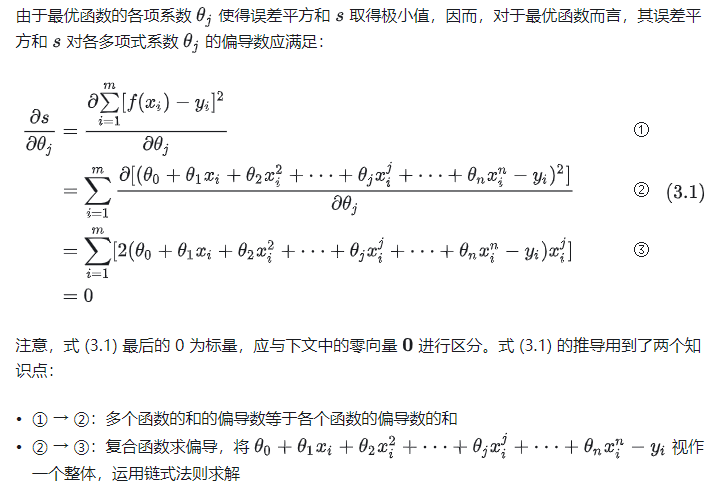

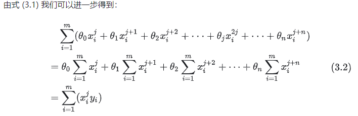

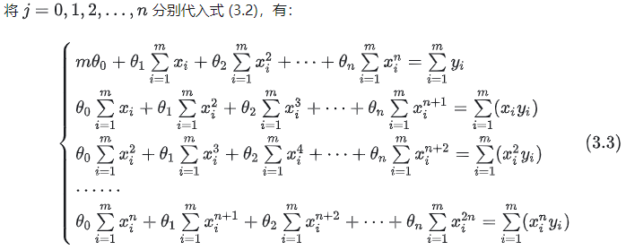

转换为矩阵形式

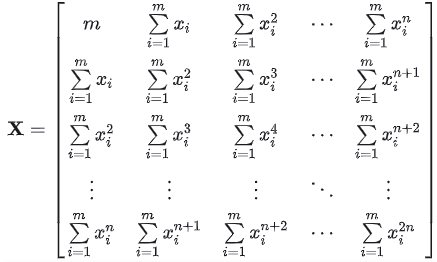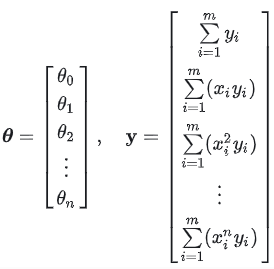

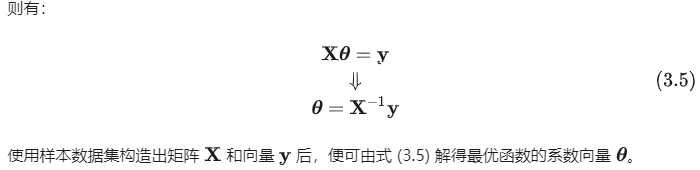

## 矩阵法求解

### 一般形式

把多项式转变为矩阵形式

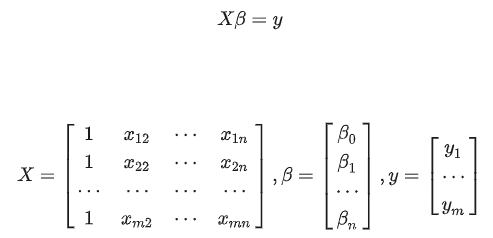

这里的β不应该带转置

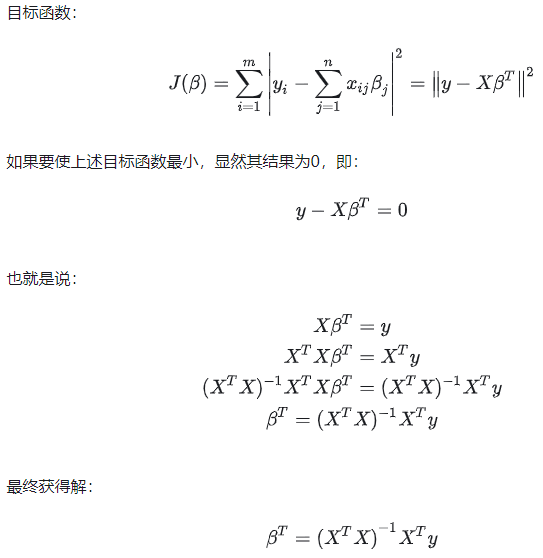

### 对代数的改进

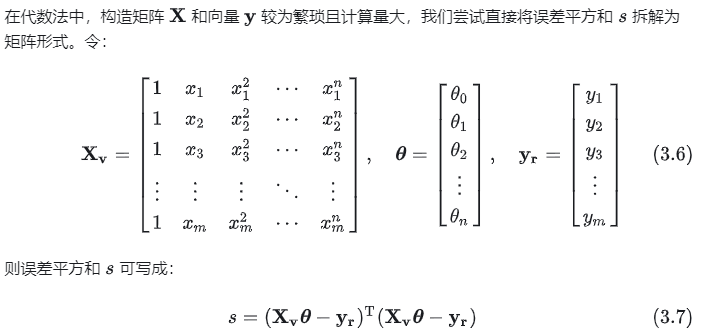

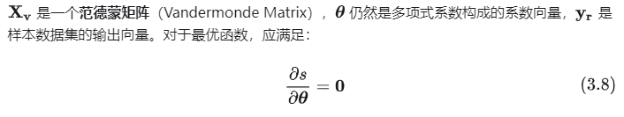

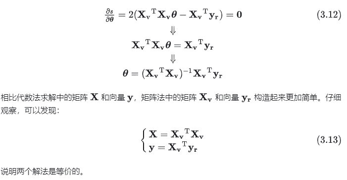

## 代数法实现

```cpp
bool polynomialCurveFit(std::vector<cv::Point2f>& key_point, int n, cv::Mat& A)
{
  //Number of key points
  int N = key_point.size();

  // generate matrix X
  cv::Mat X = cv::Mat::zeros(n + 1, n + 1, CV_64FC1);
  for (size_t i = 0; i < n + 1; i++)
  {
    for (size_t j = 0; j < n + 1; j++)
    {
      for (size_t k = 0; k < N; k++)
      {
        X.at<double>(i, j) = X.at<double>(i, j) +
          std::pow(key_point[k].x, i + j);
      }
    }
  }

  // generate matrix Y
  cv::Mat Y = cv::Mat::zeros(n + 1, 1, CV_64FC1);
  for (size_t i = 0; i < n + 1; i++)
  {
    for (size_t k = 0; k < N; k++)
    {
      Y.at<double>(i, 0) = Y.at<double>(i, 0) +
        std::pow(key_point[k].x, i) * key_point[k].y;
    }
  }

  A = cv::Mat::zeros(n + 1, 1, CV_64FC1);
  // estimate matrix 
  return cv::solve(X, Y, A, cv::DECOMP_LU);
}

```

## 矩阵法实现

```cpp
// 矩阵方式求解
void PolyFit(const std::vector<cv::Point2f> &points, const int order,
             cv::Mat *coeff) {
  cv::Mat A = cv::Mat::ones(n, order + 1, CV_64FC1);
  cv::Mat B = cv::Mat::zeros(n, 1, CV_64FC1);

  for (int i = 0; i < n; ++i) {
    const double a = points.at(i).x;
    const double b = points.at(i).y;
    B.at<double>(i, 0) = b;

    for (int j = 0, v = 1.0; j < order + 1; ++j, v *= a) {
      A.at<double>(i, j) = v;
    }
  }

  // 使用cv::solve求解(A^T * A) * coeff = A^T * B
  cv::Mat At = A.t();
  cv::Mat AtA = At * A;
  cv::Mat AtB = At * B;
  cv::solve(AtA, AtB, *coeff, cv::DECOMP_NORMAL);
}
```

也可以直接使用SVD对多项式方程的矩阵形式求解

```cpp
bool polynomialCurveFit(std::vector<Point2F>& key_point, int n, cv::Mat& A) {
  int m = key_point.size();
  cv::Mat X = cv::Mat::ones(m, n + 1, CV_64FC1);
  cv::Mat Y = cv::Mat::ones(m, 1, CV_64FC1);

  for (size_t i = 0; i < m; i++)
  {
    for (size_t j = 0; j < n + 1; j++)
    {
      X.at<double>(i, j) = std::pow(key_point[i][0], j);
    }
  }

  for (size_t i = 0; i < m; i++)
  {
    Y.at<double>(i, 0) = key_point[i][1];
  }

  A = cv::Mat::zeros(n + 1, 1, CV_64FC1);
  // XA=Y,求解Ａ cv::solve返回Ａ向量
  return cv::solve(X, Y, A, cv::DECOMP_SVD);;
}

```
