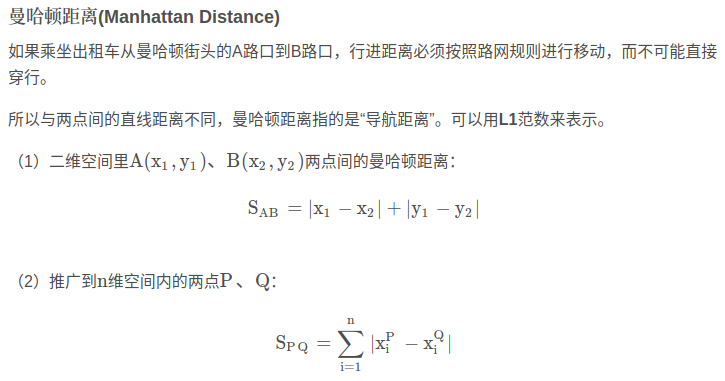

- [mahalanobis distance](#mahalanobis-distance)
- [euclidean distance](#euclidean-distance)
- [Manhattan Distance](#manhattan-distance)

## mahalanobis distance

mahalanobis distance 马式距离,用于测量点（向量）与分布之间的距离

- 表示数据的协方差距离。它是一种有效的计算两个未知样本集的相似度的方法。与欧氏距离不同的是它考虑到各种特性之间的联系

向量x到均值为$\mu$,协方差为S的样本分布的马式距离为

$$
D(x,y)=((x-\mu)S^{-1}(x-\mu)^{-1})^{1/2}
$$

协方差为单位阵时，退化为欧式距离

- 马氏距离的目的就是把方差归一化，使得特征之间的关系更加符合实际情况
- 马氏距离可以排除变量之间的相关性的干扰。但是在计算马氏距离过程中，要求总体样本数大于样本的维数，否则样本协方差矩阵的逆矩阵不存在

马氏距离与欧式距离的不同
- 首先将列转换为不相关的变量
- 缩放列以使其方差等于1
- 计算出加强版欧几里得距离

## euclidean distance

euclidean distance 欧式距离

## Manhattan Distance

参考

- [马氏距离](https://blog.csdn.net/Bit_Coders/article/details/115859264)
- [欧式距离](https://blog.csdn.net/Bit_Coders/article/details/115840560)
