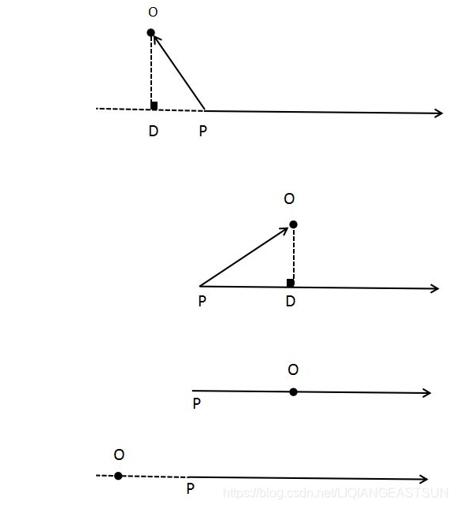
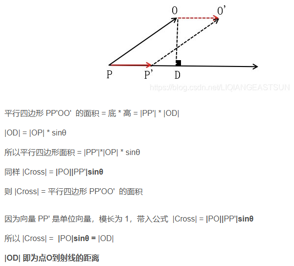

# 点到射线的关系



求点O到射线的距离以及点O到射线上的垂点位置。

其中射线方程为 P + t * rayDir，P为射线起点，rayDir 为射线单位方向向量

1. 上图第一个，点O 在射线反向延长线的一侧，向量OD 的长度 |OD| 就是点 O 到射线的距离，D点是点O到射线的垂点
2. 上图第二个，点O在射线正方向的一侧， 向量OD 的长度 |OD| 就是点 O 到射线的距离，D点是点O到射线的垂点
3. 上图第三个，点O在射线正方向上，且点O在射线上，点O到射线的距离为 0，点O到射线的垂点就是点O自身
4. 上图第四个，点O在射线反向延长线上，且点O在射线上，点O到射线的距离为 0，点O到射线的垂点就是点O自身
5. 三、四还包含一种特殊情况，点 O = 点 P

## 点O到射线的垂点D坐标

- 连接向量PO = O坐标 - P坐标
- float dot = PO 点乘 rayDir
- D坐标 = P坐标 + dot * rayDIr

## 求点O到射线的距离

- 向量 Cross = PO 叉乘 rayDir
- 下面使用|Cross| 表示向量模长
- |Cross| = |PO||PP'|sinθ
- θ 为 向量 PO 与向量 PP' 的夹角，向量 PP' = rayDir （rayDir是射线的单位方向向量所以 |rayDir| = 1）

见下图



```cs
public class PointToRay
{
    /// <summary>
    /// 点到射线的距离
    /// </summary>
    /// <param name="oPos"></param>
    /// <param name="pPos"></param>
    /// <param name="rayDir"></param>
    /// <returns></returns>
    public float PointToRayDistance(Vector3 oPos, Vector3 pPos, Vector3 rayDir)
    {
        Vector3 PO = oPos - pPos;
        Vector3 cross = Vector3.Cross(PO, rayDir);
        return cross.magnitude;
    }
 
    /// <summary>
    /// 点到射线的垂点位置
    /// </summary>
    /// <param name="oPos">点</param>
    /// <param name="pPos">射线起点</param>
    /// <param name="rayDir">射线方向向量</param>
    /// <returns></returns>
    public Vector3 PointToRayVertical(Vector3 oPos, Vector3 pPos, Vector3 rayDir)
    {
        Vector3 PO = oPos - pPos;
        float dot = Vector3.Dot(PO, rayDir);
        return pPos + dot * rayDir;
    }
}
```

## reference

- [点到射线的距离、点到射线的垂点位置](https://blog.csdn.net/LIQIANGEASTSUN/article/details/119598965)
