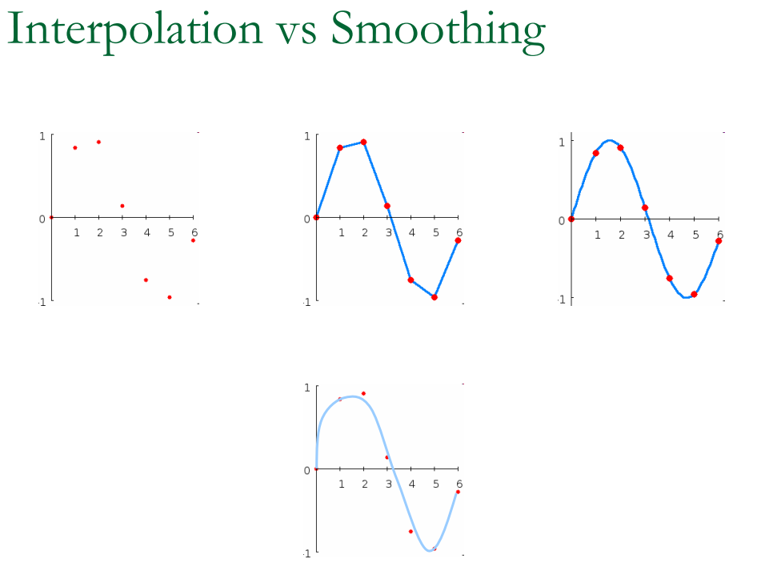

- [移动最小二乘 Moving Lest Squares](#移动最小二乘-moving-lest-squares)
  - [background](#background)
  - [applications](#applications)
  - [最小二乘与移动最小二乘](#最小二乘与移动最小二乘)
- [Direction](#direction)
- [MLS Approach](#mls-approach)
  - [拟合函数](#拟合函数)
  - [权函数](#权函数)
    - [常用的权函数](#常用的权函数)
- [移动最小二乘拟合流程](#移动最小二乘拟合流程)
  - [曲线拟合](#曲线拟合)
  - [移动最小二乘拟合的优点](#移动最小二乘拟合的优点)
  - [缺点](#缺点)

# 移动最小二乘 Moving Lest Squares

[Moving Lest Squares lecture](https://graphics.stanford.edu/courses/cs468-05-fall/slides/niloy_levin_fall_05.pdf)

## background

移动最小二乘法（MLS, Moving Least Squares）是建立大量离散数据拟合曲线的理想方法。当大量离散数据的分布较为杂乱时， 使用传统的最小二乘法，往往需要对数据进行分段拟合，此外还要避免相邻分段上的拟合曲线不连续不平滑的问题。而MLS法在处理相同问题时则不需要上述这些繁琐的步骤，简单易于实现。

## applications

- implicit surface definition 隐式曲面定义
  - projection operators
- noise removal/thinning 降噪
- up sampling 上采样
- ray tracking 射线追踪

## 最小二乘与移动最小二乘

最小二乘法是通过给定的目标函数和点集中找到目标函数的一组系数使其误差最小（L2范式）。一般是多项式函数，未知数为系数，通过找到最佳的系数来拟合。这就有很大的缺陷，对于一般的函数，很难用一个多项式函数来全局拟合。但分段拟合，其中的光滑又很难保证，会带来很大的困难。

移动最小二乘法其实本质上也类似，不同的是它采取的系数是 x 的函数，也就是对不同的目标拟合点它所属的多项式函数是不同的。

# Direction

- 拟合函数的建立：系数向量α(x)和基函数p(x)

- 紧支 compact support 权函数

需要调整系数α(x)使得节点附近采样点取值与拟合函数在采样点取值之间的差的加权平方和最小

- 可以选取不同阶的基函数以获得不同的精度，取不同的权函数以改变拟合曲线（曲面）的光滑度。

# MLS Approach

## 拟合函数

使用移动最小二乘进行曲线曲面拟合的基本思想：先将拟合区域网格化，然后求出网格点上节点值，最后链接网格节点形成拟合曲线（曲面）

在拟合区域的一个局部子域上，拟合函数f(x)表示为

**注意 待求系数α(x)和基函数p(x)向量的系数个数是相等的**

对于2维问题:

线性基：p(x)=[1,x,y]^T^  m=3

二次基：p(x)=[1, x, y, x^2^, xy, y^2^]^T^  m=6

考虑以下最小二乘问题

n是影响区域内节点数量，f(x)是拟合函数，y~i~ 是x=x~i~处节点值，y~i~=y(x);w(x-x~i~)是节点x~i~的权函数。

为确定系数α(x),以上最小二乘问题需要取极小值，J对α(x)求导

求导结果为

将α(x)带回到原式中，注意字母 m n 的表示

如果k=0 则基函数p(x)=[1], 此时的形函数为shepard函数

需要注意的是，即使基函数p(x)为多项式，MLS拟合函数的f(x)也不再是多项式。

## 权函数

权函数在最小二乘法中起到重要作用。移动最小二乘中的权函数 w(x-x~i~) 应该具有紧支性，就是说权函数在x的一个子域内不等于0，在这个子域之外全为0 这个子域成为权函数的支持域（x的影响区域）一般选择圆形作为权函数的支持域，半径记为s~max~ 由于权函数的紧枝性，只有这些包含在影响区域内的数据点对x的取值有影响

- 权函数w(x-x~I~)应该是非负的，并随着||x-x~I~||~2~的增加单调递减
- 权函数具有一定的光滑性，因为拟合函数会继承权函数的连续性
- 常用的权函数是样条函数，如三次样条插值曲线曲线。影响区域应该包含足够多的点，使得A(x)可逆

- 如果拟合函数使用的是线性基函数，则**曲线拟合的影响区域内知道包含不重叠的两个节点** **曲面拟合的影响区域内至少包含不在同一直线的3个点**

### 常用的权函数

# 移动最小二乘拟合流程

- 先将拟合区域网格化，然后利用以下公式求出网格上的节点值

- 最后连接网格节点形成拟合曲线（曲面）

## 曲线拟合

离散点数据

x=[0,0.1,0.2,0.3,0.4,0.5,0.6,0.7,0.8,0.9,1.0]
y=[0,4,5,14,15,14.5,14,12,10,5,4]

拟合过程采用线性基函数p(x)=[1,x]^T^

权函数分别为全局定常，紧枝定常，紧枝光滑，结果如下

- (a)中使用的权函数在整个区域内都是常数，这时移动最小二乘相当于传统的最小二乘，其行为相当于是一个线性拟合
- (b)权函数在一个小的子域内等于一个常数，其他地方为0，虽然这个权函数具有紧枝性，但是不光滑。它导致拟合曲线将所有的数据点连线，相当于分段线性插值
- (c)权函数为三次样条函数，紧枝且光滑。即使使用线性基函数，但因为继承了权函数的连续性，拟合函数仍然具有很好的光滑性
- 以上体现了权函数的重要性，最后一组图中仅使用线性基函数就获得了很好的拟合效果，这里是优于传统的最小二乘法的

## 移动最小二乘拟合的优点

- 不需要事先确定拟合函数类型
- 引入紧枝概念，不需要进行分段拟合
- 不需要求解线性方程组，避免求解时方程组的系数矩阵病态的情况
- 精度比较高，能捕捉数据的剧烈变化
- 只要选择合适的基函数和权函数，可以得到足够光滑的拟合曲线（曲面）
  
## 缺点

计算过程较其它拟合方法更复杂，计算量相对较大
