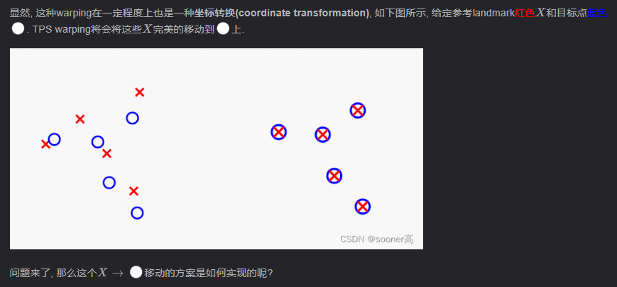
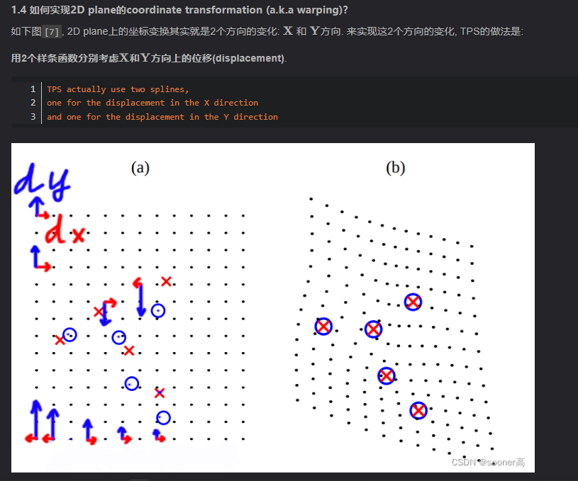
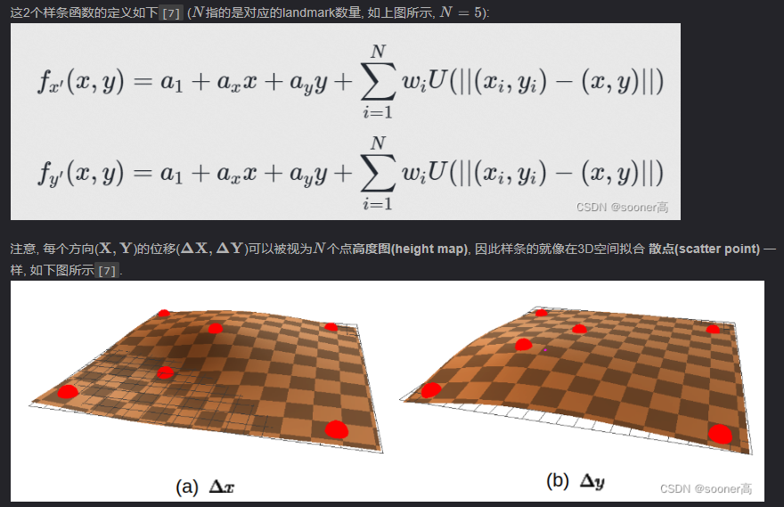
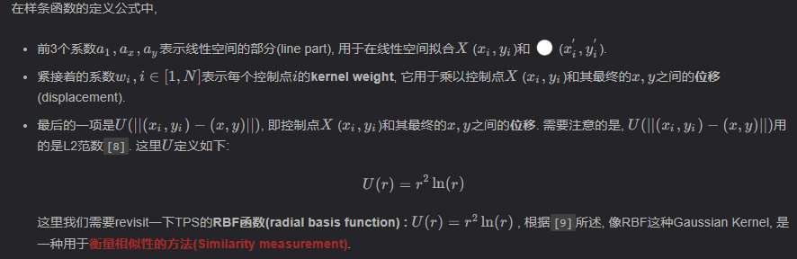
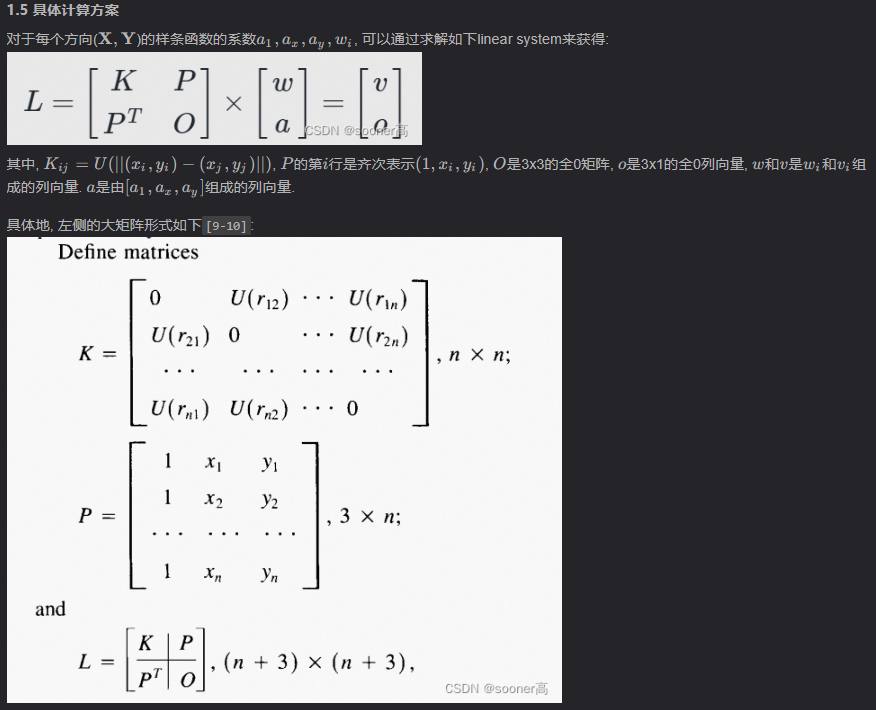
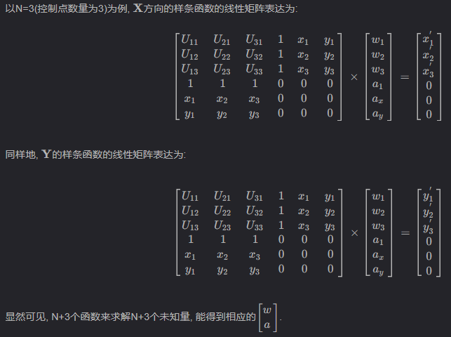

- [TPS](#tps)
  - [与仿射变换的区别](#与仿射变换的区别)
  - [求解思路](#求解思路)
  - 

# TPS

- TPS是一种插值方法，它寻找一个通过所有的控制点的弯曲最小的光滑曲面
- 对于3个不共线的控制点，TPS是一个平面，多于三个是一个曲面，少于三个则是未定义的
- TPS常用来对形状进行 non-rigid 变形
- 比如给定原始形状的有限点集A，变形后的对应目标点集B，设C=B-A，对(Ax,Ay, Cx)拟合出一个TPS，就可以得到x方向的内插函数；对(Ax,Ay, Cy)拟合出来的TPS则可以得到y方向的内插函数。这样一以来对于不在点集中的点，我们就可以插值得到目标点。从而完成整个面的变形。

**存在噪声的情况**

- TPS得到的曲面不一定要通过所有的控制点（类比B样条），这就是正则化（regularization ），并由一个正则化参数λ控制。如果λ＝0就是普通的TPS，如果λ为无穷大，TPS就退化为均方误差最小平面（平面的弯曲量为0），对于变形操作来说就是一般的仿射变换。

**径向基函数**

- TPS得到的曲面不一定要通过所有的控制点（类比B样条），这就是正则化（regularization ），并由一个正则化参数λ控制。如果λ＝0就是普通的TPS，如果λ为无穷大，TPS就退化为均方误差最小平面（平面的弯曲量为0），对于变形操作来说就是一般的仿射变换。

## 与仿射变换的区别

仿射变换保持点的共线性和直线的平行性，可由平移、旋转、缩放、翻转(Flip)和错切(Shear)变换等原子操作叠加实现。平移、旋转、翻转(Flip)不会改变物体形状，属于刚性(rigid)变换。

## 求解思路

等式两边乘以L矩阵的逆，得到[w...,a...]矩阵

这样就得到了x,y方向的[w...,a...]

下一步就可以求出x方向和y方向的样条函数

## 