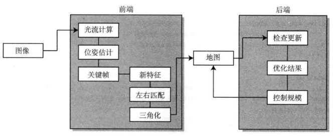

# 设计一个视觉SLAM系统

传感器与算法选择：采用双目相机，前端使用光流法，后端采用局部BA，前端一个线程，后端一个线程

前置工作：双目相机标定->极线矫正->极线匹配->生成视差图->视差图生成深度图或者点云，得到环境相对真值，这样就在一定程度上避免了尺度模糊问题，但是双目讲的是两个相机的公共视野，太近的看不到，太远也看不到

**只要得到两个相机同一时刻采集的图像上在世界坐标系下的相同点，通过三角测量便可以求解得到该点的深度。**
**视差法实际上和单目相机的三角化非常类似，不同的是，双目相机中两个相机的外参是已知的，平移向量的大小和尺度都已经确定，从而可以获取绝对的深度**

- 前端线程：插入帧，提取特征、光流追踪、三角化，必要时补充新的特征点，前端处理结果作为后端的初始值
- 在双目的slam的前端tracking中一般使用PnP算法(3D-2D,已知世界空间3D点，估计相机之间的位姿变换，使用DLT求解初值，再用BA微调)求取当前帧和上一帧的位姿变换, 在两个相机拍摄的图像上执行特征点法或光流法，追踪：只使用左目，光流法匹配，然后估计位姿
- 如果在双目拍摄的两张图片上执行直接法，还可以构建半稠密的地图
- 由于已知两个相机的外参，通常只需要一次观测就可以得到比较好的深度估计：在左相机的一条极线于右相机成像平面的投影上寻找对应点。极线搜索通常也可以建模为光度误差最小的优化问题
- 若要进行稠密的建图，则需要额外的硬件支持如GPU，极线搜索可以高度并行化

**ToF和结构光深度相机的深度测算原理和双目类似（一个发射端一个接收端，两者的外参已知，找到世界系下的相同点进行三角测量）**
**双目相机能够观测绝对尺度且不用担心纯旋转导致的退化（通常的PnP不要求这种约束），但是同样受光照和纹理的影响较大**

- 后端线程：对前端之前的发出的数据（关键帧和路标点）进行优化，返回优化结果，最终改善建图的整体效果。后端应该控制优化问题的规模，不要让其对时间无限增长
- 后端的滑窗优化或使用关键帧构建多帧观测约束的方法单目类似，也是求解最小化重投影误差的优化问题

# 用激光雷达和imu设计SLAM

传感器与算法选择: 

- 采用3D激光雷达与imu，imu对激光雷达进行去运动畸变；
- imu用ESKF做状态估计（进行运动状态积分与协方差更新）；
- （利用LiDAR的观测误差来校正IMU预测的状态）观测方程中，残差使用点到平面距离作为残差，最小化点到平面距离构建观测方程，计算观测方程jacobian
- 使用IESKF更新状态向量与协方差；
- 更新地图
