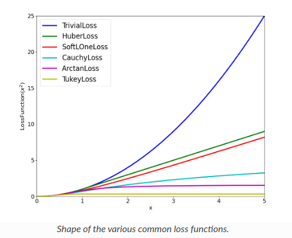
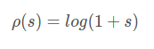
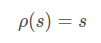
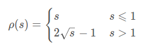

- [loss-function](#loss-function)

## loss function

定义ceres的损失函数0.1表示残差大于0.1的点，权重降低，具体效果根据核函数而定，小于0.1，则认为正常，不做特殊处理。

```cpp
ceres::Problem problem;
ceres::LossFunction *loss_function;                           // 损失核函数
//loss_function = new ceres::HuberLoss(0.1);                  // Huber核函数
loss_function = new ceres::CauchyLoss(0.1);                   // 柯西核函数
```

```cpp
// 添加残差（代价函数  loss function (损失核函数)   优化变量） 
problem.AddResidualBlock(cost_function, loss_function, para_q, para_t);

```



## ceres 中的 loss function 选择

- 在 Ceres Solver 中，核函数（或损失函数）用于处理优化问题中的异常值
- 核函数通过修改残差的贡献，降低异常值对总体优化结果的影响
- 两个常用的核函数是 Cauchy  柯西核函数和 Trivial 损失函数

### Cauchy loss function



- Cauchy 核函数是一种鲁棒的损失函数，特别适用于处理具有较大噪声的数据
- 它通过增加一个非线性的加权因子来降低异常值的影响，**这个加权因子随着残差的增加而减少**
- Cauchy 核函数具有较长的“尾巴”，意味着即使残差很大，它对总体损失的贡献也会受到限制
- 这种函数在处理大量异常值时特别有用，因为它不会让任何单个观测值对总体结果产生过大影响

```cpp
// Inspired by the Cauchy distribution
//   rho(s) = log(1 + s).
// At s = 0: rho = [0, 1, -1].
class CERES_EXPORT CauchyLoss : public LossFunction {
 public:
  explicit CauchyLoss(double a) : b_(a * a), c_(1 / b_) {}
  void Evaluate(double, double*) const override;
//可以看出CauchyLoss（）中的参数为尺度参数。
 private:
  // b = a^2.
  const double b_;
  // c = 1 / a^2.
  const double c_;
};

// 具体实现
// s: 残差平方; a: (s)尺度参数 scale parameter
void CauchyLoss::Evaluate(double s, double rho[3]) const {
  const double sum = 1.0 + s * c_;
  const double inv = 1.0 / sum;
  // 'sum' and 'inv' are always positive, assuming that 's' is.
  rho[0] = b_ * log(sum);
  rho[1] = std::max(std::numeric_limits<double>::min(), inv);
  rho[2] = - c_ * (inv * inv);
}

```

#### 尺度参数对优化过程的影响

1. 控制对异常值的敏感度。较小的尺度会使得损失函数对于异常值更加敏感，导致异常值被更强烈的压缩，反之更宽容
2. 收敛性质：不适当的参数可能会导致优化过程不稳定或收敛速度变慢
3. 平衡偏差bias与方差variance,较小的 δ 值可能导致高方差（即模型对数据的小变动过于敏感），而较大的 δ 值可能导致高偏差（即模型过于简化，不能充分捕捉数据的复杂性）
4. 解的偏差：适当的 δ 值可以帮助得到一个既对异常值有适当鲁棒性，又不会过度偏离真实数据分布的解

### Trivial loss function



- Trivial 损失函数实际上是不应用任何额外处理的标准最小二乘损失函数。在这种情况下，所有的残差都会被平等对待，不论它们是正常值还是异常值
- 使用 Trivial 损失函数的优化等同于标准的最小二乘优化，没有任何鲁棒性对策
- 这种损失函数适用于那些数据质量较高，没有太多异常值的情况

### Huber loss function



- Huber 损失函数是平方损失和绝对损失的结合。对于小的残差，它表现得像平方损失函数，对于大的残差，则表现得像绝对损失函数
- Huber 损失对于小的误差比较敏感，这使得它在没有异常值的情况下更接近最小二乘估计
- 它有一个转折点（通常称为δ），在这一点上，损失函数从平方损失转变为线性损失。这个转折点是一个超参数，需要根据具体问题来调整。

## 如何选择损失函数

- 数据中包含大量异常值或者噪声，使用像 Cauchy 或 Huber 这样的鲁棒核函数可以更好地处理这些异常值
- 异常值数量相对较少但幅度较大，噪声点极端但不频繁，Cauchy损失函数可能是更好的选择，因为它对极端值的敏感度较低
- 数据中的异常值较为温和但数量较多，Huber 损失函数可能更为合适，因为它在处理轻度异常值时表现得更好

```cpp
ceres::LossFunction* loss_function = nullptr;
switch (loss_function_type) {//根据选择的核函数type
    case LossFunctionType::TRIVIAL:
    loss_function = new ceres::TrivialLoss();
break;
    case LossFunctionType::SOFT_L1:
    loss_function = new ceres::SoftLOneLoss(loss_function_scale);
break;
    case LossFunctionType::CAUCHY:
    loss_function = new ceres::CauchyLoss(loss_function_scale);
break;

```
