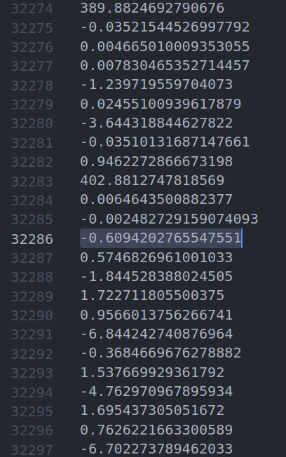

## bundle adjustment

基于 ceres-solver `simple_bundle_adjustment.cc` 和[BAL数据集](https://grail.cs.washington.edu/projects/bal/ladybug.html/problem-49-7776-pre.txt.bz2)

针孔相机模型：相机旋转R，平移t，焦距f，两个径向畸变参数k1,k2

```
P = R * X + t（从世界坐标转换为相机坐标）

p = -P / P.z（归一化除法）

p'= f * r（p）* p（转换为像素坐标）
```

r（p）是一个消除径向畸变的函数

`r(p) = 1.0 + k1 * ||p||^2 + k2 * ||p||^4`

这样就给出了以像素为单位的投影，其中图像的原点是图像的中心，x轴的正指向右，y轴的正指向上方（此外，在相机坐标系中，z轴为正轴指向后方，因此相机向下看Z轴的负方向

## BAL数据集格式

```
/*
* 数据集格式：  
* 第一行 相机id和 camera_n 特征点id和 观测结果数(特征点数量和)
* 其余行 相机id 特征点id 特征点观测结果[x,y]  
* 最后是 参数，即待优化项的初始值  
*     参数每行一个  
*        前面是相机参数，每9个一组，为一个相机的参数  
*            相机的姿态  轴角表示 -- 3
*            相机的位置  坐标 -- 3
*            相机的内参  [焦距，径向畸变k1,k2]
*     相机参数1
*     相机参数2
*     相机参数......
*     相机参数n-1
*     相机参数n
*        后面是点的参数，每3个一组，为一个点的参数  
*            点的xyz坐标（世界坐标系下）
*     点1
*     点2
*     点...
*     点n-1
*     点n
*/
```

### 怎么理解数据集文件

以`problem-49-7776-pre.txt`为例

文件首行`49 7776 31843`,共55613行
- 数据集中包含的图像共49张，49张图片中一共检测到的特征点数为31843，对这些特征过滤，多次检测到的特征点只算一次，则共有7776个不重复的特征点

举例解读


- 2-7行表示id为0的特征点在图像0,1,3,26,29,38中出现了，并给出了这个特征点的坐标（坐标原点在图像的中心，位于图像坐标系下，不是像素坐标）
- 一共31843行信息


数据在31845行开始发生变化
- 从这里开始是相机参数，每9个为一组，旋转（轴角表示），平移（世界坐标系下的平移），焦距，径向畸变参数k1,k2,[r1,r2,r3,x_c,y_c,z_c,f,k1,k2]
- 有49张图片，所以一共有49*9个camera 参数



- 来到32286行，这附近最后一次出现402这个焦距数据。那么从这里开始就是7776个特征点的世界坐标，一共7776*3

- 检查总数
- 1 + 31843 + 49 * 9 + 7776 * 3 = 55613


## BA中哪些变量得到了优化

对比BA前后的数据集
