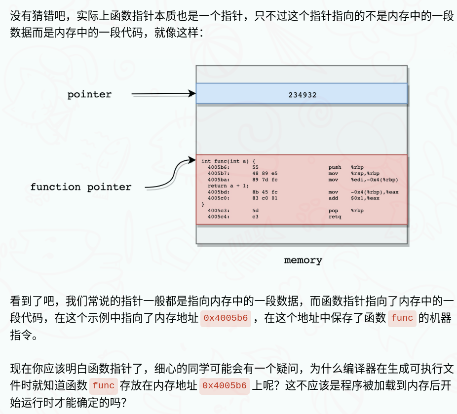
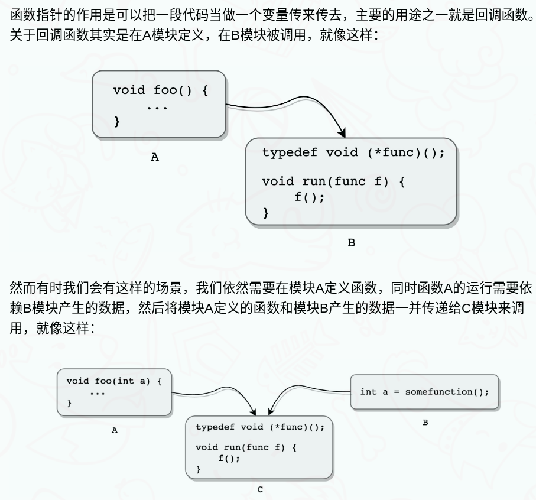
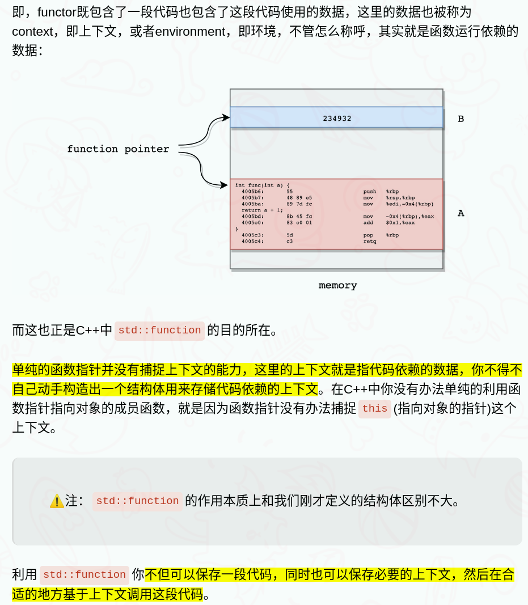

- [std::bind](#stdbind)
- [std::function](#stdfunction)
  - [为什么C++中有函数指针还需要std::function](#为什么c中有函数指针还需要stdfunction)
  - [std::function](#stdfunction-1)

## std::bind

- bind是对C++98标准中函数适配器bind1st/bind2nd的泛化和增强(这两个在C++17中被弃用)，可以适配任意的可调用对象，包括函数指针、函数引用、成员函数指针和函数对象。
- bind接受的第一个参数必须是一个可调用的对象f,可以是函数、函数指针、函数对象和成员函数指针，之后接受的参数的数量必须与f的参数数量相等，这些参数将被传递给f作为入参。
- 绑定完成后，bind会返回一个函数对象，它内部保存了f的拷贝，具有operator(),返回值类型被自动推导为f的返回值类型。反生调用时，这个函数对象将把之前存储的参数转发给f完成调用。
- 绑定器可以返回一个转换后的某元函数对象，用于匹配泛型算法

绑定函数对象：

bind可以绑定任意的函数对象，包括标准库中的所有预定义的函数对象。
如果函数对象有内部类型定义result_type,那么bind可以自动推导出返回值类型，用法与绑定普通函数一样。否则，需要在绑定形式上做出变动，用模版参数指明返回类型。
bind<result_type>(functiontor, ...)

标准库中大部分函数对象都有result_type定义，因此不需要特别的形式。

```cpp
//绑定预定义的函数对象
std::transform(v.begin(),v.end(),v.begin(),
		std::bind(std::plus<int>(),std::placeholders::_1,10)); //绑定函数对象


//绑定自定义的函数对象
//要想bind 绑定自定义的函数对象，必须提供一些型别的成员来反映其参数和返回值的型别, 
//为了方便，可以继承 binary_function等
template<typename T1, typename T2>
struct fopow : public std::binary_function<T1,T2,T1>
{
	T1 operator() (T1 base, T2 exp) const
	{
		return std::pow(base,exp);
	}
};
std::transform(v.begin(),v.end(),v.begin(),
	std::bind(fopow<double,int>(),std::placeholders::_1,2));

//自己定义result_type
template<typename T>
struct MyPlus
{
	typedef T argument_type;
	typedef T result_type;
	result_type operator() (const argument_type & arg1, const argument_type & arg2) const
	{
		return (arg1 - arg2);
	}
};

std::function<int(int)> f = std::bind(MyPlus<int>(),std::placeholders::_1,10);
std::transform(v.begin(),v.end(),v.begin(),f);
```

## std::function

- C++11的function机制是C语言中函数指针的衍生，用来实现回调功能，我们上面的绑定器通常都是以语句执行为单位，当出了某个语句的执行后，绑定器返回的这个函数对象也就随之消失，因此需要有回调功能的function去长期保留绑定器返回的函数对象，以便在需要的时候随时通过function机制调用即可

### 为什么C++中有函数指针还需要std::function

C/C++中可以使用指针指向一段代码，这个指针就叫函数指针

```cpp
#include <stdio.h>

int func(int a) { return a + 1; }

int main() {
   int (*f)(int) = func;
   printf("%p\n", f);
   return 0;
}
```





此时，单纯的函数指针已经不够用了，因为函数指针只是单纯的指向了内存中的一段代码，我们不但需要将内存中的一段代码同时也需要将内存中的一块数据传递给模块C，此时你可以定义一个结构体，将代码和数据打包起来，就像这样：

```cpp
typedef void (*func)(int);

struct functor {
    func f;
    int arg;
};
```

我们将这个结构体命名为functor，注意看，这个结构中有两部分：

- 一个指向代码的指针变量
- 一个保存数据的变量

这样，我们在A模块为指针变量赋值，在B模块为保存数据的变量赋值，然后将此结构体传递给模块C，模块C中可以这样使用：

```cpp
void run(struct functor func) {
    func->f(func->arg);
}
```



根据上文的介绍，我们也知道std::function相比函数指针的优势所在，要去理解std::function，只需要理解上面提到的结构体即可。接下来我们来谈谈std::function的用法以及一步一步实现一个简单的std::function，剖析其原理。

### std::function

function利用了函数对象的手段，结合函数指针去调用小括号运算符重载实现，内部有个函数指针`_pfunc`，并且该函数指针在operator()小括号运算符重载时被调用

```cpp
//前向声明模板类
template<typename T>
class myfunction {};

//单个类型参数模板完全特例化
template<typename R, typename A1>
class myfunction<R(A1)> {
public:
    using PFUNC = R (*)(A1);
public:
    myfunction(PFUNC pfunc) : _pfunc(pfunc) {}
    R operator()(A1 arg) {
        return _pfunc(arg);
    }
private:
    PFUNC _pfunc;
};
```

当`function`对象接收`hello`函数时，`R`作为返回值会被推导为`void`，`A1`作为单一参数类型被推导为`string`类型

```cpp
myfunction<void(string)> f1 = &hello;
f1("hello world");  //打印"hello world"
```

那现在如果我们要接收两个参数的sum求和函数呢？

```cpp
int sum(int a, int b) { return a + b; }
```

其实理解了function的原理后，这个时候要接收一个双参数sum求和函数，可以再去特化一个适合sum的类，其中R推导为int，A1为sum的第一个参数类型int，A2为sum的第二个类型int：

```cpp
#include <iostream>
using namespace std;

int sum(int a, int b) { return a + b; }

template<typename T>
class myfunction {};

//两个类型参数模板完全特例化
template<typename R, typename A1, typename A2>
class myfunction<R(A1, A2)> {
public:
    using PFUNC = R (*)(A1, A2);
public:
    myfunction(PFUNC pfunc) : _pfunc(pfunc) {}
    R operator()(A1 arg1, A2 arg2) {
        return _pfunc(arg1, arg2);
    }
private:
    PFUNC _pfunc;
};

int main() {
    myfunction<int(int, int)> f2 = &sum;
    // myfunction<int(int, int)> f2(&sum);
    cout << f2(3, 4) << endl;   // 输出5
    return 0;
}
```

通过可变模板参数，实现一个可变参数的function，该function可以接收任意数量参数的函数、函数对象、lambda表达式、bind适配后的成员函数和普通函数等等：

```cpp
template<typename T>
class myfunction {};

/*那如果类型参数多了，我们还要一个一个定义吗？？其实可以采用变长参数模板实现*/
// 可变参数模板完全特例化
template<typename R, typename... A>
class myfunction<R(A...)> {
public:
    using PFUNC = R (*)(A...);
public:
    myfunction(PFUNC pfunc) : _pfunc(pfunc) {}
    R operator()(A... arg) {
        return _pfunc(arg...);
    }
private:
    PFUNC _pfunc;
};
```

根据以上实现，我们对function的底层原理有了深刻的认识，能够自己实现一个接收任意参数的function模板类。虽然以上实现和标准库还差得很远，但是起到了学习、理解的作用吧

参考文章

- [C++11绑定器bind及function机制](https://www.cnblogs.com/S1mpleBug/p/16793438.html#c11-bind%E9%80%9A%E7%94%A8%E7%BB%91%E5%AE%9A%E5%99%A8%E5%87%BD%E6%95%B0%E9%80%82%E9%85%8D%E5%99%A8)
