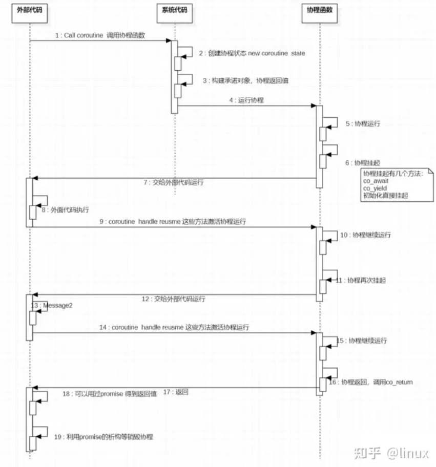

- [coroutine in c++20](#coroutine-in-c20)
  - [coroutine](#coroutine)
  - [coroutine state](#coroutine-state)
  - [承诺对象 promise](#承诺对象-promise)
  - [协程句柄 （coroutine handle）](#协程句柄-coroutine-handle)
  - [等待体（awaiter）](#等待体awaiter)
- [协程三个关键字](#协程三个关键字)
  - [co\_wait](#co_wait)
  - [co\_yield](#co_yield)
  - [co\_return](#co_return)
- [协程优势](#协程优势)
- [example](#example)
  - [vs2022](#vs2022)
  - [gcc](#gcc)


## coroutine in c++20

对C++20的协程，最简单的理解协程是可以重入的特殊函数。就是这个函数在执行的过程，可以（通过co_await ,或者co_yield）挂起，然后在外部（通过coroutine_handle）恢复运行。

测试代码: Visual studio 2022, GCC 10.0 也已经支持

协程是特殊的函数，只是这个函数具有挂起和恢复的能力，可以被挂起（挂起后调用代码继续向后执行），而后可以继续恢复其执行



### coroutine

协程具有以下特点

1. CPP通过函数返回值识别协程函数，返回类型是result
2. result里面必须有一个子类型承诺对象（promise），呈现为Result::promise_type。承诺对象（promise）是一个接口，里面实现get_return_object等接口
3. 通过std::coroutine_handle<promise_type>::from_promise( promise& p )这个静态函数，我们可以得到协程句柄（coroutine handle）
4. 协程的运行状态 ，协程函数的形参，内部变量，临时变量，挂起暂停在什么点，被保存在协程状态 (coroutine state)中

基于上述特点可以看出协程的几个重要概念

- 协程状态 (coroutine state)，记录协程状态，是分配于堆的内部对象：
  - 承诺对象
  - 形参（协程函数的参数）
  - 协程挂起的点
  - 临时变量
- 承诺对象（promise）,从协程内部操纵。协程通过此对象提交其结果或异常
- 协程句柄（coroutine handle）,协程位移标识，从外部操纵。协程句柄可以控制协程的运行状态，挂起，恢复，取消等。
- 等待体示（awaiter）,co_await 关键字调用的对象

### coroutine state

协程状态（coroutine state）是协程启动开始时，new空间存放协程状态，协程状态记录协程函数的参数，协程的运行状态，变量。挂起时的断点

- 协程状态 (coroutine state)应该是协程句柄（coroutine handle）对应的一个数据，而由系统管理的
- 协程状态 (coroutine state)并不是就是协程函数的返回值RET。虽然我们设计的RET一般里面也有promise和coroutine handle，大家一般也是通过RET去操作协程的恢复，获取返回值。但coroutine state理论上还应该包含协程运行参数，断点等信息。

### 承诺对象 promise

承诺对象的表现形式必须是result::promise_type，result为协程函数的返回值

- 承诺对象用于辅助协程，构造协程函数返回值；提交co_yieid 和 co_return 返回值；明确协程启动阶段是否挂起；以及协程内部发生异常时的处理

其接口包括

- `auto get_return_object()` ：用于生成协程函数的返回对象
- `auto initial_suspend()`：用于明确初始化后，协程函数的执行行为，返回值为等待体（awaiter），用co_wait调用其返回值。返回值为`std::suspend_always` 表示协程启动后立即挂起（不执行第一行协程函数的代码），返回`std::suspend_never` 表示协程启动后不立即挂起。（当然既然是返回等待体，你可以自己在这儿选择进行什么等待操作）
- `void return_value(T v)`: 调用co_return v后会调用这个函数，可以保存co_return的结果
- `auto yield_value(T v)`: 调用co_yield后会调用这个函数，可以保存co_yield的结果，其返回值为std::suspend_always表示协程会挂起，如果返回std::suspend_never表示不挂起
- `auto final_suspend() noexcept`: 在协程退出时调用的接口，返回std::suspend_never ，自动销毁 coroutine state 对象。若 final_suspend 返回 std::suspend_always 则需要用户自行调用handle.destroy() 进行销毁。但值得注意的是返回std::suspend_always并不会挂起协程

前面我们提到在协程创建的时候，会new协程状态（coroutine state）。你可以通过可以在 promise_type 中重载 operator new 和 operator delete，使用自己的内存分配接口

### 协程句柄 （coroutine handle）

协程句柄（coroutine handle）是一个协程的标示，用于操作协程恢复，销毁的句柄

协程句柄的表现形式是std::coroutine_handle<promise_type>，其模板参数为承诺对象（promise）类型。句柄有几个重要函数：

- `resume()`函数可以恢复协程
- `done()`函数可以判断协程是否已经完成。返回false标示协程还没有完成，还在挂起
- 协程句柄和承诺对象之间是可以相互转化的
- `std::coroutine_handle<promise_type>::from_promise`: 这是一个静态函数，可以从承诺对象（promise）得到相应句柄。
- `std::coroutine_handle<promise_type>::promise()`: 函数可以从协程句柄coroutine handle得到对应的承诺对象（promise）

### 等待体（awaiter）

co_wait 关键字会调用一个等待体对象(awaiter)。这个对象内部也有3个接口。根据接口co_wait 决定进行什么操作。

- `bool await_ready()`: 等待体是否准备好了，返回 false ，表示协程没有准备好，立即调用await_suspend。返回true，表示已经准备好了
- `auto await_suspend(std::coroutine_handle<> handle)`: 如果要挂起，调用的接口。其中handle参数就是调用等待体的协程，其返回值有3种可能
  - void 同返回true
  - bool 返回true 立即挂起，返回false 不挂起
  - 返回某个协程句柄（coroutine handle），立即恢复对应句柄的运行
- `auto await_resume()`: 协程挂起后恢复时，调用的接口。返回值作为co_wait 操作的返回值
- `std::suspend_never`类: 不挂起的的特化等待体类型
- `std::suspend_always`类: 挂起的特化等待体类型

前面不少接口已经用了这2个特化的类，同时也可以明白其实协程内部不少地方其实也在使用co_wait 关键字。

## 协程三个关键字

### co_wait

co_await调用一个awaiter对象（可以认为是一个接口），根据其内部定义决定其操作是挂起，还是继续，以及挂起，恢复时的行为。其呈现形式为

```
cw_ret = co_await  awaiter;
```

- `cw_ret = co_await awaiter` 或者 `cw_ret = co_await fun()` ，先计算表达式fun，fun返回结果，就是一个等待体`awaiter`
- 统先调用`awaiter.await_ready()`接口，看等待体是否准备好了，没准备好（return false）就调用`awaiter.await_suspend()`
- `await_suspend`根据参数可以记录调用其的协程的的句柄。await_suspend的返回值为return true ，或者 return void 就会挂起协程
- 后面在外部如果恢复了协程的运行，`awaiter.await_resume()`接口被调用。其返回结果，作为co_await的返回值

### co_yield

co_yield调用的接口是promise_type的yield_value函数，其返回值为std::suspend_always，表示协程挂起，返回值为std::suspend_never 表示不挂起。其呈现形式为

```
co_yield  cy_ret;
```

- `co_yield cy_ret;`，相当于调用`co_wait promise.yield_value(cy_ret)`，你可以在yield_value中记录参数cy_ret后面使用，yield_value的返回值如果是std::suspend_always，协程挂起，如果返回std::suspend_never ，协程就继续运行

### co_return

co_return调用的接口是promise_type的return_value函数，其呈现形式为

```
co_return cr_ret;
```

- `co_yield cr_ret;`，调用`promise.retun_value(cr_ret)`，如果没有返回值相当于`promise.retun_viod()`
- 可以在`retun_value`中记录参数`cr_ret`后面使用。然后调用`co_await promise.final_suspend(void)`, 如果返回值是`std::suspend_always`，你需要自己手动清理coroutine handle，调用`handle.destroy()`。

这儿存在一个疑问，final_suspend，并没有真正挂起协程。看C++ 参考,里面说的也是calls promise.final_suspend() and co_awaits the result.。按说如果返回应该要挂起。但用VS 2022测试是不会挂起的，再探 C++20 协程文章中说的是如果返回std::suspend_always，需要你自己清理coroutine handle

## 协程优势

- 协程的特点在于是一个线程执行，是子程序切换而不是线程切换，因此，没有线程切换的开销
- 不需要多线程的锁机制，因为只有一个线程，也不存在同时写变量冲突，在协程中控制共享资源不加锁，只需要判断状态就好了，所以执行效率比多线程高很多
- 协程是一个线程执行，那怎么利用多核CPU呢？最简单的方法是多进程+协程，既充分利用多核，又充分发挥协程的高效率，可获得极高的性能

## example

env: VS2022 (gcc10 后面再验证)

### vs2022 

```cpp
#include <coroutine>
#include <iostream>
#include <stdexcept>
#include <thread>

//!coro_ret 协程函数的返回值，内部定义promise_type，承诺对象
template <typename T>
struct coro_ret
{
  struct promise_type;
  using handle_type = std::coroutine_handle<promise_type>;

  //! 协程句柄
  handle_type coro_handle_; // 协程句柄

  coro_ret(handle_type h)
    : coro_handle_(h)
  {
    std::cout << "value constructor" << std::endl;
  }
  coro_ret(const coro_ret&) = delete;
  coro_ret(coro_ret&& s)
    : coro_handle_(s.coro_handle_)
  {
    std::cout << "move constructor" << std::endl;
    s.coro_handle_ = nullptr;
  }
  ~coro_ret()
  {
    //!自行销毁
    if (coro_handle_) {
      std::cout << "destructor" << std::endl;
      coro_handle_.destroy();
    }
      
  }
  coro_ret& operator=(const coro_ret&) = delete;
  coro_ret& operator=(coro_ret&& s)
  {
    coro_handle_ = s.coro_handle_;
    s.coro_handle_ = nullptr;
    return *this;
  }

  //!恢复协程，返回是否结束
  bool move_next()
  {
    std::cout << "coro_ret::move_next" << std::endl;
    coro_handle_.resume(); // 恢复协程
    return coro_handle_.done();
  }

  //!通过promise获取数据，返回值
  T get()
  {
    std::cout << "(get coroutine function return value via promise): " << std::endl;
    return coro_handle_.promise().return_data_;
  }


  //!promise_type就是承诺对象，承诺对象用于协程内外交流
  struct promise_type
  {
    promise_type() = default;
    ~promise_type() = default;

    //!生成协程返回值
    auto get_return_object()
    {
      return coro_ret<T>{handle_type::from_promise(*this)};
    }

    //!协程创建后开始初始化，协程函数的初始化行为，此时还没有执行函数体语句
    auto initial_suspend()
    {
      std::cout << "promise_type::initial_suspend" << std::endl;
      // return std::suspend_never{};
      return std::suspend_always{}; // 挂起
    }

    //!co_return 后这个函数会被调用
    void return_value(T v)
    {
      return_data_ = v;
      return;
    }
    //!
    auto yield_value(T v)
    {
      std::cout << "yield_value invoked." << std::endl;
      return_data_ = v;
      return std::suspend_always{};
    }
    //! 在协程最后退出后调用的接口。
    //! 若 final_suspend 返回 std::suspend_always 则需要用户自行调用
    //! handle.destroy() 进行销毁，但注意final_suspend被调用时协程已经结束
    //! 返回std::suspend_always并不会挂起协程（实测 VSC++ 2022）
    auto final_suspend() noexcept
    {
      std::cout << "final_suspend invoked." << std::endl;
      return std::suspend_always{};
    }
    //
    void unhandled_exception()
    {
      std::exit(1);
    }
    //返回值
    T return_data_;
  };

};


//这就是一个协程函数
coro_ret<int> coroutine_7in7out()
{
  //进入协程看initial_suspend，返回std::suspend_always{};会有一次挂起

  std::cout << "Coroutine co_await std::suspend_never" << std::endl;
  //co_await std::suspend_never{} 不会挂起
  co_await std::suspend_never{};
  std::cout << "Coroutine co_await std::suspend_always" << std::endl;
  co_await std::suspend_always{};

  std::cout << "Coroutine stage 1 ,co_yield" << std::endl;
  co_yield 101; // 此时协程函数返回值为101，协程函数挂起

  std::cout << "Coroutine stage 2 ,co_yield" << std::endl;
  co_yield 202; // 此时协程函数返回值为202，协程函数挂起

  std::cout << "Coroutine stage 3 ,co_yield" << std::endl;
  co_yield 303; // 此时协程函数返回值为304，协程函数挂起

  std::cout << "Coroutine stage end, co_return" << std::endl;
  co_return 808; // 此时协程函数返回值为808，协程函数结束
}

int main(int argc, char** argv[]) {
  bool done = false;
  std::cout << "Start coroutine_7in7out ()\n";
  //调用协程,得到返回值c_r，后面使用这个返回值来管理协程。
  auto b_r = coroutine_7in7out();

  auto c_r = std::move(b_r);

  //第一次停止因为initial_suspend 返回的是suspend_always，协程挂起
  //此时没有进入Stage 1
  std::cout << "Coroutine " << (done ? "is done " : "isn't done ") << "ret =" << c_r.get() << std::endl;
  done = c_r.move_next();
  std::cout<< "ret =" << c_r.get() << std::endl;

  std::cout << "Coroutine " << (done ? "is done " : "isn't done ") << "ret =" << c_r.get() << std::endl;
  done = c_r.move_next();
  std::cout << "ret =" << c_r.get() << std::endl;

  std::cout << "Coroutine " << (done ? "is done " : "isn't done ") << "ret =" << c_r.get() << std::endl;
  done = c_r.move_next();
  std::cout << "ret =" << c_r.get() << std::endl;

  std::cout << "Coroutine " << (done ? "is done " : "isn't done ") << "ret =" << c_r.get() << std::endl;
  done = c_r.move_next();
  std::cout << "ret =" << c_r.get() << std::endl;

  std::cout << "Coroutine " << (done ? "is done " : "isn't done ") << "ret =" << c_r.get() << std::endl;
  done = c_r.move_next();
  std::cout << "ret =" << c_r.get() << std::endl;

  std::cout << "Coroutine " << (done ? "is done " : "isn't done ") << "ret =" << c_r.get() << std::endl;
  std::cout << "ret =" << c_r.get() << std::endl;
  return 0;
}

```

output: 

```bash
Start coroutine_7in7out ()
value constructor
promise_type::initial_suspend
move constructor
Coroutine isn't done ret =(get coroutine function return value via promise):
0
coro_ret::move_next
Coroutine co_await std::suspend_never
Coroutine co_await std::suspend_always
ret =(get coroutine function return value via promise):
0
Coroutine isn't done ret =(get coroutine function return value via promise):
0
coro_ret::move_next
Coroutine stage 1 ,co_yield
yield_value invoked.
ret =(get coroutine function return value via promise):
101
Coroutine isn't done ret =(get coroutine function return value via promise):
101
coro_ret::move_next
Coroutine stage 2 ,co_yield
yield_value invoked.
ret =(get coroutine function return value via promise):
202
Coroutine isn't done ret =(get coroutine function return value via promise):
202
coro_ret::move_next
Coroutine stage 3 ,co_yield
yield_value invoked.
ret =(get coroutine function return value via promise):
303
Coroutine isn't done ret =(get coroutine function return value via promise):
303
coro_ret::move_next
Coroutine stage end, co_return
final_suspend invoked.
ret =(get coroutine function return value via promise):
808
Coroutine is done ret =(get coroutine function return value via promise):
808
ret =(get coroutine function return value via promise):
808
destructor
```

### gcc 

TODO:

[参考文章](https://www.cnblogs.com/blizzard8204/p/17563217.html)
