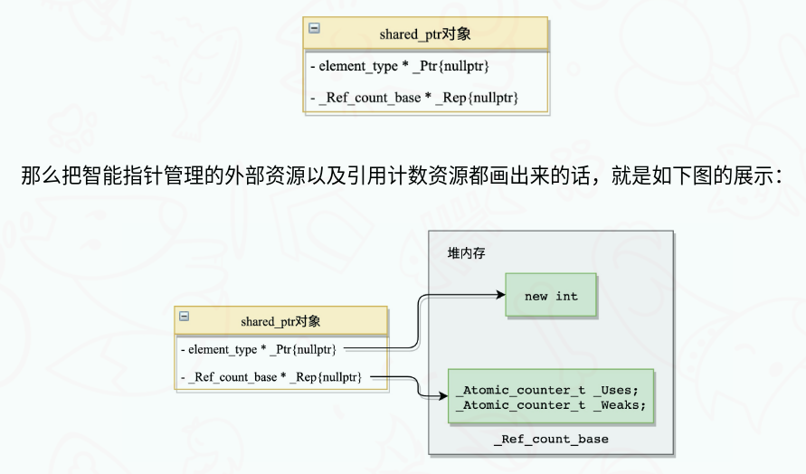
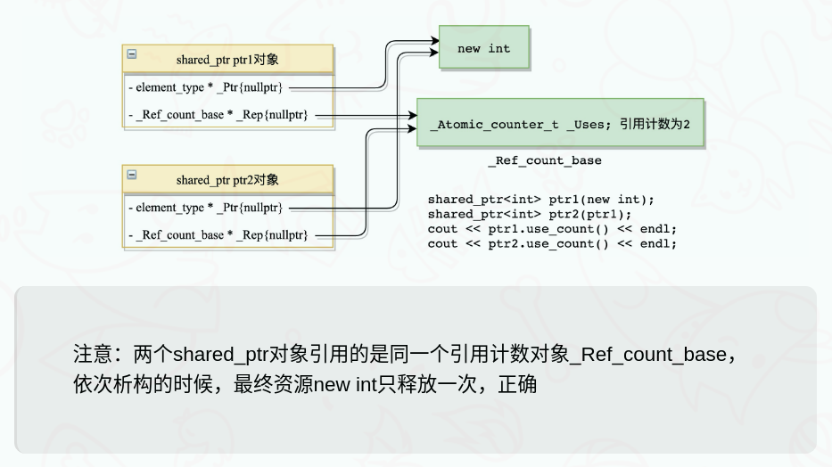
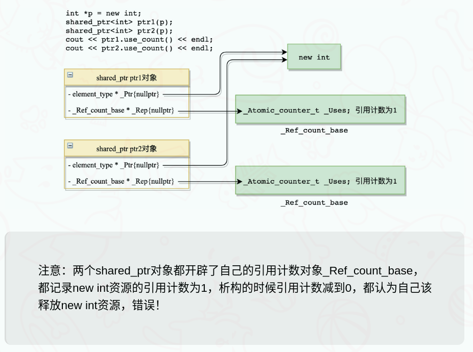

- [问题代码](#问题代码)
- [shared\_ptr 原理分析](#shared_ptr-原理分析)
- [问题修改](#问题修改)
- [enable\_shared\_from\_this class](#enable_shared_from_this-class)
- [参考文章](#参考文章)

## 问题代码

问题１

```cpp
#include <iostream>
#include <memory>
using namespace std;
// 智能指针测试类
class A {
public:
	A() : m_ptr(new int) { cout << "A()" << endl; }
	~A() {
		cout << "~A()" << endl;
		delete m_ptr; 
		m_ptr = nullptr;
	}
private:
	int *m_ptr;
};
int main() {
	A *p = new A(); // 裸指针指向堆上的对象

	shared_ptr<A> ptr1(p); // 用shared_ptr智能指针管理指针p指向的对象
	shared_ptr<A> ptr2(p); // 用shared_ptr智能指针管理指针p指向的对象
	// 下面两次打印都是1，因此同一个new A()被析构两次，逻辑错误
	cout << ptr1.use_count() << endl; 
	cout << ptr2.use_count() << endl;

	return 0;
}
```

```cpp
A()
1
1
~A()
~A()
free(): double free detected in tcache 2
Aborted (core dumped)
```

两个智能指针管理同一个堆上的对象，对象被错误析构了2次

问题2

```cpp
#include <iostream>
using namespace std;
// 智能指针测试类
class A {
public:
	A() : m_ptr(new int) { cout << "A()" << endl; }
	~A() {
		cout << "~A()" << endl;
		delete m_ptr; 
		m_ptr = nullptr;
	}
	 
	// A类提供了一个成员方法，返回指向自身对象的shared_ptr智能指针。
	shared_ptr<A> getSharedPtr() { 
		/*注意：不能直接返回this，在多线程环境下，根本无法获知this指针指向
		的对象的生存状态，通过shared_ptr和weak_ptr可以解决多线程访问共享		
		对象的线程安全问题，参考我的另一篇介绍智能指针的博客*/
		return shared_ptr<A>(this); 
	}
private:
	int *m_ptr;
};
int main() {
	shared_ptr<A> ptr1(new A());
	shared_ptr<A> ptr2 = ptr1->getSharedPtr();

	/* 按原先的想法，上面两个智能指针管理的是同一个A对象资源，但是这里打印都是1
	导致出main函数A对象析构两次，析构逻辑有问题*/
	cout << ptr1.use_count() << endl; 
	cout << ptr2.use_count() << endl;

	return 0;
}
```

## shared_ptr 原理分析

shared_ptr 源码定义如下

```cpp
template<class _Ty>
	class shared_ptr
		: public _Ptr_base<_Ty>
```

shared_ptr是从_Ptr_base继承而来的，作为派生类，shared_ptr本身没有提供任何成员变量，但是它从基类_Ptr_base继承来了如下成员变量（只罗列部分源码）：


```cpp
template<class _Ty>
class _Ptr_base
{	// base class for shared_ptr and weak_ptr
protected:
	void _Decref()
		{	// decrement reference count
		if (_Rep)
			{
			_Rep->_Decref();
			}
		}

	void _Decwref()
		{	// decrement weak reference count
		if (_Rep)
			{
			_Rep->_Decwref();
			}
		}
private:
	// _Ptr_base的两个成员变量，这里只罗列了_Ptr_base的部分代码
	element_type * _Ptr{nullptr}; // 指向资源的指针
	_Ref_count_base * _Rep{nullptr}; // 指向资源引用计数的指针
};
```

_Ref_count_base记录资源的类是怎么定义的呢？如下（只罗列部分源码）

```cpp
class __declspec(novtable) _Ref_count_base
	{	// common code for reference counting
private:
	/**
	 * _Uses记录了资源的引用计数，也就是引用资源的shared_ptr的个数；
	 * _Weaks记录了weak_ptr的个数，相当于资源观察者的个数，都是定义成基于CAS操作的原子类型，增减引用计数时时线程安全的操作
	 **/
	_Atomic_counter_t _Uses;
	_Atomic_counter_t _Weaks;
}
```

也就是说，当我们定义一个shared_ptr<int> ptr(new int)的智能指针对象时，该智能指针对象本身的内存是8个字节，如下图所示：



当你这样操作时

```cpp
shared_ptr<int> ptr1(new int);
shared_ptr<int> ptr2(ptr1);
cout << ptr1.use_count() << endl;
cout << ptr2.use_count() << endl;
```

这段代码没有任何问题，ptr1和ptr2管理了同一个资源，引用计数打印出来的都是2，出函数作用域依次析构，最终new int资源只释放一次，逻辑正确！这是因为shared_ptr ptr2(ptr1)调用了shared_ptr的拷贝构造函数（源码可以自己查看下），只是做了资源的引用计数的改变，没有额外分配其它资源，如下图所示：



当你这样操作时

```cpp
int *p = new int;
shared_ptr<int> ptr1(p);
shared_ptr<int> ptr2(p);
cout << ptr1.use_count() << endl;
cout << ptr2.use_count() << endl;
```

这段代码就有问题了，因为shared_ptr<int> ptr1(p)和shared_ptr<int> ptr2(p)都调用了shared_ptr的构造函数，在它的构造函数中，都重新开辟了引用计数的资源，导致ptr1和ptr2都记录了一次new int的引用计数，都是1，析构的时候它俩都去释放内存资源，导致释放逻辑错误，如下图所示：



上面两个代码段，分别是shared_ptr的构造函数和拷贝构造函数做的事情，导致虽然都是指向同一个new int资源，但是对于引用计数对象的管理方式，这两个函数是不一样的，构造函数是新分配引用计数对象，拷贝构造函数只做引用计数增减

相信说到这里，大家知道最开始的两个代码清单上的代码为什么出错了吧，因为每次调用的都是shared_ptr的构造函数，虽然大家管理的资源都是一样的，_Ptr都是指向同一个堆内存，但是_Rep却指向了不同的引用计数对象，并且都记录引用计数是1，出作用域都去析构，使得同一块内存被析构多次，导致问题发生！

## 问题修改

代码１修改

在产生同一资源的多个shared_ptr的时候，通过拷贝构造函数或者赋值operator=函数进行，不要重新构造，避免产生多个引用计数对象

```cpp
int main() {
	A *p = new A(); // 裸指针指向堆上的对象

	shared_ptr<A> ptr1(p); // 用shared_ptr智能指针管理指针p指向的对象
	shared_ptr<A> ptr2(ptr1); // 用ptr1拷贝构造ptr2
	// 下面两次打印都是2，最终随着ptr1和ptr2析构，资源只释放一次，正确！
	cout << ptr1.use_count() << endl; 
	cout << ptr2.use_count() << endl;

	return 0;
}
```

那么清单2代码怎么修改呢？注意我们有时候想在类里面提供一些方法，返回当前对象的一个shared_ptr强智能指针，做参数传递使用（多线程编程中经常会用到）。

首先肯定不能像上面代码清单2那样写return shared_ptr<A> (this)，这会调用shared_ptr智能指针的构造函数，对this指针指向的对象，又建立了一份引用计数对象，加上main函数中的shared_ptr<A> ptr1(new A());已经对这个A对象建立的引用计数对象，又成了两个引用计数对象，对同一个资源都记录了引用计数，为1，最终两次析构对象释放内存，错误！

那如果一个类要提供一个函数接口，返回一个指向当前对象的shared_ptr智能指针怎么办？方法就是继承`enable_shared_from_this`类，然后通过调用从基类继承来的`shared_from_this()`方法返回指向同一个资源对象的智能指针`shared_ptr`

```cpp
#include <iostream>
#include <memory>
using namespace std;
// 智能指针测试类，继承enable_shared_from_this类
class A : public enable_shared_from_this<A> {
public:
	A() : m_ptr(new int) { cout << "A()" << endl; }
	~A() {
		cout << "~A()" << endl;
		delete m_ptr;
		m_ptr = nullptr;
	}

	// A类提供了一个成员方法，返回指向自身对象的shared_ptr智能指针
	shared_ptr<A> getSharedPtr() {
		/*通过调用基类的shared_from_this方法得到一个指向当前对象的智能指针*/
		return shared_from_this();
	}
private:
	int *m_ptr;
};
```

## enable_shared_from_this class

一个类继承`enable_shared_from_this`会怎么样？看看`enable_shared_from_this`基类的成员变量有什么，如下：

```cpp
template<class _Ty>
	class enable_shared_from_this
	{	// provide member functions that create shared_ptr to this
public:
	using _Esft_type = enable_shared_from_this;

	_NODISCARD shared_ptr<_Ty> shared_from_this()
		{	// return shared_ptr
		return (shared_ptr<_Ty>(_Wptr));
		}
	// 成员变量是一个指向资源的弱智能指针
	mutable weak_ptr<_Ty> _Wptr;
};
```

也就是说，如果一个类继承了`enable_shared_from_this`，那么它产生的对象就会从基类`enable_shared_from_this`继承一个成员变量`_Wptr`，当定义第一个智能指针对象的时候`shared_ptr<A> ptr1(new A())`，调用`shared_ptr`的普通构造函数，就会初始化A对象的成员变量`_Wptr`，作为观察A对象资源的一个弱智能指针观察者（在shared_ptr的构造函数中实现，有兴趣可以自己调试跟踪源码实现）。

然后代码如下调用shared_ptr<A> ptr2 = ptr1->getSharedPtr()，getSharedPtr函数内部调用shared_from_this()函数返回指向该对象的智能指针，这个函数怎么实现的呢，看源码：

```cpp
shared_ptr<_Ty> shared_from_this()
{	// return shared_ptr
return (shared_ptr<_Ty>(_Wptr));
}
```

shared_ptr<_Ty>(_Wptr)，说明通过当前A对象的成员变量_Wptr构造一个shared_ptr出来，看看shared_ptr相应的构造函数：

```cpp
shared_ptr(const weak_ptr<_Ty2>& _Other)
{	// construct shared_ptr object that owns resource *_Other
if (!this->_Construct_from_weak(_Other)) // 从弱智能指针提升一个强智能指针
	{
	_THROW(bad_weak_ptr{});
	}
}
```

```cpp
template<class _Ty2>
bool _Construct_from_weak(const weak_ptr<_Ty2>& _Other)
{	// implement shared_ptr's ctor from weak_ptr, and weak_ptr::lock()
// if通过判断资源的引用计数是否还在，判定对象的存活状态，对象存活，提升成功；
// 对象析构，提升失败！之前的博客内容讲过这些知识，可以去参考！
if (_Other._Rep && _Other._Rep->_Incref_nz())
	{
	_Ptr = _Other._Ptr;
	_Rep = _Other._Rep;
	return (true);
	}

return (false);
}
```

综上所说，所有过程都没有再使用shared_ptr的普通构造函数，没有在产生额外的引用计数对象，不会存在把一个内存资源，进行多次计数的过程；更关键的是，通过weak_ptr到shared_ptr的提升，还可以在多线程环境中判断对象是否存活或者已经析构释放，在多线程环境中是很安全的，通过this裸指针进行构造shared_ptr，不仅仅资源会多次释放，而且在多线程环境中也不确定this指向的对象是否还存活。

问题2代码修改如下

```cpp
#include <iostream>
#include <memory>
using namespace std;
// 智能指针测试类，继承enable_shared_from_this类
class A : public enable_shared_from_this<A> {
public:
	A() : m_ptr(new int) { cout << "A()" << endl; }
	~A() {
		cout << "~A()" << endl;
		delete m_ptr;
		m_ptr = nullptr;
	}

	// A类提供了一个成员方法，返回指向自身对象的shared_ptr智能指针
	shared_ptr<A> getSharedPtr() {
		/*通过调用基类的shared_from_this方法得到一个指向当前对象的智能指针*/
		return shared_from_this();
	}
private:
	int *m_ptr;
};
int main() {
	shared_ptr<A> ptr1(new A());
	shared_ptr<A> ptr2 = ptr1->getSharedPtr();

	// 引用计数打印为2
	cout << ptr1.use_count() << endl;
	cout << ptr2.use_count() << endl;

	return 0;
}
```

## 参考文章

-[enable_shared_from_this和shared_from_this机制](https://www.cnblogs.com/S1mpleBug/p/16770731.html#shared_ptr%E5%8E%9F%E7%90%86%E5%88%86%E6%9E%90)
