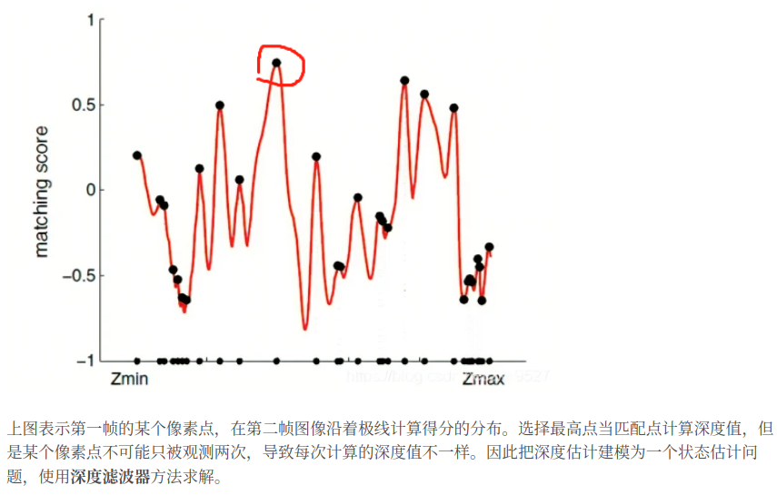
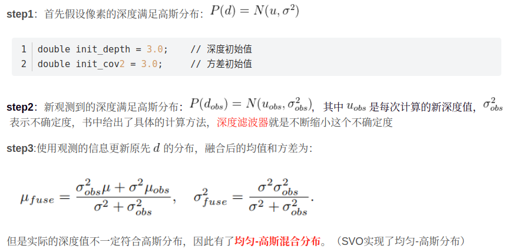
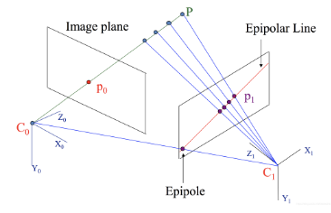

- [mono dataset](#mono-dataset)
- [单目稠密建图　mono dense mapping](#单目稠密建图mono-dense-mapping)

## mono dataset

REMODE 数据集下载地址 http://rpg.ifi.uzh.ch/datasets/remode_test_data.zip
解压后，将在 test_-data/Images 中有从 0 至 200 的所有图像，并在 test_data 目录下可以看到一个文本文件，它记录了每张图像对应的位姿。

## 单目稠密建图　mono dense mapping

1. 单目通过三角化得到像素的距离，双目通过左右目的视差计算像素的距离，这两种方式称为立体视觉
2. 通过极线搜索和块匹配技术确定某帧图像中的像素点在其他帧的位置，然后使用深度滤波确定深度值

视觉里程计中的三角测量和稠密重建中的三角测量区别
1. 视觉里程计中使用三角测量计算深度的前提是特征点已经匹配好，而且位姿已知
2. 稠密重建需要知道参考帧所有像素点的深度，由于大部分像素点都不是特征点，对于这些点通过极线搜索和快匹配方法确定在其他帧图像位置



像素深度的更新



- 距离是像素的空间位置到图像平面的距离，也就是相机坐标系下的Z坐标；
- 深度是指像素的空间位置到相机光心的距离，也就是相机坐标系下坐标的模值(sqrt(x*x+y*y+z*z)) 

空间点P到相机光心穿过平面上的点组成的直线叫极线



```cpp
double d_min = depth_mu - 3 * depth_cov, d_max = depth_mu + 3 * depth_cov;
if (d_min < 0.1) d_min = 0.1;
Vector2d px_min_curr = cam2px(T_C_R * (f_ref * d_min));    // 按最小深度投影的像素
Vector2d px_max_curr = cam2px(T_C_R * (f_ref * d_max));    // 按最大深度投影的像素
 
Vector2d epipolar_line = px_max_curr - px_min_curr;    // 极线（线段形式）
epipolar_direction = epipolar_line;        // 极线方向
epipolar_direction.normalize();
 
//设置块匹配的搜索范围
double half_length = 0.5 * epipolar_line.norm();    // 极线线段的半长度
if (half_length > 100) half_length = 100;   // 我们不希望搜索太多东西
 
// 取消此句注释以显示极线（线段）
//showEpipolarLine( ref, curr, pt_ref, px_min_curr, px_max_curr );
```

- 立体视觉对物理纹理的依赖性：梯度明显的像素，深度信息相对准确；梯度不明显的像素，块匹配没有区分性，很难估计深度
- 像素梯度和极线匹配的不确定性是存在联系的，具体表现在：梯度与极线夹角较大，极线匹配不确定性大；夹角较小，极线匹配的不确定性小
- 深度的分布可能不是高斯分布，但是深度的倒数(逆深度)比较接近高斯分布
