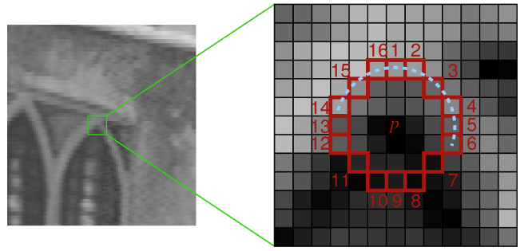
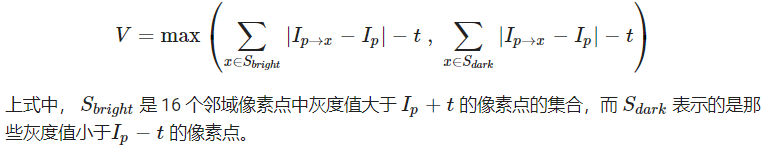

- [FAST 算法原理介绍](#fast-算法原理介绍)
  - [邻域圆角点加速检测](#邻域圆角点加速检测)
  - [对角点做非极大值抑制](#对角点做非极大值抑制)
  - [算法特点](#算法特点)

## FAST 算法原理介绍

FAST（Features from Accelerated Segment Test）角点主要检测局部像素灰度变化明显的地方，计算速度快。

### 邻域圆角点加速检测

步骤

1. 在图像中选取像素 p，假设它的亮度为 C，并设置一个阈值 T
2. 以像素 p 为中心, 选取半径为 3 的圆上的 16 个像素点



```python
def circle(row,col):
    '''
    对于图片上一像素点位置 (row,col)，获取其邻域圆上 16 个像素点坐标，圆由 16 个像素点组成
    
    args:
        row：行坐标 注意 row 要大于等于3
        col：列坐标 注意 col 要大于等于3       
    '''
    point1  = (row-3, col)
    point2  = (row-3, col+1)
    point3  = (row-2, col+2)
    point4  = (row-1, col+3)
    point5  = (row, col+3)
    point6  = (row+1, col+3)
    point7  = (row+2, col+2)
    point8  = (row+3, col+1)
    point9  = (row+3, col)
    point10 = (row+3, col-1)
    point11 = (row+2, col-2)
    point12 = (row+1, col-3)
    point13 = (row, col-3)
    point14 = (row-1, col-3)
    point15 = (row-2, col-2)
    point16 = (row-3, col-1)
    
    return [point1, point2,point3,point4,point5,point6,point7,point8,point9,point10,point11,point12, point13,point14,point15,point16]
```

3. 假如这 16 个点中，有连续的 N 个点的亮度大于 C + T 或小于 C − T，那么像素 p 可以被认为是角点。N一般取9或者12
4. 为排除大量非角点而使用一种高速的测试方法：直接检测邻域圆上第1，5，9，13序号像素亮度。**只有当这四个像素中有三个同时大于 C + T 或小于 C − T 时，当前像素才有可能是一个角点，否则应该直接排除**

```python
def is_corner(image,row,col,threshold):
    '''
    检测图像位置(row,col)处像素点是不是角点
    如果圆上有12个连续的点满足阈值条件，那么它就是一个角点
    
    方法：
        如果位置1和9它的像素值比阈值暗或比阈值亮，则检测位置5和位置15
        如果这些像素符合标准，请检查像素5和13是否相符
        如果满足有3个位置满足阈值条件，则它是一个角点
        重复循环函数返回的每个点如果没有满足阈值，则不是一个角落
        
        注意：这里我们简化了论文章中的角点检测过程，会造成一些误差
    
    args:
        image：输入图片数据,要求为灰度图片，这里可以先对图像进行拓展，保证检测整幅图的角点
        row：行坐标 注意row要大于等于3
        col：列坐标 注意col要大于等于3 
        threshold：阈值        
    return : 
        返回True或者False
    '''
    # 校验
    rows,cols = image.shape[:2]
    if row < 3 or col < 3 : return False    
    if row >= rows-3 or col >= cols-3: return False
       
    intensity = int(image[row][col])
    ROI = circle(row,col)
    # 获取位置1,9,5,13的像素值
    row1, col1   = ROI[0]
    row9, col9   = ROI[8]
    row5, col5   = ROI[4]
    row13, col13 = ROI[12]
    intensity1  = int(image[row1][col1])
    intensity9  = int(image[row9][col9])
    intensity5  = int(image[row5][col5])
    intensity13 = int(image[row13][col13])
    # 统计上面4个位置中满足  像素值  >  intensity + threshold点的个数
    countMore = 0
    # 统计上面4个位置中满足 像素值  < intensity - threshold点的个数
    countLess = 0
    if intensity1 - intensity > threshold:
        countMore += 1 
    elif intensity1 + threshold < intensity:
        countLess += 1
    if intensity9 - intensity > threshold:
        countMore += 1
    elif intensity9 + threshold < intensity:
        countLess += 1
    if intensity5 - intensity > threshold:
        countMore += 1
    elif intensity5 + threshold < intensity:
        countLess += 1
    if intensity13 - intensity > threshold:
        countMore += 1
    elif intensity13 + threshold < intensity:
        countLess += 1
        
    return countMore >= 3 or countLess>=3
```

5. 在第一遍检测后，原始FAST角点可能会出现“扎堆”现象。需要使用非极大值抑制，在一定区域内仅保留极大值角点，避免角点集中

### 对角点做非极大值抑制

Non-Maximal Suppression 解决邻近位置存在多个特征点的情况。
- 给每个已经检测到的角点一个量化的值V，然后比较邻近角点的V值，保留邻域内V值最大的点。
- V值可以定义为特征点与邻域16点像素灰度绝对值差之和



```python
def areAdjacent(point1, point2):
    """
    通过欧拉距离来确定两个点是否相邻,如果它们在彼此的四个像素内，则两个点相邻
    
    args:
        point1:像素点1的位置
        point2:像素点2的位置
     return : 
        返回True或者False
    """
    row1, col1 = point1
    row2, col2 = point2
    xDist = row1 - row2
    yDist = col1 - col2
    return (xDist ** 2 + yDist ** 2) ** 0.5 <= 4

def calculateScore(image,point):
    """ 
    计算非极大值抑制的分数
    为每一个检测到的特征点计算它的响应大小，得分V定义为p和它周围16个像素点的绝对偏差之和
    考虑两个相邻的特征点，并比较它们的V,V值较小的点移除
    
    args:
        image：输入图片数据,要求为灰度图片
        point: 角点坐标
    """
    col, row  = point
    intensity = int(image[row][col])
    ROI = circle(row,col)
    values = []
    for p in ROI:
        values.append(int(image[p]))
    score = 0
    for value in values:
        score += abs(intensity - value)
    return score

def suppress(image, corners):
    '''
    Performs non-maximal suppression on the list of corners.
    For adjacent corners, discard the one with the smallest score.
    Otherwise do nothing

    Since we iterate through all the pixels in the image in order, any adjacent 
    corner points should be next to each other in the list of all corners

    Non-maximal suppression throws away adjacent corners which are the same point in real life
    
    args:
        image： is a numpy array of intensity values. NOTE: Image must be grayscale
        corners ： a list of (x,y) tuples   where x is the column index,and y is the row index
    '''
    i = 1
    #由于相邻的角点在corners列表中彼此相邻，所以我们写成下面形式
    while i < len(corners):
        currPoint = corners[i]
        prevPoint = corners[i - 1]
        #判断两个角点是否相邻
        if areAdjacent(prevPoint, currPoint):
            #计算非极大值抑制的分数
            currScore = calculateScore(image, currPoint)
            prevScore = calculateScore(image, prevPoint)
            #移除较小分数的点
            if (currScore > prevScore):
                del(corners[i - 1])
            else:
                del(corners[i])
        else:
            i += 1
            continue
    return
```

- [tbliu/FAST](https://github.com/tbliu/FAST/tree/master)

### 算法特点

- FAST 运算速度较快
- 受图像噪声以及设定阈值影响大
- FAST 不产生多尺度特征，而且没有方向信息不具备旋转不变性
