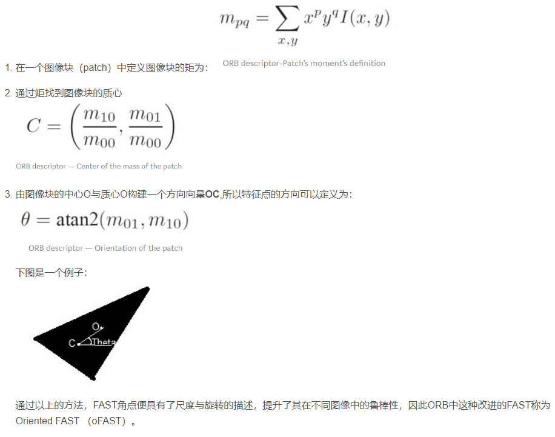
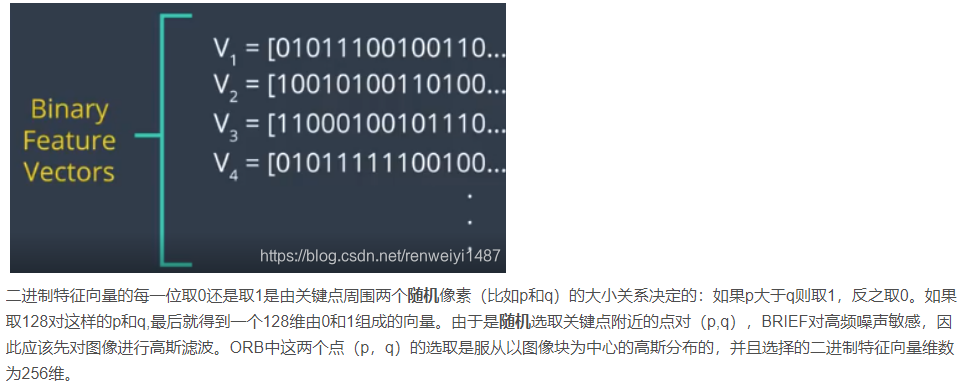
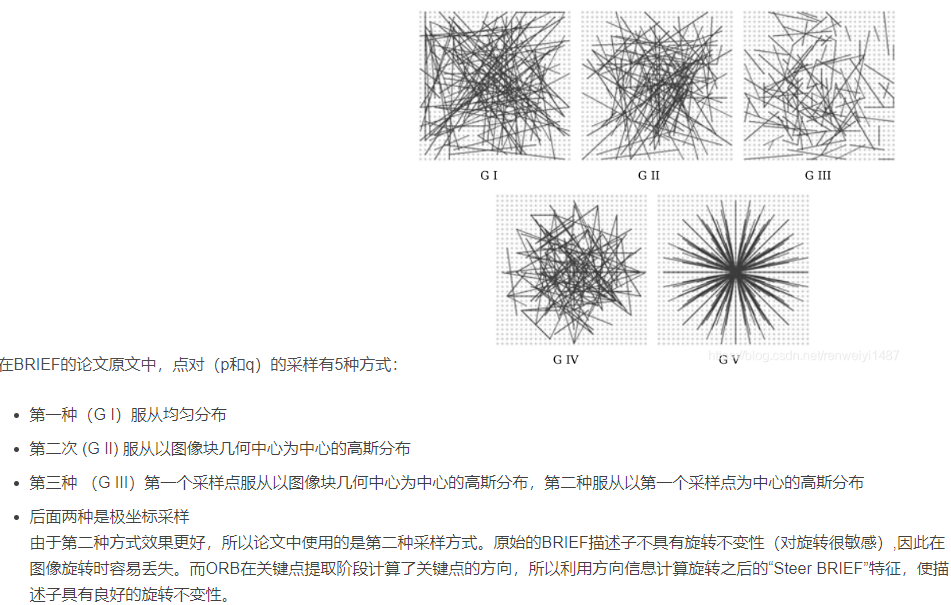

- [ORB特征](#orb特征)
  - [oFAST角点提取](#ofast角点提取)
  - [BRIEF 描述子 Binary robust independent elementary feature](#brief-描述子-binary-robust-independent-elementary-feature)
  - [特征匹配](#特征匹配)

## ORB特征

fast角点在很多应用中不满足需求，因为从远处看上去是角点的地方当相机离近时就不是角点了，或者当发生旋转时就认不出是角点了。因此提出更加稳定的局部图像特征，如：SIFT、SURF、ORB等等

特征点是由关键点（Key-point）和描述子（Descriptor）组成，关键点是指该特征点在图像中的位置，描述子通常是一个向量，描述了该关键点周围的像素信息

- ORB特征由关键点与描述子组成。它的关键点称为“Oriented FAST”，是一种改进的FAST角点，它的描述子为BRIEF
- 提取ORB特征分为如下两个步骤
  - oFAST角点提取：找出图像中的角点，与原来的FAST算法相比，ORB中计算了特征点的主方向，为BRIEF描述子增加了旋转不变性
  - BRIEF描述子：对前一步找到的关键点周围的像素区域进行描述，由于BRIEF对于图像旋转十分敏感，因此ORB对BRIEF进行了改进，利用上一步计算出的方向信息增强BRIEF的旋转不变性

### oFAST角点提取

怎么描述尺度和旋转

FAST角点没有方向信息，而且由于它取固定半径为3的圆因此也存在尺度问题（远看是角点，近看就不是角点了）
- ORB算法使用了图像金字塔（image pyramid）来解决尺度问题
- 图像金子塔每往上一层就对图像进行一个固定倍率的缩放，**较小的图像可以当作远景**
- ORB通过对图像的每一层进行关键点的提取从而**部分解决了尺度问题**

- 在旋转方面，ORB根据关键点周围灰度值的变化为每个关键点分配一个方向。为了检测灰度值的变化ORB使用了图像灰度质心（intensity centroid），图像灰度质心假设一个点的灰度强度是偏离中心的

### BRIEF 描述子 Binary robust independent elementary feature

提取了oFAST关键点后需要对每一个关键点计算描述子。BRIEF是一种二进制描述子，描述向量由多个0和1组成。简而言之，每个关键点由一个128-512位的二进制字符串表示

BRIEF具有一个重要的特性，即每个位特征具有较大的方差，且均值接近0.5。 但是，一旦将其沿关键点方向定向，它就会失去此属性并变得更加分散。 大的方差使特征更具区分性，因为它对输入的响应不同。 另一个理想的特性是使二进制特征向量不相关，因为这样每一个向量都有助于结果。 为了解决所有这些问题，ORB在所有可能的二进制向量中进行贪婪搜索，以找到方差高且均值接近0.5且不相关的向量。 结果称为rBRIEF。

### 特征匹配

不同图像之间提取完成特征点后就可以进行特征匹配，找到不同图像之间特征点的对应关系。最简单的匹配算法是暴力匹配 （Brute-Force Matcher）：对图像I中的每一个特征点与图像II中的所有特征点测量描述子的距离，然后排序，取最近的一个作为匹配点。描述子距离表示两个特征点之间的相似程度。对于rBRIEF这种二进制描述子，通常使用汉明距离（Hamming distance）:两个二进制串不同位数的个数。
