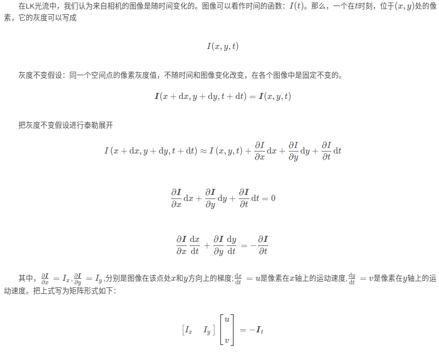
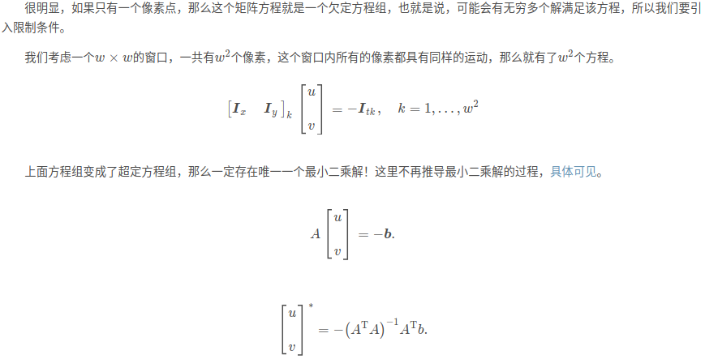
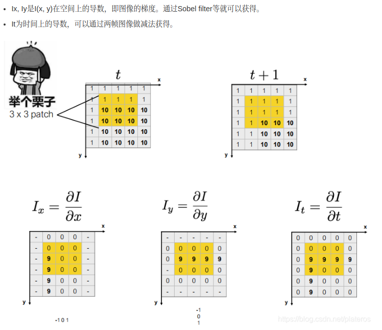
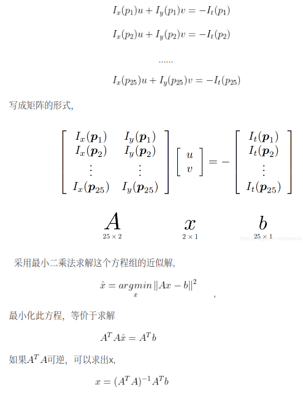
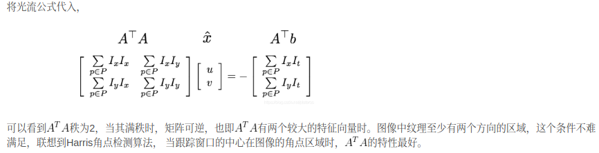
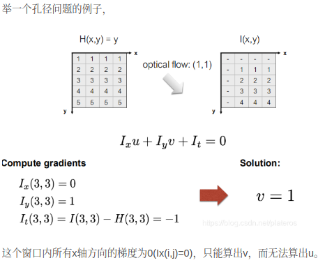
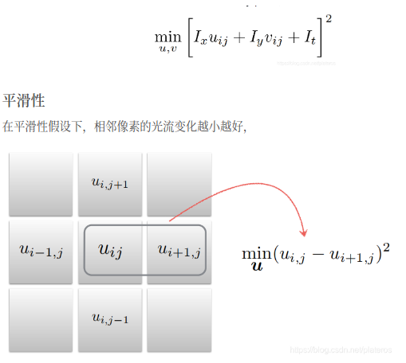
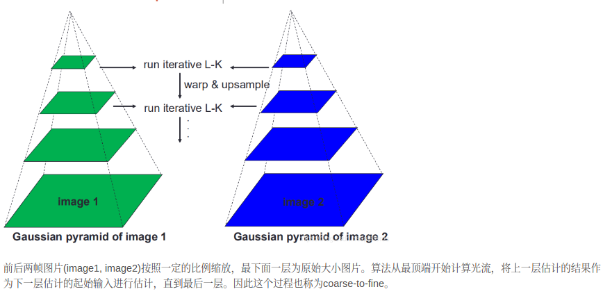

- [特征点法](#特征点法)
- [光流法和直接法](#光流法和直接法)
- [2D光流](#2d光流)
- [灰度不变假设](#灰度不变假设)
- [Lucas-Kanade 光流](#lucas-kanade-光流)
- [Horn-Schunck算法](#horn-schunck算法)
- [光流金字塔](#光流金字塔)

主要参考

- [光流基本原理和经典算法](https://blog.csdn.net/plateros/article/details/102931138)
- [optical-flow](https://github.com/xingdi-eric-yuan/optical-flow)

## 特征点法

一般包括关键点和描述子，如ORBSLAM（ORB=FAST角点+BRIFE描述子）

vslam中的应用
- 前端视觉里程计：通过匹配特征点求取位姿变换，从而估计相机位姿
- 后端优化：通过非线性优化的方法或者扩展卡尔曼滤波(EKF)通过路标点(特征点)对位姿进行进一步的优化
- 回环检测：在有回环检测的情况下，可以通过FAB-MAP建立的特征点词袋(一类特征点通过聚类形成的一个包)，对机器人是否检测回环进行判定。

优点
- 有描述子可以很稳定且鲁棒的对于视觉的特征进行描述，所以其不易受到光照的影响
- 通过特征点建立的词袋,可以进行回环检测的判定
- 理论成熟

缺点
- 对无纹理或者弱纹理会出现特征点匹配困难，比如管型腔体内，白色的墙面
- 关键点和描述子消耗计算资源比较大，实时性不高
- 图像利用率不高，除了特征点其他点作用较小

## 光流法和直接法

灰度不变假设．直接法是由光流法演变，也默认灰度不变假设

应用: 最小化光度误差（photometric error）
- 光流法：估计相机运动，跟踪关键点（可以是FAST角点，没有描述子）来优化使得图像当中的两个对应的位置光度误差最小
- 直接法：在这个基础上对前面估计的相机位姿进行进一步优化，因为这样的位姿很难保证全局最优性．这使得位姿的估计更加的准确和鲁棒

优点
- 计算量小，实时性高于特征点法
- 通过直接法的方式可以不需要有明显的纹理特征，只要一副图像当中有灰度变化即可，在没有特征点的时候甚至可以随机取点
- 图像的利用率较高，可以利用这一点对图像进行半稠密或者稠密的重建

缺点
- 对于图像的光度变化比较敏感
- 单纯图像的梯度来求取位姿的话，由于图像的非凸性，容易陷入局部最优

## 2D光流

随着时间的流逝，同一个像素会在图像中运动，可以追踪它的运动过程．计算部分像素运动的称为稀疏光流，计算所有像素的称为稠密光流

- 稀疏光流以LK光流为代表
- 稠密光流以Horm-Schunck光流为代表(建立完整地图)

## 灰度不变假设

图像梯度计算，一般用soble算子与图像进行卷积

## Lucas-Kanade 光流

LK光流目前用于稀疏光流,引入空间一致性假设．

假设同一平面上邻近的点具有相似的运动，具体来说就是选取一个mxn的窗口，在此窗口内假定光流值相同，所以这种算法也被称为constant flow．假设我们选取5x5的窗口，如果在此窗口内光流相同，我们就可以得到25个公式

LK算法最初用于求稠密光流，但是由于其对角点有较多要求，因此通常只能应用于稀疏光流。
- 这个算法假设窗口内光流一致，然而这样的窗口不易选择。
- 窗口越小，越容易出现孔径问题， 窗口越大，越无法保证窗口内光流的一致性。

## Horn-Schunck算法

Horn-Schunck算法引入了另一种假设 - 平滑性。与LK的光流一致性不同，他认为相邻像素的运动是相近的，平滑的

与LK算法相同，HS算法同样建立在光强一致性假设上,但是HS是一种全局约束算法，也就是说，对每一个像素来说，都需要满足寻找最优的光流值u,v 使得下式的模最小

## 光流金字塔

无论是Lucas-kanade还是Horn-schunck算法，均有小运动的假设。然而在实际场景的下，无法保证这个假设。

光流金字塔算法可以改善小运假设带来的弊端

