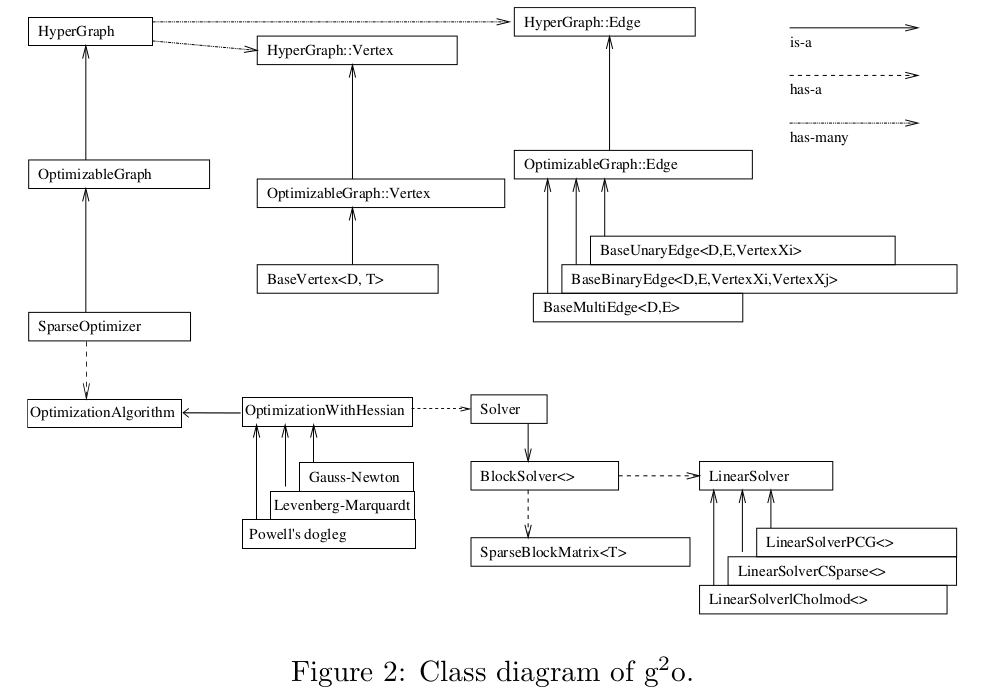

- [g2o learning note](#g2o-learning-note)
- [class diagram](#class-diagram)
- [usage](#usage)
  - [创建一个线性求解器LinearSolver](#创建一个线性求解器linearsolver)
  - [创建BlockSolver](#创建blocksolver)
  - [创建总求解器solver](#创建总求解器solver)
  - [创建稀疏优化器](#创建稀疏优化器)
  - [定义图的顶点和边，并添加到SparseOptimizer中](#定义图的顶点和边并添加到sparseoptimizer中)
    - [顶点Vertex](#顶点vertex)
    - [边Edge](#边edge)
  - [设置优化参数，开始执行优化](#设置优化参数开始执行优化)
- [slam book2 curve fitting](#slam-book2-curve-fitting)
- [3D-2D点的PnP问题](#3d-2d点的pnp问题)


[主要参考文章](https://zhuanlan.zhihu.com/p/121628349)

## g2o learning note

[g2o repos](https://github.com/gaoxiang12/slambook/blob/master/3rdparty/g2o.tar.gz)

## class diagram



1. g2o框架可以分为上下两部分，两部分中间的连接点：SparseOptimizer 就是整个g2o的核心部分。
2. SparseOpyimizer其实是一个Optimizable Graph，从而也是一个超图（HyperGraph）
3. HyperGraph有很多顶点和边。顶点继承自 Base Vertex，也即OptimizableGraph::Vertex；而边可以继承自 BaseUnaryEdge（单边）, BaseBinaryEdge（双边）或BaseMultiEdge（多边），它们都叫做OptimizableGraph::Edge
4. SparseOptimizer包含一个优化算法部分OptimizationAlgorithm，它是通过OptimizationWithHessian 来实现的。其中迭代策略可以从Gauss-Newton（高斯牛顿法，简称GN）、 Levernberg-Marquardt（简称LM法）,、Powell's dogleg 三者中间选择一个（常用的是GN和LM）。
5. 对优化算法部分进行求解的时求解器solver，它实际由BlockSolver组成
   1. BlockSolver由两部分组成：一个是SparseBlockMatrix，它由于求解稀疏矩阵(雅克比和海塞)
   2. 另一个部分是LinearSolver，它用来求解线性方程的带球增量，它可以从PCG/CSparse/Choldmod选择求解方法

## usage

搭建顺序：从底层到顶层

1. 创建线性求解器LinearSolver
2. 创建BlockSolver，并使用上述LinearSolver初始化
3. 创建总求解器solver,从GN/LM/Dogleg中选择一个作为迭代策略。使用BlockSolver进行初始化
4. 创建图优化的核心：稀疏优化器SparseOptimizer
5. 定义图优化的顶点和边，并添加到SparseOptimizer
6. 设置优化参数，开始执行优化

以SLAM十四讲中使用g2o求解曲线参数为例

```cpp
typedef g2o::BlockSolver< g2o::BlockSolverTraits<3,1> > Block;  // 每个误差项优化变量维度为3，误差值维度为1
typedef g2o::LinearSolverDense<Block::PoseMatrixType> LinearSolverType; // 线性求解器类型

/*************** 第1步：创建一个线性求解器LinearSolver*************************/
Block::LinearSolverType* linearSolver = new g2o::LinearSolverDense<Block::PoseMatrixType>(); 


/*************** 第2步：创建BlockSolver。并用上面定义的线性求解器初始化**********/
Block* solver_ptr = new Block( linearSolver );      


/*************** 第3步：创建总求解器solver。并从GN, LM, DogLeg 中选一个，再用上述块求解器BlockSolver初始化****/
g2o::OptimizationAlgorithmLevenberg* solver = new g2o::OptimizationAlgorithmLevenberg( solver_ptr );


/*************** 第4步：创建图优化的核心：稀疏优化器（SparseOptimizer）**********/
g2o::SparseOptimizer optimizer;     // 图模型
optimizer.setAlgorithm( solver );   // 设置求解器
optimizer.setVerbose( true );       // 打开调试输出


/*************** 第5步：定义图的顶点和边。并添加到SparseOptimizer中**********/
CurveFittingVertex* v = new CurveFittingVertex(); //往图中增加顶点
v->setEstimate( Eigen::Vector3d(0,0,0) );
v->setId(0);
optimizer.addVertex( v );
for ( int i=0; i<N; i++ )    // 往图中增加边
{
  CurveFittingEdge* edge = new CurveFittingEdge( x_data[i] );
  edge->setId(i);
  edge->setVertex( 0, v );                // 设置连接的顶点
  edge->setMeasurement( y_data[i] );      // 观测数值
  edge->setInformation( Eigen::Matrix<double,1,1>::Identity()*1/(w_sigma*w_sigma) ); // 信息矩阵：协方差矩阵之逆
  optimizer.addEdge( edge );
}

/*************** 第6步：设置优化参数，开始执行优化**********/
optimizer.initializeOptimization();
optimizer.optimize(100); 
```

### 创建一个线性求解器LinearSolver

sparse(稀疏)；dense(密集)

选择不同求解方式求解线性方程`H * Δx=-b` g2o中提供的求解方式主要有：

- LinearSolverCholmod ：使用sparse cholesky分解法，继承自LinearSolverCCS。
- LinearSolverCSparse：使用CSparse法，继承自LinearSolverCCS。
- LinearSolverPCG ：使用preconditioned conjugate gradient 法，继承自LinearSolver。(预处理共扼梯度)
- LinearSolverDense ：使用dense cholesky分解法，继承自LinearSolver。
- LinearSolverEigen： 依赖项只有eigen，使用eigen中sparse Cholesky 求解，因此编译好后可以方便的在其他地方使用，性能和CSparse差不多，继承自LinearSolver。

### 创建BlockSolver

BlockSolver有两种定义方式：

```cpp
// 固定变量的solver。 p代表pose的维度（是流形manifold下的最小表示），l表示landmark的维度
using BlockSolverPL = BlockSolver< BlockSolverTraits<p, l> >;

// 可变尺寸的solver。Pose和Landmark在程序开始时并不能确定，所有参数都在中间过程中被确定。
using BlockSolverX = BlockSolverPL<Eigen::Dynamic, Eigen::Dynamic>;
```

此外g2o还预定义了以下几种常用类型：

- BlockSolver_6_3 ：表示pose 是6维，观测点是3维，用于3D SLAM中的BA。
- BlockSolver_7_3：在BlockSolver_6_3 的基础上多了一个scale。
- BlockSolver_3_2：表示pose 是3维，观测点是2维。

### 创建总求解器solver

可选的迭代策略

- g2o::OptimizationAlgorithmGaussNewton
- g2o::OptimizationAlgorithmLevenberg
- g2o::OptimizationAlgorithmDogleg

### 创建稀疏优化器

```cpp
g2o::SparseOptimizer  optimizer;
```

设置求解方法

```cpp
SparseOptimizer::setAlgorithm(OptimizationAlgorithm* algorithm)
```

设置优化过程输出信息

```cpp
SparseOptimizer::setVerbose(bool verbose)
```

### 定义图的顶点和边，并添加到SparseOptimizer中

#### 顶点Vertex

在g2o中定义Vertex有一个通用的类模板：BaseVertex。在结构框图中可以看到它的位置就是HyperGraph继承的根源

**BaseVertex具有两个参数D/T**

- D 是int 类型，表示vertex的最小维度，例如3D空间中旋转是3维的，则 D = 3
- T 是待估计vertex的数据类型，例如用四元数表达三维旋转，则 T 就是Quaternion 类型

D不是顶点(状态变量)的维度，而是其在流形空间(manifold)的最小表示

g2o本身定义的常用顶点类型

- 不同应用场景：二维，三维
- 不同待优化变量（位姿，空间点）
- 不同优化类型（李群位姿SE3，李代数位姿Sim3）
  - 李代数位姿引入了缩放系数

```cpp
ertexSE2 : public BaseVertex<3, SE2>  
//2D pose Vertex, (x,y,theta)

VertexSE3 : public BaseVertex<6, Isometry3> //Isometry3使欧式变换矩阵T，实质是4*4矩阵
//6d vector (x,y,z,qx,qy,qz) (note that we leave out the w part of the quaternion)

VertexPointXY : public BaseVertex<2, Vector2>
VertexPointXYZ : public BaseVertex<3, Vector3>
// 三维点
VertexSBAPointXYZ : public BaseVertex<3, Vector3>

// SE3 Vertex parameterized internally with a transformation matrix and externally with its exponential map
// 李群位姿
VertexSE3Expmap : public BaseVertex<6, SE3Quat>

// SBACam Vertex, (x,y,z,qw,qx,qy,qz),(x,y,z,qx,qy,qz) (note that we leave out the w part of the quaternion.
// qw is assumed to be positive, otherwise there is an ambiguity in qx,qy,qz as a rotation
VertexCam : public BaseVertex<6, SBACam>

// Sim3 Vertex, (x,y,z,qw,qx,qy,qz),7d vector,(x,y,z,qx,qy,qz) (note that we leave out the w part of the quaternion.
VertexSim3Expmap : public BaseVertex<7, Sim3>
```

如果在使用中发现没有我们可以直接使用的Vertex，那就需要自己来定义了。一般来说定义Vertex需要重写这几个函数（注意注释）：

```cpp
virtual bool read(std::istream& is);
virtual bool write(std::ostream& os) const;
// 分别是读盘、存盘函数，一般情况下不需要进行读/写操作的话，仅仅声明一下就可以

virtual void oplusImpl(const number_t* update);
//顶点更新函数

virtual void setToOriginImpl();
//顶点重置函数，设定被优化变量的原始值。
```

请注意里面的oplusImpl函数，是非常重要的函数，主要用于优化过程中增量△x 的计算。根据增量方程计算出增量后，通过这个函数对估计值进行调整，因此该函数的内容要重视。

根据上面四个函数可以得到定义顶点的基本格式：

```cpp
class myVertex: public g2o::BaseVertex<Dim, Type>
  {
      public:
      EIGEN_MAKE_ALIGNED_OPERATOR_NEW

      myVertex(){}

      virtual void read(std::istream& is) {}
      virtual void write(std::ostream& os) const {}

      virtual void setOriginImpl()
      {
          _estimate = Type();
      }
      virtual void oplusImpl(const double* update) override
      {
          _estimate += update;
      }
  }
```

example

```cpp
class CurveFittingVertex: public g2o::BaseVertex<3, Eigen::Vector3d>
{
    public:
    EIGEN_MAKE_ALIGNED_OPERATOR_NEW  // 字节对齐

    virtual void setToOriginImpl() // 重置，设定被优化变量的原始值
    {
        _estimate << 0,0,0;
    }

    virtual void oplusImpl( const double* update ) // 更新
    {
        _estimate += Eigen::Vector3d(update);   //update强制类型转换为Vector3d
    }
    // 存盘和读盘：留空
    virtual bool read( istream& in ) {}
    virtual bool write( ostream& out ) const {}
};
```

另外值得注意的是，优化变量更新并不是所有时候都可以像上面两个一样直接 += 就可以，这要看优化变量使用的类型（是否对加法封闭）。

**向图中添加顶点**

接着上面定义完的顶点，我们把它添加到图中

```cpp
CurveFittingVertex* v = new CurveFittingVertex();
v->setEstimate( Eigen::Vector3d(0,0,0) )；  // 设定初始值
v->setId(0);                               // 定义节点编号
optimizer.addVertex( v );                  // 把节点添加到图中
```

#### 边Edge

图优化中的边：BaseUnaryEdge，BaseBinaryEdge，BaseMultiEdge 分别表示一元边，两元边，多元边。

顾名思义，一元边可以理解为一条边只连接一个顶点，两元边理解为一条边连接两个顶点（常见），多元边理解为一条边可以连接多个（3个以上）顶点。

以最常见的二元边为例分析一下他们的参数：D, E, VertexXi, VertexXj：

-  是 int 型，表示测量值的维度 （dimension）
- E 表示测量值的数据类型
- VertexXi，VertexXj 分别表示不同顶点的类型

```cpp
BaseBinaryEdge<2, Vector2D, VertexSBAPointXYZ, VertexSE3Expmap>
```

表示二元边，参数1是说测量值是2维的；参数2对应测量值的类型是Vector2D，参数3和4表示两个顶点也就是优化变量分别是三维点 VertexSBAPointXYZ，和李群位姿VertexSE3Expmap。

**定义边**

除了上面那行定义语句，还要复写一些重要的成员函数：

```cpp
virtual bool read(std::istream& is);
virtual bool write(std::ostream& os) const;
// 一般情况下不需要进行读/写操作的话，仅仅声明一下就可以

virtual void computeError();
// 非常重要，是使用当前顶点值计算的测量值与真实测量值之间的误差

virtual void linearizeOplus();
// 非常重要，是在当前顶点的值下，该误差对优化变量的偏导数，也就是Jacobian矩阵
```

除了上面四个函数，还有几个重要的成员变量以及函数：

```cpp
_measurement； // 存储观测值
_error;  // 存储computeError() 函数计算的误差
_vertices[]; // 存储顶点信息，比如二元边，_vertices[]大小为2
//存储顺序和调用setVertex(int, vertex) 和设定的int有关（0或1）

setId(int);  // 定义边的编号（决定了在H矩阵中的位置）
setMeasurement(type);  // 定义观测值
setVertex(int, vertex);  // 定义顶点
setInformation();  // 定义协方差矩阵的逆
```

有了上面那些重要的成员变量和成员函数，就可以用来定义一条边了：

```cpp
class myEdge: public g2o::BaseBinaryEdge<errorDim, errorType, Vertex1Type, Vertex2Type>
  {
      public:
      EIGEN_MAKE_ALIGNED_OPERATOR_NEW      

      myEdge(){}     
      virtual bool read(istream& in) {}
      virtual bool write(ostream& out) const {}      
      virtual void computeError() override
      {
          // ...
          _error = _measurement - Something;
      }    
  
      virtual void linearizeOplus() override  // 求误差对优化变量的偏导数，雅克比矩阵
      {
          _jacobianOplusXi(pos, pos) = something;
          // ...         
          /*
          _jocobianOplusXj(pos, pos) = something;
          ...
          */
      }      
      private:
      data
  }
```

### 设置优化参数，开始执行优化

设置SparseOptimizer的初始化、迭代次数、保存结果等

```cpp
// initialization
SparseOptimizer::initializeOptimization(HyperGraph::EdgeSet& eset)

// set iterate times
SparseOptimizer::optimize(int iterations,bool online)
```

## slam book2 curve fitting

这个例子中定义的是1元边

```cpp
// （误差）边的模型    模板参数：观测值维度，类型，连接顶点类型
class CurveFittingEdge: public g2o::BaseUnaryEdge<1,double,CurveFittingVertex>
{
public:
    EIGEN_MAKE_ALIGNED_OPERATOR_NEW
    CurveFittingEdge( double x ): BaseUnaryEdge(), _x(x) {}
    // 计算曲线模型误差
    void computeError()
    {
        const CurveFittingVertex* v = static_cast<const CurveFittingVertex*> (_vertices[0]);
        const Eigen::Vector3d abc = v->estimate();
        _error(0,0) = _measurement - std::exp( abc(0,0)*_x*_x + abc(1,0)*_x + abc(2,0) ) ;
    }
    virtual bool read( istream& in ) {}
    virtual bool write( ostream& out ) const {}
public:
    double _x;  // x 值， y 值为 _measurement
};
```

向图中添加一元边

```cpp
// 往图中增加边
for ( int i=0; i<N; i++ )
{
    CurveFittingEdge* edge = new CurveFittingEdge( x_data[i] );
    edge->setId(i);
    edge->setVertex( 0, v );                // 设置连接的顶点
    edge->setMeasurement( y_data[i] );      // 观测数值
    edge->setInformation( Eigen::Matrix<double,1,1>::Identity()*1/(w_sigma*w_sigma) ); // 信息矩阵：协方差矩阵之逆
    optimizer.addEdge( edge );
}
```

## 3D-2D点的PnP问题

针对最小化重投影误差，使用二元边

```cpp
//继承自BaseBinaryEdge类，观测值2维，类型Vector2D,顶点分别是三维点、李群位姿
class G2O_TYPES_SBA_API EdgeProjectXYZ2UV : public  
               BaseBinaryEdge<2, Vector2D, VertexSBAPointXYZ, VertexSE3Expmap>{
  public:
    EIGEN_MAKE_ALIGNED_OPERATOR_NEW;

    //1. 默认初始化
    EdgeProjectXYZ2UV();

    //2. 计算误差
    void computeError()  {
      //李群相机位姿v1 相机位姿
      const VertexSE3Expmap* v1 = static_cast<const VertexSE3Expmap*>(_vertices[1]);
      // 顶点v2, 世界坐标系下的三维点
      const VertexSBAPointXYZ* v2 = static_cast<const VertexSBAPointXYZ*>(_vertices[0]);
      //相机参数
      const CameraParameters * cam
        = static_cast<const CameraParameters *>(parameter(0));
     //误差计算，测量值减去估计值，也就是重投影误差obs-cam
     //估计值计算方法是T*p,得到相机坐标系下坐标，然后在利用camera2pixel()函数得到像素坐标。
      Vector2D obs(_measurement);
      _error = obs - cam->cam_map(v1->estimate().map(v2->estimate()));
    }

    //3. 线性增量函数，也就是雅克比矩阵J的计算方法
    virtual void linearizeOplus();

    //4. 相机参数
    CameraParameters * _cam; 
    bool read(std::istream& is);
    bool write(std::ostream& os) const;
};
```

```cpp
_error = obs - cam->cam_map(v1->estimate().map(v2->estimate()));//误差=观测-投影
```

- cam_map 函数功能是把相机坐标系下三维点（输入）用内参转换为图像坐标（输出）
- map函数是把世界坐标系下三维点变换到相机坐标系
- v1->estimate().map(v2->estimate())意思是用V1估计的pose把V2代表的三维点，变换到相机坐标系下（把世界坐标系下的三维点转到相机坐标系下，然后在进一步转为图像坐标）

向图中添加二元边

```cpp
index = 1;
for ( const Point2f p:points_2d )
{
    g2o::EdgeProjectXYZ2UV* edge = new g2o::EdgeProjectXYZ2UV();
    edge->setId ( index );  // 边的b编号
    edge->setVertex ( 0, dynamic_cast<g2o::VertexSBAPointXYZ*> ( optimizer.vertex ( index ) ) );
    edge->setVertex ( 1, pose );
    edge->setMeasurement ( Eigen::Vector2d ( p.x, p.y ) );  // 设置观测的特征点图像坐标
    edge->setParameterId ( 0,0 );
    edge->setInformation ( Eigen::Matrix2d::Identity() );
    optimizer.addEdge ( edge );
    index++;
}
```
