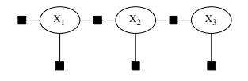

# GTSAM

GTSAM exploits sparsity to be computationally efficient. 利用稀疏性提高计算效率

为了批量优化历史位姿$\mathbf{x} = {x_0, x_1, x_2, ... x_i}$，研究者将图论引入SLAM后端优化。每一个机器的位姿$x_i$是图中的顶点；通过各种里程计计算，比如连续位姿间的IMU积分结果或者点云匹配结果，成为两个位姿$x_i,x_j$之间的边；对于一些额外的观测，比如GPS数据，成为连接顶点的一元边（只有一端连接到顶点）



GTSAM使用因子图（FactorGraph）作为通用的图问题描述框架

## 图优化（GraphOptimization）vs. GTSAM中使用的因子图优化（FactorGraph Optimization）区别 vs. BA

- 图优化似乎一般指位姿图（PoseGraph）的优化，图中的顶点都是机器人的位姿
- BA(Bundle Adjustment)似乎一般指在视觉SLAM中对地标（Landmarks）和位姿同时优化的方法
- GTSAM的因子图除了能够构建位姿图之外，还可以将速度、偏差、IMU预积分等当作顶点和边加入图中。另外，GTSAM框架实现了iSAM和iSAM2两个递增式优化器

## 重要概念

- 变量（variables）：因子图中的每一个顶点是一个代求的变量。假设我们只需要求解每一个时刻的机器人姿态，那么每个顶点就是该时刻的机器人位姿，如上图中的 ${X_1,X_2,X_3}$
- 值（values）：值是每个变量数值。在调用优化器对因子图做优化时，我们要先为每个变量设置初始值，优化结束后再从优化器中拿出每个变量优化后的值
- 因子（factors）：因子是因子图中的边，每条边都可以视为一个因子，每个因子又可以认为是一个约束。比如连续两个位姿之间可以由IMU计算出两个位姿的变换，该变换作为一条边加入因子图连接两个变量（二元因子：binary factor）；又或者在某个时刻有GPS数据输入，GPS数据是一个观测，也可以作为一个因子加入因子图，这时候GPS的边只有一端连接到变量（一元因子：unary factor）
- 因子图（factor graph）：因子图由顶点（变量）和因子（边）构成
- 优化器（Optimizer）：因子图只是建模了SLAM的历史位姿和输入与观测间的关系，如何求解这个因子图也就是如何设置变量使得整个图最符合所有的约束（误差最小）则需要用到优化器
- 除了最常见的求解非线性问题的Gaussian-Newton和Levenberg-Marquardt优化器之外，GTSAM还实现了两个增量式优化器iSAM,iSAM2
- 键（Keys）：往因子图添加因子需要指定该因子连接到哪些变量。GTSAM中使用键来指明
- 一元因子需要指明其连接到第几个变量；二元因子需要指明其连接到哪两个变量。因子图中每个变量的键都应该是唯一的。为了方便在多种变量类型的情况下指明键，GTSAM提供Symbols来让用户方便生成不同变量类型的键值。（键不一定是连续的，但必须是唯一的）

# simpler problem of modeling robot motion

Let us consider the simpler problem of modeling robot motion. This can be done with a continuous Markov chain, and provides a gentle introduction to GTSAM 连续马尔可夫链


- $x_1,x_2,x_3$为机器人三个时刻的位姿
- unary factor(一元因子)$f_0$为第一个时刻机器人位姿的观测, 是x1的先验
- binary factors(二元因子) f1(x1, x2; o1) & f1(x2, x3; o2), o1 o2表示odom measurements

```cpp
// gtsam/examples/OdometryExample.cpp
// 构建一个空的非线性因子图
NonlinearFactorGraph graph;

// 构建先验因子，也就是图中的f_0
// 这里使用二维姿态（x,y,theta）简化问题
Pose2 priorMean(0.0, 0.0, 0.0);
// 高斯噪声，代表我们对该因子的不确定性
auto priorNoise = noiseModel::Diagonal::Sigmas(Vector3(0.3, 0.3, 0.1));

// 将先验因子加入因子图
// 其中的1表示该因子连接到第1个变量
graph.add(PriorFactor<Pose2>(1, priorMean, priorNoise));

// 构建里程计因子，也就是图中的f_1,f_2
// 往前移动2米，y轴不便，theta不变
Pose2 odometry(2.0, 0.0, 0.0);
auto odometryNoise = noiseModel::Diagonal::Sigmas(Vector3(0.2, 0.2, 0.1));

// 将里程计因子加入因子图
// 1,2代表该里程计约束是从变量1到变量2
graph.add(BetweenFactor<Pose2>(1, 2, odometry, odometryNoise));
// 添加相同的因子到变量2和变量3之间
graph.add(BetweenFactor<Pose2>(2, 3, odometry, odometryNoise));

// 创建 Values 实例，并将其用作初始估计值，以找到轨迹X的最大a后验（MAP）分配(posteriori assignment)：
// 设置各个变量的初始值(对每个变量指定猜测值或者叫观测值)
Values initial;
initial.insert(1, Pose2(0.5, 0.0, 0.2));
initial.insert(2, Pose2(2.3, 0.1, -0.2));
initial.insert(3, Pose2(4.1, 0.1, 0.1));

// 调用优化器并使用设定好的初始值对因子图优化
Values result = LevenberMarquardtOptimizer(graph, initial).optimize();

// 计算所有变量的边际协方差
cout.precision(2);
Marginals marginals(graph, result);
cout << "x1 covariance:\n" << marginals.marginalCovariance(1) << endl;
cout << "x2 covariance:\n" << marginals.marginalCovariance(2) << endl;
cout << "x3 covariance:\n" << marginals.marginalCovariance(3) << endl;
```

You should think of a factor graph as a function to be applied to values -as the notation f(X) / P(X|Z) implies- rather than as an object to be modified. 将因子图视为要应用于values的函数

以上代码可能的输出

# reference

- [gtsam hand on introduction](https://github.com/borglab/gtsam/blob/develop/doc/gtsam.pdf)
