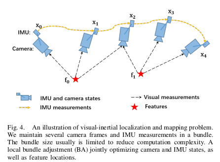

# imu & camera 时间戳同步

由于硬件系统的触发延时、传输延时和没有准确同步时钟等问题，IMU和相机之间通常存在时间偏差，估计并纠正这个偏差将有效提升VIO系统的性能

相机与IMU数据流时间戳上的偏差将影响VIO系统的工作，比如在VINS-Mono系统中，两个KeyFrame图像之间的IMU预积分项将因为时间不对齐而不准确，从而给状态估计带来偏差

IMU和相机时间偏差标定的几种方法包括:

1. [基于MSCKF的在线时间标定方法](https://intra.ece.ucr.edu/~mourikis/papers/Li2014IJRR_timing.pdf)
2. [Online Temporal Calibration for Monocular Visual-Inertial Systems](https://arxiv.org/abs/1808.00692)
3. [Kalibr 工具箱中离线的时间标定方法](https://github.com/ethz-asl/kalibr/wiki/camera-imu-calibration)

以下为绕沈劭劼团队方法进行学习

## Online Temporal Calibration for Monocular Visual-Inertial Systems

### 假设传感器之间的时间偏移是一个常数

以imu时间戳为参考时间，应根据 td 向前或向后移动相机图像序列，没有移动整个摄像机或 IMU 序列，而是移动特征点的观测值

- 下图描绘了一幅说明时间偏移的图片。在图中，上半部分表示采样瞬间，下半部分显示了时间戳瞬间。由于触发延迟、传输延迟和时钟不同步，生成的时间戳不等于实际采样时间，从而导致摄像机和IMU之间的时间错位
- 定义td: $t_{imu}=t_{cam}+td$, ，其中时间偏移 td 是我们应该移动摄像机时间戳的时间量，以便摄像机和 IMU 数据流在时间上保持一致。td 可以是正值或负值。如果相机延迟比 IMU 长，则 td 为负值。相反，td 为正值。

### 引入用于建模和补偿时间错位的特征速度

假设: 在很短的时间内（几毫秒），摄像机的运动可以被视为匀速运动，故图像特征在短时间内在图像平面上也近似匀速移动.基于这个假设，我们计算特征在图像平面上的速度,如下图所示，$I_k$ 和 $I_{k+1}$ 是两个连续的图像帧。假设摄像机在短时间内 [t_k，t_{k+1}] 以恒定速度从 $C_k$ 移动到 $C_{k+1}$。因此，我们近似地认为特征 l 在这个短时间段内也在图像平面上以恒定速度 $V_l^k$ 移动。速度 $V_l^k$ 的计算为像素移动值除以时间间隔 t

### Vision Factor with Time Offset 具有时间偏移的视觉因素

- 在重投影误差中加入td

在经典的稀疏视觉 SLAM 算法中，视觉测量被公式化为成本函数中的（重新）投影误差。我们通过添加一个新变量（时间偏移）来反映经典的（重新）投影误差。

特征有两种典型的参数化。一些算法将特征参数化为其在全局帧中的 3D 位置，而其他算法将特征参数化为相对于特定图像帧的深度或逆深度。

#### 3D Position Parameterization

3D点在世界坐标系下位姿已知

3D 位置参数化：特征被参数化为全局框架中的 3D 位置 (Pl = [xl yl zl]T)。传统上，视觉测量被公式化为投影误差

原始重投影模型

上图描述了重投影过程。虚线表示没有时间偏移建模的传统重投影过程。实线表示考虑了时间偏移的重投影。黄线表示 IMU 约束。IMU 约束与传统的重投影约束不一致。通过优化 td，我们可以在时域中找到与 IMU 约束匹配的最佳摄像机位姿和特征观测

#### Depth Parameterization 逆深度参数化

假设图像中特征点的深度或者逆深度已知，则i帧到j帧的传统重投影误差描述为

特征l先投影到global frame, 然后投影回相机帧j的图像平面，残差定义为观测值和反向投影位置之间的位移

引入时间偏移td

#### OPtimization with td 携带时间偏移的优化

通过利用上述视觉因子，我们可以轻松地将时间校准函数添加到典型的基于视觉惯性优化的框架中，如ceres

在这些框架中，视觉惯性 SLAM 被表述为一个非线性优化问题，将视觉和惯性测量紧密耦合。如下图所示，多个摄像机帧和 IMU 测量被捆绑为 “束”，“束” 大小决定计算的时间复杂度。局部束调整（BA）联合优化摄像机和 IMU 状态以及特征位置。

我们可以很容易地将提出的加入时间偏移优化的视觉因子添加到这种框架中。具体而言，整个状态变量增加时间偏移优化量，状态变量定义为：

- 其中，第 k 组预积分的 IMU 状态由全局坐标系中的位置 $p_k^w$、速度 $v_k^w$、方向 $R_k^w$ 和局部 body 坐标系中的 IMU 偏差 $b_a$、$b_g$ 组成
- 特征 $P_l$ 由全局坐标系中的 3D 位置或相对于特定图像坐标系的深度参数化
- 整个问题被表述为一个包含 IMU 传播因子、重投影因子以及某个先验因子的代价函数。因此，我们使用加入时间偏移变量的视觉因子来实现时间偏移校准

#### Compensation of time offset 时间偏移补偿

在每次优化之后，我们通过移动后续视觉流的时间戳来补偿时间偏移，因为 $t′_{cam}=t_{cam}+td$。然后，系统估计补偿视觉测量和惯性测量之间的 $\delta td$。$\delta td$ 将在后续数据流中迭代优化，并收敛到零。随着时间间隔 $\delta td$ 的减小，我们的基本假设（特征在短时间间隔内在图像平面上以恒定速度移动）越来越合理。即使在开始时存在巨大的时间偏移（例如数百毫秒），该过程也会逐渐从粗到细进行补偿，直至收敛到零。

#### 实验

作者使用该方法和 Kalibr 时间校准工具

1. 试验结果显示，时间偏移量随曝光时间线性变化
2. 

## 参考文章

- [传感器时间戳对齐](https://haolin11.github.io/2022/12/03/Online-Temporal-Calibration-for-Monocular-Visual-Inertial-Systems/)
- [VIO系统中相机和IMU时间戳对齐](https://blog.csdn.net/weixin_50508111/article/details/122466521)
