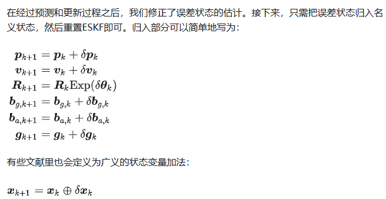

- [ESKF 简明推导](#eskf-简明推导)
  - [ESKF 介绍](#eskf-介绍)
  - [ESKF状态方程](#eskf状态方程)
  - [误差状态的旋转项](#误差状态的旋转项)
  - [误差状态的速度项](#误差状态的速度项)
  - [误差状态的运动学方程](#误差状态的运动学方程)
  - [离散时间的ESKF运动学方程](#离散时间的eskf运动学方程)
  - [ESKF的运动过程](#eskf的运动过程)
  - [ESKF的更新过程](#eskf的更新过程)
  - [ESKF的误差状态后续处理](#eskf的误差状态后续处理)
  - [速度量观测](#速度量观测)
  - [reference](#reference)

# ESKF 简明推导

## ESKF 介绍

在现代的大多数IMU系统中，人们往往使用误差状态卡尔曼滤波器（Error state Kalman filter, ESKF）而非原始状态的卡尔曼滤波器。大部分基于滤波器的LIO或VIO实现中，都使用ESKF作为状态估计方法。相比于传统KF，ESKF的优点可以总结如下

1. 在旋转的处理上，ESKF的状态变量可以采用最小化的参数表达，也就是使用三维变量来表达旋转的增量。而传统KF需要用到四元数（4维）或者更高维的表达（旋转矩阵，9维），要不就得采用带有奇异性的表达方式（欧拉角）
2. ESKF总是在原点附近，离奇异点较远，并且也不会由于离工作点太远而导致线性化近似不够的问题
3. ESKF的状态量为小量，其二阶变量相对来说可以忽略。同时大多数雅可比矩阵在小量情况下变得非常简单，甚至可以用单位阵代替
4. 误差状态的运动学也相比原状态变量要来得更小，因为我们可以把大量更新部分放到原状态变量中

- 在ESKF中，我们通常把原状态变量称为名义状态变量（nominal state），然后把ESKF里的状态变量称为误差状态变量（error state）
- 真值状态量 = 名义状态量+误差状态值

ESKF整体流程如下：

1. 当IMU测量数据到达时，我们把它积分后，放入名义状态变量中。由于这种做法没有考虑噪声，其结果自然会快速漂移，于是我们希望把误差部分作为误差变量，放在ESKF中
2. ESKF内部会考虑各种噪声和零偏的影响，并且给出误差状态的一个高斯分布描述
3. 同时，ESKF本身作为一种卡尔曼滤波器，也具有预测过程和修正过程，其中修正过程需要依赖IMU以外的传感器观测。
4. 在修正之后，ESKF可以给出后验的误差高斯分布，随后我们可以把这部分误差放入名义状态变量中，并把ESKF置零，这样就完成了一次循环

## ESKF状态方程

关于误差变量的平移、零偏和重力公式，都很容易得出对应的时间导数表达式，而速度，旋转两式由于和$\delta R$有关，需要单独推导

## 误差状态的旋转项

- 推导过程从误差状态定义公式两侧对时间求导，等于真值状态量的导数开始
- 运用了SO3的伴随性质
- 泰勒近似：$Exp(\theta) = I + \theta$^

推导过程如下：

## 误差状态的速度项

- 推导过程忽略了二阶小量相乘
- 用了交换叉乘顺序，需要在前添加负号

## 误差状态的运动学方程

## 离散时间的ESKF运动学方程

## ESKF的运动过程

ESKF的预测过程包含两部分：1. 对名义状态量的预测（imu积分）；2. 对误差状态的均值和协方差矩阵的预测

- 由于ESKF的误差状态在每次更新以后会被重置，因此运动方程的均值部分没有太大意义，而方差部分则可以指导整个误差估计的分布情况

## ESKF的更新过程

## ESKF的误差状态后续处理

ESKF的重置分为均值部分和协方差部分。均值部分重置为0，协方差矩阵部分进行一次切空间投影

## 速度量观测

直观上看RTK读数主要在观测阶段通过卡尔曼增益作用与误差状态的位移变量中

在gins系统中如果长时间缺少RTK观测，ESKF就会变成纯靠imu积分的递推模式，该模式下位移将很快发散，发散的主要原因是缺少速度观测，常见是使用车辆电机转速或轮式编码器观测速度（轮子容易受打滑影响）

## reference

- [简明ESKF推导](https://zhuanlan.zhihu.com/p/441182819)
