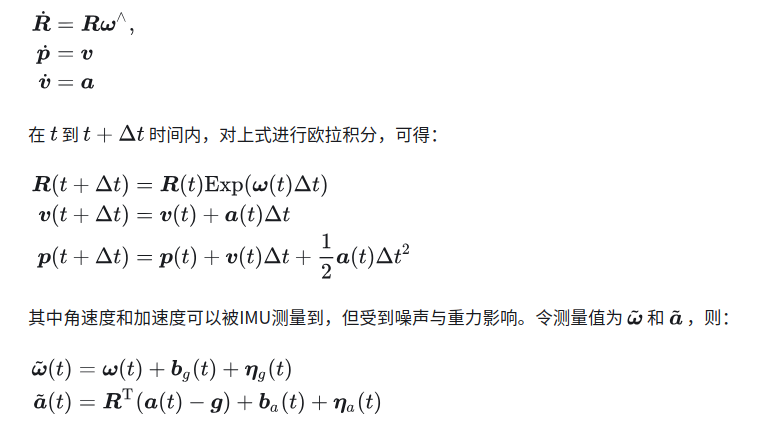
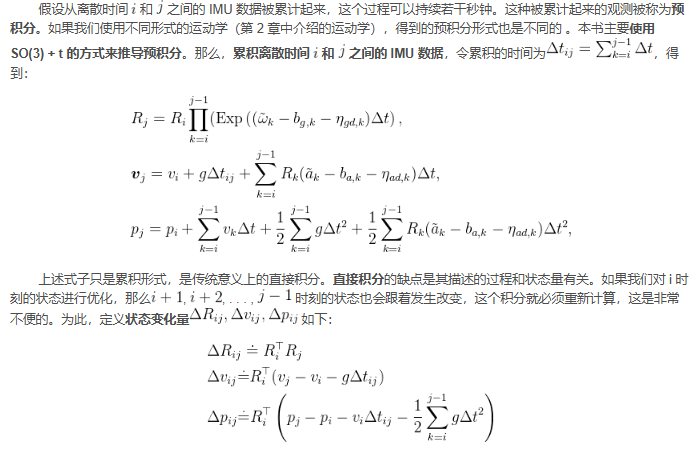
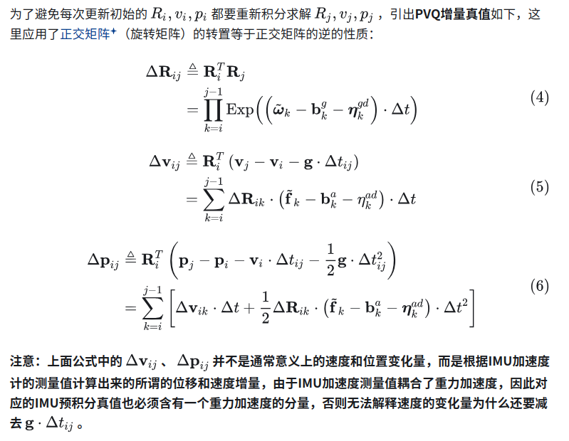
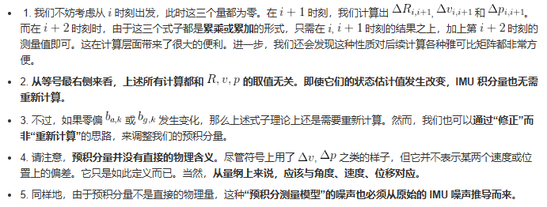

- [IMU Pre-Integration](#imu-pre-integration)
  - [预积分与传统imu运动学积分的区别](#预积分与传统imu运动学积分的区别)
  - [IMU ＆ VO VSLAM](#imu--vo-vslam)
  - [IMU 系统](#imu-系统)
  - [Pre-Integration](#pre-integration)
    - [概述](#概述)
    - [IMU 预积分优化方法](#imu-预积分优化方法)
    - [IMU预积分测量值的速算](#imu预积分测量值的速算)
    - [IMU预积分优化的残差比例调节](#imu预积分优化的残差比例调节)
    - [重力加速度和绝对姿态求解](#重力加速度和绝对姿态求解)
  - [参考文章](#参考文章)

# IMU Pre-Integration

IMU
1. 陀螺仪与加速度计，测量imu坐标系上，三个轴的角速度和线加速度;
2. 内部存在白噪声和零偏bias(传感器内部机械、温度等各种物理因素产生的传感器内部误差的综合参数),IMU的加速度计和陀螺仪的每个轴都用彼此相互独立的参数建模

预积分是一种在紧耦合系统中常见的imu数据处理方法，立足点就落在相邻两帧（点云）之间的IMU积分测量值计算及其动态更新上

## 预积分与传统imu运动学积分的区别

在基于 ESKF 的 GINS 中，我们将两个 GNSS 观测之间的imu数据进行积分作为eskf的预测过程．这种做法把 IMU 数据看成某种一次性的使用方式：将它们积分到当前状态估计值上，然后用观测数据更新当时的状态估计值．以上做法和此时的状态估计有关，如果状态量发生变化，需要重新积分

预积分与传统的imu运动学积分不同，预积分可以将一段时间内的 IMU 测量数据累计起来，**建立预积分测量，同时还能保证测量值与状态变量无关**．无论是 LIO 系统还是 VIO 系统，预积分已经成为诸多与 IMU 紧耦合的标准方法，但是原理相对传统 ESKF 的预测过程会更加复杂一些

## IMU ＆ VO VSLAM

在纯视觉的slam或者vo中，由于图像的运动模糊、遮挡、快速运动、纯旋转、尺度不确定性的一系列问题，导致仅靠一个摄像头很难完成我们实际场景的应用需求

MU直接可以得到运动主体自身的角速度、加速度的测量数据，从而对运动有一个约束，或者说与视觉形成互补，可实现快速运动的定位和主体纯旋转的处理，从而进一步提高slam/vio的可靠性

## IMU 系统

在imu中考虑５个变量，旋转R 平移p 角速度w 线速度v 加速度a,状态方程如下(旋转使用SO(3))

传统imu运动学积分测量频率太高，我们并不希望优化过程随着imu数据进行调用，更希望将这些imu测量值则和在一起处理，即在关键帧之间对imu数据进行预积分,然后按照关键帧的频率调用优化过程

对上述累积式稍加改变，尽量将 IMU 读数放在一侧，状态量放到另一侧，可得如下式子，该式称为预积分的定义式

在构建图优化时，可以把零偏和噪声加入到优化中，以获得更准确的结果，而每次优化，零偏和噪声都会更新，进而需要重新对imu积分．为了节省计算资源，Christian Forster提出了预积分的方法

## Pre-Integration

### 概述

- 将关键帧i到j之间的imu数据累计，获取每个周期PVQ(位置 速度 姿态)增量的测量值，对照其它通过非IMU方式获得的PVQ增量的估计值，构建PVQ增量的残差.
- 以该残差构造代价函数对每个节点的PVQ进行迭代更新和优化

$$

残差_{ij}=PVQ增量估计值_{ij} - PVQ增量测量值_{ij}

$$

这个残差项中待优化变量有{R_i, p_i, v_i, R_j, p_j, v_j, $\delta {b_i}^g$, $\delta {b_i}^a$} 后面两项分别是陀螺仪和加速度计零偏在两帧间的增量，因此信息矩阵主要针对残差

在这个过程中通过对IMU测量噪声协方差的递推，获得了每周期PVQ增量测量值的噪声分布，再通过求协方差的逆的平方根，获得了信息矩阵，对残差中PVQ的比例进行调节，而不是全部待优化变量

### IMU 预积分优化方法

IMU 预积分优化的核心是构造代价函数，代价函数核心是构造残差

$$

残差_{ij}=PVQ增量估计值_{ij} - PVQ增量测量值_{ij}

$$

其中估计值通常需要通过非IMU的方式获得，例如通过点云到Map的匹配，这也是IMU预积分与外部的唯一界面，或者说是IMU预积分对外部的唯一依赖，只要有了这个估计值，IMU预积分就可以独立运作了。测量值就来自IMU预积分。

- 在图优化的过程中，要进行局部甚至全局的反复优化，随着优化的推进，IMU的测量偏差（bias）也会变化，残差中的PVQ增量测量值就需要重新计算
- IMU预积分就提供了一个近似的测量值修正方法，免去了积分的重新计算，是预积分降低计算量的关键。
- 因此预积分的主线就是求解相邻两帧之间PVQ增量的测量值，试图通过在既有IMU预积分测量值上添加一个近似修正量的方式来避免重新积分

### IMU预积分测量值的速算

前面提到，之所以PVQ增量测量值需要重新积分，关键在于角速度和加速度的测量偏差（bias）在优化过程中会发生变化，而PVQ增量测量值包含了偏差，自然会发生变化

为了避免重新积分，IMU预积分的解决方案是：设定 “新偏差=旧偏差+更新量”
- 获得bias的更新量，然后把PVQ增量测量值当做bias的函数
- 求该函数对bias的导数，则bias更新量与函数导数（斜率）的乘积就是bias发生变化后PVQ测量值的修正量（近似值）
- 这样一来每当偏差发生变化就能够通过线性运算直接获得新的测量值，而不需要重新积分(牛逼！)

$$

PVQ增量测量值_(新) = PVQ增量测量值_(旧) + \partial{ PVQ增量测量值} / \partial {测量偏差bias} * 偏差更新量

$$

每次优化后，只更新后半部分，就是IMU预积分理论避免重新积分，降低运算量的关键

### IMU预积分优化的残差比例调节

- 除了避免优化过程中反复计算积分，IMU预积分理论的另一个关键贡献在于实现了测量噪声（即协方差）的递推计算
- 并将协方差转换成信息矩阵，应用于优化过程，调节残差的比例，起到平衡权重的作用

这个平衡权重和kalman相似，卡尔曼滤波也有一个协方差矩阵P，迭代更新，在Update步骤，P被用于计算增益K，增益K实际上是估计值的不确定性在总的系统不确定性中所占的比值，然后增益K被用于调节残差的比例

- 在IMU预积分中协方差的作用和卡尔曼滤波器中协方差P的作用完全相同，也是需要迭代更新，也是用于调节残差的比例
- 在IMU预积分中，首先将测量噪声从PVQ增量测量值中分离出来，证明其服从高斯分布，然后推导出协方差的递推公式
- 所谓信息矩阵其实就是用于调节残差比例的权重，首先要取协方差矩阵的逆矩阵，相当于取了协方差的倒数，方差越大权重越小，反之权重越大，然后再将逆矩阵转成信息矩阵

### 重力加速度和绝对姿态求解

IMU预积分理论最大的贡献是对这些IMU相对测量进行处理，使得它与绝对位姿解耦（或者只需要线性运算就可以进行校正），从而大大提高优化速度

另外，这种优化架构还使得加速度计测量中不受待见的重力变成一个有利条件——重力的存在将使整个系统对绝对姿态（指相对水平地理坐标系的俯仰角和横滚角，不包括真航向）可观。要知道纯视觉VO或者SLAM是完全无法得到绝对姿态的。

**IMU预积分仍然是通过优化的方法获得重力加速度的方向的**，而用于优化的残差仍然是下面这个公式：

$$

残差_{ij}=PVQ增量估计值_{ij} - PVQ增量测量值_{ij}

$$

- 其中PVQ增量测量值是通过IMU预积分获得的测量值，其中耦合了重力加速度，特别是P和V，并不是通常意义上的位移和速度，而是根据IMU加速度计的测量值计算出来的“所谓的”位移和速度
- 耦合了重力加速度之后在垂直方向上位移和速度会产生巨大的分量,，P和V的这个垂直分量在真实世界是不存在的，存在的唯一目的是协助找出重力加速度的真正方向
- 而PVQ增量估计值是通过非IMU方式获得的（例如点云到Map的匹配），原本是没有重力加速度分量在其中的，P和V在垂直方向也就没有对应的分量

- 那么我们根据对重力加速度方向的估计，添加一个重力加速度的分量进去（即待求解的重力加速度及其方向），使**P和V的估计值在垂直方向获得对应的分量**。再通过对残差的迭代优化，使估计值和测量值相匹配，就能够获得重力加速度的真实方向

## 参考文章

- [IMU预积分的理解和推导](https://zhuanlan.zhihu.com/p/473227932)
- [简明预积分推导](https://zhuanlan.zhihu.com/p/388859808)
- [预积分Forster](https://zhuanlan.zhihu.com/p/635496502)
