- [预备知识](#预备知识)
- [李群形式推导预积分](#李群形式推导预积分)
- [构建预积分测量模型](#构建预积分测量模型)
  - [使PVQ增量测量值具有“测量值=真值+噪声”的形式](#使pvq增量测量值具有测量值真值噪声的形式)
  - [预积分噪声模型与协方差矩阵](#预积分噪声模型与协方差矩阵)
  - [零偏更新时预积分测量值的更新](#零偏更新时预积分测量值的更新)
- [参考文章](#参考文章)

# 预备知识

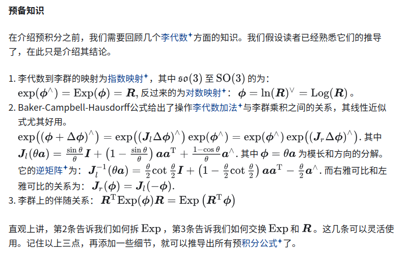

# 李群形式推导预积分

假设k=i帧的QVP分别是$R_i, v_i, p_i$,则可以利用从k=i到k=j-1帧的所有imu数据测量，直接更新得到k=j帧的$R_j, v_j, p_j$

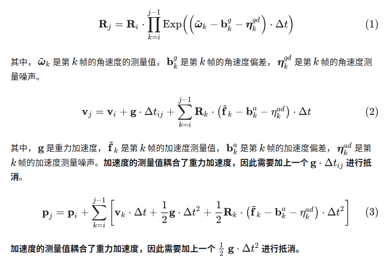

上述是传统的直接积分，缺点是若我们对i时刻的状态量$r v p$ bias优化,则i+1,i+2,...,j-1时刻的状态也会跟着变化，就需要重新计算积分

为了避免每次更新初始化的$R_I, v_i, p_i$都需要重新积分求解$R_j, v_j, p_j$，引出PVQ增量真值(相对运动量)

- 上述计算都与$R_i$取值无关，即使$R_i$改变与无需重新计算
- 若零偏变化则上述式子需要重新计算，引出下面优化计算的方法
- 预积分量并没有直接的物理含义。尽管符号上用了之类的样子，但它并不表示某两个速度或位置上的偏差。它只是如此定义而已。当然，从量纲上来说，应该与角度、速度、位移对应。

# 构建预积分测量模型

**预积分的测量值可由 IMU 的测量值积分得到**

预积分内部带有IMU的零偏量，因此不可避免地会依赖此时的零偏量估计。为了处理这种依赖，我们对预积分定义作一些工程上的调整

1. 首先认为i时刻的零偏是固定的，并且在整个预积分计算过程中也是固定的
2. 作出预积分对零偏量的一阶线性化模型，即，舍弃对零偏量的高阶项
3. 当零偏估计发生改变时，在原先预积分测量值的基础上使用线性模型进行修正得到新的预积分测量值

## 使PVQ增量测量值具有“测量值=真值+噪声”的形式

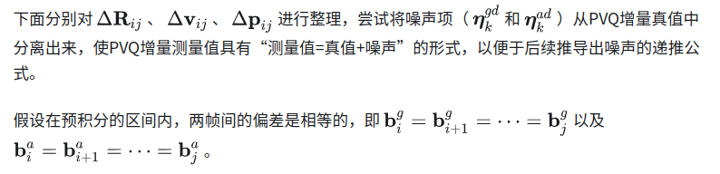

固定 i 时刻的零偏估计，来分析预积分的噪声。无论是图优化还是滤波器技术，都需要知道某个测量量究竟含有多大的噪声

旋转部分

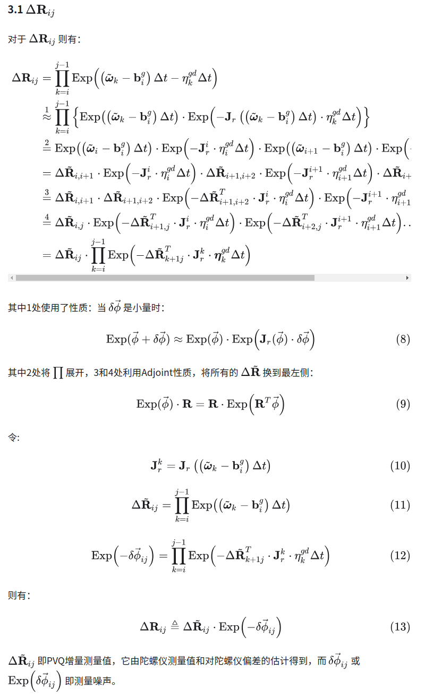

速度部分

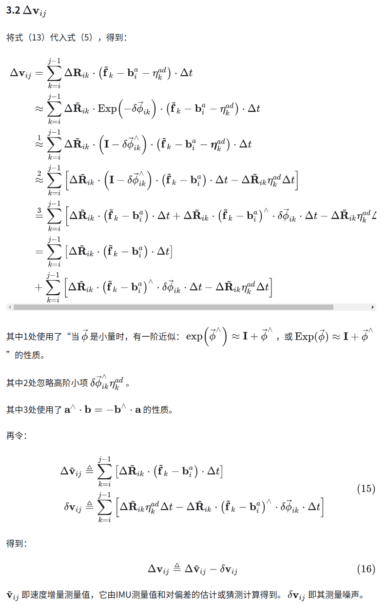

平移部分

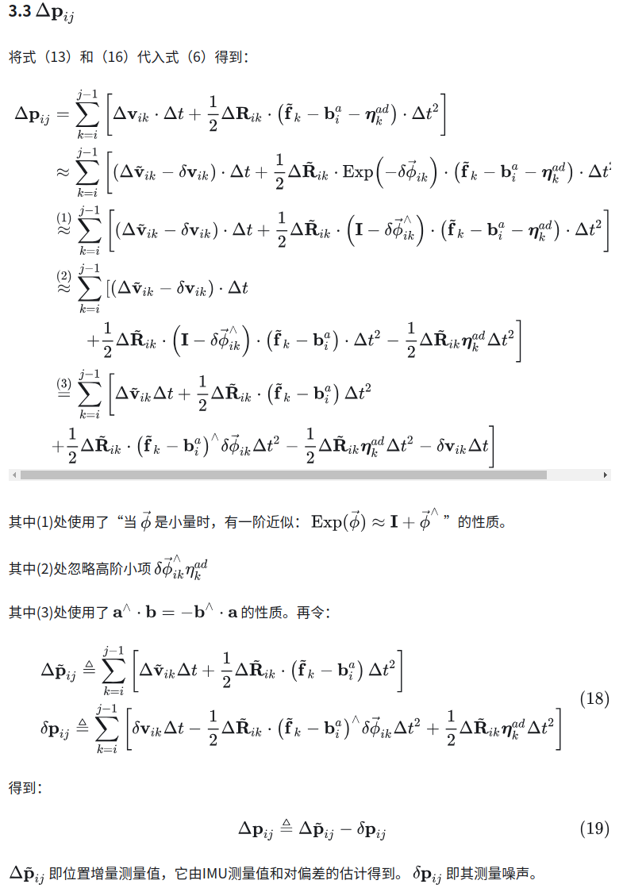

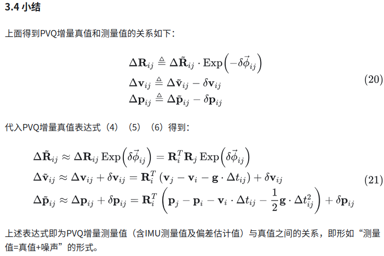

- 它的左侧是可以通过传感器数据积分得到的观测量，右侧是根据状态变量推断出来的预测值，再加上（或乘上）一个随机噪声
- 左侧$\Delta R_{ik}$可以通过IMU读数得到,$\Delta v_{ik}$可以由 k
 时刻IMU读数加上$\Delta R_{ik}$计算，$\Delta P_{ik}$又可以通过前两者计算结果得到
- 从右侧看来，也很容易根据 i和j时刻的状态变量来推测预测分观测量的大小,从而写出误差公式，形成最小二乘.但是现在的问题是：预积分的噪声是否符合零均值的高斯分布?如果是，它的协方差有多大？和IMU本身的噪声之间是什么关系？

## 预积分噪声模型与协方差矩阵

由于噪声项的定义比较复杂，我们将复杂的噪声项线性化，保留一阶项系数，然后推导线性模型下的协方差矩阵变化

旋转部分

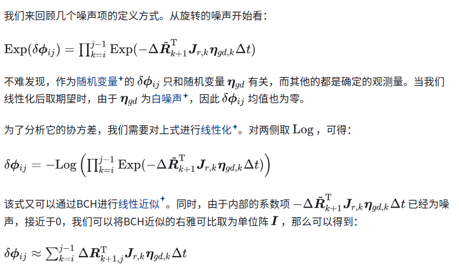

此式是高斯随机变量的线性组合，它的结果依然是高斯的。同时，由于预积分的累加特性，预测分观测量的噪声也会随着时间不断累加。我们可以这样提问：能否用第j-1时刻的噪声来计算第j时刻的噪声？如果可以，那么程序实现也会更加简单

递推形式

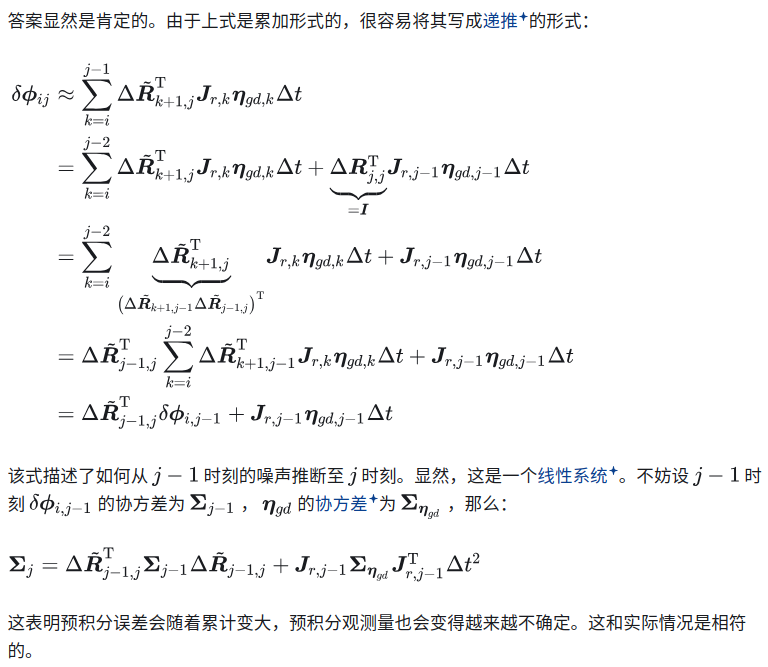

速度部分与平移部分

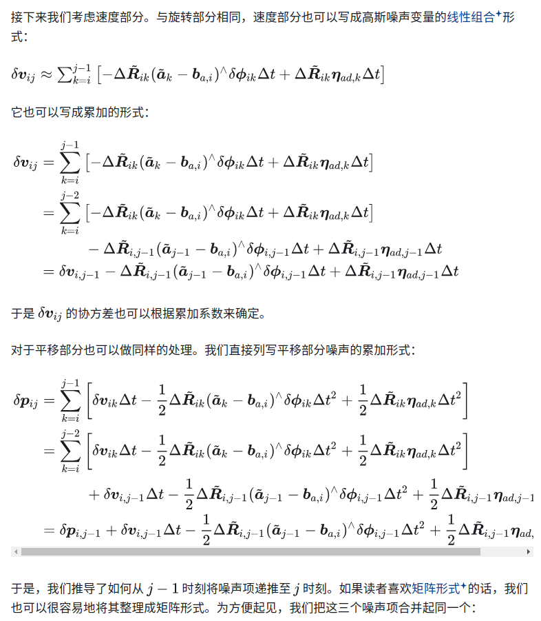

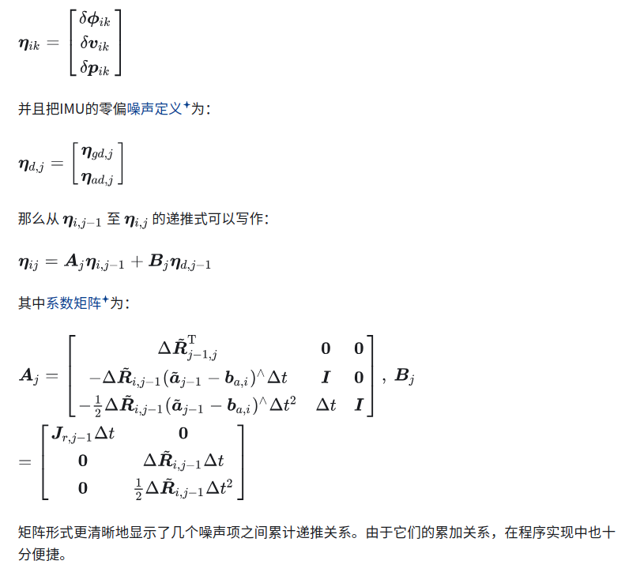

协方差递推计算

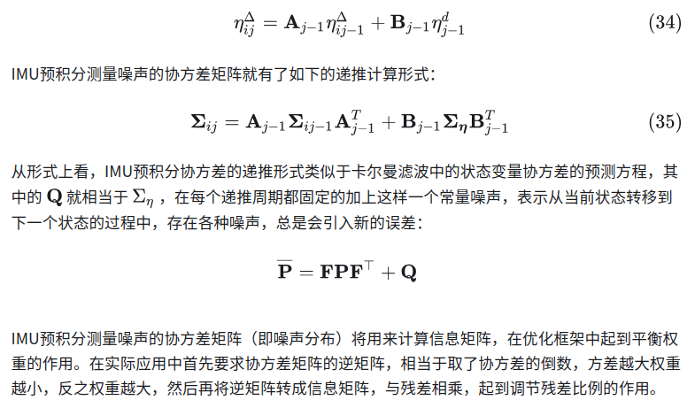

噪声协方差的逆矩阵对于MAP最大后验估计器有一个很强的影响，噪声协方差矩阵的逆可以被用于以下加权公式优化中的项

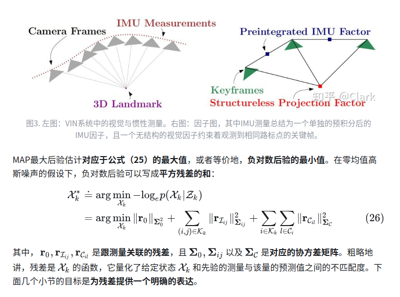

## 零偏更新时预积分测量值的更新

前面的预积分计算，都是在假设积分区间内陀螺和加计的偏差恒定的基础上推导的。当 bias 发生变化时，若仍按照前述公式，预积分测量值需要整个重新计算一遍，这将非常的耗费算力。为了解决这个问题，提出了利用线性化来进行偏差变化时预积分项的一阶近似更新方法。

一种讨巧的做法：假定预积分观测是随零偏线性变化的，虽然实际上并不是线性变化的，但我们总可以对一个复杂函数做线性化并保留一阶项,然后在原先的观测量上进行修正。具体来说，我们把预积分观测量看成$b_{g,i} b_{a,i}$的函数,那么当$b_{g,i} b_{a,i}$更新了$\delta b_{g,i} \delta b_{a,i}$之后，预积分观测应作以下修正

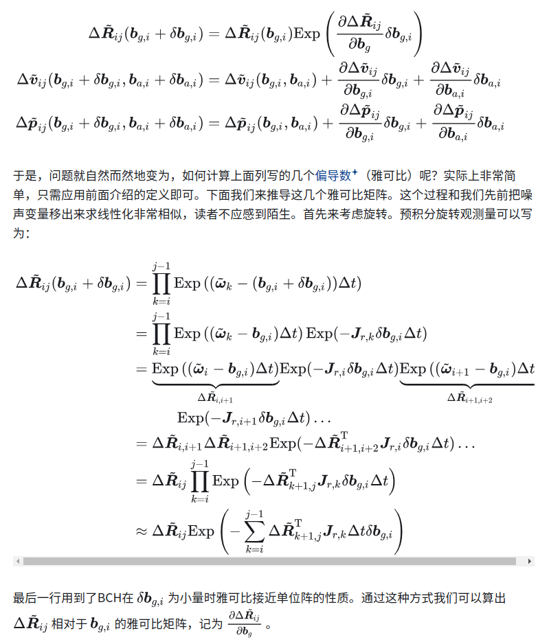

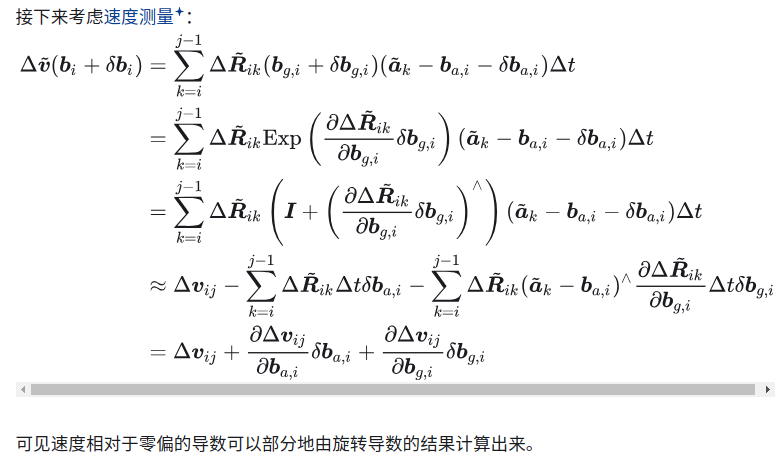

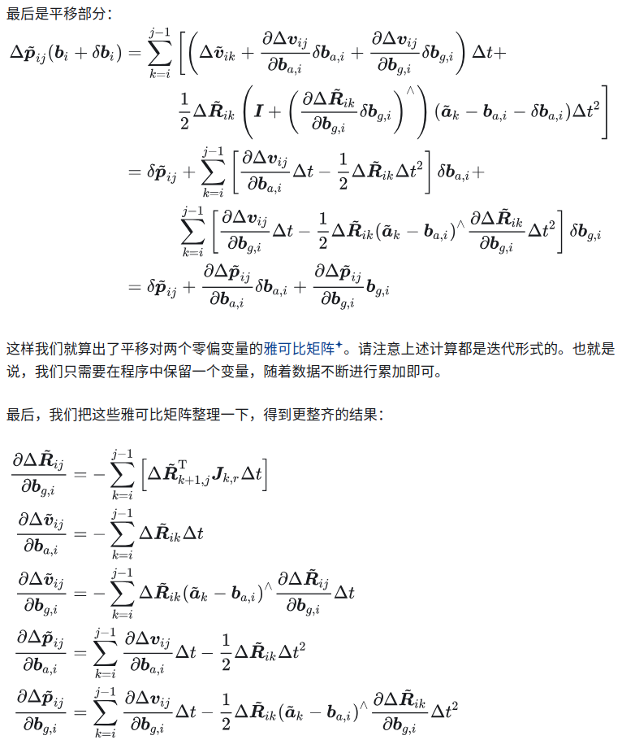

or

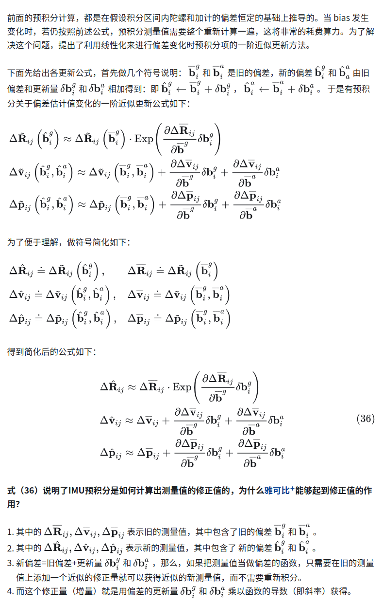

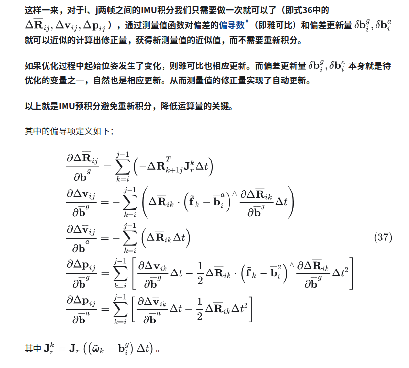

以上就是IMU预积分避免重新积分，降低运算量的关键

# 参考文章

- [IMU预积分的理解和推导](https://zhuanlan.zhihu.com/p/473227932)
- [简明预积分推导](https://zhuanlan.zhihu.com/p/388859808)
- [预积分Forster](https://zhuanlan.zhihu.com/p/635496502)
- [预积分学](https://blog.csdn.net/m0_49384824/article/details/145161364)
