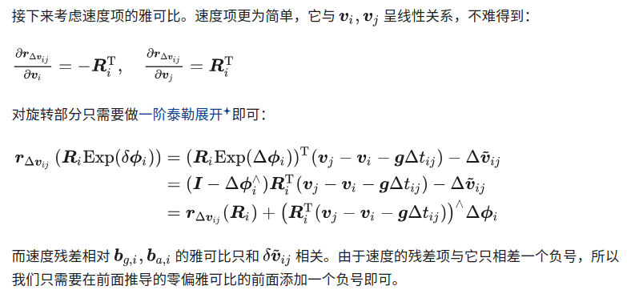
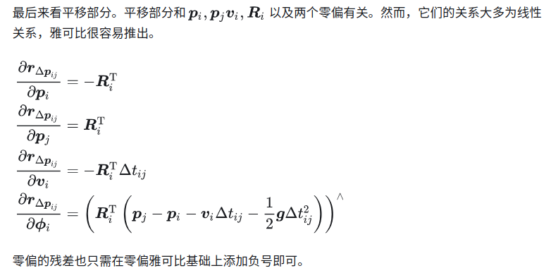

- [预积分模型归结至图优化](#预积分模型归结至图优化)
- [预积分的雅可比矩阵](#预积分的雅可比矩阵)
- [参考文章](#参考文章)

# 预积分模型归结至图优化

之前文档定义了预积分的测量模型，推导了它的噪声模型和协方差矩阵，并说明了随着零偏更新，预积分该怎么更新．事实上，我们已经可以把预积分观测作为图优化的因子（Factor）或者边（Edge）了

预积分模型构建了关键帧i到关键帧j之间的一种约束

or

# 预积分的雅可比矩阵

我们来讨论预积分相比于状态变量的雅可比矩阵。预积分测量已经归纳了IMU在短时间内的读数

至此，推导了预积分观测量对所有状态变量的导数形式　(高博太强了)

**为了确保残差朝着噪声分布的方向去优化，需要残差乘以噪声模型推导中获得的信息矩阵，以平衡权重**

# 参考文章

- [IMU预积分的理解和推导](https://zhuanlan.zhihu.com/p/473227932)
- [简明预积分推导](https://zhuanlan.zhihu.com/p/388859808)
- [预积分Forster](https://zhuanlan.zhihu.com/p/635496502)
