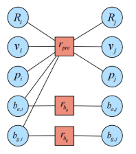
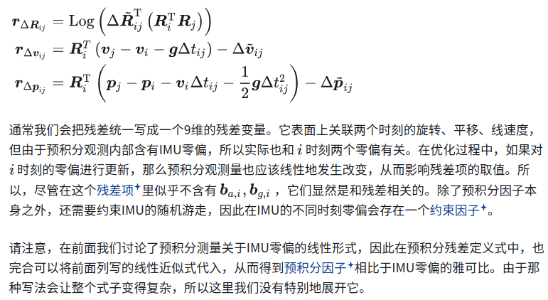
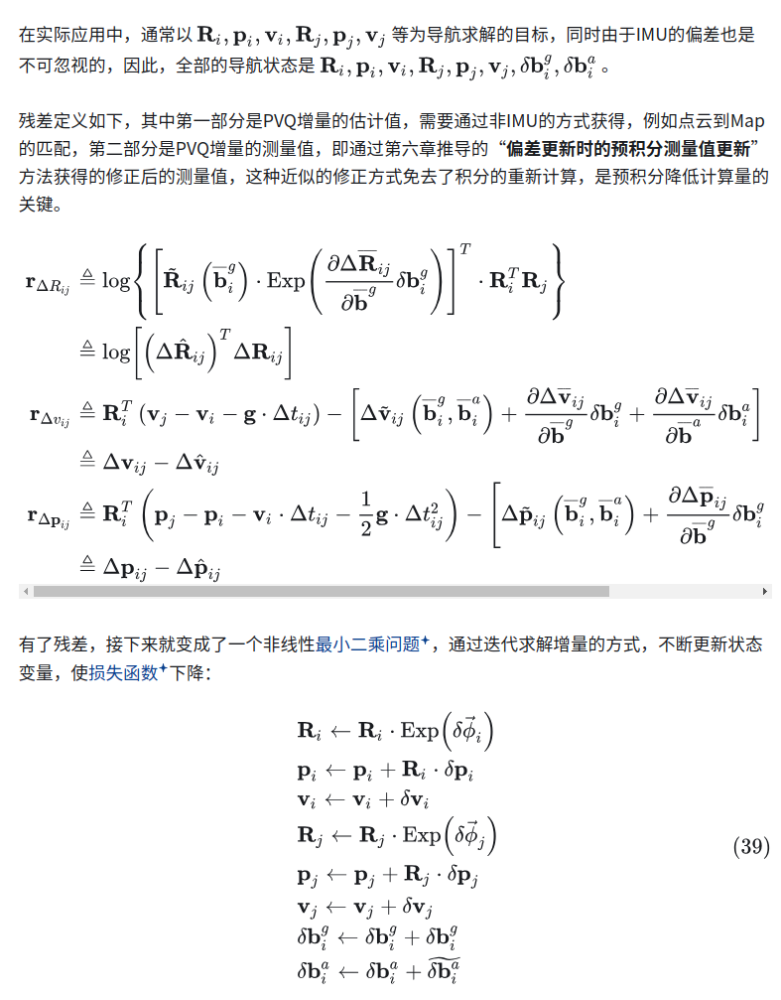
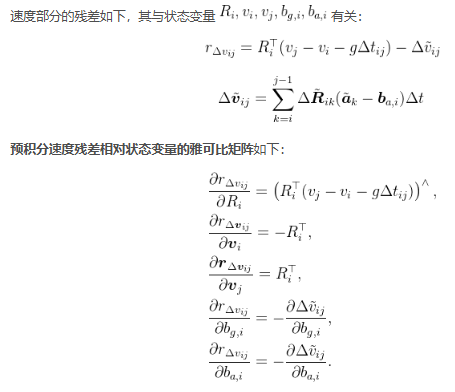
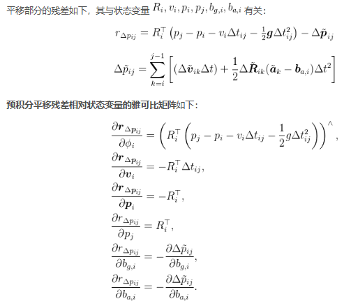
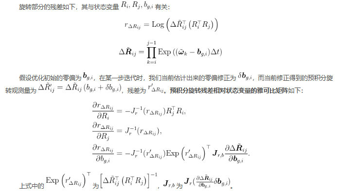
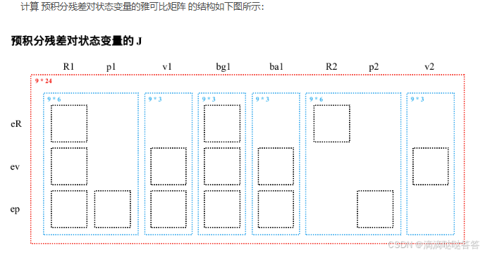

- [预积分模型归结至图优化](#预积分模型归结至图优化)
- [预积分的雅可比矩阵](#预积分的雅可比矩阵)
- [参考文章](#参考文章)

# 预积分模型归结至图优化

之前文档定义了预积分的测量模型，推导了它的噪声模型和协方差矩阵，并说明了随着零偏更新，预积分该怎么更新．事实上，我们已经可以把预积分观测作为图优化的因子（Factor）或者边（Edge）了

预积分模型构建了关键帧i到关键帧j之间的一种约束

- 用i时刻，j时刻的状态变量值与预积分观测值做差，得到残差的定义公式
- 残差表面上关联两个时刻的旋转，平移，线速度，但是由于预积分观测内部含有imu零偏，所以也和i时刻的两个零偏有关，在优化过程中如果对i时刻零偏进行更新，那么预积分观测量也应该线性发生改变，从而影响残差值，所以预积分因子需要约束imu的随机游走

or

# 预积分的雅可比矩阵

我们来讨论预积分相比于状态变量的雅可比矩阵。预积分测量已经归纳了IMU在短时间内的读数

旋转部分的残差与状态变量$R_i$ $R_j$ $b_{g,i}$有关

速度部分残差与状态变量$R_i$ $V_i$ $V_j$ $b_{g,i}$ $b_{a,i}$有关

平移部分残差与状态变量$R_i$ $V_i$ $P_i$ $P_j$ $b_{g,i}$ $b_{a,i}$有关

至此，推导了预积分观测量对所有状态变量的导数形式　(高博太强了)

**为了确保残差朝着噪声分布的方向去优化，需要残差乘以噪声模型推导中获得的信息矩阵，以平衡权重**

# 参考文章

- [IMU预积分的理解和推导](https://zhuanlan.zhihu.com/p/473227932)
- [简明预积分推导](https://zhuanlan.zhihu.com/p/388859808)
- [预积分Forster](https://zhuanlan.zhihu.com/p/635496502)
