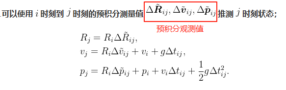
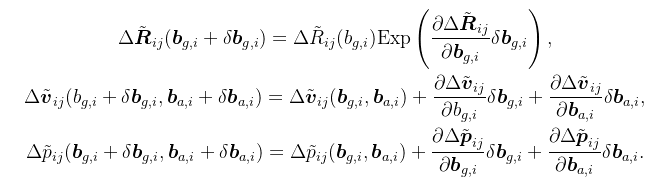
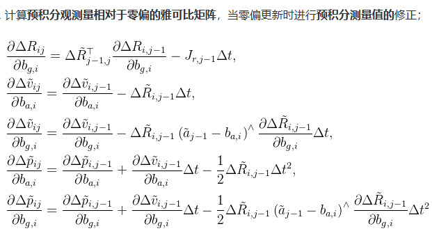
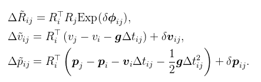
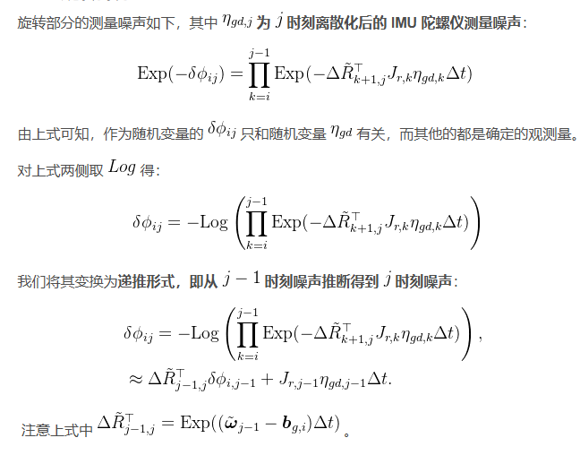
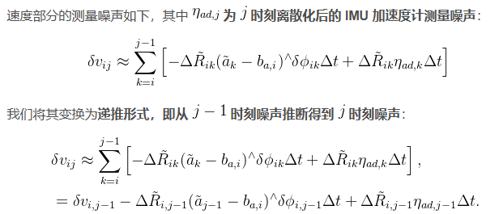
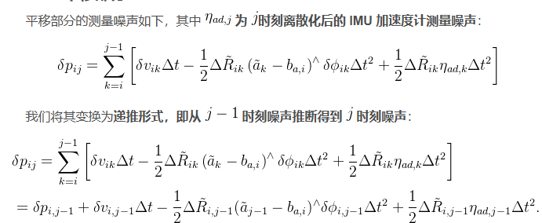
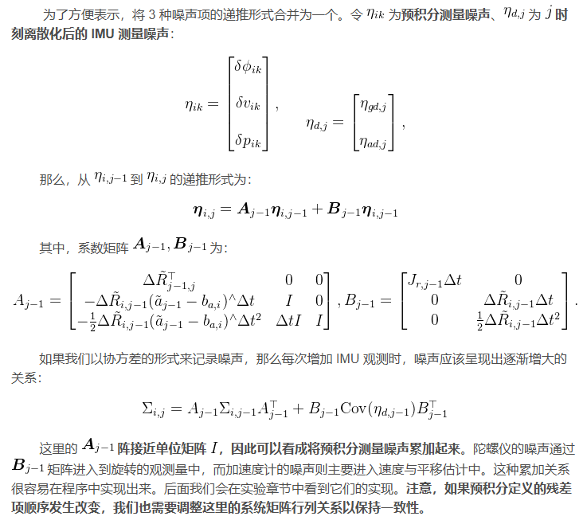
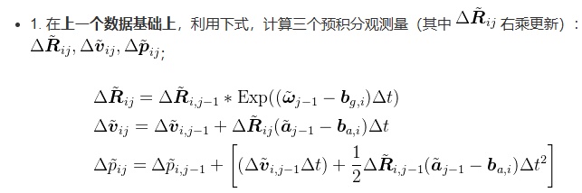

- [imu 预积分总结](#imu-预积分总结)
  - [使用i时刻到j时刻的预积分观测值推断j时刻状态](#使用i时刻到j时刻的预积分观测值推断j时刻状态)
  - [预积分噪声模型（使用j-1时刻的噪声计算j时刻的噪声）](#预积分噪声模型使用j-1时刻的噪声计算j时刻的噪声)
  - [计算预积分的观测值](#计算预积分的观测值)
  - [再从正向理一遍imu预积分过程](#再从正向理一遍imu预积分过程)
  - [reference](#reference)

# imu 预积分总结

这里按照自己的想法，用倒叙介绍imu预积分

书中imu预积分观测值与测量值意思一样，主要公式上标符号即可

## 使用i时刻到j时刻的预积分观测值推断j时刻状态

使用imu预积分是为了在状态量频繁更新时，减少重复积分的次数，目的是`使用i时刻到j时刻的预积分观测值推断j时刻状态`



接着采用一种取巧的方法，假定预积分的观测值是随着陀螺仪，加记零偏线性变化(线性化并保留一阶项)，那么当$b_{g,i}, b_{a,i}$更新了$\delta b_{g,i}, \delta b_{a,i}$ 预积分可以做如下修正



此时只要求的观测量相对零偏的偏导（先忽略噪声）就可以并入到上一节计算中



## 预积分噪声模型（使用j-1时刻的噪声计算j时刻的噪声）

这时候讨论预积分噪声模型与噪声协方差的递推，噪声项为j-1时刻 p v q 噪声与j时刻零偏噪声



旋转噪声



速度噪声模型



平移噪声模型



噪声项合并



这里我们完成了噪声项的递推与噪声项协方差矩阵的计算，再往回走就是计算预积分的观测值

## 计算预积分的观测值



## 再从正向理一遍imu预积分过程

1. 在上一个数据基础上，计算三个预积分观测量$\Delta R_{ij}, \Delta V_{ij}, \Delta P_{ij}$(这里要加上上标)

```cpp
  // 1. 更新位置和速度的测量值(也叫观测值)
  dp_ = dp_ + dv_ * dt + 0.5f * dR_.matrix() * acc * dt * dt;
  dv_ = dv_ + dR_ * acc * dt;
  // ...
  dR_ = dR_ * deltaR;            // (4.9)
```

2. 推算j时刻的噪声，计算p v r 三个噪声项的协方差矩阵，作为后续图优化的信息矩阵

```cpp
  // 运动方程雅可比矩阵系数，A,B阵，见(4.29)
  // 2. 预积分噪声模型
  // 噪声项的运动模型递推 A对应[theta, v, p] B对应[g, a]
  Eigen::Matrix<double, 9, 9> A;
  A.setIdentity();
  Eigen::Matrix<double, 9, 6> B;
  B.setZero();

  // NOTE A, B左上角块与公式稍有不同 另外两项在后面
  A.block<3, 3>(3, 0) = -dR_.matrix() * dt * acc_hat;
  A.block<3, 3>(6, 0) = -0.5f * dR_.matrix() * acc_hat * dt2;
  A.block<3, 3>(6, 3) = dt * Mat3d::Identity();

  B.block<3, 3>(3, 3) = dR_.matrix() * dt;
  B.block<3, 3>(6, 3) = 0.5f * dR_.matrix() * dt2;

  // 这里接着更新噪声模型递推
  A.block<3, 3>(0, 0) = deltaR.matrix().transpose();
  B.block<3, 3>(0, 0) = rightJ * dt;

  // 这里接着更新噪声模型递推
  A.block<3, 3>(0, 0) = deltaR.matrix().transpose();
  B.block<3, 3>(0, 0) = rightJ * dt;

  // 更新噪声项
  cov_ = A * cov_ * A.transpose() + B * noise_gyro_acce_ * B.transpose();

```

3. 计算预积分观测量相对于零偏的雅可比矩阵

```cpp
  // 更新各雅可比，见式(4.39)
  // 3. 更新观测量对零偏的各jacobian
  dP_dba_ = dP_dba_ + dV_dba_ * dt - 0.5f * dR_.matrix() * dt2; // (4.39d)
  dP_dbg_ = dP_dbg_ + dV_dbg_ * dt -
            0.5f * dR_.matrix() * dt2 * acc_hat * dR_dbg_;   // (4.39e)
  dV_dba_ = dV_dba_ - dR_.matrix() * dt;                     // (4.39b)
  dV_dbg_ = dV_dbg_ - dR_.matrix() * dt * acc_hat * dR_dbg_; // (4.39c)
  dR_dbg_ = deltaR.matrix().transpose() * dR_dbg_ - rightJ * dt; // (4.39a)
```

4. 使用i时刻到j时刻的预积分观测值推断j时刻状态

```cpp
SO3 IMUPreintegration::GetDeltaRotation(const Vec3d &bg) {
  return dR_ * SO3::exp(dR_dbg_ * (bg - bg_));
}

Vec3d IMUPreintegration::GetDeltaVelocity(const Vec3d &bg, const Vec3d &ba) {
  return dv_ + dV_dbg_ * (bg - bg_) + dV_dba_ * (ba - ba_);
}

Vec3d IMUPreintegration::GetDeltaPosition(const Vec3d &bg, const Vec3d &ba) {
  return dp_ + dP_dbg_ * (bg - bg_) + dP_dba_ * (ba - ba_);
}
```

## reference

- [高翔 svd imu 预积分](https://blog.csdn.net/m0_49384824/article/details/145161364)
