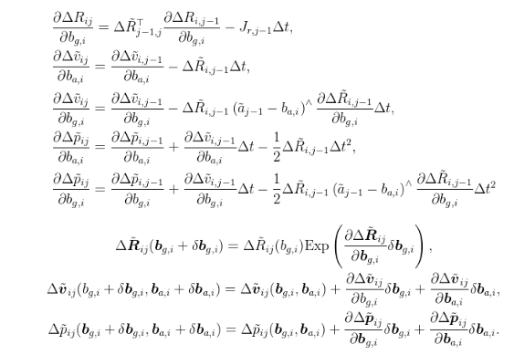

- [预积分流程](#预积分流程)
- [预积分实现](#预积分实现)
  - [预积分类设计](#预积分类设计)
  - [imu预积分流程](#imu预积分流程)
- [reference](#reference)

# 预积分流程

默认已阅读 `imu_preintegration_1` `imu_preintegration_2` `imu_preintegration_3`

- 在一个关键帧组成的系统中，我们可以从任意一个时刻的关键帧出发开始预积分，并且在任一时刻停止预积分过程
- 之后，我们可以把预积分的观测量、噪声以及各种累计雅可比取出来，用于约束两个关键帧的状态

在开始预积分之后，当$j-1$时刻一个新的imu数据到来时，应该完成以下任务

1. 计算预积分观测量


2. 计算三个噪声的协方差矩阵，作为后续图优化的信息矩阵


3. 计算预积分观测量相对于零偏的雅可比矩阵，当零偏更新时进行预积分测量值的修正



4. 增量积分时间$\Delta t_{ij}$

5. 可以使用i时刻到j时刻的预积分观测值推断j时刻状态


# 预积分实现

## 预积分类设计

一个预积分应该存储以下数据

- 预积分观测量
- 预积分开始时imu的零偏
- 在积分期间的测量噪声
- 各积分量对imu零偏的jacobian矩阵
- 整个积分时间$\Delta t_{ij}$

```cpp
/**
 * IMU 预积分器
 *
 * 调用Integrate来插入新的IMU读数，然后通过Get函数得到预积分的值
 * 雅可比也可以通过本类获得，可用于构建g2o的边类
 */
class IMUPreintegration {
   public:
    EIGEN_MAKE_ALIGNED_OPERATOR_NEW
    /// 参数配置项
    /// 初始的零偏需要设置，其他可以不改
    struct Options {
        Options() {}
        Vec3d init_bg_ = Vec3d::Zero();  // 初始零偏
        Vec3d init_ba_ = Vec3d::Zero();  // 初始零偏
        double noise_gyro_ = 1e-2;       // 陀螺噪声，标准差
        double noise_acce_ = 1e-1;       // 加计噪声，标准差
    };
 
 
   public:
    double dt_ = 0;                          // 整体预积分时间
    Mat9d cov_ = Mat9d::Zero();              // 累计噪声矩阵
    Mat6d noise_gyro_acce_ = Mat6d::Zero();  // 测量噪声矩阵(这里不是零偏噪声)
 
    // 零偏
    Vec3d bg_ = Vec3d::Zero();
    Vec3d ba_ = Vec3d::Zero();
 
    // 预积分观测量
    SO3 dR_;
    Vec3d dv_ = Vec3d::Zero();
    Vec3d dp_ = Vec3d::Zero();
 
    // 雅可比矩阵
    Mat3d dR_dbg_ = Mat3d::Zero();
    Mat3d dV_dbg_ = Mat3d::Zero();
    Mat3d dV_dba_ = Mat3d::Zero();
    Mat3d dP_dbg_ = Mat3d::Zero();
    Mat3d dP_dba_ = Mat3d::Zero();
};
```

注意 IMU 零偏相关的噪声项并不直接和预积分类有关，我们将它们挪到优化类当中

## imu预积分流程

单个 IMU 的积分函数实现如下

```cpp
void IMUPreintegration::Integrate(const IMU &imu, double dt) {
    // 去掉零偏的测量
    Vec3d gyr = imu.gyro_ - bg_;  // 陀螺
    Vec3d acc = imu.acce_ - ba_;  // 加计
 
    // 更新dv, dp, 见p105 (4.9), (4.13), (4.16) 
    // 等号右侧 dp_ dv_ dr_ 为 i 时刻预积分观测量， 等号左侧 dp_ dv_ dr_ 为 j 时刻预积分观测量
    Vec3d omega = gyr * dt;         // 转动量
    SO3 deltaR = SO3::exp(omega);   // exp后
    
    // 1. 固定零偏（去掉零偏影响）,计算预积分测量值
    SO3 new_dR = dR_ * deltaR;
    Vec3d new_dv = dv_ + dR_ * acc * dt;
    Vec3d new_dp = dp_ + dv_ * dt + 0.5f * dR_.matrix() * acc * dt * dt;
 
    Mat3d rightJ = SO3::jr(omega);  // 右雅可比
    Mat3d acc_hat = SO3::hat(acc);
    double dt2 = dt * dt;
 
    // 2. 计算噪声模型（pvq观测噪声与两个零偏噪声）与噪声协方差矩阵的递推线性模型
    // 运动方程雅可比矩阵系数，A,B阵，见p108 (4.29)
    Eigen::Matrix<double, 9, 9> A;
    A.setIdentity();
    Eigen::Matrix<double, 9, 6> B;
    B.setZero();
 
    A.block<3, 3>(0, 0) = deltaR.matrix().transpose(); // 
    A.block<3, 3>(3, 0) = -dR_.matrix() * dt * acc_hat;
    A.block<3, 3>(6, 0) = -0.5f * dR_.matrix() * acc_hat * dt2;
    A.block<3, 3>(6, 3) = dt * Mat3d::Identity();
 
    B.block<3, 3>(0, 0) = rightJ * dt;
    B.block<3, 3>(3, 3) = dR_.matrix() * dt;
    B.block<3, 3>(6, 3) = 0.5f * dR_.matrix() * dt2;
 
    // 更新噪声项
    cov_ = A * cov_ * A.transpose() + B * noise_gyro_acce_ * B.transpose();  
 
    // 3. 计算预积分观测值对两个零偏的偏导
    // 更新各雅可比，见式p111 (4.39)
    dR_dbg_ = deltaR.matrix().transpose() * dR_dbg_ - rightJ * dt;                     // p111 (4.39a)
    dV_dba_ = dV_dba_ - dR_.matrix() * dt;                                             // (4.39b)
    dV_dbg_ = dV_dbg_ - dR_.matrix() * dt * acc_hat * dR_dbg_;                         // (4.39c)
    dP_dba_ = dP_dba_ + dV_dba_ * dt - 0.5f * dR_.matrix() * dt2;                      // (4.39d)
    dP_dbg_ = dP_dbg_ + dV_dbg_ * dt - 0.5f * dR_.matrix() * dt2 * acc_hat * dR_dbg_;  // (4.39e)
 
    // 更新预积分测量值
    dR_ = new_dR; 
    dv_ = new_dv; 
    dp_ = new_dp;  
 
    // my 增量积分时间
    dt_ += dt;
}
```

注意：如果不进行优化，预积分和直接积分的效果是完全一致的，都是将 IMU 的数据积分起来
在预积分之后，我们也可以像 ESKF 一样，从起始状态向最终状态进行预测。预测函数实现是非常简单的：

```cpp
NavStated IMUPreintegration::Predict(const sad::NavStated &start, const Vec3d &grav) const {
    // grav 存在默认值
    // std::cout << "grav: " << grav.transpose() << std::endl;
    // p105 (4.18) 变形版， 忽略噪声后 i 时刻状态和 j 时刻状态的关系式, 这里的 dt_ 是整体预积分时间
    SO3 Rj = start.R_ * dR_;
    Vec3d vj = start.R_ * dv_ + start.v_ + grav * dt_;
    // pj 有点问题
    Vec3d pj = start.R_ * dp_ + start.p_ + start.v_ * dt_ + 0.5f * grav * dt_ * dt_;
 
    auto state = NavStated(start.timestamp_ + dt_, Rj, pj, vj);
    state.bg_ = bg_;
    state.ba_ = ba_;
    return state;
}
```

与 ESKF 不同的是：

- 预积分可以对多个 IMU 数据进行预测，可以从任意起始时刻向后预测
- ESKF 通常只在当前状态下，针对单个 IMU 数据，向下一个时刻预测

# reference

- [预积分学](https://blog.csdn.net/m0_49384824/article/details/145161364)
