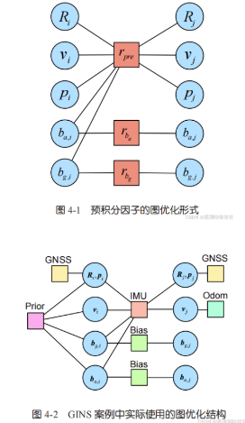
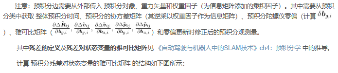
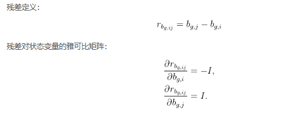
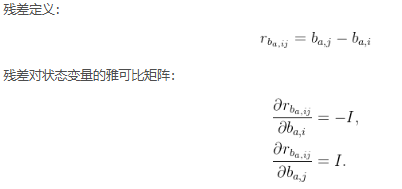
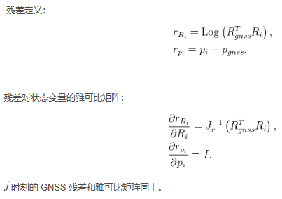
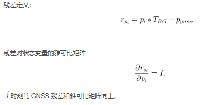
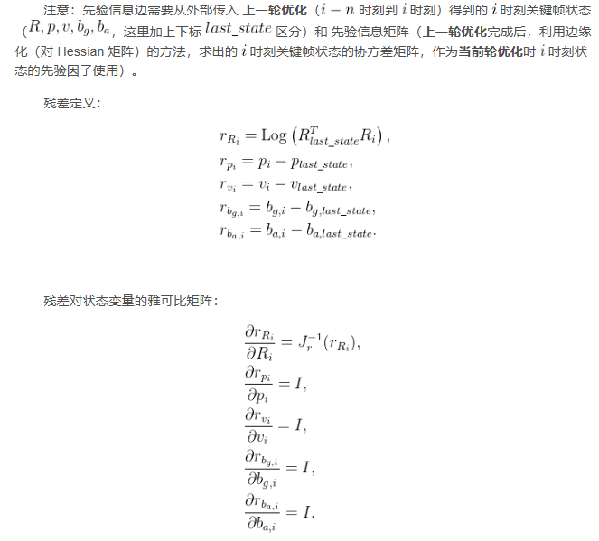

- [基于预积分和图优化的 GINS](#基于预积分和图优化的-gins)
  - [旋转在前平移在后的位姿顶点](#旋转在前平移在后的位姿顶点)
  - [速度顶点](#速度顶点)
  - [陀螺仪与加速度计零偏顶点](#陀螺仪与加速度计零偏顶点)
- [预积分的图优化边](#预积分的图优化边)
  - [预积分边](#预积分边)
  - [零偏随机游走边（3维双元边）](#零偏随机游走边3维双元边)
    - [陀螺仪随机游走边](#陀螺仪随机游走边)
    - [加速度计随机游走边](#加速度计随机游走边)
  - [gnss观测边（单边）](#gnss观测边单边)
    - [双天线方案(6维 旋转,平移)](#双天线方案6维-旋转平移)
    - [单天线方案(3维 平移)](#单天线方案3维-平移)
  - [先验因子边(15维多元边)](#先验因子边15维多元边)
  - [轮速记边(3维单元边)](#轮速记边3维单元边)
- [reference](#reference)

# 基于预积分和图优化的 GINS

使用以下形式预积分顶点



顶点分为位姿，速度，陀螺仪零偏，加计零偏四种顶点

## 旋转在前平移在后的位姿顶点

位姿顶点的顺序为旋转在前，平移在后，雅可比矩阵的顺序要与之对应

```cpp
/**
 * 旋转在前，平移在后的的SO3+t类型pose，6自由度，存储时伪装为g2o::VertexSE3，供g2o_viewer查看
 */
class VertexPose : public g2o::BaseVertex<6, SE3> {
   public:
    EIGEN_MAKE_ALIGNED_OPERATOR_NEW
    VertexPose() {}
 
    // 读写函数是为了保存顶点信息到 .g2o 文件中的，该文件可使用 g2o_viewer 可视化
    bool read(std::istream& is) override {
        double data[7];
        for (int i = 0; i < 7; i++) {
            is >> data[i];
        }
        setEstimate(SE3(Quatd(data[6], data[3], data[4], data[5]), Vec3d(data[0], data[1], data[2])));
        return true;
    }
 
    bool write(std::ostream& os) const override {
        os << "VERTEX_SE3:QUAT ";
        os << id() << " ";
        Quatd q = _estimate.unit_quaternion();
        os << _estimate.translation().transpose() << " ";
        os << q.coeffs()[0] << " " << q.coeffs()[1] << " " << q.coeffs()[2] << " " << q.coeffs()[3] << std::endl;
        return true;
    }
 
    // 重置。这里未实现该函数的功能
    virtual void setToOriginImpl() {}
 
    // 更新
    virtual void oplusImpl(const double* update_) {
        // Eigen::Map<const Vec3d>(&update_[0]) ：使用 &update_[0] 获取指向数组中第 1 个元素的地址，从该地址开始，将 update_ 数组连续的 3 个元素映射为一个 Eigen::Vector3d 对象
        // Eigen::Map<const Vec3d>(&update_[3]) ：使用 &update_[3] 获取指向数组中第 4 个元素的地址，从该地址开始，将 update_ 数组连续的 3 个元素映射为一个 Eigen::Vector3d 对象
        // Eigen::Map: 这是一个模板类，用于将现有的内存块映射为 Eigen 对象。这种映射是零开销的，因为它不会复制数据，而是直接使用提供的内存。
        _estimate.so3() = _estimate.so3() * SO3::exp(Eigen::Map<const Vec3d>(&update_[0]));  // 旋转部分，右乘更新
        _estimate.translation() += Eigen::Map<const Vec3d>(&update_[3]);                     // 平移部分
        updateCache();
    }
};
```

## 速度顶点

```cpp
/**
 * 速度顶点，单纯的Vec3d
 */
class VertexVelocity : public g2o::BaseVertex<3, Vec3d> {
   public:
    EIGEN_MAKE_ALIGNED_OPERATOR_NEW
    VertexVelocity() {}
 
    virtual bool read(std::istream& is) { return false; }
    virtual bool write(std::ostream& os) const { return false; }
 
    virtual void setToOriginImpl() { _estimate.setZero(); }
 
    virtual void oplusImpl(const double* update_) { _estimate += Eigen::Map<const Vec3d>(update_); }
};
```

## 陀螺仪与加速度计零偏顶点

```cpp
/**
 * 陀螺零偏顶点，亦为Vec3d，从速度顶点继承
 */
class VertexGyroBias : public VertexVelocity {
   public:
    EIGEN_MAKE_ALIGNED_OPERATOR_NEW
    VertexGyroBias() {}
};
 
/**
 * 加计零偏顶点，Vec3d，亦从速度顶点继承
 */
class VertexAccBias : public VertexVelocity {
   public:
    EIGEN_MAKE_ALIGNED_OPERATOR_NEW
    VertexAccBias() {}
};
```

# 预积分的图优化边

在基于预积分和图优化的 GINS 系统中，边主要有以下几种

1. 预积分的边，约束上衣时刻的１５维状态（p v q b_a b_g）与下一时刻的p v q
2. 零偏随机游走的边，共两种，连接两个时刻的零偏状态
3. GNSS 的观测边。因为我们使用六自由度观测，所以它关联单个时刻的位姿
4. 先验信息，刻画上一时刻的状态分布，关联下一时刻的 15 维状态
5. 轮速计的观测边。关联上一时刻的速度顶点

## 预积分边

注意：预积分边需要从外部传入 预积分对象、重力矢量和权重因子（为信息矩阵添加的乘积因子）




```cpp
/// 与预积分相关的vertex, edge
/**
 * 预积分边（多元边）
 * 连接6个顶点：上一帧的pose, v, bg, ba，下一帧的pose, v
 * 观测量为9维，即预积分残差, 顺序：R, v, p
 * information从预积分类中获取，构造函数中计算
 * 旋转在前，平移在后
 */
class EdgeInertial : public g2o::BaseMultiEdge<9, Vec9d> {
   public:
    EIGEN_MAKE_ALIGNED_OPERATOR_NEW
 
    /**
     * 构造函数中需要指定预积分类对象
     * @param preinteg  预积分对象指针
     * @param gravity   重力矢量
     * @param weight    权重。为信息矩阵添加的乘积因子
     */
    EdgeInertial(std::shared_ptr<IMUPreintegration> preinteg, const Vec3d& gravity, double weight = 1.0);
 
    bool read(std::istream& is) override { return false; }
    bool write(std::ostream& os) const override { return false; }
 
    // 计算边的误差，即预积分残差
    void computeError() override;
    // 计算雅可比矩阵
    void linearizeOplus() override;
 
    // 计算 Hessian 矩阵
    Eigen::Matrix<double, 24, 24> GetHessian() {
        linearizeOplus();
        Eigen::Matrix<double, 9, 24> J;
        // 对应上图六部分
        J.block<9, 6>(0, 0) = _jacobianOplus[0];
        J.block<9, 3>(0, 6) = _jacobianOplus[1];
        J.block<9, 3>(0, 9) = _jacobianOplus[2];
        J.block<9, 3>(0, 12) = _jacobianOplus[3];
        J.block<9, 6>(0, 15) = _jacobianOplus[4];
        J.block<9, 3>(0, 21) = _jacobianOplus[5];
        // 乘以信息矩阵反映全找嗯
        return J.transpose() * information() * J;
    }
 
   private:
    const double dt_;
    std::shared_ptr<IMUPreintegration> preint_ = nullptr;
    Vec3d grav_;
};
```

```cpp
EdgeInertial::EdgeInertial(std::shared_ptr<IMUPreintegration> preinteg, const Vec3d& gravity, double weight)
    : preint_(preinteg), dt_(preinteg->dt_) {
    resize(6);  // 6个关联顶点
    grav_ = gravity;
    setInformation(preinteg->cov_.inverse() * weight);
}
 
void EdgeInertial::computeError() {
    auto* p1 = dynamic_cast<const VertexPose*>(_vertices[0]);
    auto* v1 = dynamic_cast<const VertexVelocity*>(_vertices[1]);
    auto* bg1 = dynamic_cast<const VertexGyroBias*>(_vertices[2]);
    auto* ba1 = dynamic_cast<const VertexAccBias*>(_vertices[3]);
    auto* p2 = dynamic_cast<const VertexPose*>(_vertices[4]);
    auto* v2 = dynamic_cast<const VertexVelocity*>(_vertices[5]);
 
    Vec3d bg = bg1->estimate();
    Vec3d ba = ba1->estimate();
 
    // 零偏的更新（假设预积分的测量值是随零偏线性变化的，当零偏更新时，在原先预积分测量值的基础上进行修正得到新的预积分测量值）
    const SO3 dR = preint_->GetDeltaRotation(bg);
    const Vec3d dv = preint_->GetDeltaVelocity(bg, ba);
    const Vec3d dp = preint_->GetDeltaPosition(bg, ba);
 
    /// 预积分误差项 p112 （4.41）
    // 预积分残差项
    const Vec3d er = (dR.inverse() * p1->estimate().so3().inverse() * p2->estimate().so3()).log();
    Mat3d RiT = p1->estimate().so3().inverse().matrix();
    const Vec3d ev = RiT * (v2->estimate() - v1->estimate() - grav_ * dt_) - dv;
    const Vec3d ep = RiT * (p2->estimate().translation() - p1->estimate().translation() - v1->estimate() * dt_ -
                            grav_ * dt_ * dt_ / 2) -
                     dp;
    _error << er, ev, ep;
}
 
void EdgeInertial::linearizeOplus() {
    // 在 setVertex() 函数中设置 void setVertex(size_t i, Vertex* v) {_vertices[i]=v;}
    // 顺序为 v0_pose、v0_vel、v0_bg、v0_ba、v1_pose、v1_vel（这里体现了 旋转在前，平移在后）
    auto* p1 = dynamic_cast<const VertexPose*>(_vertices[0]);
    auto* v1 = dynamic_cast<const VertexVelocity*>(_vertices[1]);
    auto* bg1 = dynamic_cast<const VertexGyroBias*>(_vertices[2]);
    auto* ba1 = dynamic_cast<const VertexAccBias*>(_vertices[3]);
    auto* p2 = dynamic_cast<const VertexPose*>(_vertices[4]);
    auto* v2 = dynamic_cast<const VertexVelocity*>(_vertices[5]);
 
    Vec3d bg = bg1->estimate();
    Vec3d ba = ba1->estimate();
    Vec3d dbg = bg - preint_->bg_;
 
    // 一些中间符号
    const SO3 R1 = p1->estimate().so3();
    const SO3 R1T = R1.inverse();
    const SO3 R2 = p2->estimate().so3();
 
    auto dR_dbg = preint_->dR_dbg_;
    auto dv_dbg = preint_->dV_dbg_;
    auto dp_dbg = preint_->dP_dbg_;
    auto dv_dba = preint_->dV_dba_;
    auto dp_dba = preint_->dP_dba_;
 
    // 估计值
    Vec3d vi = v1->estimate();
    Vec3d vj = v2->estimate();
    Vec3d pi = p1->estimate().translation();
    Vec3d pj = p2->estimate().translation();
 
    const SO3 dR = preint_->GetDeltaRotation(bg);
    const SO3 eR = SO3(dR).inverse() * R1T * R2;
    const Vec3d er = eR.log();
    // 修复 bug 
    const Mat3d invJr = SO3::jr_inv(er);
 
    /// 雅可比矩阵
    /// 注意有3个index, 顶点的，自己误差的，顶点内部变量的
    /// 变量顺序：pose1(R1,p1), v1, bg1, ba1, pose2(R2,p2), v2
    /// 残差顺序：eR, ev, ep，残差顺序为行(row)，变量顺序为列(col)
 
    //       | R1 | p1 | v1 | bg1 | ba1 | R2 | p2 | v2 |
    //  vert | 0       | 1  | 2   | 3   | 4       | 5  |
    //  col  | 0    3  | 0  | 0   | 0   | 0    3  | 0  |
    //    row
    //  eR 0 |
    //  ev 3 |
    //  ep 6 |
 
    /// 残差对R1, 9x3
    _jacobianOplus[0].setZero();
    // dR/dR1, p113 (4.42)
    _jacobianOplus[0].block<3, 3>(0, 0) = -invJr * (R2.inverse() * R1).matrix();
    // dv/dR1, p115 (4.47)
    _jacobianOplus[0].block<3, 3>(3, 0) = SO3::hat(R1T * (vj - vi - grav_ * dt_));
    // dp/dR1, p115 (4.48d）
    _jacobianOplus[0].block<3, 3>(6, 0) = SO3::hat(R1T * (pj - pi - vi * dt_ - 0.5 * grav_ * dt_ * dt_));
 
    /// 残差对p1, 9x3
    // dp/dp1, p115 (4.48a)
    _jacobianOplus[0].block<3, 3>(6, 3) = -R1T.matrix();
 
    /// 残差对v1, 9x3
    _jacobianOplus[1].setZero();
    // dv/dv1, p114 (4.46a)
    _jacobianOplus[1].block<3, 3>(3, 0) = -R1T.matrix();
    // dp/dv1, p115 (4.48c)
    _jacobianOplus[1].block<3, 3>(6, 0) = -R1T.matrix() * dt_;
 
    /// 残差对bg1
    _jacobianOplus[2].setZero();
    // dR/dbg1, p114 (4.45)
    _jacobianOplus[2].block<3, 3>(0, 0) = -invJr * eR.inverse().matrix() * SO3::jr((dR_dbg * dbg).eval()) * dR_dbg;
    // dv/dbg1  p111 (4.38)前添加负号
    _jacobianOplus[2].block<3, 3>(3, 0) = -dv_dbg;
    // dp/dbg1  p111 (4.38)前添加负号
    _jacobianOplus[2].block<3, 3>(6, 0) = -dp_dbg;
 
    /// 残差对ba1
    _jacobianOplus[3].setZero();
    // dv/dba1  p111 (4.38)前添加负号
    _jacobianOplus[3].block<3, 3>(3, 0) = -dv_dba;
    // dp/dba1  p111 (4.38)前添加负号
    _jacobianOplus[3].block<3, 3>(6, 0) = -dp_dba;
 
    /// 残差对pose2
    _jacobianOplus[4].setZero();
    // dr/dr2, p114 (4.43)
    _jacobianOplus[4].block<3, 3>(0, 0) = invJr;
    // dp/dp2, p115 (4.48b)
    _jacobianOplus[4].block<3, 3>(6, 3) = R1T.matrix();
 
    /// 残差对v2
    _jacobianOplus[5].setZero();
    // dv/dv2, p114 (4,46b)
    _jacobianOplus[5].block<3, 3>(3, 0) = R1T.matrix();  // OK
}
```

## 零偏随机游走边（3维双元边）

### 陀螺仪随机游走边



```cpp
/**
 * 陀螺仪随机游走边（双元边）
 */
class EdgeGyroRW : public g2o::BaseBinaryEdge<3, Vec3d, VertexGyroBias, VertexGyroBias> {
   public:
    EIGEN_MAKE_ALIGNED_OPERATOR_NEW
 
    EdgeGyroRW() {}
 
    virtual bool read(std::istream& is) { return false; }
    virtual bool write(std::ostream& os) const { return false; }
 
    void computeError() {
        // 在 setVertex() 函数中设置 void setVertex(size_t i, Vertex* v) {_vertices[i]=v;}
        // 顺序为 v0_bg、v1_bg
        const auto* VG1 = dynamic_cast<const VertexGyroBias*>(_vertices[0]);
        const auto* VG2 = dynamic_cast<const VertexGyroBias*>(_vertices[1]);
        _error = VG2->estimate() - VG1->estimate();
    }
 
    virtual void linearizeOplus() {
        // 残差对 bg1, 3x3
        _jacobianOplusXi = -Mat3d::Identity();
        // 残差对 bg2, 3x3
        _jacobianOplusXj.setIdentity();
    }
 
    Eigen::Matrix<double, 6, 6> GetHessian() {
        linearizeOplus();
        Eigen::Matrix<double, 3, 6> J;
        J.block<3, 3>(0, 0) = _jacobianOplusXi;
        J.block<3, 3>(0, 3) = _jacobianOplusXj;
        return J.transpose() * information() * J;
    }
};
```

### 加速度计随机游走边



```cpp
/**
 * 加速度计随机游走边（双元边）
 */
class EdgeAccRW : public g2o::BaseBinaryEdge<3, Vec3d, VertexAccBias, VertexAccBias> {
   public:
    EIGEN_MAKE_ALIGNED_OPERATOR_NEW
 
    EdgeAccRW() {}
 
    virtual bool read(std::istream& is) { return false; }
    virtual bool write(std::ostream& os) const { return false; }
 
    void computeError() {
        // 在 setVertex() 函数中设置 void setVertex(size_t i, Vertex* v) {_vertices[i]=v;}
        // 顺序为 v0_ba、v1_ba
        const auto* VA1 = dynamic_cast<const VertexAccBias*>(_vertices[0]);
        const auto* VA2 = dynamic_cast<const VertexAccBias*>(_vertices[1]);
        _error = VA2->estimate() - VA1->estimate();
    }
 
    virtual void linearizeOplus() {
        // 残差对 ba1, 3x3
        _jacobianOplusXi = -Mat3d::Identity();
        // 残差对 ba2, 3x3
        _jacobianOplusXj.setIdentity();
    }
 
    Eigen::Matrix<double, 6, 6> GetHessian() {
        linearizeOplus();
        Eigen::Matrix<double, 3, 6> J;
        J.block<3, 3>(0, 0) = _jacobianOplusXi;
        J.block<3, 3>(0, 3) = _jacobianOplusXj;
        return J.transpose() * information() * J;
    }
};
```

## gnss观测边（单边）

GNSS 方案分为双天线方案和单天线方案

### 双天线方案(6维 旋转,平移)

注意：双天线 GNSS 边需要从外部传入 GNSS 测量值($T_{WB}$)



```cpp
/**
 * 6 自由度的GNSS
 * 误差的旋转在前，平移在后
 */
class EdgeGNSS : public g2o::BaseUnaryEdge<6, SE3, VertexPose> {
   public:
    EIGEN_MAKE_ALIGNED_OPERATOR_NEW;
    EdgeGNSS() = default;
    EdgeGNSS(VertexPose* v, const SE3& obs) {
        setVertex(0, v);
        setMeasurement(obs);
    }
    // 这里使用的是 bag包或者 .txt数据，其中的 GNSS 数据已经被转换到车体坐标系下了，是直接对 R,p 的观测
    void computeError() override {
        // 在 setVertex() 函数中设置 void setVertex(size_t i, Vertex* v) {_vertices[i]=v;}
        // 顺序为 p_gnss_0 或者 p_gnss_1
        VertexPose* v = (VertexPose*)_vertices[0];
        _error.head<3>() = (_measurement.so3().inverse() * v->estimate().so3()).log();
        _error.tail<3>() = v->estimate().translation() - _measurement.translation();
    };
 
    void linearizeOplus() override {
        VertexPose* v = (VertexPose*)_vertices[0];
        // jacobian 6x6
        _jacobianOplusXi.setZero();
        _jacobianOplusXi.block<3, 3>(0, 0) = (_measurement.so3().inverse() * v->estimate().so3()).jr_inv();  // dR/dR
        _jacobianOplusXi.block<3, 3>(3, 3) = Mat3d::Identity();                                              // dp/dp
    }
 
    Mat6d GetHessian() {
        linearizeOplus();
        return _jacobianOplusXi.transpose() * information() * _jacobianOplusXi;
    }
 
    virtual bool read(std::istream& in) { return true; }
    virtual bool write(std::ostream& out) const { return true; }
 
   private:
};
```

### 单天线方案(3维 平移)

注意：单天线 GNSS 边需要从外部传入 传感器外参($T_BG$)和gnss测量值（此时是$T_WG$而不是双天线的$T_{WB}$）



```cpp
/**
 * 只有平移的GNSS
 * 此时需要提供RTK外参 TBG，才能正确施加约束
 */
class EdgeGNSSTransOnly : public g2o::BaseUnaryEdge<3, Vec3d, VertexPose> {
   public:
    EIGEN_MAKE_ALIGNED_OPERATOR_NEW;
 
    /**
     * 指定位姿顶点、RTK观测 t_WG、外参TGB
     * @param v
     * @param obs
     */
    EdgeGNSSTransOnly(VertexPose* v, const Vec3d& obs, const SE3& TBG) : TBG_(TBG) {
        setVertex(0, v);
        setMeasurement(obs);
    }
 
    void computeError() override {
        // 在 setVertex() 函数中设置 void setVertex(size_t i, Vertex* v) {_vertices[i]=v;}
        // 顺序为 p_gnss_0 或者 p_gnss_1
        VertexPose* v = (VertexPose*)_vertices[0];
        // RTK 读数为 T_WG
        _error = (v->estimate() * TBG_).translation() - _measurement;
    };
 
    // 可以由用户提供雅可比矩阵的解析解；或者省略 linearizeOplus() 函数使用 g2o 默认的数值方式自动计算雅可比矩阵的数值解，但效率较低并且可能会引入误差
    // void linearizeOplus() override {
    //     VertexPose* v = (VertexPose*)_vertices[0];
    //     // jacobian 6x6
    //     _jacobianOplusXi.setZero();
    //     _jacobianOplusXi.block<3, 3>(0, 0) = (_measurement.so3().inverse() * v->estimate().so3()).jr_inv();  // dR/dR
    //     _jacobianOplusXi.block<3, 3>(3, 3) = Mat3d::Identity();                                              // dp/dp
    // }
 
    virtual bool read(std::istream& in) { return true; }
    virtual bool write(std::ostream& out) const { return true; }
 
   private:
    SE3 TBG_;
};
```

## 先验因子边(15维多元边)



```cpp
/**
 * 先验信息边（多元变）
 * 对上一帧IMU pvq bias的先验
 * info 由外部指定，通过时间窗口边缘化给出
 *
 * 顶点顺序：pose, v, bg, ba
 * 残差顺序：R, p, v, bg, ba，15维
 * 残差的旋转在前，平移在后
 */
class EdgePriorPoseNavState : public g2o::BaseMultiEdge<15, Vec15d> {
   public:
    EIGEN_MAKE_ALIGNED_OPERATOR_NEW
    EdgePriorPoseNavState(const NavStated& state, const Mat15d& info);
 
    virtual bool read(std::istream& is) { return false; }
    virtual bool write(std::ostream& os) const { return false; }
 
    void computeError();
    virtual void linearizeOplus();
 
    Eigen::Matrix<double, 15, 15> GetHessian() {
        linearizeOplus();
        Eigen::Matrix<double, 15, 15> J;
        J.block<15, 6>(0, 0) = _jacobianOplus[0];
        J.block<15, 3>(0, 6) = _jacobianOplus[1];
        J.block<15, 3>(0, 9) = _jacobianOplus[2];
        J.block<15, 3>(0, 12) = _jacobianOplus[3];
        return J.transpose() * information() * J;
    }
 
    NavStated state_;
};
```

```cpp
EdgePriorPoseNavState::EdgePriorPoseNavState(const NavStated& state, const Mat15d& info) {
    resize(4);
    state_ = state;
    setInformation(info);
}
 
void EdgePriorPoseNavState::computeError() {
    // 在 setVertex() 函数中设置 void setVertex(size_t i, Vertex* v) {_vertices[i]=v;}
    // 顺序为 v0_pose、v0_vel、v0_bg、v0_ba
    auto* vp = dynamic_cast<const VertexPose*>(_vertices[0]);
    auto* vv = dynamic_cast<const VertexVelocity*>(_vertices[1]);
    auto* vg = dynamic_cast<const VertexGyroBias*>(_vertices[2]);
    auto* va = dynamic_cast<const VertexAccBias*>(_vertices[3]);
 
    const Vec3d er = SO3(state_.R_.matrix().transpose() * vp->estimate().so3().matrix()).log();
    const Vec3d ep = vp->estimate().translation() - state_.p_;
    const Vec3d ev = vv->estimate() - state_.v_;
    const Vec3d ebg = vg->estimate() - state_.bg_;
    const Vec3d eba = va->estimate() - state_.ba_;
 
    _error << er, ep, ev, ebg, eba;
}
 
void EdgePriorPoseNavState::linearizeOplus() {
    const auto* vp = dynamic_cast<const VertexPose*>(_vertices[0]);
    const Vec3d er = SO3(state_.R_.matrix().transpose() * vp->estimate().so3().matrix()).log();
 
    //       | R1 | p1 | v1 | bg1 | ba1 |
    //  vert | 0       | 1  | 2   | 3   |
    //  col  | 0    3  | 0  | 0   | 0   |
    //    row
    //  eR 0 |
    //  ep 3 |
    //  ev 6 |
    // ebg 9 |
    // eba 12|
 
    /// 注意有3个index, 顶点的，自己误差的，顶点内部变量的
    _jacobianOplus[0].setZero();
    _jacobianOplus[0].block<3, 3>(0, 0) = SO3::jr_inv(er);    // dr/dr
    _jacobianOplus[0].block<3, 3>(3, 3) = Mat3d::Identity();  // dp/dp
    _jacobianOplus[1].setZero();
    _jacobianOplus[1].block<3, 3>(6, 0) = Mat3d::Identity();  // dv/dv
    _jacobianOplus[2].setZero();
    _jacobianOplus[2].block<3, 3>(9, 0) = Mat3d::Identity();  // dbg/dbg
    _jacobianOplus[3].setZero();
    _jacobianOplus[3].block<3, 3>(12, 0) = Mat3d::Identity();  // dba/dba
}
```

## 轮速记边(3维单元边)


```cpp
/**
 * 3维 轮速计观测边
 * 轮速观测世界速度在自车坐标系下矢量, 3维情况下假设自车不会有y和z方向速度
 */
class EdgeEncoder3D : public g2o::BaseUnaryEdge<3, Vec3d, VertexVelocity> {
   public:
    EIGEN_MAKE_ALIGNED_OPERATOR_NEW;
    EdgeEncoder3D() = default;
 
    /**
     * 构造函数需要知道世界系下速度
     * @param v0
     * @param speed
     */
    EdgeEncoder3D(VertexVelocity* v0, const Vec3d& speed) {
        setVertex(0, v0);
        setMeasurement(speed);
    }
 
    void computeError() override {
        VertexVelocity* v0 = (VertexVelocity*)_vertices[0];
        _error = v0->estimate() - _measurement;
    }
 
    void linearizeOplus() override { _jacobianOplusXi.setIdentity(); }
 
    virtual bool read(std::istream& in) { return true; }
    virtual bool write(std::ostream& out) const { return true; }
};
```

# reference

- [基于预积分和图优化的 GINS](https://blog.csdn.net/m0_49384824/article/details/145193351)
