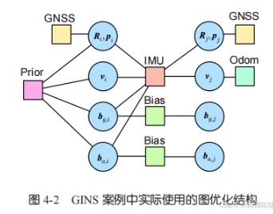
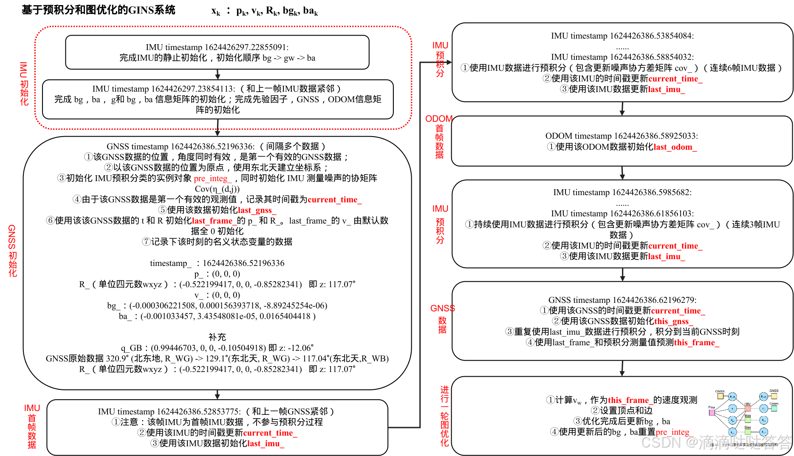

- [实现基于预积分和图优化的 GINS](#实现基于预积分和图优化的-gins)
- [代码实现](#代码实现)
  - [IMU 静止初始化](#imu-静止初始化)
  - [初始化各类信息矩阵](#初始化各类信息矩阵)
  - [当 IMU 数据到达时，使用预积分器来累计 IMU 的积分信息](#当-imu-数据到达时使用预积分器来累计-imu-的积分信息)
  - [odom数据到达时, 将它记录为最近时刻的速度观测并保留它的读数](#odom数据到达时-将它记录为最近时刻的速度观测并保留它的读数)
  - [在 GNSS 数据到达时，先使用 last\_imu\_ 数据预积分到 GNSS 时刻](#在-gnss-数据到达时先使用-last_imu_-数据预积分到-gnss-时刻)
  - [使用 IMU 预积分的预测值来作为优化的初始值](#使用-imu-预积分的预测值来作为优化的初始值)
- [图优化和 ESKF 的区别](#图优化和-eskf-的区别)
- [总结](#总结)
- [reference](#reference)

# 实现基于预积分和图优化的 GINS

- 利用前面定义的图优化顶点和边，来实现一个类似于 ESKF 的 GNSS 惯导融合定位
- 也可借这个实验来更深入地考察图优化与滤波器之间的异同
- 这个基于图优化的 GINS 系统逻辑和 ESKF 大体相同，一样需要静态的 IMU 初始化来确定初始的 IMU 零偏与重力方向,
  - 我们把这些逻辑处理放到一个单独的类中，重点关注这个图优化模型是如何构建的。它的基本逻辑如下：

1. 使用imu静止初始化获取初始零偏$b_a, b_g$和它们的初始协方差矩阵和重力方向,随后初始化各类信息矩阵($b_g, b_a, gnss, odom, 先验因子的信息矩阵$),然后使用首个带位姿的gnss数据来获取初始位姿与姿态，初始速度为0,初始的零偏等于预积分类中的零偏，即imu静止初始化得到的零偏，如果 IMU 和 GNSS 都有效，就开始进行预测和优化过程
2. 当 IMU 数据到达时，使用预积分器来累计 IMU 的积分信息
3. 当 ODOM 数据到达时，我们将它记录为最近时刻的速度观测并保留它的读数
4. 在 GNSS 数据到达时，先使用 last_imu_ 数据预积分到 GNSS 时刻
5. 使用 IMU 预积分的预测值来作为优化的初始值(j时刻优化的初始值代码中为`this_frame_`),构建前一个时刻的 GNSS 与当前时刻的 GNSS 间的图优化问题，当然也可以用 GNSS 的观测值来计算，两种方式的优化初值会不太一样，但在本例中结果相似。该问题的节点和边定义如下：

- 节点: 前一时刻与当前时刻的位姿、速度、两个零偏，共 8 个顶点
- 边: 两个时刻间的预积分观测边，两个时刻的 GNSS 的观测边，前一个时刻的先验边，两个零偏随机游走边，速度观测边。这样一共有 7 个边



# 代码实现

使用imu静止初始化获取初始零偏$b_a, b_g$和它们的初始协方差矩阵和重力方向,随后初始化各类信息矩阵($b_g, b_a, gnss, odom, 先验因子的信息矩阵$),然后使用首个带位姿的gnss数据来获取初始位姿与姿态，初始速度为0,初始的零偏等于预积分类中的零偏，即imu静止初始化得到的零偏，如果 IMU 和 GNSS 都有效，就开始进行预测和优化过程

## IMU 静止初始化

```cpp
run_gins_pre_integ.cc 主函数
 
          /// IMU 处理函数
          // IMU 静止初始化
          if (!imu_init.InitSuccess()) {
              imu_init.AddIMU(imu);
              return;
          }
```

## 初始化各类信息矩阵

IMU 静止初始化完成后 ，使用静止初始化得到的$b_a, b_g, g$初始化预积分类的$b_a, b_g, g$, 然后初始化各类信息矩阵($b_g, b_a, gnss, odom, 先验因子的信息矩阵$)

```cpp
run_gins_pre_integ.cc 主函数
         
          /// 需要IMU初始化
          if (!imu_inited) {
              // 读取初始零偏，设置GINS
              sad::GinsPreInteg::Options options;
              options.preinteg_options_.init_bg_ = imu_init.GetInitBg();
              options.preinteg_options_.init_ba_ = imu_init.GetInitBa();
              options.gravity_ = imu_init.GetGravity();
              gins.SetOptions(options);
              imu_inited = true;
              std::cout << "imu_inited = true" <<std::endl;
              std::cout << "imu time:" << std::fixed << std::setprecision(8) << imu.timestamp_ << std::endl;
              return;
          }
```

初始化各类信息矩阵($b_g, b_a, gnss, odom, 先验因子的信息矩阵$)，其中预积分边的信息矩阵由预积分类中的协方差矩阵之逆初始化

```cpp
void GinsPreInteg::SetOptions(sad::GinsPreInteg::Options options) {
    options_ = options;
 
    // 设置 bg 的信息矩阵
    double bg_rw2 = 1.0 / (options_.bias_gyro_var_ * options_.bias_gyro_var_);
    options_.bg_rw_info_.diagonal() << bg_rw2, bg_rw2, bg_rw2;
 
    // 设置 ba 的信息矩阵
    double ba_rw2 = 1.0 / (options_.bias_acce_var_ * options_.bias_acce_var_);
    options_.ba_rw_info_.diagonal() << ba_rw2, ba_rw2, ba_rw2;
 
    // 设置 GNSS 的信息矩阵
    double gp2 = options_.gnss_pos_noise_ * options_.gnss_pos_noise_;
    double gh2 = options_.gnss_height_noise_ * options_.gnss_height_noise_;
    double ga2 = options_.gnss_ang_noise_ * options_.gnss_ang_noise_;
 
    options_.gnss_info_.diagonal() << 1.0 / ga2, 1.0 / ga2, 1.0 / ga2, 1.0 / gp2, 1.0 / gp2, 1.0 / gh2;
 
    // 初始化 IMU预积分类 的 实例对象
    pre_integ_ = std::make_shared<IMUPreintegration>(options_.preinteg_options_);
 
    // 设置 ODOM 的信息矩阵
    double o2 = 1.0 / (options_.odom_var_ * options_.odom_var_);
    options_.odom_info_.diagonal() << o2, o2, o2;
 
    // 先验因子的信息矩阵
    prior_info_.block<6, 6>(9, 9) = Mat6d ::Identity() * 1e6;
 
    if (this_frame_) {
        this_frame_->bg_ = options_.preinteg_options_.init_bg_;
        this_frame_->ba_ = options_.preinteg_options_.init_ba_;
    }
}
```

当首个带姿态的 GNSS 数据到来时，使用该数据初始化初始位姿，初始速度为 0，初始的零偏等于预积分类中的零偏，即 IMU 静止初始化得到的零偏

```cpp
void GinsPreInteg::AddGnss(const GNSS& gnss) {
    this_frame_ = std::make_shared<NavStated>(current_time_);
    this_gnss_ = gnss;
 
    if (!first_gnss_received_) {
        if (!gnss.heading_valid_) {
            // 要求首个GNSS必须有航向
            return;
        }
 
        std::cout << "first gnss time:" << std::fixed << std::setprecision(8) << gnss.unix_time_ << std::endl;
        // 首个gnss信号，将初始pose设置为该gnss信号
        this_frame_->timestamp_ = gnss.unix_time_;
        this_frame_->p_ = gnss.utm_pose_.translation();
        this_frame_->R_ = gnss.utm_pose_.so3();
        this_frame_->v_.setZero();
        this_frame_->bg_ = options_.preinteg_options_.init_bg_;
        this_frame_->ba_ = options_.preinteg_options_.init_ba_;
 
        pre_integ_ = std::make_shared<IMUPreintegration>(options_.preinteg_options_);
 
        last_frame_ = this_frame_;
        last_gnss_ = this_gnss_;
        first_gnss_received_ = true;
        current_time_ = gnss.unix_time_;
        return;
    }
 
    //* 省略 *// 
}
```

## 当 IMU 数据到达时，使用预积分器来累计 IMU 的积分信息

```cpp
void GinsPreInteg::AddImu(const IMU& imu) {
    if (first_gnss_received_ && first_imu_received_) {
        std::cout << "---IMU 预积分" << std::endl;
        pre_integ_->Integrate(imu, imu.timestamp_ - last_imu_.timestamp_);
    }
 
    first_imu_received_ = true;
    last_imu_ = imu;
    current_time_ = imu.timestamp_;
}
```

## odom数据到达时, 将它记录为最近时刻的速度观测并保留它的读数

```cpp
void GinsPreInteg::AddOdom(const sad::Odom& odom) {
    last_odom_ = odom;
    last_odom_set_ = true;
}
```

## 在 GNSS 数据到达时，先使用 last_imu_ 数据预积分到 GNSS 时刻

这里 last_imu_ 比较特殊，该数据使用了两次，这是第二次使用（第一次是前面的预积分），使用该数据预积分到当前 GNSS 的时刻

```cpp
void GinsPreInteg::AddGnss(const GNSS& gnss) {
    this_frame_ = std::make_shared<NavStated>(current_time_);
    this_gnss_ = gnss;
 
    //* 省略 *//
 
    // 积分到GNSS时刻
    // 这部分为什么可以积分到GNSS时刻 ???
    // 这个特殊的 last_imu_ 数据使用了两次，这是第二次使用（第一次是前面的预积分）。预积分到当前GNSS的时刻
    pre_integ_->Integrate(last_imu_, gnss.unix_time_ - current_time_);
 
    current_time_ = gnss.unix_time_;
    // last_frame_ 和 this_frame_，使用 IMU 预积分的预测值来作为优化的初始值（this_frame_）
    *this_frame_ = pre_integ_->Predict(*last_frame_, options_.gravity_);
 
    Optimize();
 
    last_frame_ = this_frame_;
    last_gnss_ = this_gnss_;
}
```

## 使用 IMU 预积分的预测值来作为优化的初始值

使用 IMU 预积分的预测值来作为优化的初始值(j时刻优化的初始值代码中为`this_frame_`),构建前一个时刻的 GNSS 与当前时刻的 GNSS 间的图优化问题

注意：

1. 优化完成后将优化后的值重新赋值给 last_frame_ 和 this_frame_，并且使用优化后的$b_a, b_g$重置预积分实例对象
2. 这里没有先验因子的信息矩阵进行更新处理，(TODO: 后续会探究先验因子信息矩阵的设置及更新)

```cpp
void GinsPreInteg::Optimize() {
    if (pre_integ_->dt_ < 1e-3) {
        // 未得到积分
        return;
    }
 
    // 创建可变尺寸的 BlockSolver
    using BlockSolverType = g2o::BlockSolverX;
    using LinearSolverType = g2o::LinearSolverEigen<BlockSolverType::PoseMatrixType>;
 
    auto* solver = new g2o::OptimizationAlgorithmLevenberg(
        g2o::make_unique<BlockSolverType>(g2o::make_unique<LinearSolverType>()));
    g2o::SparseOptimizer optimizer;
    optimizer.setAlgorithm(solver);
 
    // 上时刻顶点， pose, v, bg, ba
    auto v0_pose = new VertexPose();
    v0_pose->setId(0);
    v0_pose->setEstimate(last_frame_->GetSE3());
    optimizer.addVertex(v0_pose);
 
    auto v0_vel = new VertexVelocity();
    v0_vel->setId(1);
    v0_vel->setEstimate(last_frame_->v_);
    optimizer.addVertex(v0_vel);
 
    auto v0_bg = new VertexGyroBias();
    v0_bg->setId(2);
    v0_bg->setEstimate(last_frame_->bg_);
    optimizer.addVertex(v0_bg);
 
    auto v0_ba = new VertexAccBias();
    v0_ba->setId(3);
    v0_ba->setEstimate(last_frame_->ba_);
    optimizer.addVertex(v0_ba);
 
    // 本时刻顶点，pose, v, bg, ba
    // this_frame_ 是从 起始点last_frame_ 开始通过 IMU预积分 得到的预测值，在这里作为图优化的初始值。
    auto v1_pose = new VertexPose();
    v1_pose->setId(4);
    v1_pose->setEstimate(this_frame_->GetSE3());
    optimizer.addVertex(v1_pose);
 
    auto v1_vel = new VertexVelocity();
    v1_vel->setId(5);
    v1_vel->setEstimate(this_frame_->v_);
    optimizer.addVertex(v1_vel);
 
    auto v1_bg = new VertexGyroBias();
    v1_bg->setId(6);
    v1_bg->setEstimate(this_frame_->bg_);
    optimizer.addVertex(v1_bg);
 
    auto v1_ba = new VertexAccBias();
    v1_ba->setId(7);
    v1_ba->setEstimate(this_frame_->ba_);
    optimizer.addVertex(v1_ba);
 
    // 预积分边
    auto edge_inertial = new EdgeInertial(pre_integ_, options_.gravity_);
    edge_inertial->setVertex(0, v0_pose);
    edge_inertial->setVertex(1, v0_vel);
    edge_inertial->setVertex(2, v0_bg);
    edge_inertial->setVertex(3, v0_ba);
    edge_inertial->setVertex(4, v1_pose);
    edge_inertial->setVertex(5, v1_vel);
    auto* rk = new g2o::RobustKernelHuber();
    rk->setDelta(200.0);
    edge_inertial->setRobustKernel(rk);
    optimizer.addEdge(edge_inertial);
 
    // 两个零偏随机游走
    auto* edge_gyro_rw = new EdgeGyroRW();
    edge_gyro_rw->setVertex(0, v0_bg);
    edge_gyro_rw->setVertex(1, v1_bg);
    edge_gyro_rw->setInformation(options_.bg_rw_info_);
    optimizer.addEdge(edge_gyro_rw);
 
    auto* edge_acc_rw = new EdgeAccRW();
    edge_acc_rw->setVertex(0, v0_ba);
    edge_acc_rw->setVertex(1, v1_ba);
    edge_acc_rw->setInformation(options_.ba_rw_info_);
    optimizer.addEdge(edge_acc_rw);
 
    // 上时刻先验
    auto* edge_prior = new EdgePriorPoseNavState(*last_frame_, prior_info_);
    edge_prior->setVertex(0, v0_pose);
    edge_prior->setVertex(1, v0_vel);
    edge_prior->setVertex(2, v0_bg);
    edge_prior->setVertex(3, v0_ba);
    optimizer.addEdge(edge_prior);
 
    // GNSS边
    auto edge_gnss0 = new EdgeGNSS(v0_pose, last_gnss_.utm_pose_);
    edge_gnss0->setInformation(options_.gnss_info_);
    optimizer.addEdge(edge_gnss0);
 
    auto edge_gnss1 = new EdgeGNSS(v1_pose, this_gnss_.utm_pose_);
    edge_gnss1->setInformation(options_.gnss_info_);
    optimizer.addEdge(edge_gnss1);
 
    // Odom边
    EdgeEncoder3D* edge_odom = nullptr;
    Vec3d vel_world = Vec3d::Zero();
    Vec3d vel_odom = Vec3d::Zero();
    if (last_odom_set_) {
        // velocity obs
        double velo_l =
            options_.wheel_radius_ * last_odom_.left_pulse_ / options_.circle_pulse_ * 2 * M_PI / options_.odom_span_;
        double velo_r =
            options_.wheel_radius_ * last_odom_.right_pulse_ / options_.circle_pulse_ * 2 * M_PI / options_.odom_span_;
        double average_vel = 0.5 * (velo_l + velo_r);
        vel_odom = Vec3d(average_vel, 0.0, 0.0);
        vel_world = this_frame_->R_ * vel_odom;
 
        edge_odom = new EdgeEncoder3D(v1_vel, vel_world);
        edge_odom->setInformation(options_.odom_info_);
        optimizer.addEdge(edge_odom);
 
        // 重置odom数据到达标志位，等待最新的odom数据
        last_odom_set_ = false;
    }
 
    optimizer.setVerbose(options_.verbose_);
    optimizer.initializeOptimization();
    optimizer.optimize(20);
 
    if (options_.verbose_) {
        // 获取结果，统计各类误差
        LOG(INFO) << "chi2/error: ";
        LOG(INFO) << "preintegration: " << edge_inertial->chi2() << "/" << edge_inertial->error().transpose();
        // LOG(INFO) << "gnss0: " << edge_gnss0->chi2() << ", " << edge_gnss0->error().transpose();
        LOG(INFO) << "gnss1: " << edge_gnss1->chi2() << ", " << edge_gnss1->error().transpose();
        LOG(INFO) << "bias: " << edge_gyro_rw->chi2() << "/" << edge_acc_rw->error().transpose();
        LOG(INFO) << "prior: " << edge_prior->chi2() << "/" << edge_prior->error().transpose();
        if (edge_odom) {
            LOG(INFO) << "body vel: " << (v1_pose->estimate().so3().inverse() * v1_vel->estimate()).transpose();
            LOG(INFO) << "meas: " << vel_odom.transpose();
            LOG(INFO) << "odom: " << edge_odom->chi2() << "/" << edge_odom->error().transpose();
        }
    }
 
    last_frame_->R_ = v0_pose->estimate().so3();
    last_frame_->p_ = v0_pose->estimate().translation();
    last_frame_->v_ = v0_vel->estimate();
    last_frame_->bg_ = v0_bg->estimate();
    last_frame_->ba_ = v0_ba->estimate();
 
    this_frame_->R_ = v1_pose->estimate().so3();
    this_frame_->p_ = v1_pose->estimate().translation();
    this_frame_->v_ = v1_vel->estimate();
    this_frame_->bg_ = v1_bg->estimate();
    this_frame_->ba_ = v1_ba->estimate();
 
    // 重置integ
    // 更新 bg、ba，重置预积分
    options_.preinteg_options_.init_bg_ = this_frame_->bg_;
    options_.preinteg_options_.init_ba_ = this_frame_->ba_;
    pre_integ_ = std::make_shared<IMUPreintegration>(options_.preinteg_options_);
}
```

最后运行基于图优化的GINS



# 图优化和 ESKF 的区别

1. 相比 ESKF，基于预积分的图优化方案可以累积 IMU 读数。累积多少时间，或者每次迭代优化取多少次，都可以人为选择。而 ESKF 默认只能迭代一次，预测也只依据单个时刻的IMU 数据
2. 预积分边（或者用因子图优化的方法，称 IMU 因子或预积分因子）是一个很灵活的因子。它关联的六个顶点都可以发生变化。为了保持状态不发生随意改变，预积分因子通常要配合其他因子一起使用
   1. 在我们的案例中，两端的 GNSS 因子可以限制位姿的变化，ODOM 因子可以限制速度的改变，两个零偏因子会限制零偏的变化量，但不限制零偏的绝对值
3. 先验因子会让整个估计变得更平滑。严格来说，先验因子的协方差矩阵还需要使用边缘化来操作, 这里我们给先验因子设定了固定大小的信息矩阵，来简化程序中的一些实现
   1. 在后续的紧耦合LIO中我们会谈论先验因子信息矩阵的设定和代码实现方式
   2. 可以尝试去除本因子，看看轨迹估计会产生什么影响
4. 图优化让我们很方便地设置核函数，回顾各个因子占据的误差大小，进而确定优化过程主要受哪一部分影响
   1. 例如，我们可以分析正常情况下 RTK 观测应该产生多少残差，而异常情况下应该产生多少残差，从而确定 GNSS 是否给出了正确的位姿读数
5. 由于引入了更多计算，图优化的耗时明显要高于滤波器方案

# 总结

介绍了预积分的基本原理，包括它的观测模型、噪声模型、雅可比推导方式以及针对零偏的处理方式

1. 若不考虑优化，那么预积分和直接积分完全等同；预积分可以用于预测后续状态
2. 用于优化时，预积分可以方便地建模两帧间的相对运动。如果固定 IMU 零偏，还可以大幅简化预积分模型。如果考虑零偏，那么需要针对零偏的更新，来更新预积分的观测
3. 预积分模型可以很容易地与其他图优化模型进行融合，在同一个问题中进行优化。也可以很方便地设置积分时间、优化帧数等参数，相比于滤波器方案更加自由

# reference

- [基于预积分和图优化的 GINS](https://blog.csdn.net/m0_49384824/article/details/145193351)
