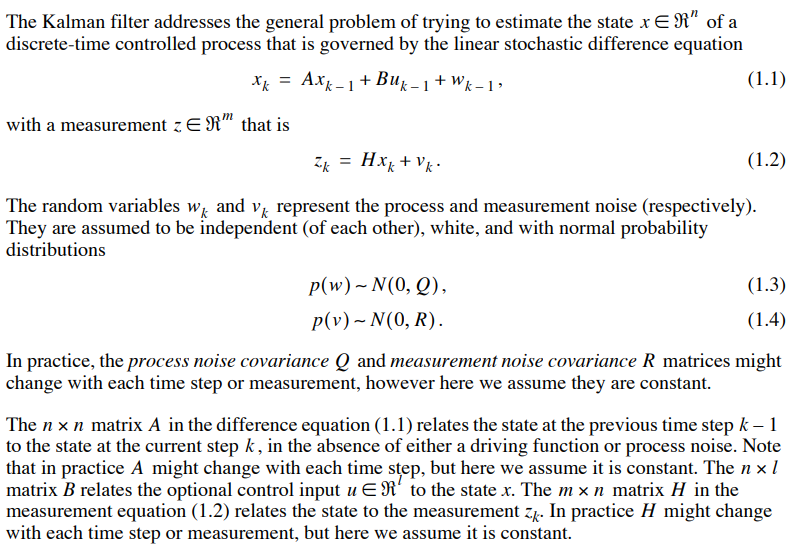
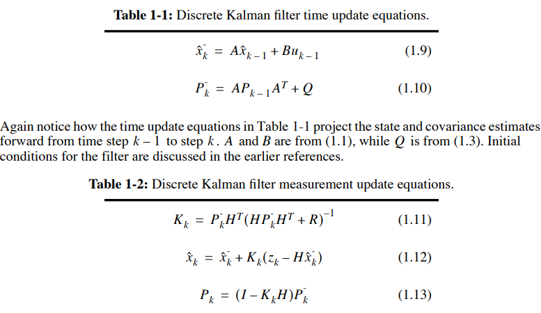
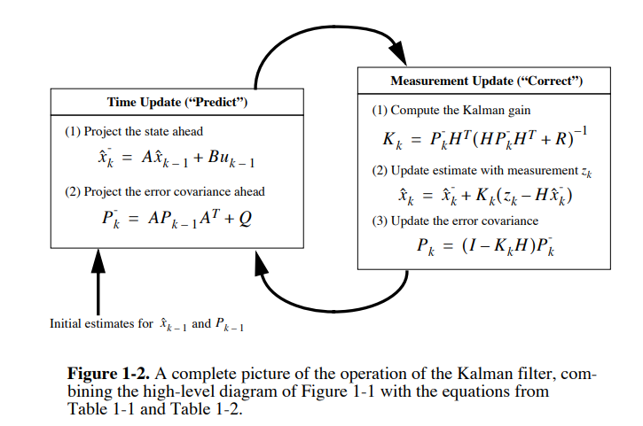
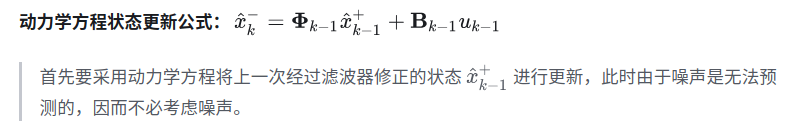
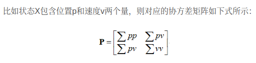
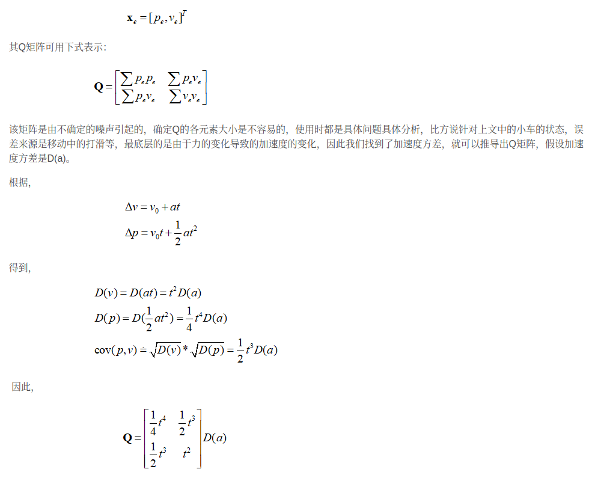
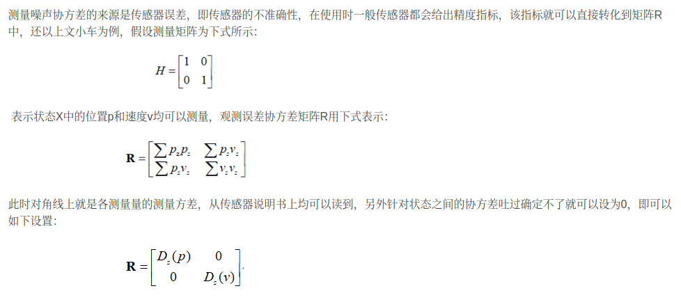
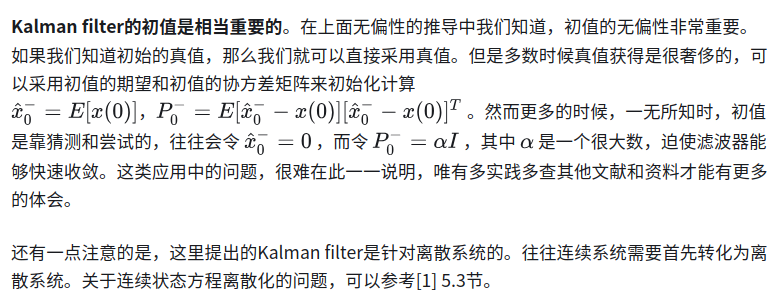

- [discrete kalman filter](#discrete-kalman-filter)
- [协方差 P Q R](#协方差-p-q-r)
- [应用和注意事项](#应用和注意事项)

## discrete kalman filter

discrete kalman filter 离散卡尔曼滤波

使用Kalman filter需要以下假设

1. 系统的动力学模型和量测模型都必须为线性
2. 动力学模型是比较准确的，符合实际系统的行为
3. 动力学模型中的噪音和观测噪音都是零均值且方差已知的白噪声

离散kalman方程总结

1. $x_k$　状态转移方程 $z_k$ 状态的观测量
2. Q是w过程噪声的协方差，R是观测噪声的协方差，这里假设他们保持恒定
3. A是状态转移矩阵,这里也假设不变
4. B 控制输入矩阵
5. H状态观测方程,这里也假设不变

- 动力学方程状态更新(时变)

- 状态协方差更新

根据过程噪声协方差Q 状态转移矩阵A 上一次的状态协方差Ｐ跟新Ｐ

- 计算卡尔曼增益参数

**卡尔曼滤波的估计原则就是使最优状态估计的P的迹trace最小，涉及P的迹trace对K求导**

K将随时间变化，K=>0:预测误差为0，系统完全取决于预测值,则表示测量误差为0,系统状态值完全取决于测量值

- 根据K修正预测值
- 根据修正后的预测值修正状态协方差

## 协方差 P Q R

- 状态协方差矩阵P

状态协方差矩阵P就是状态之间的协方差组成的矩阵，对角线元素是各个状态的方差，其余元素是相应元素的协方差，由此也能看出P是一个多维方阵，维度和状态数一致，且P是对称方阵。

在使用时协方差矩阵P是一个迭代更新的量，每一轮预测和更新后，P都会更新一个新的值，因此初始化时可以根据估计协定，不用太苛求初始化的精准度，因为随着几轮迭代会越来越趋紧真实值

- 过程噪声协方差矩阵Q

该矩阵的每一个元素分别是状态X的元素误差之间的协方差，以上文中的状态X为例，其包含位置p和速度v两个元素，其误差状态为：

- 观测噪声协方差矩阵R

1. P矩阵可以根据状态方差估计，不用太最求准确度，因为P矩阵会随着迭代次数的增加而收敛到准确值；
2. Q矩阵是状态转移预测过程由于外部干扰产生，移动机器人中可以运动加速度的方差来推导，此时只要估计一个加速度的方差即可,具体系统会随时间变化；
3. R矩阵是传感器测量的不准确度，每个每个传感器都会给出测量对向的准确度，直接转换就能用．具体系统会随时间，温度变化

## 应用和注意事项

- 当观测噪声协方差矩阵Ｒ增大，对应K会下降，代表精度较差的测量值应该有较低的权重
- 当未修正的协方差矩阵P增大，Ｋ将增大，分配更大权重给测量值，反之Ｋ减少，分配更多权重给动力学方程的预测
- Q表示对模型的信任程度,R表示对量测的信任程度,卡尔曼滤波是在模型和量测之间进行均衡

参考

[卡尔曼滤波器详解——从零开始(4) Kalman Filter from Zero](https://zhuanlan.zhihu.com/p/340523145)

[kalman滤波理解三：协方差矩阵的计算](https://blog.csdn.net/u011362822/article/details/95905113)
