- [extended Kalman filter](#extended-kalman-filter)
- [EKF update and correct](#ekf-update-and-correct)
- [matlab中对ekf的解释](#matlab中对ekf的解释)

A Kalman filter that linearizes about the current mean and covariance is referred to as an extended Kalman filter or EKF.

In something akin to a Taylor series, we can linearize the estimation around the current estimate using the partial derivatives of the process and measurement functions to compute estimates even in the face of non-linear relationships.  在类似于泰勒级数的东西中，我们可以使用过程和测量函数的偏导数围绕当前估计值线性化估计值，即使在面对非线性关系时也能计算估计值。

## extended Kalman filter

卡尔曼滤波对于解决匀速或者匀加速度运动这种线性模型很适用，但实际问题中，基本不存在匀速或者匀加速这么简单的情况,这也就引出了扩展卡尔曼滤波EKF，用来解决非线性问题

EKF的核心就是将非线性问题转换为线性问题然后用KF求解，对于非线性化的$f(x_k)$ $h(x_k)$，采用泰勒展开的方式线性化,然后其余步骤都与KF相同，带入计算即可

- 计算方差时,EKF的状态转移矩阵A和观测矩阵Ｈ都是状态信息的jacobian矩阵
- 在预测公式部分，Ａ(指代下面F矩阵)是f的jacobian矩阵
- 在更新公式部分，Ｈ是h的jacobian矩阵

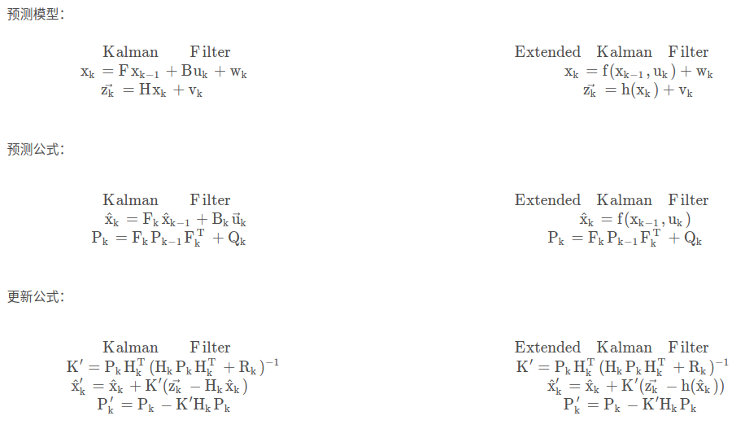

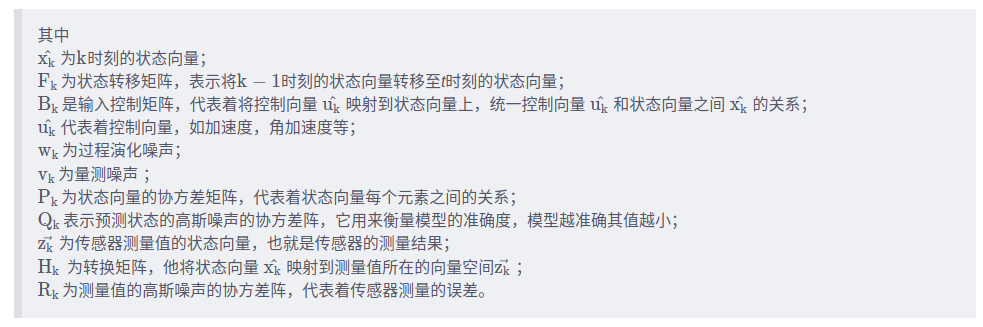

线性到非线性的说明

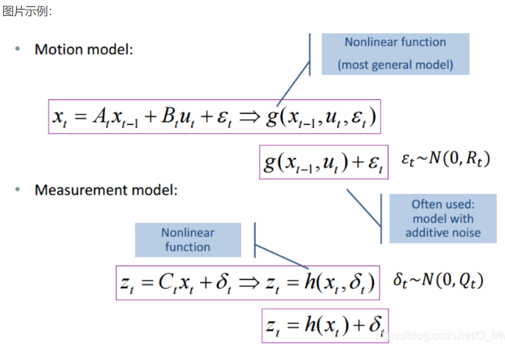

## EKF update and correct

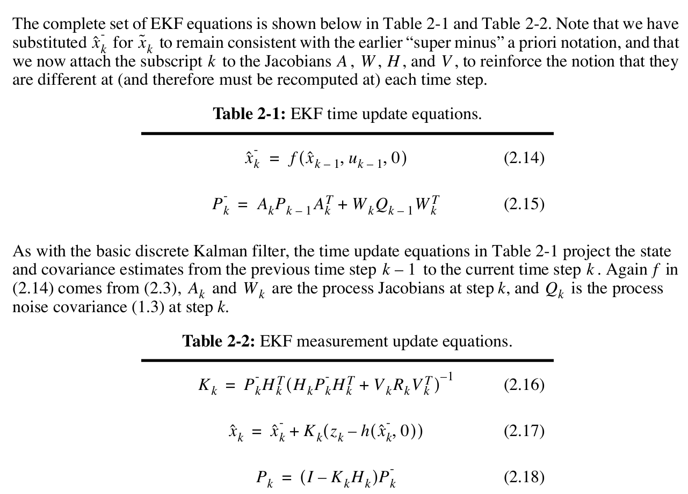

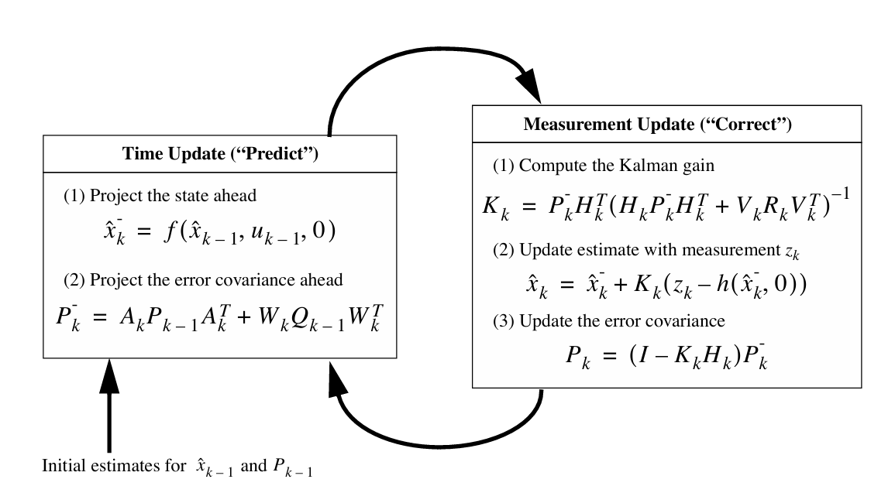

or

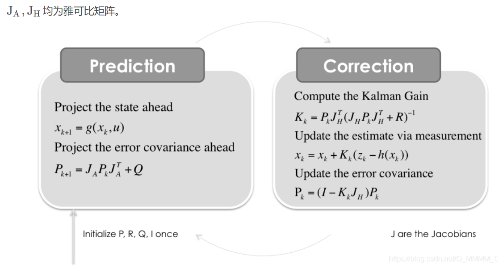

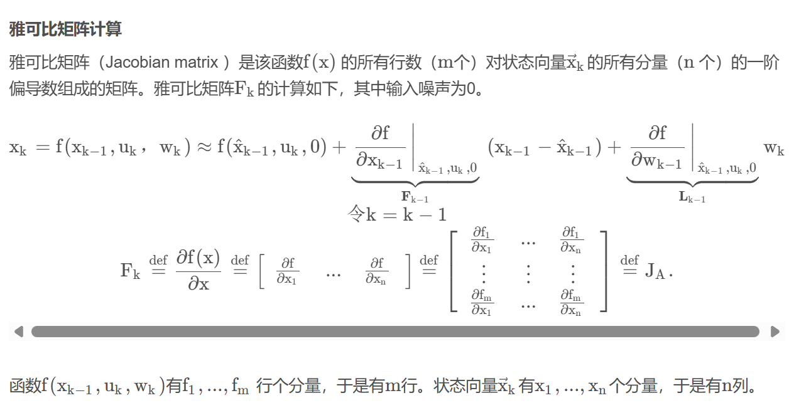

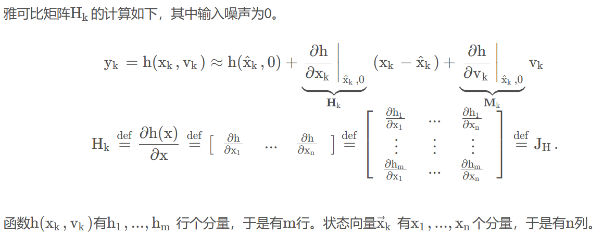

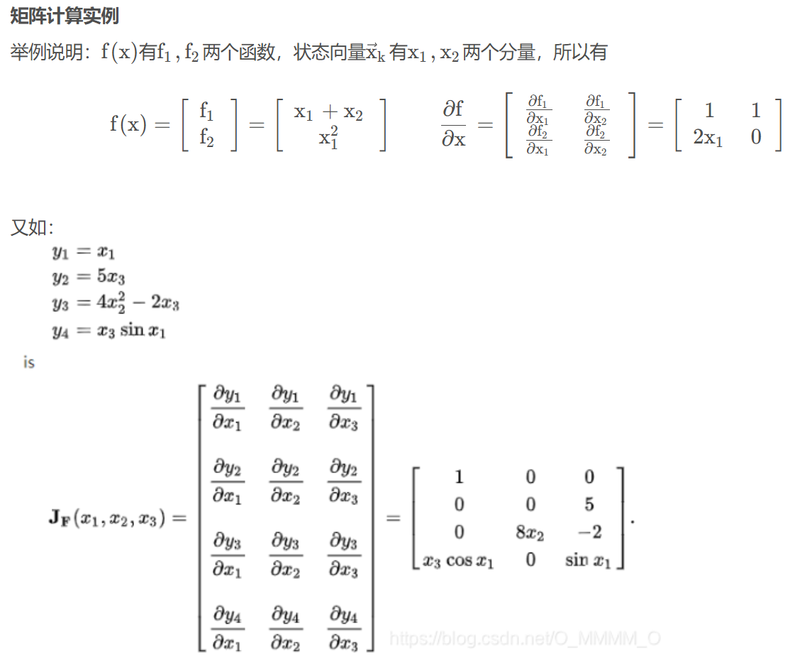

## matlab中对ekf的解释

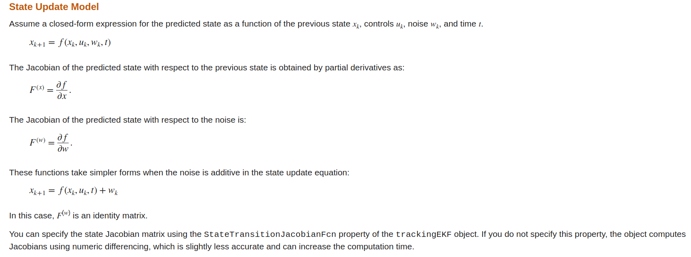

**当噪声在状态更新方程中是加法时,$F^{(w)}$是单位阵**
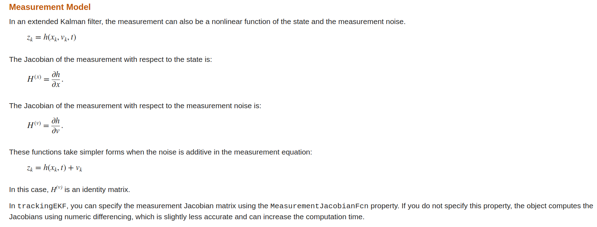

**当噪声在测量方程中是加法时,$H^{(v)}$是单位阵**

The extended Kalman filter loop is almost identical to the loop of Linear Kalman Filters except that:
EK与LKF除了以下几处外几乎相同
- The filter uses the exact nonlinear state update and measurement functions whenever possible. 滤波器尽可能使用精确的非线性状态更新和测量函数
- The state Jacobian replaces the state transition matrix. 状态 Jacobian 替换状态转换矩阵
- The measurement Jacobian replaces the measurement matrix. 测量 Jacobian 将替换测量矩阵

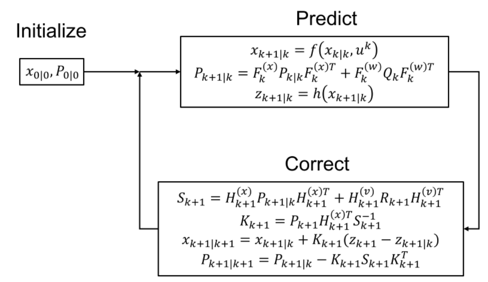

参考

[Extended Kalman Filter (EKF) With Python Code Example](https://automaticaddison.com/extended-kalman-filter-ekf-with-python-code-example/#EKF_Algorithm_Step-by-Step)

[Extended Kalman Filters](https://ww2.mathworks.cn/help/driving/ug/extended-kalman-filters.html)

[Extended Kalman Filter: How to Implement in C++ with Eigen](https://codingcorner.org/extended-kalman-filter-in-cpp-with-eigen3/)

[扩展卡尔曼滤波（EKF）理论讲解与实例（matlab、python和C++代码）](https://blog.csdn.net/O_MMMM_O/article/details/106078679)
