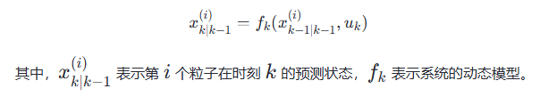
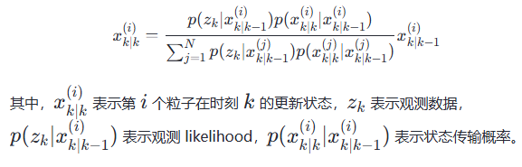
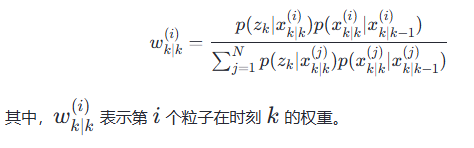
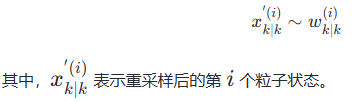
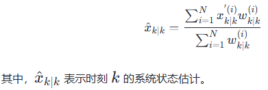
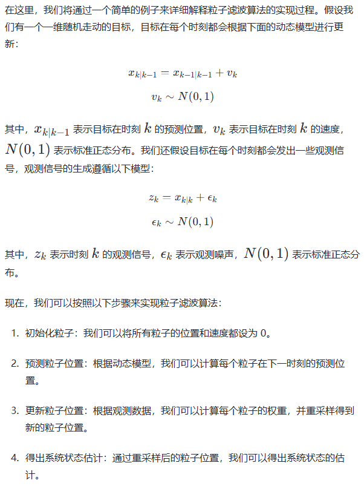

# particle filter

粒子滤波算法（Particle Filtering）是一种概率统计方法，主要用于解决不确定性问题。它是一种基于样本的滤波方法，通过生成大量的随机粒子来估计系统的状态。这种方法尤其适用于非线性、非高斯系统

## 粒子与粒子滤波

粒子是一种抽象的概念，可以用来表示系统状态。在粒子滤波算法中，粒子被用于表示系统状态的不确定性。粒子滤波算法通过生成大量的随机粒子来估计系统状态，从而实现对不确定性的估计

## 滤波与预测

滤波是一种信号处理方法，主要用于消除信号噪声。在位置估计中，滤波被用于估计系统状态。预测则是一种基于历史数据来预测未来事件的方法。在粒子滤波算法中，预测和滤波被结合使用来估计系统状态。

## 主要步骤

粒子滤波算法的核心原理是通过生成大量的随机粒子来估计系统状态，主要步骤如下

1. 初始化：在开始粒子滤波算法之前，需要对系统状态进行初始化。通常情况下，我们可以使用先验概率分布来初始化粒子的状态
2. 预测：对于每个粒子，我们需要根据系统的动态模型来预测其下一时刻的状态。这个过程可以表示为：



3. 更新：对于每个粒子，我们需要根据观测数据来更新其状态。这个过程可以表示为：



4. 权重计算：对于每个粒子，我们需要计算其权重。权重可以表示为：



5. 重采样：通过权重，我们可以对粒子进行重采样。重采样的过程可以表示为



6. 结果得出：通过重采样后的粒子状态，我们可以得出系统状态的估计。这个过程可以表示为：




## 具体代码实例



```python
import numpy as np

def init_particles(N, x_mean, x_cov):
    '''
    粒子初始化
    '''
    particles = []
    for i in range(N):
        particle = np.array([x_mean, 0]) # 每个粒子是二维数组 [位置，速度]
        particle_cov = np.array([[x_cov, 0], [0, x_cov]]) # 位置，速度的协方差矩阵
        particles.append((particle, particle_cov))
    return particles

def predict(particles, dt, v_mean, v_cov):
    '''
    根据系统动态模型预测粒子在下一时刻的状态
    particles: 当前粒子集合
    dt: 时间间隔
    v_mean: 速度均值
    v_cov: 速度协方差
    '''
    new_particles = []
    for i, (particle, particle_cov) in enumerate(particles):
        # 匀速运动+高斯噪声
        particle_next = particle + dt * v_mean + np.random.normal(0, np.sqrt(v_cov), size=2)
        # 完成状态传播
        new_particles.append((particle_next, particle_cov))
    return new_particles

def update(particles, z_mean, z_cov, dt):
    '''
    根据观测数据计算每个粒子的权重，反映粒子与实际观测的匹配程度
    particles: 输入的粒子集合
    z_mean: 观测数据
    z_cov: 观测数据方差
    dt: 时间间隔
    '''

    # 使用高斯分布概率密度函数计算每个粒子的权重
    weights = np.array([np.exp(-0.5 * ((z_mean - particle[0]) / z_cov)**2) for particle in particles])
    weights /= weights.sum() # 权重归一化，使它们的总和为1，形成概率分布

    # 粒子权重更新
    new_particles = [(particle[0], particle[1], weight) for particle, weight in zip(particles, weights)]
    return new_particles

def resample(particles):
    '''
    重采样步骤，根据粒子权重重新选择粒子，保留重要性高的粒子
    '''
    new_particles = []
    weights = np.array([particle[2] for particle in particles])
    weights /= weights.sum()

    # 基于权重分布进行重采样
    # 参数p 大小（size）应该与指定的a相同，用来规定选取a中每个元素的概率
    indices = np.random.choice(range(len(particles)), size=len(particles), p=weights)
    new_particles = [particles[i] for i in indices]
    
    # 保持粒子结构一致（去除权重信息或重置权重）
    new_particles = [(particle[0], particle[1]) for particle in new_particles]
    return new_particles

def estimate(particles):
    '''
    从粒子集合中估计系统状态的均值和协方差
    '''

    # 计算状态均值
    x_mean = np.mean([particle[0] for particle in particles])

    # 计算协方差
    x_cov = np.mean([np.outer(particle[0] - x_mean, particle[1][0, 0]) for particle in particles])
    return x_mean, x_cov

N = 100
x_mean = 0
x_cov = 1
v_mean = 0
v_cov = 1
dt = 0.1
z_mean = 0
z_cov = 1

particles = init_particles(N, x_mean, x_cov)
for k in range(10):
    particles = predict(particles, dt, v_mean, v_cov)
    particles = update(particles, z_mean, z_cov, dt)
    particles = resample(particles)

x_mean_est, x_cov_est = estimate(particles)
print("Estimated position: ", x_mean_est)
print("Estimated covariance: ", x_cov_est)
```

## 发展趋势

1. 粒子数量的选择：粒子滤波算法的性能与粒子数量有关。选择合适的粒子数量是一个关键问题。如果粒子数量过少，可能会导致估计的不准确；如果粒子数量过多，计算成本会增加。
2. 粒子滤波算法的优化：粒子滤波算法的优化，如加速算法、减少计算成本

## 应用

1. 粒子滤波算法主要应用于目标跟踪、地图定位、机器人定位等领域
2. 粒子滤波算法的优点是它可以处理非线性、非高斯系统，具有高度鲁棒性和准确性。但是，它的缺点是需要选择合适的粒子数量，计算成本较高

## reference

- [粒子滤波算法,代码部分我做了一些修改](https://juejin.cn/post/7321778214485295154)
