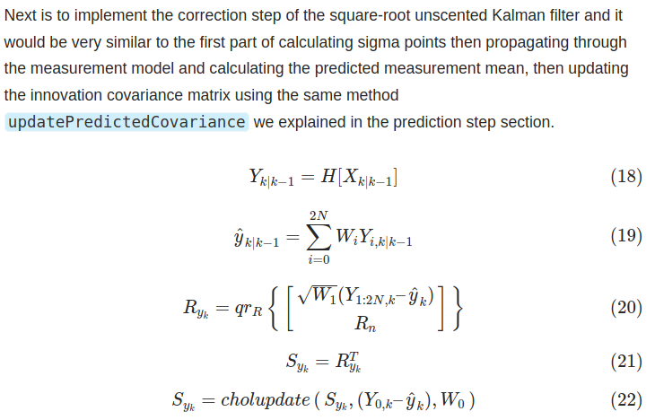

- [Square-root UKF](#square-root-ukf)
- [background](#background)
- [ukf \& sr-ukf](#ukf--sr-ukf)
- [sr-ukf helper function](#sr-ukf-helper-function)
  - [Rank-1 Cholesky Update/Downdate in C++](#rank-1-cholesky-updatedowndate-in-c)
  - [Forward and Backward Substitutions](#forward-and-backward-substitutions)
    - [Forward Substitution](#forward-substitution)
    - [Backward Substitution](#backward-substitution)
- [sr-ukf algorithm](#sr-ukf-algorithm)
  - [prediction step](#prediction-step)
  - [correction step](#correction-step)

## Square-root UKF

## background

- 扩展卡尔曼滤波器已经成为许多非线性估计和机器学习应用中选择的算法。这些包括估计非线性动态系统的状态以及估计非线性系统识别的参数例如学习神经网络的权重）EKF将标准线性卡尔曼滤波器方法应用于实际非线性系统的线性化。该方法是次优的，且可能很容易导致发散。
- 无迹卡尔曼滤波UKF作为EKF的无导数替代方案。通过Wan和Merwe的工作将其扩展到参数估计中。UKF在预测和估计误差方面始终优于EKF,对于一般状态空间问题它的计算复杂度为$O(L^3)$, 当EKF应用于参数估计时，状态空间方程的特殊形式允许$O(L^2)$
- 平方根无迹卡尔曼滤波器（SR-UKF），对于一般的状态估计它的计算复杂度也是$O(L^3)$, 对于参数估计则为$O(L^2)$（注意UKF的原始公式用于参数估计为$O(L^3)$）
- 平方根形式具有数值稳定性和状态协方差的半正定性的附加优点
- UKF优于EKF的性能已经在许多应用中得到证实。此外，不像EKF，UKF无需显式地计算导数（例如，计算雅各比矩阵和海森矩阵）

## ukf & sr-ukf

- 在UKF中，计算代价最高的运算为每次更新时计算新的sigma点集，需要状态协方差矩阵的平方根矩阵
- 在平方根SRUKF实现中，平方根矩阵将会直接传播，避免在每次时间步长重新分解

## sr-ukf helper function

首先，我们首先实现实现平方根无迹卡尔曼滤波器所需的辅助函数。这些实用函数类似于 Cholesky Rank-1 更新，以及向前和向后替换

- Rank-1 Cholesky update/downdate function 更新已经 Cholesky 分解的协方差矩阵
- the forward and backward substitutions are needed to compute the Kalman gain more efficiently without the need of calculating matrix inversion. 前向和后向替换来更有效地计算卡尔曼增益，而无需计算矩阵求逆

### Rank-1 Cholesky Update/Downdate in C++

### Forward and Backward Substitutions

#### Forward Substitution

当线性方程组中A矩阵是下三角矩阵时，使用前向替换，从x1,x2求到xn

#### Backward Substitution

当线性方程组中A矩阵是上三角矩阵时，使用后向替换，从xn,xn-1求到x1

## sr-ukf algorithm

1. The initialization is calculating the cholesky factorization of P, Q and R. And additionally, setting the state vector 计算PQR的cholesky因式分解

### prediction step

### correction step

参考

- [Sqaure-root Unscented Kalman Filter: How to Implement in C++ with Eigen](https://codingcorner.org/square-root-ukf-cpp/)
- [【论文阅读】【Merwe】The square-root unscented Kalman filter for state and parameter-estimation-2001](https://zhuanlan.zhihu.com/p/624132323) 

