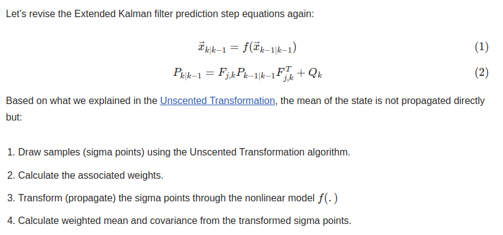
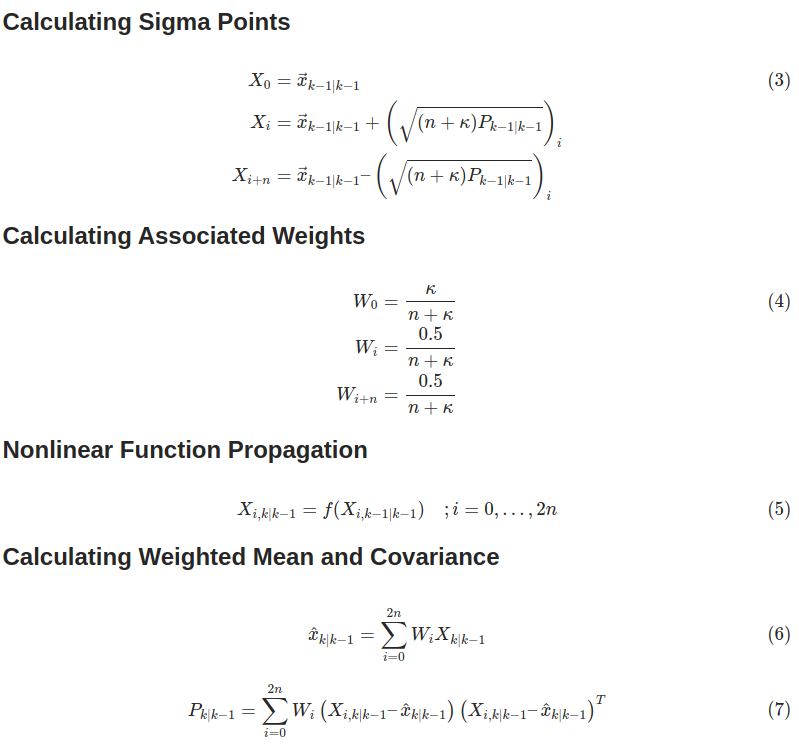
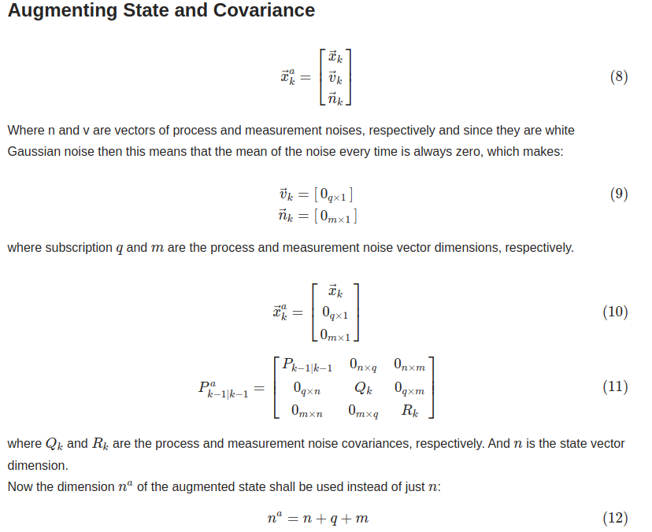
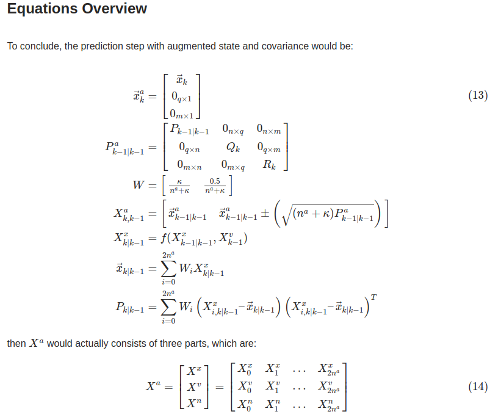
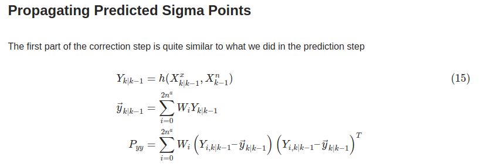
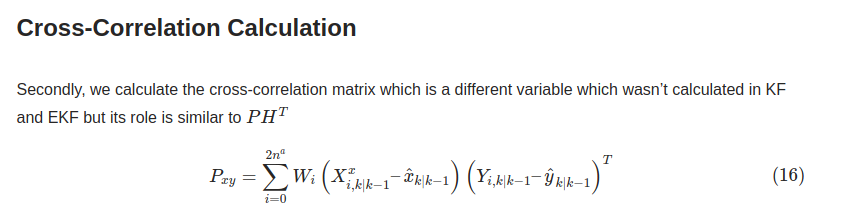
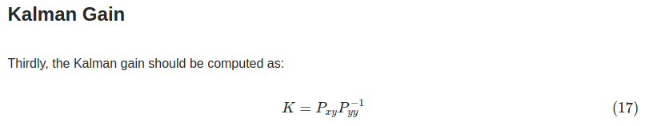
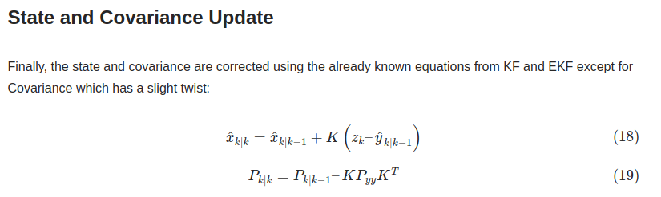

- [UKF Predication step](#ukf-predication-step)
- [Correction step](#correction-step)

Integrate the unscented transformation into the Kalman filter algorithm which will result in the newest variant of Kalman filters, called the Unscented Kalman filter (UKF)

## UKF Predication step

对EKF预测步骤方程修改，对状态和协方差进行增强，基于无迹变换从新计算状态量先验均值和状态协方差矩阵

这样就凑成一个均值为0，协方差只有对角线有值的近似高斯分布．解下来对这个近似高斯分布进行 unscented transform

此处预测结果中的先验状态量和先验状态协方差已经是不是unscented transform 形式了

## Correction step

1. 对Sigma点通过非线性函数映射到观测空间，并计算均值和协方差矩阵.这里是重复了一遍unscented transform,但使用的非线性函数是H而不是F

2. 然后计算互相关矩阵，这里的作用于KF中的$P*H^T$类似

3. 计算K增益

7. 矫正预测的状态量和状态协方差矩阵，这里的状态量和协方差矩阵与(13)式中不同，不是近似正态高斯，而是传统的kf结果

参考

- [Unscented Kalman Filter: The Best Explanation in Python](https://codingcorner.org/unscented-kalman-filter-ukf-best-explanation-with-python/)
- [Unscented Kalman Filter: How to Implement in C++ with Eigen](https://codingcorner.org/unscented-kalman-filter-how-to-implement-in-cpp-like-an-expert/)