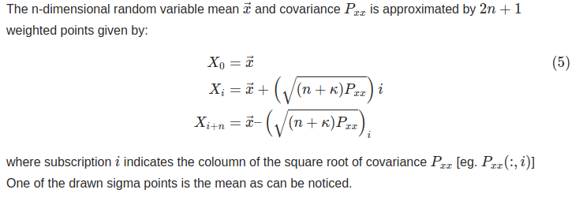
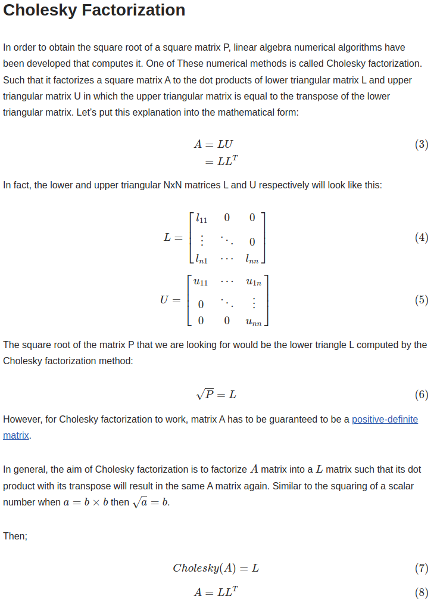
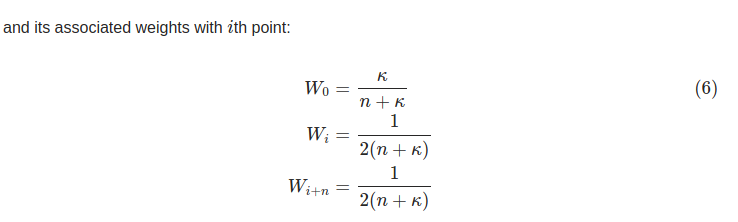
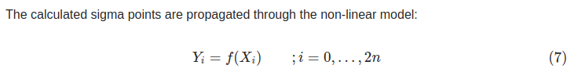
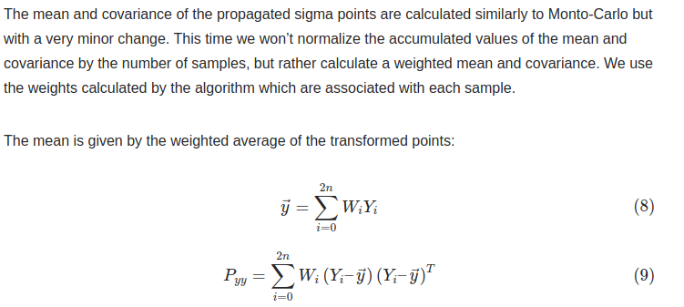

- [unscented transform](#unscented-transform)
- [unscented transform algorithm](#unscented-transform-algorithm)

## unscented transform

无迹变换,用于处理非线性系统状态估计中的非线性函数的传播问题.允许高度非线性的系统状态通过非线性函数传播，同时保持了状态的均值和协方差的准确性.

无迹变换的基本思想是通过精心选择的一组点（称为Sigma点）来近似描述原始状态的概率分布，然后将这些点通过非线性函数映射到新的状态空间，通过映射后的点来近似新状态的概率分布

It is founded on the intuition that approximating a Gaussian distribution is easier than approximating an arbitrary nonlinear function. 近似高斯分布比近似任意非线性函数更简单

- The unscented transformation basically starts with drawing 2n+1 samples from the input gaussian distribution which is commonly called (Sigma Points) but this time they are not drawn randomly but rather according to a specific, determinstic algorithm. 从输入高斯分布中抽取根据特定算法绘制的　2n+1 个sigma点

## unscented transform algorithm

1. generated 2n+1 sigma points

每个点对应协方差平方跟的第i列

Cholesky decompose estimate square root of covariance $P_{xx}$ 协方差的平方跟是下三角矩阵

２. 为2n+1点计算各自权重，第一个点是sigma点的均值, kappa是sigma点的缩放系数,经验上通常$n +\kappa = 3$　这样就可以计算所有的sigma点了

3. sigmaX点通过非线性函数传播，计算sigmaY

4. 对传播后的点和权重，重新求均值和协方差矩阵，作为新的估计

reference

[Unscented Transformation: How to Implement in C++ with Eigen](https://codingcorner.org/unscented-transformation-c-with-eigen-and-cmake/)

[Unscented Transformation: The Best Explanation in Python](https://codingcorner.org/unscented-transformation-explained-with-python/)
