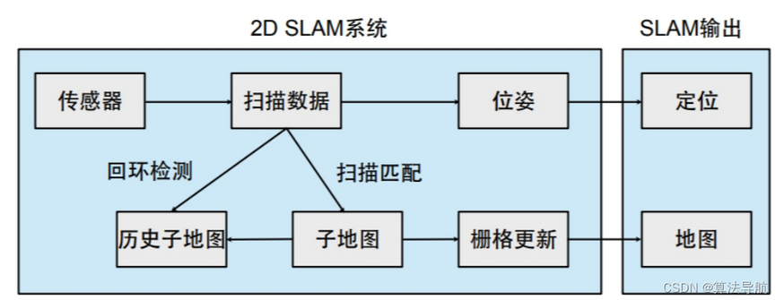
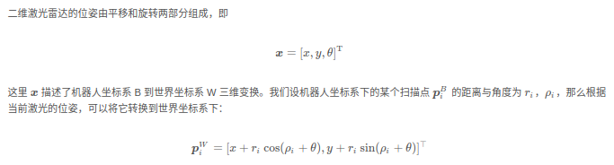
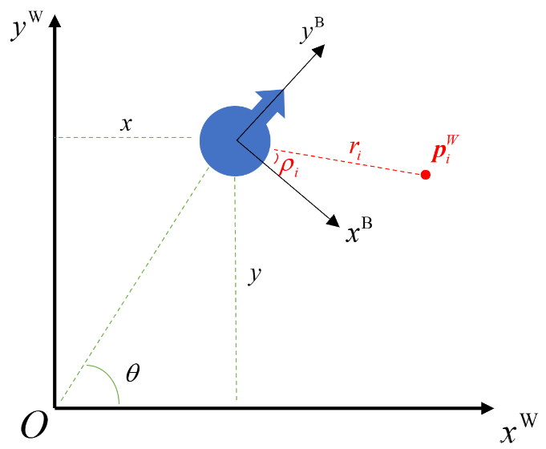
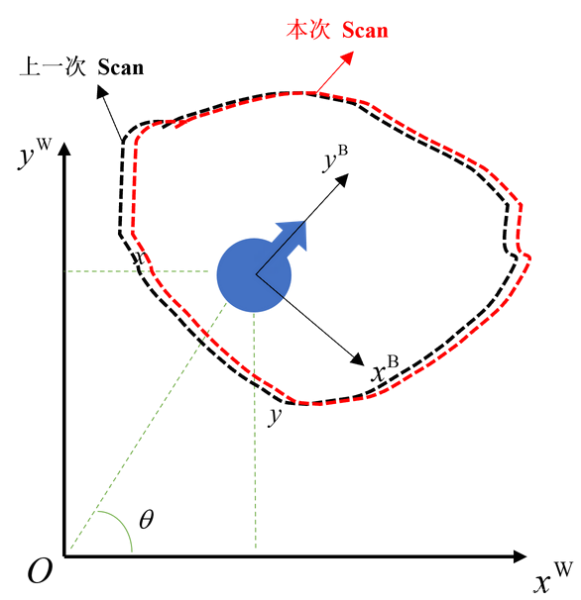
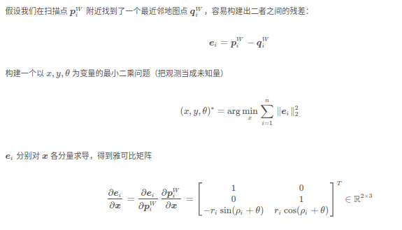
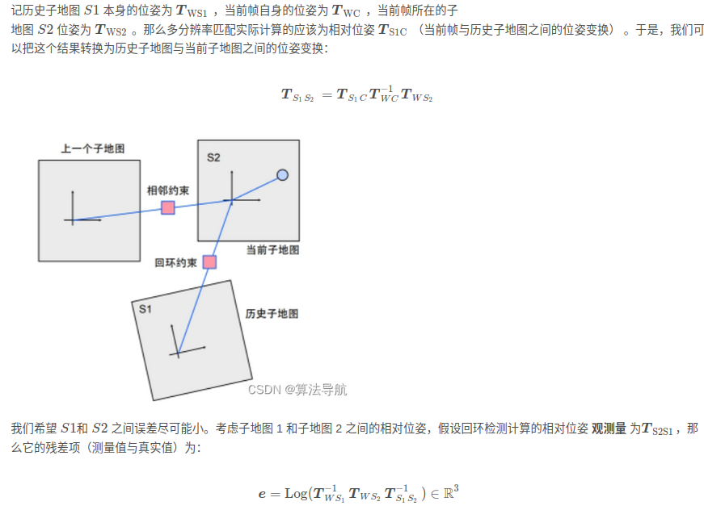

- [2D SLAM](#2d-slam)
  - [2d lidar data](#2d-lidar-data)
    - [扫描点转世界坐标](#扫描点转世界坐标)
  - [scan matching](#scan-matching)
    - [ICP](#icp)
    - [likelihood field 似然场](#likelihood-field-似然场)
  - [occupancy grid](#occupancy-grid)
  - [子地图](#子地图)
    - [子地图原理](#子地图原理)
      - [一个基于子地图的2D slam](#一个基于子地图的2d-slam)
    - [子地图表示](#子地图表示)
  - [回环检测](#回环检测)
    - [多分辨率的回环检测](#多分辨率的回环检测)
    - [基于子地图的回环修正](#基于子地图的回环修正)

# 2D SLAM

- 大部分2d slam方案假设障碍物与激光雷达在同一高度，在扫地机、AGV中应用较多（感觉差不多饱和了，但是没有特别好用的产品）

以下是经典的2D slam框架

- 二维激光雷达按照一定频率向外输出激光测距信息，我们称一圈数据为一次 扫描 scan
- 为了计算本次扫描对应的机器人位姿，需要将其与某些东西进行匹配（或配准），这个过程称为扫描匹配。既可以将 Scan 与前一次 Scan 进行匹配，也可以与地图匹配，即Scan to Scan和Scan to Map两种模式
- 子地图：将一些邻近的激光雷达扫描归入一个子地图，然后再将子地图拼接起来，得到全局地图。每个子地图内部是固定的，调整优化的是子地图之间的位姿
- 用占据栅格地图进行地图的更新与管理

## 2d lidar data

二维扫描数据的存储形式：由一组角度和距离的数值对来表示($\rho_i,r_i$)表示第 i i i 个点与车辆自身的角度和距离。
那么极坐标转笛卡尔坐标后为$[x,y,{\theta}]^T$

### 扫描点转世界坐标

左乘RT，再围绕自身旋转$\rho$

## scan matching

构建最小二乘问题

### ICP

### likelihood field 似然场

## occupancy grid

- 基于 Bresenham 算法的地图生成
- 基于模板生成

## 子地图

### 子地图原理

把若干个匹配好的结果放在一起，形成一个个子地图（Submap）。子地图是介于单个扫描数据与全局地图之间的数据组织形式。

#### 一个基于子地图的2D slam

- 一个子地图对应一个似然场和一个栅格地图
- 当前扫描数据与当前子地图匹配，计算扫描数据在当前子地图中的位姿
- 若机器人发生移动或旋转，按照一定距离和角度取关键帧
- 若机器人移动范围超过当前子地图或者当前子地图包含的关键帧超过一定数量，就建立新的子地图
  - 新地图以当前帧为中心，完全没有数据
  - 为了方便后续配准将旧地图中最近的一些关键帧复制到新的子地图中
- 合并每个子地图的栅格地图，得到全局地图

该流程不限于2D SLAM，也可以在3D SLAM和视觉SLAM中使用子地图模式

### 子地图表示

- 我们认为每个子地图含有一个可随时调整的位姿，用$T_{ws}$表示子地图到世界坐标系的转换，$T_{sc}$表示扫描数据到子地图的转换，则扫描数据到世界坐标系的转换为

$$
T_{wc} = T_{ws} T_{sc}
$$

- 一般的在匹配完成后$T_{sc}$就固定了，只需要调整$T_{ws}$
- 所以在回环检测过程中，可以把子地图视为一个基本单元,只需要调整$T_{ws}$

## 回环检测

当机器人走完一圈回到原来的场地时，新的子地图会与原来的子地图存在一定重叠区域。如果我们对这些重叠区域不作任何配准，它们在拼接时就会产生明显的**重影现象**

- 把当前的扫描数据或者子地图与历史地图配准，再调整各子地图之间的相对位置关系，就可以大概消除累计误差

### 多分辨率的回环检测

由粗至精，先在小分辨率的似然场中进行一次配准，再把粗配准的结果投影到高分辨率的似然场中，形成由粗至精的匹配过程

### 基于子地图的回环修正

当前帧与历史子地图之间的配准关系满足回环检测，这点可以建模为位姿优化问题

