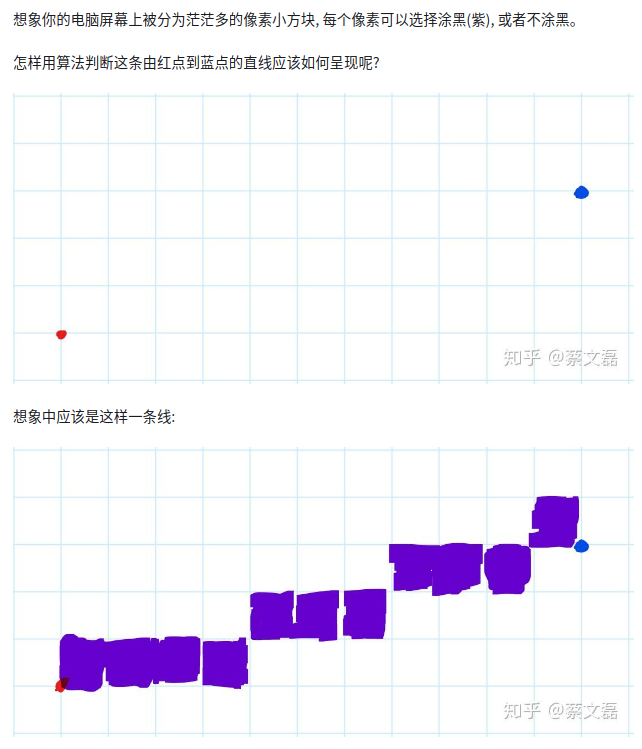
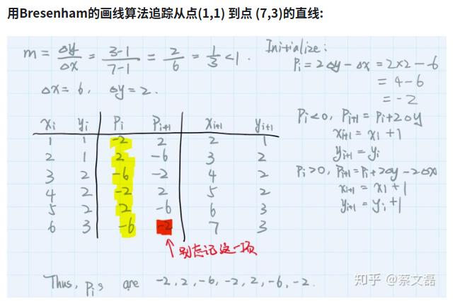
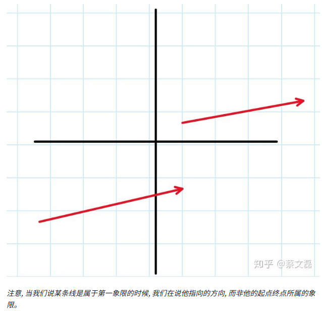
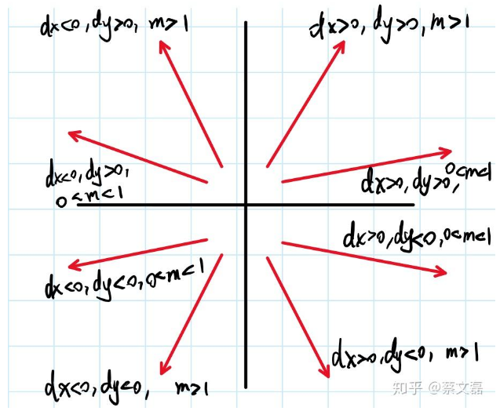

- [bresenham‘s line algorithm 布雷森汉姆直线算法](#bresenhams-line-algorithm-布雷森汉姆直线算法)
  - [推导](#推导)
  - [不同方向直线情况的判定原则](#不同方向直线情况的判定原则)
  - [各种情况](#各种情况)
  - [reference](#reference)

# bresenham‘s line algorithm 布雷森汉姆直线算法

简单描述: 给定两点: 起点(x1, y1), 终点(x2, y2), 连接他们的理论直线可以用一元一次方程y=mx+b来描述, 规定$m∈ (0,1)$并且这条线是指向第一象限的线



可以看到, 从红点到蓝点的路上, 每一个的小方块的坐标值都有以下特点:

1. X(横轴)的值每次增长1
2. Y的值会在保持不变和增长1之间选择

## 推导

定义一个参数Pi 用于判断下一个小方块的y值$y_{i+1}$是保持不变还是加１

```txt
dx = x2 - x1
dy = y2 - y1
m = dy/dx

xi = x1
yi = y1
pi = 2dy - dx

while xi != x2 + 1
    if Pi < 0
        pi = pi + 2dy
        yi = yi
    else
        pi = pi + 2dy - 2dx
        yi = yi + 1
#将下一个像素(x,y)涂色
    plot(xi, yi)
    xi = xi + 1
```

需要注意的是, 这样的Bresenham画线算法只能用于画斜率在0到1之间, 并且指向第一象限的线, 判断的条件用式子表示则为:满足 dx > 0 && dy > 0 && 0< m < 1

example



## 不同方向直线情况的判定原则

原始的Bresenham只能画指向第一象限并且斜率小于1的直线 (如图)

因此, 我们通过判断: 斜率m, x增长量dx, y增长量dy, 可以得到一共8种不同的情况, 而他们都可以通过改变Bresenham的一些变量来实现突破之前提到的限制





- 对于相同象限, 斜率不同的情况, 其实就是将斜率在0到1之间的线作关于函数y = x 对称而得到。对应到代码中就是将所有的y和所有的x调换位置
  - 例如, 原来的pi = 2dy - dx, 在这种情况下就变成 pi = 2dx - dy, 以此类推, 但是需要注意的是最后的输出点仍然是 (xi, yi) 而不是(yi, xi)
- 对于不同象限, 斜率相同的情况, 其实就是将两个点 (x1, y1) (x2, y2) 进行符号的改变, 使其转移到第一象限中进行运算, 最后再输出原始的(xi, yi)点
  - 例如, 对于第二象限 dx < 0, dy > 0, 那么就取其关于y轴对称的点 (-x1, y1) (-x2, y2)应用Bresenham算法计算, 但是最后输出的点仍然是 plot(x1, y1) 而不是 (-x1, y1)
- 对于象限也不同, 斜率也不同的情况 (第三象限的直线), 就将上述两种情况的变通结合起来, 以此类推

## 各种情况

这位知乎网友是人真好

- 若dx > 0, dy > 0, 0< m < 1:

```
xi = x1, yi = y1

第一项: pi = 2dy -dx

若pi < 0: pi = pi + 2dy, yi = yi

若pi > 0: pi = pi + 2dy - 2dx, yi = yi + 1

xi = xi + 1

输出: (xi, yi)
```

- 若dx > 0, dy > 0, m > 1:

```
xi = x1, yi = y1

第一项: pi = 2dx -dy

若pi < 0: pi = pi + 2dx, xi = xi

若pi > 0: pi = pi + 2dx - 2dy, xi = xi + 1

yi = yi + 1

输出: (xi, yi)
```

- 若dx > 0, dy < 0, 0< m < 1:

```
xi = x1, yi = -y1

第一项: pi = 2dy -dx

若pi < 0: pi = pi + 2dy, yi = yi

若pi > 0: pi = pi + 2dy - 2dx, yi = yi + 1

xi = xi + 1

输出: (xi, -yi)
```

- 若dx > 0, dy < 0, m > 1:

```
xi = x1, yi = -y1

第一项: pi = 2dx -dy

若pi < 0: pi = pi + 2dx, xi = xi

若pi > 0: pi = pi + 2dx - 2dy, xi = xi + 1

yi = yi + 1

输出: (xi, -yi)
```

- 若dx < 0, dy > 0, 0< m < 1:

```
xi = -x1, yi = y1

第一项: pi = 2dy -dx

若pi < 0: pi = pi + 2dy, yi = yi

若pi > 0: pi = pi + 2dy - 2dx, yi = yi + 1

xi = xi + 1

输出: (-xi, yi)
```

- 若dx < 0, dy > 0, m > 1:

```
xi = -x1, yi = y1

第一项: pi = 2dx -dy

若pi < 0: pi = pi + 2dx, xi = xi

若pi > 0: pi = pi + 2dx - 2dy, xi = xi + 1

yi = yi + 1

输出: (-xi, yi)
```

- 若dx < 0, dy < 0, 0< m < 1:

```
xi = -x1, yi = -y1

第一项: pi = 2dy -dx

若pi < 0: pi = pi + 2dy, yi = yi

若pi > 0: pi = pi + 2dy - 2dx, yi = yi + 1

xi = xi + 1

输出: (-xi, -yi)
```

- 若dx < 0, dy < 0, m > 1:

```
xi = -x1, yi = -y1

第一项: pi = 2dx -dy

若pi < 0: pi = pi + 2dx, xi = xi

若pi > 0: pi = pi + 2dx - 2dy, xi = xi + 1

yi = yi + 1

输出: (-xi, -yi)
```

## reference

- [Bresenham 直线算法](https://zhuanlan.zhihu.com/p/106155534)
