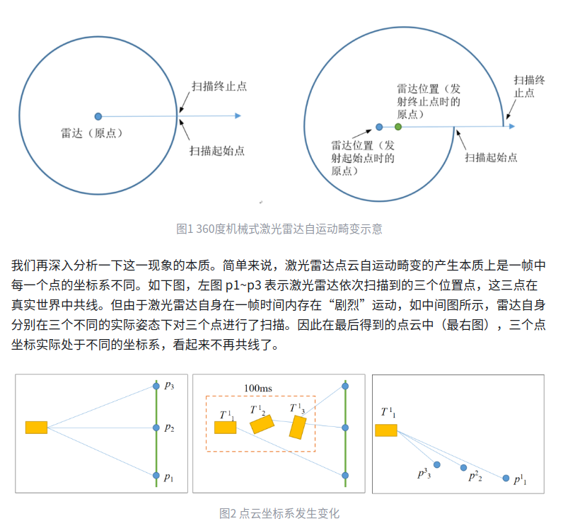

# 激光雷达自运动畸变

- 一般我们会将100ms (对应典型值10Hz) 内累积的数据作为一帧点云输出
- 若在这100ms内，激光雷达本体或安装所在的机体发生绝对位置的变化，那么此帧点云中每一个点的坐标系就是不同的
- 直观上看，这一帧点云数据就会发生一定的“变形”，不能真实对应所探测到的环境信息，类似于拍照时手抖了，拍出来的照片就会糊。这便是激光雷达的自运动畸变

## 校正方案

在实际应用中，一般首先设法测量激光雷达的运动信息，如一帧点云首尾（100ms间隔）的雷达位姿变化 T。然后根据某点到初始点或末尾点之间的时间差 Δt，通过短时匀速假设进行线性插值得到该点的 

环境干扰

- 玻璃: 激光会穿过透明玻璃, 呈现在地图上的结果就是地图毛刺、扭曲、不完整
  - 可以使用超声波进行一定的避障
- 高反光材质: 容易使地图点丢失
- 低反光材质: 降低了雷达的检出率和分辨率，地图一般呈现为边界模糊或散状点
- 雨雪粉尘天气
