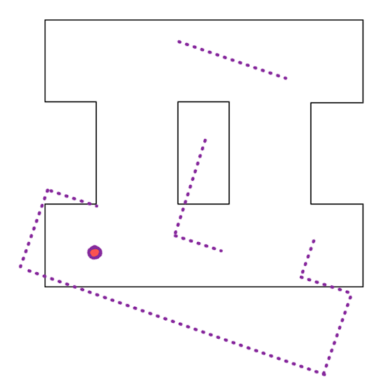
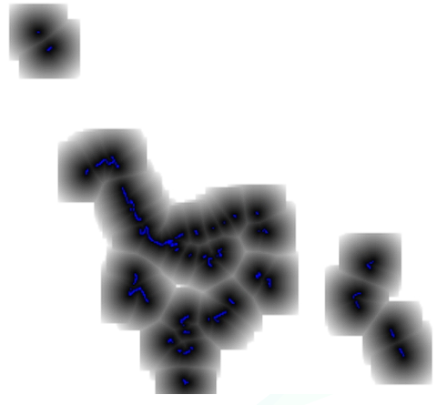
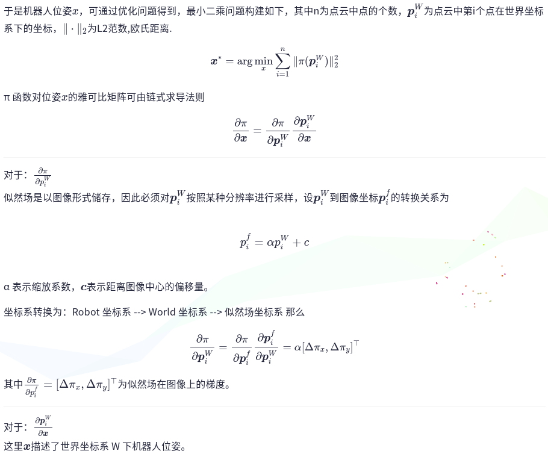
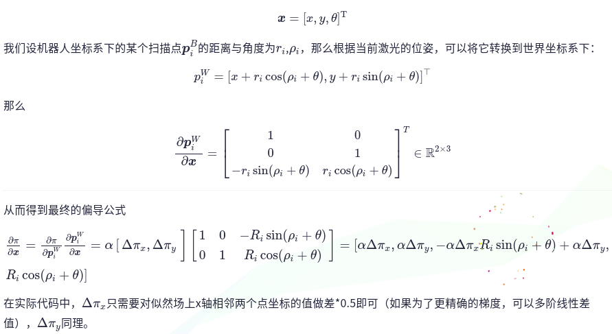

# likelihood filed 似然场

## 激光点云世界坐标

假设在激光slam中 robot based world pose: $(x,y,\theta)^T$, 那么某帧激光点云中某个扫描点$p_i^{w}(r,\rho)$的世界坐标为

$$
p_i^{w} = [x+r_i cos(\rho+\theta), y+r_i sin(\rho+\theta)]
$$

## 扫描数据与地图数据的配准

假设激光雷达扫描的点云表示为${p_i^R}$,如何求解机器人在地图World中的位姿 $(x,y,\theta)^T$，使得点云上所有的点经过变换后，都在地图上对应位置的黑线上

建立一个最小二乘的优化问题，使得点云中的每个点与地图中的对应点之间的距离最小？通过这样子就可以让扫描得到的点云都尽量的落到地图黑线上

## 似然场

2Dslam通常会保存占据栅格地图(occupancy grid map)，它的栅格更新机制对动态物体有一定的过滤效果。似然场是一种类似ICP的将扫描数据雨栅格地图进行配准的方法

- 在地图中每个点附近定义一个不断向外衰减的场,当一个被测量点落在场附近时，可以用场的读数作为该点的误差函数
- 似然场可以用来配准两个扫描数据，也可以配准一个扫描数据与地图

下图为某个二维扫描数据和它对应的似然场

似然场围绕每个扫描点产生并随距离变大而衰减，从图中的表现为图像灰度代表值，黑色为0，白色为1,其余为0-1，先把这个场定义为似然场 $\pi$

- 似然场可以代替kd-tree，使用它的读数获取某个点的最近点

