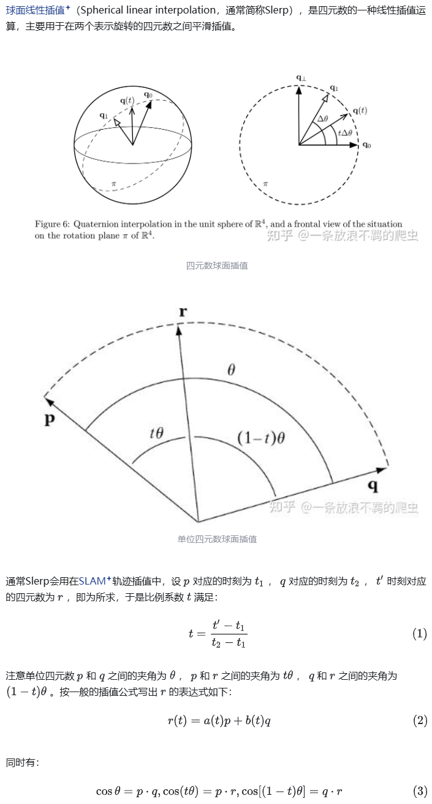
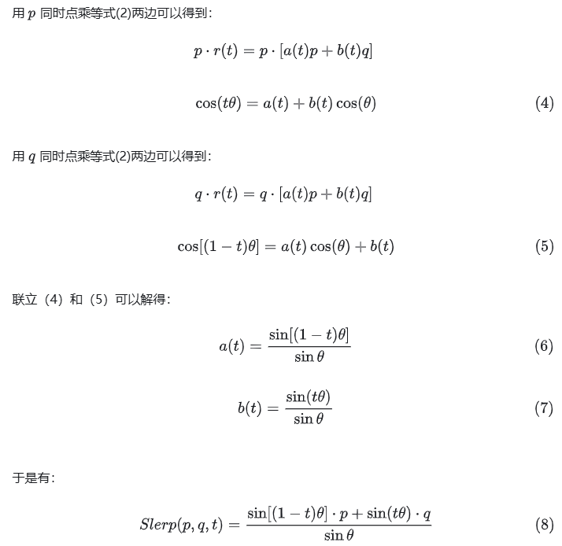
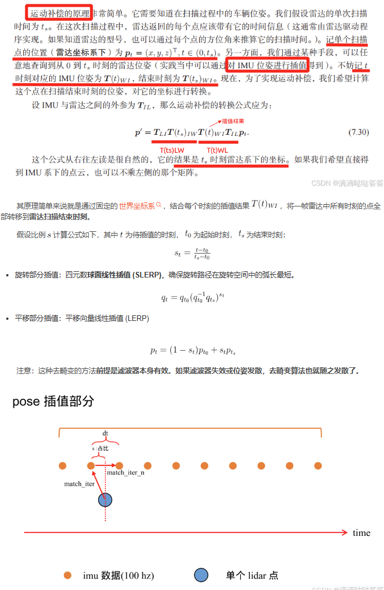

- [基于四元数球面线性插值的imu运动补偿](#基于四元数球面线性插值的imu运动补偿)
  - [Spherical linear interpolation SLERP](#spherical-linear-interpolation-slerp)
  - [对李代数插值是否能参考slerp ?](#对李代数插值是否能参考slerp-)
- [实际使用](#实际使用)
- [reference](#reference)

# 基于四元数球面线性插值的imu运动补偿

在做LIO时，通常使用imu对雷达点云进行运动补偿，在实现时通常会对旋转和平移分别进行插值

- 旋转插值: 四元数球面线性插值(SLERP)
- 平移插值: 平面向量线性插值(LERP)

## Spherical linear interpolation SLERP

SLERP是四元数的一种线性插值运算，主要用于在两个表示旋转的四元数之间平滑插值,通常Slerp会用在SLAM轨迹插值中





特殊情况处理

1. 如果四元数点积的结果是负值（夹角大于90°），那么后面的插值就会在4D球面上绕远路。
   1. 为了解决这个问题，先测试点积的结果，当结果是负值时，将两个四元数的其中一个取反（并不会改变它代表的朝向）。而经过这一步操作，可以保证这个旋转走的是最短路径。
2. 当p q的夹角非常小时会导致$sin_{\theta}$接近0，这时除法可能会出现问题。为了避免这样的问题，当$\theta$接近0时退化为线性方程$slerp(p,q,t)=(1-t)p+tq$

Eigen 源码实现

```cpp
/** \returns the spherical linear interpolation between the two quaternions
  * \c *this and \a other at the parameter \a t in [0;1].
  * 
  * This represents an interpolation for a constant motion between \c *this and \a other,
  * see also http://en.wikipedia.org/wiki/Slerp.
  */
template <class Derived>
template <class OtherDerived>
EIGEN_DEVICE_FUNC Quaternion<typename internal::traits<Derived>::Scalar>
QuaternionBase<Derived>::slerp(const Scalar& t, const QuaternionBase<OtherDerived>& other) const
{
  EIGEN_USING_STD(acos)
  EIGEN_USING_STD(sin)
  const Scalar one = Scalar(1) - NumTraits<Scalar>::epsilon();
  Scalar d = this->dot(other);
  Scalar absD = numext::abs(d);

  Scalar scale0;
  Scalar scale1;

  if(absD>=one)
  {
    scale0 = Scalar(1) - t;
    scale1 = t;
  }
  else
  {
    // theta is the angle between the 2 quaternions
    Scalar theta = acos(absD);
    Scalar sinTheta = sin(theta);

    scale0 = sin( ( Scalar(1) - t ) * theta) / sinTheta;
    scale1 = sin( ( t * theta) ) / sinTheta;
  }
  if(d<Scalar(0)) scale1 = -scale1;

  return Quaternion<Scalar>(scale0 * coeffs() + scale1 * other.coeffs());
}
```

## 对李代数插值是否能参考slerp ?

- 四元数方法做插值保证的是两个向量之间做插值对于旋转角度的百分比是光滑的
- 对李代数做插值是没有意义的，李代数只在局部正切空间有效，对于微小的扰动需要利用BCH公式做近似
- 两个大数值的李代数相加平均对于原来的旋转是没有相关性的，两者不在同一个正切平面

# 实际使用



```cpp
SE3 pose_first;
SE3 pose_next;
 
// 计算旋转插值结果（使用球面线性插值 - SLERP）
Eigen::Quaterniond result_R = pose_first.unit_quaternion().slerp(s, pose_next.unit_quaternion());
 
// 计算平移插值结果（使用线性插值 - LERP）
Eigen::Vector3d result_p = pose_first.translation() * (1 - s) + pose_next.translation() * s;
 
// 检查结果（仅用于调试）
std::cout << "Interpolated Rotation (Quaternion): " << result_R.coeffs().transpose() << std::endl;
std::cout << "Interpolated Translation: " << result_p.transpose() << std::endl;
```

```cpp
void LooselyLIO::Undistort() {
    auto cloud = measures_.lidar_;
    auto imu_state = eskf_.GetNominalState();  // 最后时刻的状态
    SE3 T_end = SE3(imu_state.R_, imu_state.p_);
 
    if (options_.save_motion_undistortion_pcd_) {
        sad::SaveCloudToFile("/home/wu/slam_in_autonomous_driving/data/ch7/undist/before_undist.pcd", *cloud);
    }
 
    /// 将所有点转到最后时刻状态上
    std::for_each(std::execution::par_unseq, cloud->points.begin(), cloud->points.end(), [&](auto &pt) {
        SE3 Ti = T_end; // 只是为了初始化
        NavStated match;
 
        // 根据pt.time查找时间，pt.time是该点打到的时间与雷达开始时间之差，单位为毫秒
        // 插值结果为 Ti
        math::PoseInterp<NavStated>(
            measures_.lidar_begin_time_ + pt.time * 1e-3, imu_states_, [](const NavStated &s) { return s.timestamp_; },
            [](const NavStated &s) { return s.GetSE3(); }, Ti, match);
 
        Vec3d pi = ToVec3d(pt);
        Vec3d p_compensate = TIL_.inverse() * T_end.inverse() * Ti * TIL_ * pi;
 
        pt.x = p_compensate(0);
        pt.y = p_compensate(1);
        pt.z = p_compensate(2);
    });
    scan_undistort_ = cloud;
 
    if (options_.save_motion_undistortion_pcd_) {
        sad::SaveCloudToFile("/home/wu/slam_in_autonomous_driving/data/ch7/undist/after_undist.pcd", *cloud);
    }
}
```

```cpp
/**
 * pose 插值算法
 * @tparam T    数据类型
 * @tparam C 数据容器类型
 * @tparam FT 获取时间函数
 * @tparam FP 获取pose函数
 * @param query_time 查找时间
 * @param data  数据容器
 * @param take_pose_func 从数据中取pose的谓词，接受一个数据，返回一个SE3
 * @param result 查询结果
 * @param best_match_iter 查找到的最近匹配
 *
 * NOTE 要求query_time必须在data最大时间和最小时间之间(容许0.5s内误差)
 * data的map按时间排序
 * @return
 */
template <typename T, typename C, typename FT, typename FP>
inline bool PoseInterp(double query_time, C&& data, FT&& take_time_func, FP&& take_pose_func, SE3& result,
                       T& best_match, float time_th = 0.5) {
    if (data.empty()) {
        LOG(INFO) << "cannot interp because data is empty. ";
        return false;
    }
 
    // 如果 query_time 超过最大时间，但在容许阈值 time_th 范围内，此时插值的结果直接使用最后一条数据的位姿。
    // rbegin() 返回的是反向迭代器，指向容器的最后一个元素（从后往前遍历的起点）
    double last_time = take_time_func(*data.rbegin());
    if (query_time > last_time) {
        if (query_time < (last_time + time_th)) {
            // 尚可接受
            result = take_pose_func(*data.rbegin());
            best_match = *data.rbegin();
            return true;
        }
        return false;
    }
 
    auto match_iter = data.begin();
    for (auto iter = data.begin(); iter != data.end(); ++iter) {
        auto next_iter = iter;
        next_iter++;
 
        if (take_time_func(*iter) < query_time && take_time_func(*next_iter) >= query_time) {
            match_iter = iter;
            break;
        }
    }
 
    auto match_iter_n = match_iter;
    match_iter_n++;
 
    double dt = take_time_func(*match_iter_n) - take_time_func(*match_iter);
    double s = (query_time - take_time_func(*match_iter)) / dt;  // s=0 时为第一帧，s=1时为next
    // 出现了 dt为0的bug
    if (fabs(dt) < 1e-6) {
        best_match = *match_iter;
        result = take_pose_func(*match_iter);
        return true;
    }
 
    SE3 pose_first = take_pose_func(*match_iter);
    SE3 pose_next = take_pose_func(*match_iter_n);
    // 旋转部分使用了四元数的球面线性插值（Slerp）。Slerp（Spherical Linear Interpolation） 是一种在两四元数之间进行插值的方式。与普通的线性插值不同，Slerp 能够保持旋转的路径最短，给出的旋转角度总是通过球面路径最优化。
    //     s 是插值的参数。当 s 在 0 和 1 之间时，结果是 pose_first 和 pose_next 之间的旋转的插值。
    // 平移部分使用线性插值，y = (1-s)*y_0 + s*y_1
    result = {pose_first.unit_quaternion().slerp(s, pose_next.unit_quaternion()),
              pose_first.translation() * (1 - s) + pose_next.translation() * s};
    best_match = s < 0.5 ? *match_iter : *match_iter_n;
    return true;
}
```

# reference

- [四元数的球面线性插值](https://zhuanlan.zhihu.com/p/538653027)
