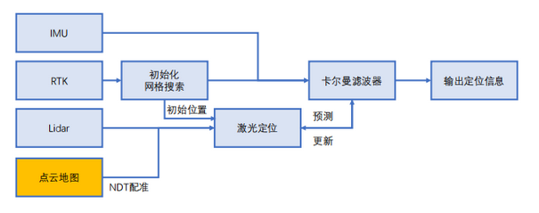
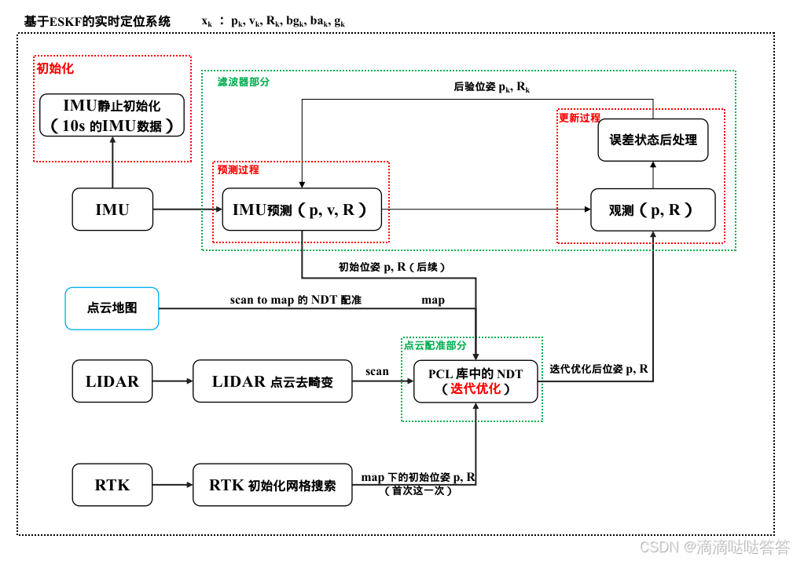
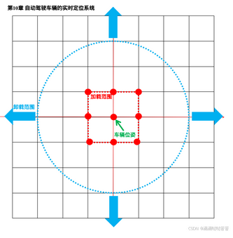

- [基于离线点云地图的实时定位](#基于离线点云地图的实时定位)
- [点云融合定位的设计方案](#点云融合定位的设计方案)
  - [点云定位与卡尔曼滤波器的融合](#点云定位与卡尔曼滤波器的融合)
- [点云融合定位流程](#点云融合定位流程)
- [算法实现](#算法实现)
  - [RTK初始搜索](#rtk初始搜索)
  - [使用imu数据进行ESKF预测](#使用imu数据进行eskf预测)
  - [使用 LIDAR 数据 NDT 配准位姿进行 ESKF 的更新过程](#使用-lidar-数据-ndt-配准位姿进行-eskf-的更新过程)
  - [点云地图的加载卸载](#点云地图的加载卸载)
- [小结](#小结)
- [感谢](#感谢)
- [reference](#reference)

# 基于离线点云地图的实时定位

在点云地图基础之上，我们可以把当前激光扫描数据与地图进行匹配，从而获得车辆自身的位置，再与 IMU 等传感器进行滤波器融合

- 然而，点云定位并不像 RTK 那样可以直接给出物理世界坐标，而必须先给出一个大致的位置点，再引导点云配准算法收敛
- 因此，点云定位在实际使用时，会遇到一些特有逻辑问题，以下演示一个基于ESKF的实时定位方案

# 点云融合定位的设计方案

从融合手段上来看，点云融合定位可以与传统组合导航一样，使用 ESKF 进行融合；也可以像现有的 SLAM 系统一样，使用位姿图优化进行融合

1. 卡尔曼方案从设计到实现都比较简单，其结果往往比较光滑，但可能收敛到错误的解，导致定位跑偏，而且不容易被修正回来
2. 图优化方法容易检查各种因子与定位状态的偏差，从而在逻辑层面处理各种异常情况，但其定位平滑性不容易保障（除非进行手动的边缘化处理，或者使用 GTSAM 这种自带边缘化的优化库）

## 点云定位与卡尔曼滤波器的融合

- 点云定位需要一个预测的车辆位置作为搜索的起点，因此设计了一个初始化流程
- 当滤波器尚未计算出自身位置时，利用第一个有效 RTK 信号来控制点云定位的搜索范围
- 又由于 NCLT 数据集中的 RTK 并不含有姿态信息，我们需要通过网格搜索来确定车辆的朝向
- 当卡尔曼滤波器收敛以后，我们再通过滤波器的预测值来作为点云定位的初值进行配准



# 点云融合定位流程

1. 用第一个有效的 RTK 数据减去地图原点（建图时第一个有效的 RTK 位姿，定位时从配置文件中加载即可）后加载点云地图，并使用该 RTK 数据进行初始化网格搜索确定车辆在点云地图中的初始位姿。确定位姿后使用该位姿初始化 ESKF 状态
2. 使用 IMU 数据开始 ESKF 的预测过程
3. 先使用 ESKF 预测得到的位姿加载点云地图，将当前 LIDAR 数据作为 scan 和 点云地图进行 scan to map 的 NDT 配准（使用 PCL 库中的 NDT 配准函数），迭代后得到优化位姿。使用该优化位姿进行 ESKF 的更新过程

这里的流程和松耦合相似但有以下不同

1. 这里使用了 RTK 初始搜索获取滤波器 ESKF 的初始状态
2. 这里使用了scan to map 的 NDT 配准方式



```cpp
void Fusion::ProcessMeasurements(const MeasureGroup& meas) {
    measures_ = meas;
 
    if (imu_need_init_) {
        TryInitIMU();
        return;
    }
 
    /// 以下三步与LIO一致，只是align完成地图匹配工作
    if (status_ == Status::WORKING) {
        Predict();
        Undistort();
    } else {
        scan_undistort_ = measures_.lidar_;
    }
 
    Align();
}
 
void Fusion::Align() {
    FullCloudPtr scan_undistort_trans(new FullPointCloudType);
    pcl::transformPointCloud(*scan_undistort_, *scan_undistort_trans, TIL_.matrix());
    scan_undistort_ = scan_undistort_trans;
    current_scan_ = ConvertToCloud<FullPointType>(scan_undistort_);
    current_scan_ = VoxelCloud(current_scan_, 0.5);
 
    if (status_ == Status::WAITING_FOR_RTK) {
        // 若存在最近的RTK信号，则尝试初始化
        if (last_gnss_ != nullptr) {
            if (SearchRTK()) {
                status_ == Status::WORKING;
                ui_->UpdateScan(current_scan_, eskf_.GetNominalSE3());
                ui_->UpdateNavState(eskf_.GetNominalState());
            }
        }
    } else {
        LidarLocalization();
        ui_->UpdateScan(current_scan_, eskf_.GetNominalSE3());
        ui_->UpdateNavState(eskf_.GetNominalState());
    }
}
```

# 算法实现

## RTK初始搜索

用第一个有效的 RTK 数据减去地图原点（建图时第一个有效的 RTK 位姿，定位时从配置文件中加载即可）后加载点云地图，并使用该 RTK 数据进行初始化网格搜索确定车辆在点云地图中的初始位姿。确定位姿后使用该位姿初始化 ESKF 状态

```cpp
    /// 网格搜索时的结构
    struct GridSearchResult {
        SE3 pose_;           // 按 10 度递增的网格搜索的初始位姿
        SE3 result_pose_;    // NDT 配准优化后的位姿
        double score_ = 0.0; // NDT 配准得分
    };
```

由于 RTK 不带角度，按 10 度的固定步长进行 360 度搜索，需要搜索 36 次。将按 10 度递增的网格搜索的初始位姿送入 AlignForGrid() 函数中进行多分辨率 NDT 配准（10.0, 5.0, 4.0, 3.0。map 按照 NDT 尺寸乘以 0.1 降采样，scan 不额外进行降采样），求解配准后的位姿及其对应的配准得分，如果最大配准得分大于阈值（4.5）则认为获得了正确的初始位姿。 确定位姿后使用该位姿初始化 ESKF 状态

```cpp
bool Fusion::SearchRTK() {
    if (init_has_failed_) {
        if ((last_gnss_->utm_pose_.translation() - last_searched_pos_.translation()).norm() < 20.0) {
            LOG(INFO) << "skip this position";
            return false;
        }
    }
 
    // 由于RTK不带姿态，我们必须先搜索一定的角度范围
    std::vector<GridSearchResult> search_poses;
    LoadMap(last_gnss_->utm_pose_);
 
    /// 由于RTK不带角度，这里按固定步长扫描RTK角度
    double grid_ang_range = 360.0, grid_ang_step = 10;  // 角度搜索范围与步长
    for (double ang = 0; ang < grid_ang_range; ang += grid_ang_step) {
        SE3 pose(SO3::rotZ(ang * math::kDEG2RAD), Vec3d(0, 0, 0) + last_gnss_->utm_pose_.translation());
        GridSearchResult gr;
        gr.pose_ = pose;
        search_poses.emplace_back(gr);
    }
 
    LOG(INFO) << "grid search poses: " << search_poses.size();
    std::for_each(std::execution::par_unseq, search_poses.begin(), search_poses.end(),
                  [this](GridSearchResult& gr) { AlignForGrid(gr); });
 
    // 选择最优的匹配结果
    auto max_ele = std::max_element(search_poses.begin(), search_poses.end(),
                                    [](const auto& g1, const auto& g2) { return g1.score_ < g2.score_; });
    LOG(INFO) << "max score: " << max_ele->score_ << ", pose: \n" << max_ele->result_pose_.matrix();
    if (max_ele->score_ > rtk_search_min_score_) {
        LOG(INFO) << "初始化成功, score: " << max_ele->score_ << ">" << rtk_search_min_score_;
        status_ = Status::WORKING;
 
        /// 重置滤波器状态
        auto state = eskf_.GetNominalState();
        state.R_ = max_ele->result_pose_.so3();
        state.p_ = max_ele->result_pose_.translation();
        state.v_.setZero();
        eskf_.SetX(state, eskf_.GetGravity());
 
        ESKFD::Mat18T cov;
        cov = ESKFD::Mat18T::Identity() * 1e-4;
        cov.block<12, 12>(6, 6) = Eigen::Matrix<double, 12, 12>::Identity() * 1e-6;
        eskf_.SetCov(cov);
 
        return true;
    }
 
    init_has_failed_ = true;
    last_searched_pos_ = last_gnss_->utm_pose_;
    return false;
}
 
void Fusion::AlignForGrid(sad::Fusion::GridSearchResult& gr) {
    /// 多分辨率
    pcl::NormalDistributionsTransform<PointType, PointType> ndt;
    ndt.setTransformationEpsilon(0.05);
    ndt.setStepSize(0.7);
    ndt.setMaximumIterations(40);
 
    ndt.setInputSource(current_scan_);
    auto map = ref_cloud_;
 
    CloudPtr output(new PointCloudType);
    std::vector<double> res{10.0, 5.0, 4.0, 3.0};
    Mat4f T = gr.pose_.matrix().cast<float>();
    for (auto& r : res) {
        auto rough_map = VoxelCloud(map, r * 0.1);
        ndt.setInputTarget(rough_map);
        ndt.setResolution(r);
        ndt.align(*output, T);
        T = ndt.getFinalTransformation();
    }
 
    gr.score_ = ndt.getTransformationProbability();
    gr.result_pose_ = Mat4ToSE3(ndt.getFinalTransformation());
}
```

## 使用imu数据进行ESKF预测

```cpp
void Fusion::Predict() {
    imu_states_.clear();
    imu_states_.emplace_back(eskf_.GetNominalState());
 
    /// 对IMU状态进行预测
    for (auto& imu : measures_.imu_) {
        eskf_.Predict(*imu);
        imu_states_.emplace_back(eskf_.GetNominalState());
    }
}
```

## 使用 LIDAR 数据 NDT 配准位姿进行 ESKF 的更新过程

先使用 ESKF 预测得到的位姿加载点云地图，将当前 LIDAR 数据作为 scan 和 点云地图进行 scan to map 的 NDT 配准（使用 PCL 库中的 NDT 配准函数），迭代后得到优化位姿。使用该优化位姿进行 ESKF 的更新过程

```cpp
bool Fusion::LidarLocalization() {
    SE3 pred = eskf_.GetNominalSE3();
    LoadMap(pred);
 
    ndt_.setInputCloud(current_scan_);
    CloudPtr output(new PointCloudType);
    ndt_.align(*output, pred.matrix().cast<float>());
 
    SE3 pose = Mat4ToSE3(ndt_.getFinalTransformation());
    eskf_.ObserveSE3(pose, 1e-1, 1e-2);
 
    LOG(INFO) << "lidar loc score: " << ndt_.getTransformationProbability();
 
    return true;
}
```

## 点云地图的加载卸载

在定位过程中，初始化阶段在 Fusion::Init() 函数中调用 LoadMapIndex() 函数加载了点云地图的索引文件。后续在 2 个地方调用了 Fusion::LoadMap() 函数加载和卸载点云地图。分别在 RTK 初始搜索函数 Fusion::SearchRTK() 和 ESKF 更新函数 Fusion::LidarLocalization() 中

点云定位层面，我们使用切分好的点云进行定位。我们把点云按边长 100米的范围进行了网格划分，所以本章控制点云地图的载入范围为车辆周边 9 格（如下图所示）。同时，为了防止车辆在某个区块边缘处运动导致频繁加载与卸载，我们也设定一个卸载范围，卸载范围稍大于加载范围，卸载范围取和当前测量距离大于，超出该范围的点云才会被卸载



代码实现如下所示。这里使用了 std::set<Vec2i, less_vec<2>> 存储地图索引、使用std::map<Vec2i, CloudPtr, less_vec<2>> 存储地图数据。即使用 C++ STL 容器中的 std::set 和 std::map 来管理和加载地图数据。先先根据索引判断地图是否存在，再判断地图有没有加载。如果地图存在但是并没有加载，则加载地图；如果已经加载，则直接跳过。

```cpp
void Fusion::LoadMap(const SE3& pose) {
    int gx = floor((pose.translation().x() - 50.0) / 100);
    int gy = floor((pose.translation().y() - 50.0) / 100);
    Vec2i key(gx, gy);
 
    // 一个区域的周边地图，我们认为9个就够了
    std::set<Vec2i, less_vec<2>> surrounding_index{
        key + Vec2i(0, 0), key + Vec2i(-1, 0), key + Vec2i(-1, -1), key + Vec2i(-1, 1), key + Vec2i(0, -1),
        key + Vec2i(0, 1), key + Vec2i(1, 0),  key + Vec2i(1, -1),  key + Vec2i(1, 1),
    };
 
    // 加载必要区域
    bool map_data_changed = false;
    int cnt_new_loaded = 0, cnt_unload = 0;
    for (auto& k : surrounding_index) {
        // 先根据索引判断地图是否存在
        if (map_data_index_.find(k) == map_data_index_.end()) {
            // 该地图数据不存在
            continue;
        }
 
        // 如果地图存在但是并没有加载，则加载地图；如果已经加载，则直接跳过
        if (map_data_.find(k) == map_data_.end()) {
            // 加载这个区块
            CloudPtr cloud(new PointCloudType);
            pcl::io::loadPCDFile(data_path_ + std::to_string(k[0]) + "_" + std::to_string(k[1]) + ".pcd", *cloud);
            map_data_.emplace(k, cloud);
            map_data_changed = true;
            cnt_new_loaded++;
        }
    }
 
    // 卸载不需要的区域，这个稍微加大一点，不需要频繁卸载
    for (auto iter = map_data_.begin(); iter != map_data_.end();) {
        if ((iter->first - key).cast<float>().norm() > 3.0) {
            // 卸载本区块
            iter = map_data_.erase(iter);
            cnt_unload++;
            map_data_changed = true;
        } else {
            iter++;
        }
    }
 
    LOG(INFO) << "new loaded: " << cnt_new_loaded << ", unload: " << cnt_unload;
    if (map_data_changed) {
        // rebuild ndt target map
        ref_cloud_.reset(new PointCloudType);
        for (auto& mp : map_data_) {
            *ref_cloud_ += *mp.second;
        }
 
        LOG(INFO) << "rebuild global cloud, grids: " << map_data_.size();
        ndt_.setInputTarget(ref_cloud_);
    }
 
    ui_->UpdatePointCloudGlobal(map_data_);
}
```


# 小结

点云定位通常比 RTK 定位具有更好的鲁棒性。只要点云地图本身建的足够准确，在大部分地图区域内它都可以正常工作，定位系统不必依赖室外 RTK 信号的好坏

在已有激光点云地图的基础上，进行融合定位的案例。点云定位的几个优势和劣势可以概括如下

1. 点云定位结果与场景结构相关，而与天气、遮挡关系无关，通常比 RTK 具有更好的环境适应性。点云定位既可以用于室外，也可以用于室内，没有太多限制因素
2. 点云定位结果可以和 RTK 一样，融入 ESKF 滤波器中，也可以组成一个图优化系统
3. 如果在较大的场景中使用，应该先对地图点云切分，每次加载周围一小块区域用于定位
4. 与 RTK 不同的时，点云定位需要事先指定一个大致的位置，而不是像 RTK 那直接给出定位结果。如果初始位置精度不够，我们还需要对附近的位置和角度进行网格搜索，才能确定自身位置。
5. 点云定位对动态场景有一定的适应性。只要主体结构（通常是建筑物）变化不大，一些小型的动态物体（人群、车辆等等）通常不会对点云定位产生很大的干扰
6. 如果定位场景属于开阔场地，我们还可以对点云地图进行压缩，形成 2.5D 地图 。这种压缩之后的地图可以大幅减少所需的存储空间，对自动驾驶应用更加友好

# 感谢

在此感谢 [自动驾驶与机器人中的SLAM技术](https://github.com/gaoxiang12/slam_in_autonomous_driving) 作者 高翔老师

# reference

- [自动驾驶车辆的实时定位系统](https://blog.csdn.net/m0_49384824/article/details/145149503)
