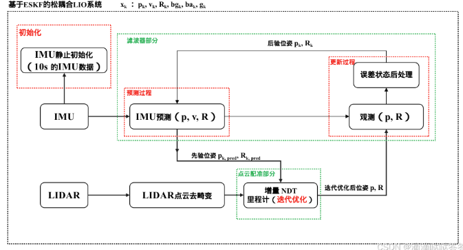
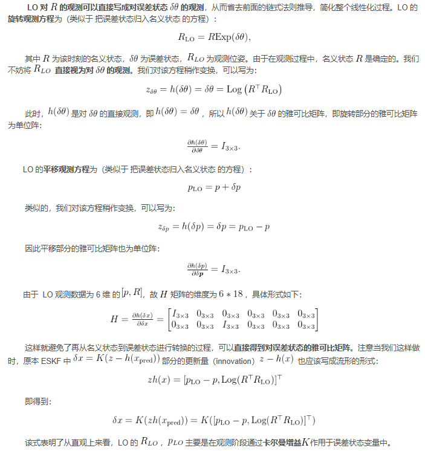
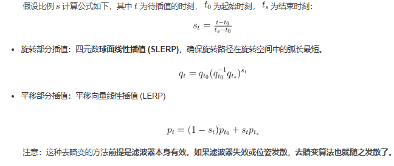

- [eskf\_loosely\_coupled\_LIO](#eskf_loosely_coupled_lio)
  - [松耦合与紧耦合](#松耦合与紧耦合)
  - [坐标系说明](#坐标系说明)
  - [松耦合系统的运动和观测方程](#松耦合系统的运动和观测方程)
  - [松耦合LIO数据准备](#松耦合lio数据准备)
  - [松耦合 LIO 系统的主要流程](#松耦合-lio-系统的主要流程)
    - [使用 IMU 预测位姿进行运动补偿](#使用-imu-预测位姿进行运动补偿)
  - [松耦合系统的配准部分](#松耦合系统的配准部分)
  - [reference](#reference)

# eskf_loosely_coupled_LIO

在松耦合LIO系统中，有一个状态估计器来计算车辆自身的状态

- IMU和轮速为其提供惯性和速度方面的观测源
- 点云匹配结果为系统提供位姿数据的观测源

在松耦合估计中，点云配准和卡尔曼滤波是相对解耦,参考一下使用ESKF，和增量式NDT里程计，实现松耦合LIO系统

在点云配准时也可以使用状态估计器的预测输出作为初始位姿进行配准

## 松耦合与紧耦合

松耦合: 不将点云本身残差比如点线残差，点面残差，ndt残差直接放入状态估计器，而是将点云配准的输出位姿融入状态估计器

## 坐标系说明

引入imu后，有三个坐标系，世界坐标W，imu坐标系I，雷达坐标系L，I & L之间存在转换关系$T_{IL}$,因为imu的运动模型都是在imu坐标系下处理，故也将雷达点云转到imu坐标系下，设雷达点云坐标$p_L$,转换到imu坐标系下$p_I$

$$

p_{I}=T_{IL}p_{L}=R_{IL}p_{L}+t_{IL}

$$

## 松耦合系统的运动和观测方程

由于整个 LIO 运行在 IMU 坐标系中，状态变量的运动方程与eskf一致，同时雷达里程计（LO）的输出位姿，可直接视为对状态变量R P的观测，这个过程实际和第 3 章的 ESKF 中谈到的 GNSS 观测是一样的．

## 松耦合LIO数据准备

1. IMU 数据与激光数据进行同步。激光通常使用 10Hz 的频率，而 IMU 通常是更高的 100Hz。我们希望能够统一处理两个激光数据之间的那 10 个 IMU 数据
2. 需要处理激光的运动补偿，而运动补偿需要有激光测量时间内的位姿数据来源，正好可以用 ESKF 对每个 IMU 数据的预测值
3. 我们应该从 ESKF 中拿到预测的位姿数据，交给里程计算法，再将里程计配准之后的位姿放入 ESKF 中

## 松耦合 LIO 系统的主要流程

松耦合 LooselyLIO 类持有一个 IncrementalNDTLO（增量 NDT 里程计）对象，一个 ESKF 对象，一个 MessageSync 对象 处理同步之后的点云和 IMU

- 当 MeasureGroup 到达后，在 IMU 未初始化时，使用静止初始化来估计 IMU 零偏
- 初始化完毕后，先使用 IMU 数据进行预测，再用预测数据对点云去畸变
- 最后对去畸变的点云做配准

### 使用 IMU 预测位姿进行运动补偿

原理简单来说就是通过固定的世界坐标系，结合每个时刻的插值结果．将一帧雷达中所有时刻的点全部转移到雷达扫描结束时刻

## 松耦合系统的配准部分

前文已经得到了去畸变的点云，这里只需将其传递给增量 NDT 里程计，并使用滤波器预测得到的先验位姿作为增量 NDT 里程计的初始位姿，经过迭代计算后得到优化后的位姿后再返回给滤波器，滤波器进行观测过程。在这个过程中滤波器部分和点云配准部分是解耦的

## reference

[基于ESKF的松耦合LIO系统](https://blog.csdn.net/m0_49384824/article/details/145090993)
